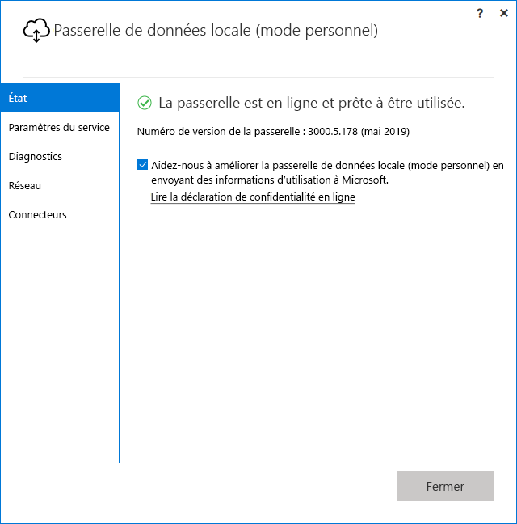

# <a name="use-personal-gateways-in-power-bi"></a>Utiliser des passerelles personnelles dans Power BI

[!INCLUDE [gateway-rewrite](../includes/gateway-rewrite.md)]

La passerelle de données locale (mode personnel) est une version de la passerelle de données locale qui fonctionne seulement avec Power BI. Vous pouvez utiliser une passerelle personnelle afin de disposer d’une passerelle sur votre propre ordinateur et d’avoir accès aux données locales.

> [!NOTE]
> Vous ne pouvez avoir qu’une seule passerelle en mode personnel en cours d’exécution pour chaque utilisateur Power BI. Si vous installez une autre passerelle en mode personnel pour le même utilisateur, même sur un autre ordinateur, l’installation la plus récente remplace la précédente installation.

## <a name="on-premises-data-gateway-vs-on-premises-data-gateway-personal-mode"></a>Passerelle de données locale et passerelle de données locale (mode personnel)

Le tableau suivant décrit les différences entre une passerelle de données locale et une passerelle de données locale (mode personnel).

|   |Passerelle de données locale | Passerelle de données locale (mode personnel) |
| ---- | ---- | ---- |
|Services cloud pris en charge |Power BI, PowerApps, Azure Logic Apps, Power Automate, Azure Analysis Services, dataflows |Power BI |
|S’exécute |Comme configuré par les utilisateurs qui ont accès à la passerelle |En tant que vous-même pour l’authentification Windows et comme configuré par vous d’autres types d’authentification |
|Installation seulement en tant qu’administrateur de l’ordinateur |Oui |Non |
|Gestion centralisée de la passerelle et de la source de données |Oui |Non |
|Importer des données et planifier l’actualisation |Oui |Oui |
|Support DirectQuery |Oui |Non |
|Prise en charge de LiveConnect pour Analysis Services |Oui |Non |

## <a name="install-the-on-premises-data-gateway-personal-mode"></a>Installer la passerelle de données locale (mode personnel)

Pour installer la passerelle de données locale (mode personnel) :

1. [Téléchargez la passerelle de données locale](https://go.microsoft.com/fwlink/?LinkId=820925&clcid=0x409).

2. Dans le programme d’installation, sélectionnez la passerelle de données locale (mode personnel), puis **Suivant**.

   

Les fichiers de la passerelle sont installés dans _"%localappdata%\Microsoft\On-premises data gateway (personal mode)_ . Une fois l’installation terminée, lorsque vous vous connectez, vous voyez l’écran suivant.



## <a name="use-fast-combine-with-the-personal-gateway"></a>Utiliser le Regroupement rapide avec la passerelle personnelle

La fonctionnalité Combinaison rapide sur une passerelle personnelle vous permet d’ignorer les niveaux de confidentialité spécifiés lors de l’exécution des requêtes. Pour que Combinaison rapide fonctionne avec la passerelle de données locale (mode personnel) :

1. À l’aide de l’Explorateur de fichiers, ouvrez le fichier suivant :

   `%localappdata%\Microsoft\On-premises data gateway (personal mode)\Microsoft.PowerBI.DataMovement.Pipeline.GatewayCore.dll.config`

2. En bas du fichier, ajoutez le texte suivant :

    ```xml
    <setting name="EnableFastCombine" serializeAs="String">
       <value>true</value>
    </setting>
    ```

3. Une fois l’opération terminée, le paramètre prend effet environ une minute plus tard. Pour vérifier s’il fonctionne correctement, essayez une actualisation à la demande dans le service Power BI pour vérifier que le Regroupement rapide fonctionne.

## <a name="frequently-asked-questions-faq"></a>Foire aux questions (FAQ)

**Question :** Puis-je exécuter la passerelle de données locale (mode personnel) côte à côte avec la passerelle de données locale (version Enterprise de la passerelle) ?
  
**Réponse :** Oui, les deux passerelles peuvent s’exécuter simultanément.

**Question :** Est-il possible d’utiliser la passerelle de données locale (mode personnel) en tant que service ?
  
**Réponse :** Non. La passerelle de données locale (mode personnel) peut uniquement être exécutée en tant qu’application. Si vous devez utiliser la passerelle en tant que service et/ou en mode administrateur, utilisez la [passerelle de données locale](/data-integration/gateway/service-gateway-onprem) (version Enterprise de la passerelle).

**Question :** Quelle est la fréquence de mise à jour de la passerelle de données locale (mode personnel) ?
  
**Réponse :** nous prévoyons de mettre à jour la passerelle tous les mois.

**Question :** Pourquoi suis-je invité à mettre à jour mes informations d’identification ?
  
**Réponse :** plusieurs situations peuvent déclencher une demande d’informations d’identification. La plus courante est que vous avez réinstallé la passerelle de données locale (mode personnel) sur un ordinateur différent de celui sur lequel vous avez installé votre Passerelle Power BI – Personal. Il peut également s’agir d’un problème dans la source de données et Power BI n’a pas pu effectuer le test de connexion, le délai d’attente a été dépassé ou une erreur système s’est produite. Pour mettre à jour vos informations d’identification dans le service Power bi, sélectionnez l’icône d’engrenage, puis **Paramètres** > **Jeux de données**. Recherchez le jeu de données en question, puis sélectionnez **Informations d’identification de la source de données**.

**Question :** Pendant combien de temps ma passerelle personnelle est-elle hors connexion pendant la mise à niveau ?
  
**Réponse :** La mise à niveau de la passerelle personnelle vers la nouvelle version ne prend que quelques minutes.

**Question :** J’utilise des scripts R et Python. Sont-ils pris en charge ?
  
**Réponse :** Les scripts R et Python sont pris en charge pour le mode personnel.

## <a name="next-steps"></a>Étapes suivantes

* [Configuration des paramètres de proxy de la passerelle de données locale](/data-integration/gateway/service-gateway-proxy)  

D’autres questions ? Essayez la [communauté Power BI](https://community.powerbi.com/).
