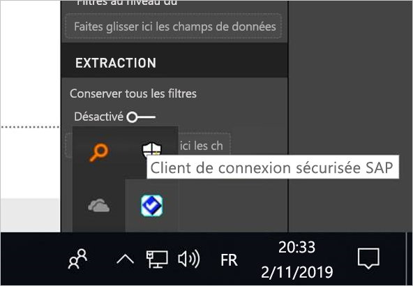
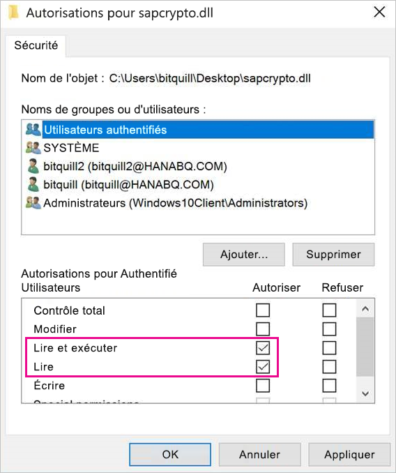
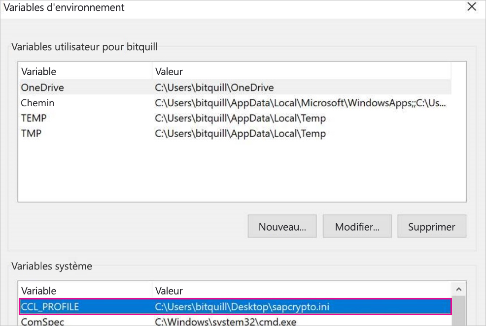
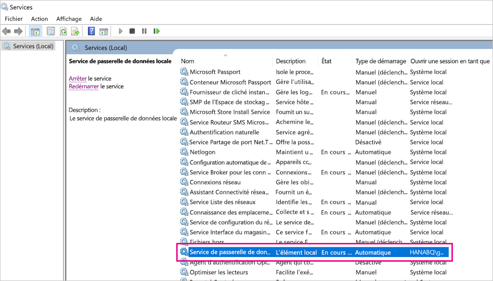
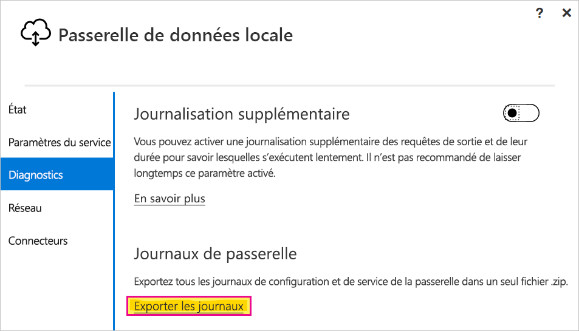

# <a name="use-kerberos-single-sign-on-for-sso-to-sap-bw-using-commoncryptolib-sapcryptodll"></a>Utiliser l’authentification unique Kerberos pour l’authentification unique pour SAP BW à l’aide de CommonCryptoLib (sapcrypto.dll)

Cet article explique comment configurer votre source de données SAP BW pour activer l’authentification unique à partir du service Power BI à l’aide de CommonCryptoLib (sapcrypto.dll).

> [!NOTE]
> Suivez les étapes décrites dans cet article en plus de celles de l’article [Configurer l’authentification unique Kerberos](service-gateway-sso-kerberos.md) avant d’essayer d’actualiser un rapport basé sur SAP BW qui utilise l’authentification unique Kerberos. L’utilisation de CommonCryptoLib comme bibliothèque SNC active les connexions par authentification unique à la fois aux serveurs d’applications SAP BW et aux serveurs de messages SAP BW.

## <a name="configure-sap-bw-to-enable-sso-using-commoncryptolib"></a>Configurer SAP BW pour activer l’authentification unique à l’aide de CommonCryptoLib

> [!NOTE]
> La passerelle de données locale est une application 64 bits et requiert donc la version 64 bits de CommonCryptoLib (sapcrypto.dll) pour effectuer l’authentification unique BW. Si vous prévoyez de tester la connexion par authentification unique à votre serveur SAP BW dans l’interface graphique de SAP avant de tenter une connexion par authentification unique via la passerelle (méthode recommandée), vous aurez également besoin de la version 32 bits de CommonCryptoLib, car l’interface graphique de SAP est une application 32 bits.

1. Vérifiez que votre serveur BW est correctement configuré pour l’authentification unique Kerberos avec CommonCryptoLib. Si c’est le cas, vous pouvez utiliser l’authentification unique pour accéder à votre serveur BW (directement ou via un serveur de messages SAP BW) avec un outil SAP, comme l’interface graphique SAP, qui a été configuré pour utiliser CommonCryptoLib. 

   Pour plus d’informations sur les étapes de configuration, consultez [Authentification unique SAP : S’authentifier avec Kerberos/SPNEGO](https://blogs.sap.com/2017/07/27/sap-single-sign-on-authenticate-with-kerberosspnego/). Votre serveur BW doit utiliser CommonCryptoLib comme bibliothèque SNC et avoir un nom SNC commençant par *CN=* , comme *CN=BW1*. Pour plus d’informations sur les conventions de nommage des noms SNC (en particulier le paramètre snc/identity/as), consultez [Paramètres SNC pour la configuration de Kerberos](https://help.sap.com/viewer/df185fd53bb645b1bd99284ee4e4a750/3.0/360534094511490d91b9589d20abb49a.html).

1. Si vous ne l’avez pas déjà fait, installez la version 64 bits du [connecteur SAP .NET](https://support.sap.com/en/product/connectors/msnet.html) sur l’ordinateur sur lequel la passerelle a été installée. 
   
   Vous pouvez vérifier si le composant a été installé en tentant de vous connecter à votre serveur BW dans Power BI Desktop à partir de la machine de passerelle. Si vous ne réussissez pas à vous connecter à l’aide de l’implémentation 2.0, cela signifie que le connecteur .NET n’est pas installé ou qu’il n’a pas été installé dans le GAC.

1. Assurez-vous que le client de connexion sécurisée SAP n’est pas en cours d’exécution sur l’ordinateur sur lequel la passerelle est installée. 

   SLC met en cache les tickets Kerberos d’une façon pouvant interférer avec la capacité de la passerelle à utiliser Kerberos pour l’authentification unique. 

1. Si le client de connexion sécurisée est installé, désinstallez-le ou veillez à quitter le client de connexion sécurisée SAP. Cliquez avec le bouton droit sur l’icône de la barre d’état système, puis sélectionnez **Se déconnecter** et **Quitter** avant de tenter une connexion SSO à l’aide de la passerelle. 

   Le client de connexion sécurisée n’est pas pris en charge sur les machines Windows Server. Pour plus d’informations, consultez [SAP Note 2780475](https://launchpad.support.sap.com/#/notes/2780475) (utilisateur-s requis).

   

1. Si vous désinstallez le client de connexion sécurisée ou sélectionnez **Se déconnecter** et **Quitter**, ouvrez une fenêtre de commande et entrez `klist purge` pour effacer tous les tickets Kerberos mis en cache avant de tenter une connexion SSO via la passerelle.

1. Téléchargez CommonCryptoLib (sapcrypto.dll) 64 bits (version *8.5.25 ou ultérieure*) à partir de SAP Launchpad, puis copiez-le dans un dossier sur votre machine passerelle. Dans le même répertoire que celui où vous avez copié sapcrypto.dll, créez un fichier nommé sapcrypto.ini, avec le contenu suivant :

    ```
    ccl/snc/enable_kerberos_in_client_role = 1
    ```

    Le fichier .ini contient les informations de configuration requises par CommonCryptoLib pour activer l’authentification unique dans le scénario de passerelle.

    > [!NOTE]
    > Ces fichiers doivent être stockés au même emplacement. En d’autres termes, _/path/to/sapcrypto/_ doit contenir à la fois sapcrypto.ini et sapcrypto.dll.

    L’utilisateur du service de passerelle et l’utilisateur Active Directory (AD) dont l’utilisateur du service emprunte l’identité ont besoin des autorisations de lecture et d’exécution pour les deux fichiers. Nous vous recommandons d’accorder des autorisations aux fichiers .ini et .dll au groupe des utilisateurs authentifiés. À des fins de test, vous pouvez également accorder explicitement ces autorisations à l’utilisateur du service de passerelle et à l’utilisateur Active Directory que vous utilisez pour les tests. Dans la capture d’écran suivante, nous avons accordé au groupe des utilisateurs authentifiés les autorisations **Lecture et exécution** pour sapcrypto.dll :

    

1. Si vous n’avez pas de source de données SAP BW associée à la passerelle par le biais de laquelle vous souhaitez établir une connexion d’authentification unique, ajoutez-en une dans la page **Gérer les passerelles** du service Power BI. Si vous en avez déjà une, modifiez-la : 
    - Choisissez **SAP Business Warehouse** comme **Type de source de données** si vous souhaitez créer une connexion par authentification unique à un serveur d’applications BW. 
    - Sélectionnez **Serveur de messages SAP Business Warehouse** si vous souhaitez créer une connexion par authentification unique à un serveur de messagerie BW.

1. Dans le cas d’une **bibliothèque SNC**, sélectionnez la variable d’environnement **SNC\_LIB** ou **SNC\_LIB\_64**, ou une variable **personnalisée**. 

   - Si vous sélectionnez **SNC\_LIB**, vous devez définir la valeur de la variable d’environnement **SNC\_LIB\_64** de la machine de passerelle sur le chemin absolu de la copie 64 bits de sapcrypto.dll de la machine de passerelle. Par exemple, *C:\Users\Test\Desktop\sapcrypto.dll*.

   - Si vous choisissez **Personnalisé**, collez le chemin absolu du fichier *sapcrypto.dll* dans le champ « Chemin de la bibliothèque SNC personnalisée » qui figure dans la page **Gérer les passerelles**. 

1. Pour le **Nom du partenaire SNC**, entrez le nom SNC du serveur BW. Sous **Paramètres avancés**, vérifiez que l’option **Utiliser l’authentification unique via Kerberos pour les requêtes DirectQuery** est cochée. Renseignez les autres champs comme si vous établissiez une connexion par authentification Windows à partir de PBI Desktop.

1. Créez une variable d’environnement système **CCL\_PROFILE** et définissez sa valeur sur le chemin de sapcrypto.ini.

    

    Les fichiers sapcrypto.ini et sapcrypto.dll doivent se trouver au même emplacement. Dans l’exemple ci-dessus, sapcrypto.ini et sapcrypto.dll se trouvent tous les deux sur le Bureau.

1. Redémarrez le service de passerelle.

    

1. [Générer un rapport Power BI](service-gateway-sso-kerberos.md#run-a-power-bi-report)

## <a name="troubleshooting"></a>Résolution des problèmes

Si vous ne parvenez pas à actualiser le rapport dans le service Power BI, vous pouvez utiliser le suivi de la passerelle, le traçage CPIC et le traçage CommonCryptoLib pour diagnostiquer le problème. Étant donné que le traçage CPIC et CommonCryptoLib sont des produits SAP, Microsoft ne peut pas fournir de support direct pour eux.

### <a name="gateway-logs"></a>Journaux de passerelle

1. Reproduisez le problème.

2. Ouvrez l’[application de passerelle](https://docs.microsoft.com/data-integration/gateway/service-gateway-app), puis sélectionnez **Exporter les journaux** sous l’onglet **Diagnostics**.

      

### <a name="cpic-tracing"></a>Traçage CPIC

1. Pour activer le traçage CPIC, définissez deux variables d’environnement : **CPIC\_TRACE** et **CPIC\_TRACE\_DIR**. 

   La première variable définit le niveau de trace, et la deuxième variable définit le répertoire des fichiers de trace. Le répertoire doit être un emplacement dans lequel les membres du groupe des utilisateurs authentifiés peuvent écrire. 
 
2. Définissez **CPIC\_TRACE** sur *3* et **CPIC\_TRACE\_DIR** sur le répertoire où seront enregistrés les fichiers de trace. Par exemple :

   

3. Reproduisez le problème et vérifiez que **CPIC\_TRACE\_DIR** contient des fichiers de trace.
 
    Le traçage CPIC peut diagnostiquer des problèmes de niveau supérieur tels que l'échec du chargement de la bibliothèque sapcrypto.dll. Par exemple, voici un extrait d'un fichier de trace CPIC dans lequel une erreur de chargement d’une bibliothèque .dll s'est produite :

    ```
    [Thr 7228] *** ERROR => DlLoadLib()==DLENOACCESS - LoadLibrary("C:\Users\test\Desktop\sapcrypto.dll")
    Error 5 = "Access is denied." [dlnt.c       255]
    ```

    Si vous rencontrez un tel échec mais que vous avez défini les autorisations Lire et exécuter sur sapcrypto.dll et sapcrypto.ini comme décrit [dans la section ci-dessus](#configure-sap-bw-to-enable-sso-using-commoncryptolib), essayez de définir les mêmes autorisations Lire et exécuter sur le dossier contenant les fichiers.

    Si vous n'arrivez toujours pas à charger la bibliothèque .dll, essayez d'activer l’[audit du fichier](/windows/security/threat-protection/auditing/apply-a-basic-audit-policy-on-a-file-or-folder). L'examen des journaux d'audit résultants dans l'observateur d'événements Windows peut vous aider à déterminer l’origine de l’échec de chargement du fichier. Recherchez une entrée d'échec initiée par l'utilisateur Active Directory usurpé. Par exemple, pour l'utilisateur usurpé `MYDOMAIN\mytestuser`, un échec dans le journal d'audit ressemblerait à ceci :

    ```
    A handle to an object was requested.

    Subject:
        Security ID:        MYDOMAIN\mytestuser
        Account Name:       mytestuser
        Account Domain:     MYDOMAIN
        Logon ID:       0xCF23A8

    Object:
        Object Server:      Security
        Object Type:        File
        Object Name:        <path information>\sapcrypto.dll
        Handle ID:      0x0
        Resource Attributes:    -

    Process Information:
        Process ID:     0x2b4c
        Process Name:       C:\Program Files\On-premises data gateway\Microsoft.Mashup.Container.NetFX45.exe

    Access Request Information:
        Transaction ID:     {00000000-0000-0000-0000-000000000000}
        Accesses:       ReadAttributes
                
    Access Reasons:     ReadAttributes: Not granted
                
    Access Mask:        0x80
    Privileges Used for Access Check:   -
    Restricted SID Count:   0
    ```

### <a name="commoncryptolib-tracing"></a>Traçage CommonCryptoLib 

1. Activez le traçage CommonCryptoLib en ajoutant ces deux lignes au fichier sapcrypto.ini créé précédemment :

    ```
    ccl/trace/level=5
    ccl/trace/directory=<drive>:\logs\sectrace
    ```

2. Remplacez l’option `ccl/trace/directory` par un emplacement où les membres du groupe des utilisateurs authentifiés peuvent écrire. 

3. Vous pouvez également créer un nouveau fichier .ini pour modifier ce comportement. Dans le même répertoire que les fichiers sapcrypto.dll et sapcrypto.ini, créez un fichier nommé sectrace.ini, avec le contenu suivant. Remplacez l’option `DIRECTORY` par un emplacement de votre machine où les membres du groupe Utilisateurs authentifiés peuvent écrire :

    ```
    LEVEL = 5
    DIRECTORY = <drive>:\logs\sectrace
    ```

4. Reproduisez le problème et vérifiez que l’emplacement désigné par **DIRECTORY** contient des fichiers de trace. 

5. Lorsque vous avez terminé, désactivez le traçage CPIC et CCL.

    Pour plus d’informations sur le traçage CommonCryptoLib, consultez [Note SAP 2491573](https://launchpad.support.sap.com/#/notes/2491573) (identifiant SAP nécessaire).

## <a name="next-steps"></a>Étapes suivantes

Pour plus d’informations sur la passerelle de données locale et DirectQuery, consultez les ressources suivantes :

* [Qu’est-ce qu’une passerelle de données locale ?](/data-integration/gateway/service-gateway-onprem)
* [DirectQuery dans Power BI](desktop-directquery-about.md)
* [Sources de données prises en charge par DirectQuery](power-bi-data-sources.md)
* [DirectQuery et SAP BW](desktop-directquery-sap-bw.md)
* [DirectQuery et SAP HANA](desktop-directquery-sap-hana.md)
