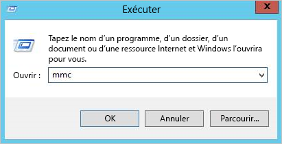
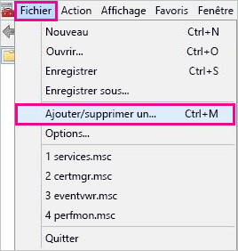
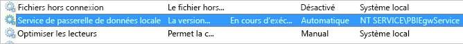

# <a name="use-security-assertion-markup-language-saml-for-sso-from-power-bi-to-on-premises-data-sources"></a>Utiliser SAML (Security Assertion Markup Language) pour l’authentification unique de Power BI sur des sources de données locales

Quand l’authentification unique est activée, les rapports et les tableaux de bord Power BI actualisent facilement les données à partir des sources locales, tout en respectant les autorisations de niveau utilisateur qui sont configurées sur ces sources. Utilisez [SAML (Security Assertion Markup Language)](https://www.onelogin.com/pages/saml) pour permettre une connectivité d’authentification unique fluide. 

## <a name="supported-data-sources"></a>Sources de données prises en charge

Nous prenons en charge SAP HANA avec SAML. Pour plus d’informations sur la configuration de l’authentification unique pour SAP HANA à l’aide de SAML, consultez [SAML SSO for BI Platform to HANA](https://wiki.scn.sap.com/wiki/display/SAPHANA/SAML+SSO+for+BI+Platform+to+HANA) (Authentification unique SAML pour la plateforme BI dans HANA).

Nous prenons en charge des sources de données supplémentaires avec [Kerberos](service-gateway-sso-kerberos.md) (dont SAP HANA).

Pour SAP HANA, il est recommandé d’activer le chiffrement avant d’établir une connexion avec authentification unique SAML. Pour activer le chiffrement, configurez le serveur HANA pour qu’il accepte les connexions chiffrées et configurez la passerelle afin qu’elle utilise le chiffrement pour communiquer avec votre serveur HANA. Le pilote ODBC HANA n’étant pas en mesure de chiffrer les assertions SAML par défaut, l’assertion SAML signée est envoyée à partir de la passerelle au serveur HANA *en clair* et peut donc être interceptée et réutilisée par des tiers.

> [!IMPORTANT]
> SAP ne prend plus en charge OpenSSL. Par conséquent, Microsoft a mis fin à son support. Les connexions existantes et nouvelles continueront de fonctionner correctement jusqu’à la fin de l’année 2020, mais elles ne fonctionneront plus à partir du 1er janvier 2021. Utilisez CommonCryptoLib à la place.

## <a name="configuring-the-gateway-and-data-source"></a>Configuration de la passerelle et de la source de données

Pour utiliser SAML, vous devez établir une relation d’approbation entre les serveurs HANA pour lesquels vous souhaitez activer l’authentification unique et la passerelle. Dans ce scénario, la passerelle joue le rôle de fournisseur d’identité SAML. Il existe plusieurs façons d’établir cette relation. SAP vous recommande d’utiliser la bibliothèque de chiffrement SAP (également appelée CommonCryptoLib ou sapcrypto) pour effectuer les étapes de configuration qui nous permettent d’établir la relation d’approbation. Pour plus d’informations, consultez la documentation SAP officielle.

Les étapes suivantes décrivent comment établir une relation d’approbation entre un serveur HANA et le fournisseur d’identité de la passerelle en signant le certificat X509 du fournisseur d’identité de la passerelle à l’aide d’une autorité de certification racine approuvée par le serveur HANA. 

### <a name="create-the-certificates"></a>Créer les certificats

Pour créer les certificats, effectuez les étapes suivantes :

1. Sur l’appareil qui exécute SAP HANA, créez un dossier vide pour stocker vos certificats, puis accédez à ce dossier.
2. Créez les certificats racine en exécutant la commande suivante :

   ```
   openssl req -new -x509 -newkey rsa:2048 -days 3650 -sha256 -keyout CA_Key.pem -out CA_Cert.pem -extensions v3_ca'''
   ```

    Vous devez mémoriser la phrase secrète pour utiliser ce certificat afin d’en signer d’autres.
    Vous devez voir *CA_Cert.pem* et *CA_Key.pem* en train d’être créés.

   
3. Créez les certificats IdP en exécutant la commande suivante :
 
    ```
    openssl req -newkey rsa:2048 -days 365 -sha256 -keyout IdP_Key.pem -out IdP_Req.pem -nodes
    ```
    Vous devez voir *IdP_Key.pem* et *IdP_Req.pem* en train d’être créés.

4. Signez les certificats IdP avec les certificats racine :

    ```
    openssl x509 -req -days 365 -in IdP_Req.pem -sha256 -extensions usr_cert -CA CA_Cert.pem -CAkey CA_Key.pem -CAcreateserial -out IdP_Cert.pem
    ```
    Vous devez voir *CA_Cert.srl* et *IdP_Cert.pem* en train d’être créés.
    Nous nous préoccupons uniquement de *IdP_Cert.pem*.    

### <a name="create-saml-identity-provider-certificate-mapping"></a>Créer un mappage de certificat de fournisseur d’identité SAML

Créez le mappage de certificat de fournisseur d’identité SAML en effectuant les étapes suivantes.

1. Dans **SAP HANA Studio** , cliquez avec le bouton droit sur le nom de votre serveur SAP HANA, puis accédez à **Security > Open Security Console > SAML Identity Provider** (Sécurité > Ouvrir la console de sécurité > Fournisseur d’identité SAML).
2. Si la bibliothèque de chiffrement SAP n’est pas sélectionnée, sélectionnez-la. N’utilisez *pas* la bibliothèque de chiffrement OpenSSL (la sélection sur la gauche, dans l’image suivante), car elle est dépréciée par SAP.

    

3. Importez le certificat signé *IdP_Cert.pem* en cliquant sur le bouton d’importation bleu, comme illustré dans l’image suivante.

    

N’oubliez pas d’attribuer un nom à votre *fournisseur d’identité*.

### <a name="import-and-create-the-signed-certificates-in-hana"></a>Importer et créer les certificats signés dans HANA

Ensuite, vous allez importer et créer les certificats signés dans HANA. Procédez comme suit :

1. Dans **HANA Studio** , exécutez la requête suivante :

    ```
    CREATE CERTIFICATE FROM '<idp_cert_pem_certificate_content>'
    ```
    
    Voici un exemple :

    ```
    CREATE CERTIFICATE FROM
    '-----BEGIN CERTIFICATE-----
    MIIDyDCCArCgA...veryLongString...0WkC5deeawTyMje6
    -----END CERTIFICATE-----
    '
    ```

2. S’il n’existe pas de PSE avec SAML Purpose, créez-en un en exécutant la requête suivante dans **HANA Studio**  :
    
    ```
    CREATE PSE SAMLCOLLECTION;<br>set pse SAMLCOLLECTION purpose SAML;<br>
    ```

3. Ajoutez le certificat signé nouvellement créé au PSE à l’aide de la commande suivante :

    ```
    alter pse SAMLCOLLECTION add CERTIFICATE <certificate_id>;
    ```

    Par exemple :
    ```
    alter pse SAMLCOLLECTION add CERTIFICATE 1978320;
    ```

    Vous pouvez vérifier la liste des certificats créés à l’aide de la requête suivante :
    ```
    select * from PUBLIC"."CERTIFICATES"
    ```

    Le certificat est à présent installé correctement. Vous pouvez exécuter la requête suivante pour le confirmer :
    ```
    select * from "PUBLIC"."PSE_CERTIFICATES"
    ```

### <a name="map-the-user"></a>Mapper l’utilisateur

Pour mapper l’utilisateur, effectuez les étapes suivantes :

1. Dans **SAP HANA Studio** , sélectionnez le dossier **Security**  :

    

2. Développez **Users** , puis sélectionnez l’utilisateur auquel vous souhaitez associer votre utilisateur Power BI.

3. Cochez la case **SAML** , puis sélectionnez **Configure** , mis en surbrillance dans l’image suivante.

    

4. Sélectionnez le fournisseur d’identité que vous avez créé dans la section [Créer un mappage de certificat de fournisseur d’identité SAML](#create-saml-identity-provider-certificate-mapping), plus haut dans cet article. Sous External Identity, entrez l’UPN de l’utilisateur Power BI (en général, l’adresse e-mail avec laquelle l’utilisateur se connecte à Power BI), puis sélectionnez **Add**.  L’image suivante montre les options et les sélections.

    

    Si vous avez configuré votre passerelle pour utiliser l’option de configuration *ADUserNameReplacementProperty* , entrez la valeur qui remplacera l’UPN d’origine de l’utilisateur Power BI. Par exemple, si vous définissez *ADUserNameReplacementProperty* avec la valeur *SAMAccountName* , entrez le *SAMAccountName* de l’utilisateur.

### <a name="configure-the-gateway"></a>Configurer la passerelle

Le certificat et l’identité de la passerelle étant maintenant configurés, convertissez le certificat au format pfx et configurez la passerelle pour qu’elle utilise le certificat en effectuant les étapes suivantes.

1. Convertissez le certificat au format pfx en exécutant la commande suivante. Cette commande nomme le fichier. pfx obtenu samlcert.pfx et définit *root* comme mot de passe :

    ```
    openssl pkcs12 -export -out samltest.pfx -in IdP_Cert.pem -inkey IdP_Key.pem -passin pass:root -passout pass:root
    ```

2. Copiez le fichier pfx sur la machine de passerelle :

    1. Double-cliquez sur *samltest.pfx* , puis sélectionnez **Ordinateur local** > **Suivant**.

    2. Entrez le mot de passe, puis sélectionnez **Suivant**.

    3. Sélectionnez **Placer tous les certificats dans le magasin suivant** , puis sélectionnez **Parcourir** > **Personnel** > **OK**.

    4. Sélectionnez **Suivant** , puis **Terminer**.

       

3. Octroyez au compte de service de passerelle l’accès à la clé privée du certificat en effectuant les étapes suivantes :

    1. Sur la machine de passerelle, exécutez la console MMC (Microsoft Management Console).

        

    2. Sous **Fichier** , sélectionnez **Ajouter/Supprimer un composant logiciel enfichable**.

        

    3. Sélectionnez **Certificats** > **Ajouter** , puis sélectionnez **Un compte d’ordinateur** > **Suivant**.

    4. Sélectionnez **Ordinateur local** > **Terminer** > **OK**.

    5. Développez **Certificats** > **Personnel** > **Certificats** , puis recherchez le certificat.

    6. Cliquez avec le bouton droit sur le certificat, puis accédez à **Toutes les tâches** &gt; **Gérer les clés privées**.

        

    1. Ajoutez le compte de service de passerelle à la liste. Par défaut, le compte est **NT SERVICE\PBIEgwService**. Vous pouvez déterminer le compte qui exécute le service de passerelle en exécutant **services.msc** et en recherchant **Service de passerelle de données locale**.

        

Enfin, suivez les étapes ci-après pour ajouter l’empreinte de certificat à la configuration de la passerelle :

1. Exécutez la commande PowerShell suivante pour lister les certificats présents sur votre ordinateur :

    ```powershell
    Get-ChildItem -path cert:\LocalMachine\My
    ```

2. Copiez l’empreinte du certificat que vous avez créé.

3. Accédez au répertoire de la passerelle qui, par défaut, est *C:\Program Files\On-premises data gateway*.

4. Ouvrez *PowerBI.DataMovement.Pipeline.GatewayCore.dll.config* , puis recherchez la section *SapHanaSAMLCertThumbprint*. Collez l’empreinte que vous avez copiée.

5. Redémarrez le service de passerelle.

## <a name="running-a-power-bi-report"></a>Exécution d’un rapport Power BI

Vous pouvez maintenant utiliser la page **Gérer la passerelle** dans Power BI pour configurer la source de données SAP HANA. Sous **Paramètres avancés** , activez l’authentification unique avec SAML. Ceci vous permet de publier des rapports et des jeux de données liés à cette source de données.

   

## <a name="troubleshooting"></a>Dépannage

Après avoir configuré l’authentification unique SAML, vous risquez de voir l’erreur suivante dans le portail Power BI : *Impossible d’utiliser les informations d’identification fournies pour la source SapHana.* Cette erreur indique que les informations d’identification SAML ont été refusées par SAP HANA.

Les traces d’authentification côté serveur fournissent des informations détaillées pour résoudre les problèmes d’informations d’identification sur SAP HANA. Suivez ces étapes pour configurer le traçage de votre serveur SAP HANA :

1. Sur le serveur SAP HANA, activez la trace d’authentification en exécutant la requête suivante :

    ```
    ALTER SYSTEM ALTER CONFIGURATION ('indexserver.ini', 'SYSTEM') set ('trace', 'authentication') = 'debug' with reconfigure 
    ```

1. Reproduisez le problème.

1. Dans HANA Studio, ouvrez la console d’administration et sélectionnez l’onglet **Fichiers de diagnostic**.

1. Ouvrez la dernière trace du serveur d’index et recherchez *SAMLAuthenticator.cpp*.

    Vous devriez trouver un message d’erreur détaillé qui indique la cause racine, par exemple :

    ```
    [3957]{-1}[-1/-1] 2018-09-11 21:40:23.815797 d Authentication   SAMLAuthenticator.cpp(00091) : Element '{urn:oasis:names:tc:SAML:2.0:assertion}Assertion', attribute 'ID': '123123123123123' is not a valid value of the atomic type 'xs:ID'.
    [3957]{-1}[-1/-1] 2018-09-11 21:40:23.815914 i Authentication   SAMLAuthenticator.cpp(00403) : No valid SAML Assertion or SAML Protocol detected
    ```

1. Une fois le problème résolu, désactivez la trace d’authentification en exécutant la requête suivante :

    ```
    ALTER SYSTEM ALTER CONFIGURATION ('indexserver.ini', 'SYSTEM') UNSET ('trace', 'authentication');
    ```

## <a name="next-steps"></a>Étapes suivantes

Pour plus d’informations sur la passerelle de données locale et DirectQuery, consultez les ressources suivantes :

* [Qu’est-ce qu’une passerelle de données locale ?](/data-integration/gateway/service-gateway-onprem)
* [DirectQuery dans Power BI](desktop-directquery-about.md)
* [Sources de données prises en charge par DirectQuery](power-bi-data-sources.md)
* [DirectQuery et SAP BW](desktop-directquery-sap-bw.md)
* [DirectQuery et SAP HANA](desktop-directquery-sap-hana.md)