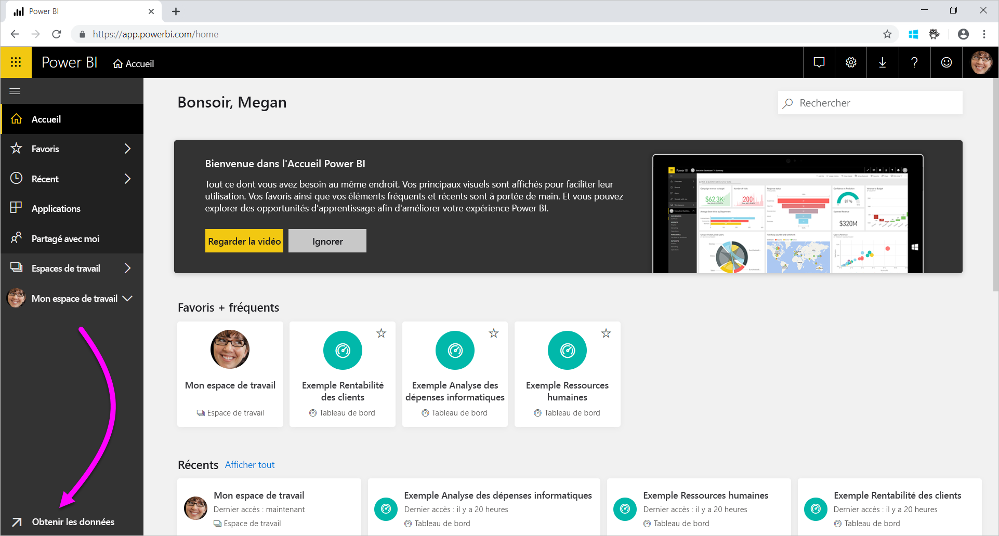
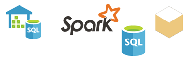

# Sources de données pour le service Power BI
Les données sont au cœur de Power BI. Supposons que vous explorez des données. Vous pouvez le faire en créant des graphiques et des tableaux de bord ou en posant des questions avec **Questions et réponses**. Les visualisations et les réponses que vous voyez tirent leurs données sous-jacentes d’un jeu de données. Mais d’où provient ce jeu de données ? Il vient d’une source de données.

Dans cet article, nous allons aborder les types de sources de données auxquels vous pouvez vous connecter à partir du service Power BI. N’oubliez pas qu’il existe de nombreux autres types de sources de données à partir desquels vous pouvez obtenir des données. Si vous choisissez ces sources de données, vous devrez peut-être commencer par utiliser les fonctionnalités d’interrogation et de modélisation de données avancées d’Excel ou Power BI Desktop. Nous parlerons plus en détail de ces options plus tard. Pour l’instant, examinons les différents types de sources de données disponibles directement sur le site du service Power BI.

Vous pouvez obtenir des données à partir des sources de données dans Power BI en sélectionnant **Obtenir des données** en bas à gauche de la page.

 

Une fois que vous avez sélectionné **Obtenir des données**, vous pouvez choisir les données auxquelles vous souhaitez accéder.

## Découvrir du contenu

La section **Découvrir le contenu** contient toutes les données et tous les rapports dont vous avez besoin, déjà prêts. Dans Power BI, il existe deux types de packs de contenu : Organisation et Services. 

**Organisation** : Si vous et d’autres utilisateurs de l’organisation avez un compte Power BI Pro, vous pouvez créer, partager et utiliser des packs de contenu. Pour en savoir plus, consultez [Introduction aux packs de contenu d’organisation](../collaborate-share/service-organizational-content-pack-introduction.md).

**Services** : Il existe des douzaines de services avec des packs de contenu pour Power BI et de nouveaux packs sont constamment ajoutés. La plupart des services nécessitent de posséder un compte. Pour en savoir plus, consultez [Se connecter aux services que vous utilisez avec Power BI](service-connect-to-services.md).

## Créer du contenu

La section **Créer du contenu** contient des options qui vous permettent de créer et d’importer vous-même du contenu. Dans Power BI, il existe deux moyens de créer ou d’importer votre propre contenu : les fichiers et les bases de données. 

### Fichiers

**Excel** ( *.xlsx*, *.xlsm*) : Dans Excel, un classeur peut contenir différents types de données. Par exemple, il peut contenir des données que vous avez entrées vous-même dans des feuilles de calcul. Il peut également contenir des données que vous avez interrogées et chargées à partir de sources de données externes à l’aide de Power Query. Power Query est disponible via **Obtenir et transformer** dans Excel 2016 ou Power Pivot. Vous pouvez importer des données à partir de tableaux dans des feuilles de calcul ou importer des données à partir d’un modèle de données. Pour en savoir plus, consultez [Obtenir des données à partir de fichiers pour Power BI](service-get-data-from-files.md).

**Power BI Desktop** ( *.pbix*) : Vous pouvez utiliser Power BI Desktop pour interroger et charger des données à partir de sources de données externes et créer des rapports. Vous pouvez aussi étendre votre modèle de données avec des mesures et des relations, ou importer votre fichier Power BI Desktop dans votre site Power BI. Power BI Desktop convient parfaitement aux utilisateurs plus avancés. En général, ces utilisateurs ont une bonne compréhension de leurs sources de données. Ils maîtrisent aussi l’interrogation et la transformation des données et les concepts de modélisation des données. Pour en savoir plus, consultez [Se connecter à des données dans Power BI Desktop](desktop-connect-to-data.md).

**Comma Separated Value** ( *.csv*) : Il s’agit de fichiers texte simples avec des lignes de données. Chaque ligne peut contenir une ou plusieurs valeurs, séparées par une virgule. Par exemple, un fichier *.csv* contenant des données de nom et d’adresse risque d’avoir de nombreuses lignes. Chaque ligne peut avoir des valeurs pour le prénom, le nom, la rue, la ville, le pays et ainsi de suite. Vous ne pouvez pas importer des données dans un fichier *.csv*, mais de nombreuses applications, comme Excel, peuvent enregistrer des données de tableaux simples dans un fichier *.csv*.

Pour les autres types de fichiers comme les tableaux XML ( *.xml*) ou les fichiers texte ( *.txt*), vous pouvez utiliser **Obtenir et transformer** pour d’abord interroger, transformer et charger les données dans un fichier Excel ou Power BI Desktop. Vous pouvez ensuite importer le fichier Excel ou Power BI Desktop dans Power BI.

De plus, l’endroit où vous stockez vos fichiers peut faire une grosse différence. OneDrive Entreprise offre davantage de souplesse et une meilleure intégration avec Power BI. Vous pouvez tout à fait conserver vos fichiers sur votre lecteur local. Cela dit, si vous devez actualiser vos données, vous devrez effectuer quelques étapes supplémentaires. Pour plus d’informations, consultez les liens d’article ci-dessous.

### Bases de données

**Bases de données dans le cloud** - Depuis le service Power BI, vous pouvez vous connecter en direct à :

* Azure SQL Database
* Azure SQL Data Warehouse
* Spark dans Azure HDInsight

Les connexions depuis Power BI à ces bases de données sont actives. Supposons que vous vous connectez à une base de données Azure SQL. Vous commencez à explorer ses données en créant des rapports dans Power BI. Chaque fois que vous découpez vos données ou ajoutez un autre champ à une visualisation, Power BI envoie une requête directement à la base de données. Pour en savoir plus, consultez [Azure et Power BI](service-azure-and-power-bi.md).

**Bases de données locales** - Depuis le service Power BI, vous pouvez vous connecter directement à des bases de données model tabulaires SQL Server Analysis Services. Pour cela, vous aurez besoin d’une passerelle d’entreprise Power BI. Si vous ne savez pas trop comment vous connecter à la base de données model tabulaire de votre organisation, contactez votre administrateur ou le service informatique. Pour en savoir plus, consultez [Données actives SQL Server Analysis Services dans Power BI](sql-server-analysis-services-tabular-data.md).

Pour les autres types de bases de données de votre organisation, vous devez utiliser Power BI Desktop ou Excel pour vous connecter, interroger et charger des données dans un modèle de données. Vous pouvez ensuite importer votre fichier dans Power BI où un jeu de données existe. Si vous configurez une actualisation planifiée, Power BI utilise ces informations de configuration et de connexion du fichier pour se connecter directement à la source de données et rechercher des mises à jour. Power BI charge ensuite ces mises à jour dans le jeu de données. Pour en savoir plus, consultez [Se connecter à des données dans Power BI Desktop](desktop-connect-to-data.md).

## Et si mes données proviennent d’une source différente ?
Il existe des centaines de sources de données différentes que vous pouvez utiliser avec Power BI. Quelle que soit leur provenance, les données doivent être dans un format consommable par le service Power BI. Avec des données consommables, le service Power BI peut créer des rapports et des tableaux de bord, répondre aux questions avec **Questions et réponses**, etc.

Certaines sources de données ont déjà les données mises en forme pour le service Power BI. Ces sources sont comme les packs de contenu des fournisseurs de services tels que Google Analytics et Twilio. Les bases de données model tabulaires SQL Server Analysis Services sont également prêtes à l’emploi. Vous pouvez aussi vous connecter en direct aux bases de données dans le cloud, comme Azure SQL Database et Spark on HDInsight.

Dans d’autres cas, il peut être nécessaire d’interroger et charger les données dans un fichier. Par exemple, supposons que vous avez des données logistiques dans votre organisation. Vous stockez ces données dans un entrepôt de données sur un serveur. Dans le service Power BI, vous ne pouvez pas vous connecter à cette base de données et commencer à explorer ses données, sauf s’il s’agit d’une base de données model tabulaire. Toutefois, vous pouvez utiliser Power BI Desktop ou Excel pour interroger et charger ces données logistiques dans un modèle de données que vous enregistrez en tant que fichier. Vous pouvez ensuite importer ce fichier dans Power BI où un jeu de données existe.

Vous vous dites probablement : « Mais les données logistiques sur cette base de données changent tous les jours. Comment actualiser mon jeu de données Power BI ? » Quand vous importez les données dans le jeu de données, vous importez également les informations de connexion de Power BI Desktop ou du fichier Excel.

Supposons que vous configurez une actualisation planifiée ou effectuez une actualisation manuelle sur le jeu de données. Power BI utilise les informations de connexion dans le jeu de données, ainsi que quelques autres paramètres, pour se connecter directement à la base de données. Il recherche ensuite les mises à jour et les charge dans le jeu de données. À noter que vous aurez probablement besoin d’une passerelle Power BI pour sécuriser les transferts de données entre votre serveur local et Power BI. Lorsque le transfert est terminé, les visualisations des rapports et des tableaux de bord s’actualisent automatiquement.

Vous voyez que même si vous ne pouvez pas vous connecter à la source de données directement depuis le service Power BI, vous pouvez toujours en obtenir les données dans Power BI. Cela peut simplement nécessiter quelques étapes supplémentaires et le concours du service informatique. Pour en savoir plus, consultez [Sources de données dans Power BI Desktop](desktop-data-sources.md).

## Informations complémentaires
Les termes de jeu de données et source de données sont très utilisés dans Power BI. Ils sont souvent utilisés indifféremment. Mais en réalité, il s’agit de deux concepts complètement différents, bien que liés.

Vous créez un **jeu de données** automatiquement dans Power BI quand vous utilisez **Obtenir des données**. Avec **Obtenir des données**, vous vous connectez et importez des données à partir d’un pack de contenu ou d’un fichier ou vous vous connectez à une source de données active. Un jeu de données contient des informations sur la source de données et sur les informations d’identification de la source de données. Dans de nombreux cas, il comprend aussi une partie des données copiées à partir de la source de données. Quand vous créez des visualisations dans les rapports et les tableaux de bord, vous consultez souvent les données du jeu de données.

Une **source de données** est l’emplacement d’où proviennent les données d’un jeu de données. Par exemple, les données peuvent provenir :

* D’un service en ligne comme Google Analytics ou QuickBooks
* D’une base de données dans le cloud comme Azure SQL Database
* D’une base de données ou d’un fichier sur un ordinateur ou serveur local de votre propre organisation

## Actualisation des données
Peut-être que vous enregistrez vos fichiers sur votre lecteur local ou sur un lecteur quelque part dans votre organisation. Vous aurez peut-être besoin d’une passerelle Power BI pour pouvoir actualiser le jeu de données dans Power BI. L’ordinateur qui stocke le fichier doit être allumé lors de l’actualisation. Vous pouvez réimporter le fichier ou utiliser l’option Publier depuis Excel ou Power BI Desktop, mais ces deux opérations ne sont pas des processus automatisés.

Si vous enregistrez vos fichiers sur OneDrive Entreprise ou SharePoint - Sites d’équipe, vous pouvez vous y connecter ou les importer dans Power BI. Ainsi, votre jeu de données, vos rapports et vos tableaux de bord seront toujours à jour. Étant donné que OneDrive et Power BI sont tous deux dans le cloud, Power BI peut se connecter directement au fichier enregistré. Il se connecte environ toutes les heures et recherche les mises à jour. Le jeu de données et toutes les visualisations s’actualisent automatiquement en cas de mise à jour.

Les packs de contenu provenant des services sont automatiquement mis à jour. Dans la plupart des cas, ils sont mis à jour une fois par jour. Vous pouvez effectuer une actualisation manuellement. Toutefois, l’affichage des données mises à jour dépend du fournisseur de services. Les mises à jour des packs de contenu des utilisateurs de votre organisation dépendent des sources de données utilisées. Elles dépendent également de la personne qui a créé le pack de contenu et configuré l’actualisation.

Azure SQL Database, Azure SQL Data Warehouse et Spark sur Azure HDInsight sont uniques sont des sources de données dans le cloud. Le service Power BI est également dans le cloud, donc Power BI peut se connecter à ces sources de données en direct avec **DirectQuery**. Ce que vous voyez dans Power BI est toujours synchronisé et il n’est pas nécessaire de configurer une actualisation planifiée.

Quand vous vous connectez à SQL Server Analysis Services depuis Power BI, il s’agit d’une connexion active, tout comme une base de données Azure dans le cloud. La différence est que la base de données elle-même se trouve sur un serveur de votre organisation. Ce type de connexion nécessite une passerelle Power BI, que configure le service informatique.

L’actualisation des données est un élément essentiel de Power BI et beaucoup trop complexe pour pouvoir le détailler ici. Pour mieux comprendre ce processus, consultez [Actualisation des données dans Power BI](refresh-data.md).

## Considérations et limitations
Pour toutes les sources de données utilisées dans le service Power BI, prenez en considération les limitations suivantes. D’autres limitations s’appliquent à des fonctionnalités spécifiques, mais la liste suivante s’applique à l’ensemble du service Power BI :

* **Limite de la taille du jeu de données**  : Il existe une limite de 1 Go pour les jeux de données stockés dans les capacités partagées du service Power BI. Si vous avez besoin de jeux de données plus volumineux, vous pouvez utiliser [Power BI Premium](../admin/service-premium-what-is.md).

* **Valeurs distinctes dans une colonne**  : Lors de la mise en cache des données dans un jeu de données Power BI (ce qui est parfois appelé mode « Importation »), il existe une limite de 1 999 999 997 sur le nombre de valeurs distinctes qui peuvent être stockées dans une colonne.

* **Limite de lignes**  : Lors de l’utilisation de **DirectQuery**, Power BI impose une limite aux résultats de requête qui sont envoyés à votre source de données sous-jacente. Si la requête envoyée à la source de données renvoie plus de 1 million de lignes, une erreur s’affiche et la requête échoue. Vos données sous-jacentes peuvent toujours contenir plus de 1 million de lignes. Il est peu probable que vous rencontriez cette limite, car la plupart des rapports regroupent les données en ensembles plus petits de résultats.

* **Limite du nombre de colonnes** - Le nombre maximal de colonnes autorisées dans l’ensemble des tableaux d’un jeu de données est de 16 000 colonnes. Cette limite s’applique au service Power BI et aux jeux de données utilisés dans Power BI Desktop. Power BI effectue le suivi du nombre de colonnes et de tables dans le jeu de données de cette façon, ce qui signifie que le nombre maximal de colonnes est de 16 000 moins une pour chaque table dans le jeu de données.
