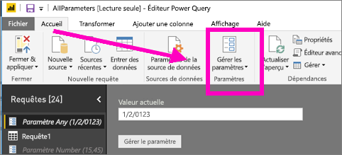
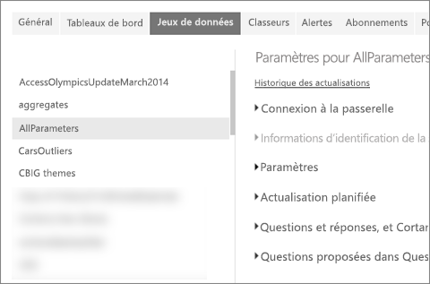
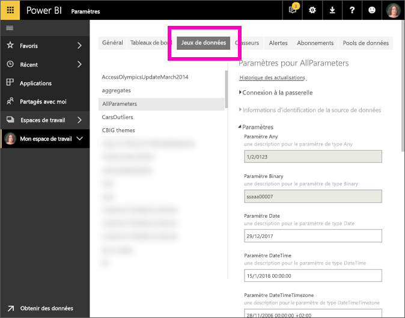

# Modifier les valeurs des paramètres dans le service Power BI
Les créateurs de rapports ajoutent des paramètres de requête aux rapports dans Power BI Desktop. Ces paramètres leur permettent de rendre certaines parties des rapports dépendantes d’une ou plusieurs *valeurs* de paramètre. Par exemple, un créateur de rapports peut créer un paramètre qui limite les données à un seul pays/une seule région ou un paramètre qui définit les formats acceptables pour les champs de dates, d’heure, de texte ou autres.

## Passer en revue et modifier les paramètres dans le service Power BI

En tant que créateur de rapports, vous définissez les paramètres dans Desktop. Quand vous [publiez ce rapport sur le service Power BI](../create-reports/desktop-upload-desktop-files.md), les valeurs et sélections de paramètres l’accompagnent. Vous pouvez passer en revue et modifier certaines valeurs de paramètres dans le service Power BI (pas les paramètres qui limitent les données disponibles, mais ceux qui définissent et décrivent les valeurs acceptables).

1. Dans le service Power BI, sélectionnez l’icône en forme de rouage  pour ouvrir **Paramètres**.

2. Sélectionnez l’onglet pour **Jeux de données** et mettez en surbrillance un jeu de données dans la liste. 
    
    

3. Développez **Paramètres**.  Si le jeu de données sélectionné ne contient pas de paramètres, un message s’affiche avec le lien En savoir plus sur les paramètres de requête. Mais si le jeu de données contient des paramètres, le fait de développer le titre **Paramètres** a pour effet d’afficher ces paramètres. 

    

    Passez en revue les valeurs des paramètres et modifiez-les si nécessaire. Les champs grisés ne peuvent pas être modifiés. 

## Étapes suivantes
Pour ajouter des paramètres simples en cas de besoin, vous pouvez [modifier l’URL](../collaborate-share/service-url-filters.md).