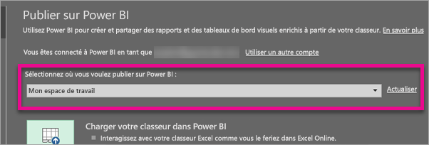
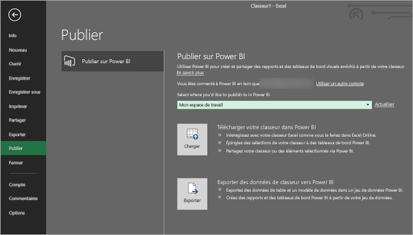
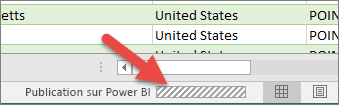

# Publier sur Power BI à partir de Microsoft Excel
Avec Micorsoft Excel 2016 et version ultérieure, vous pouvez publier vos classeurs Excel directement vers votre espace de travail [Power BI](https://powerbi.microsoft.com), où vous pouvez créer des rapports et des tableaux de bord hautement interactifs, basés sur les données de votre classeur. Vous pouvez ensuite partager vos informations avec d’autres personnes au sein de votre organisation.

Lorsque vous publiez un classeur dans Power BI, vous devez tenir compte des points suivants :

* Le compte que vous utilisez pour vous connecter à Office, OneDrive Entreprise (si vous utilisez des classeurs qui y sont enregistrés) et Power BI doivent correspondre au même compte.
* Vous ne pouvez pas publier un classeur vide ou dont aucun contenu n’est pris en charge par Power BI.
* Vous ne pouvez pas publier de classeurs chiffrés ou protégés par mot de passe, ou qui bénéficient de la gestion de la protection des informations.
* La publication sur Power BI requiert qu’une authentification moderne soit activée (valeur par défaut). Si elle est désactivée, l’option Publier n’est pas disponible dans le menu Fichier.

## Publier votre classeur Excel
Pour publier votre classeur Excel, dans Excel, sélectionnez **Fichier** > **Publier** et sélectionnez **Charger** ou **Exporter**.

Si vous choisissez de **Charger** votre classeur dans Power BI, vous pouvez interagir avec le classeur comme vous le feriez à l’aide d’Excel Online. Vous pouvez également épingler des sélections à partir de votre classeur sur des tableaux de bord Power BI et partager votre classeur ou des éléments sélectionnés, par le biais de Power BI.

Si vous sélectionnez **Exporter**, vous pouvez exporter les données de la table et son modèle de données dans un jeu de données Power BI, que vous pouvez ensuite utiliser pour créer des rapports et des tableaux de bord Power BI.

### Publication de fichier local
Excel prend en charge la publication de fichiers Excel locaux. Ceux-ci ne doivent pas nécessairement être enregistrés sur OneDrive Entreprise ou SharePoint Online.

> [!IMPORTANT]
> Vous pouvez publier des fichiers locaux seulement si vous utilisez Excel 2016 (ou ultérieur) avec un abonnement Microsoft 365. Les installations autonomes Excel 2016 peuvent Publier sur Power BI, mais uniquement lorsque le classeur est enregistré sur OneDrive Entreprise ou SharePoint Online.
> 

Lorsque vous sélectionnez **Publier**, vous pouvez sélectionner l’espace de travail sur lequel publier. Si votre fichier Excel se trouve sur OneDrive Entreprise, vous ne pouvez le publier que sur *Mon espace de travail*. S’il se trouve sur un lecteur local, vous pouvez le publier sur *Mon espace de travail* ou sur un espace de travail partagé auquel vous avez accès.

Deux options indiquant comment obtenir votre classeur dans Power BI.

Une fois publié, le contenu du classeur que vous publiez est importé dans Power BI, séparé du fichier local. Si vous souhaitez mettre à jour le fichier dans Power BI, vous devez publier à nouveau la version mise à jour ou actualiser les données en configurant une actualisation planifiée, sur le classeur ou sur le jeu de données dans Power BI.

### Publication à partir d’une installation Excel autonome
Lors de la publication à partir d’une installation Excel autonome, le classeur doit être enregistré dans OneDrive Entreprise. Sélectionnez **Enregistrer dans le cloud**, puis choisissez un emplacement sur OneDrive Entreprise.

Une fois votre classeur enregistré sur OneDrive Entreprise, lorsque vous sélectionnez **Publier**, deux options vous sont proposées pour obtenir votre classeur dans Power BI, **Charger** ou **Exporter** :

#### Charger votre classeur dans Power BI
Lorsque vous choisissez l’option **Charger**, votre classeur apparaît dans Power BI comme il le ferait dans Excel Online. Mais, contrairement à Excel Online, vous avez la possibilité d’épingler des éléments de vos classeurs sur vos tableaux de bord.

Vous ne pouvez pas modifier votre classeur dans Power BI. Si vous devez modifier des données, vous pouvez cliquer sur **Modifier**, puis choisir de modifier votre classeur dans Excel Online ou l’ouvrir dans Excel sur votre ordinateur. Toutes les modifications apportées sont enregistrées dans le classeur sur OneDrive Entreprise.

Lorsque vous sélectionnez **Charger**, aucun jeu de données n’est créé dans Power BI. Votre classeur apparaît sous Rapports dans le volet de navigation de votre espace de travail. Les classeurs téléchargés dans Power BI comportent une icône Excel spéciale, qui les identifie comme classeurs Excel ayant été téléchargés.

Choisissez l’option **Charger** si vous avez uniquement des données dans des feuilles de calcul ou si vous avez des tableaux croisés dynamiques et des graphiques à afficher dans Power BI.

L’utilisation de l’option Charger à partir de la fonctionnalité Publier sur Power BI dans Excel équivaut à utiliser **Obtenir des données > Fichier > OneDrive Entreprise > Se connecter, gérer et afficher Excel dans Power BI** à partir de Power BI dans votre navigateur.

#### Exporter des données de classeur vers Power BI
Lorsque vous choisissez l’option **Exporter**, toutes les données prises en charge dans les tables et/ou un modèle de données sont exportées dans un nouveau jeu de données dans Power BI. Toutes les feuilles Power View dans le classeur sont recréées dans Power BI sous forme de rapports.

Vous pouvez continuer à modifier votre classeur. Lorsque vos modifications sont enregistrées, elles sont synchronisées avec le jeu de données dans Power BI, généralement une heure plus tard environ. Si vous avez besoin de mises à jour plus immédiates, vous pouvez sélectionner **Publier** à partir d’Excel et vos modifications sont immédiatement exportées. Toutes les visualisations dans des rapports et des tableaux de bord sont mises à jour également.

Choisissez l’option **Publier** si vous avez utilisé les caractéristiques Obtenir et transformer ou Power Pivot pour charger vos données dans un modèle de données ou si votre classeur contient des feuilles Power View avec des visualisations que vous voulez afficher dans Power BI.

L’utilisation de l’option **Exporter** est très similaire à l’utilisation de **Obtenir des données > Fichier > OneDrive Entreprise > Exporter des données Excel dans Power BI** à partir de Power BI dans votre navigateur.

## Publication
Lorsque vous choisissez l’une de ces options, Excel se connecte à Power BI avec votre compte actuel, puis publie votre classeur sur votre espace de travail Power BI. Vous pouvez surveiller la barre d’états dans Excel pour voir comment le processus de publication progresse.

Lorsque vous avez terminé, vous pouvez accéder directement à Power BI à partir d’Excel.

## Étapes suivantes
[Données Excel dans Power BI](service-excel-workbook-files.md)  
D’autres questions ? [Posez vos questions à la communauté Power BI](https://community.powerbi.com/)

