# Créer une application modèle dans Power BI

Les *applications modèles* Power BI permettent aux partenaires Power BI de créer des applications Power BI avec peu ou pas de code et de les déployer ensuite vers n’importe quel client Power BI.  Cet article contient des instructions pas à pas pour créer une application modèle Power BI.

Si vous créez déjà des rapports et tableaux de bord Power BI, vous pouvez devenir *concepteur d’applications modèles* et créer vous-même du contenu analytique et l’intégrer dans une *application*. Vous pouvez déployer votre application sur d’autres locataires Power BI par le biais de n’importe quelle plateforme disponible, comme AppSource, ou en l’utilisant dans votre propre service web. En tant que concepteur, vous pouvez créer un package analytique protégé pour la distribution.

Les administrateurs Power BI régissent et contrôlent les utilisateurs de leur organisation qui sont autorisés à créer des applications modèles et/ou à les installer. Ces utilisateurs autorisés peuvent installer votre application modèle, puis la modifier et la distribuer aux consommateurs Power BI dans leur organisation.

## Prérequis

Les prérequis pour créer une application modèle sont les suivants :  

- Une [licence Power BI Pro](../fundamentals/service-self-service-signup-for-power-bi.md)
- Une [installation de Power BI Desktop](../fundamentals/desktop-get-the-desktop.md) (facultatif)
- Une bonne connaissance des [concepts de base de Power BI](../fundamentals/service-basic-concepts.md)
- Des autorisations de partage public d’une application de modèle (pour plus d’informations, consultez [Portail d’administration Power BI, paramètres d’application modèle)](../admin/service-admin-portal.md#template-apps-settings)

## Créer l’espace de travail de modèle

Pour créer une application modèle que vous pouvez ensuite distribuer à d’autres locataires Power BI, vous devez la créer dans un des nouveaux espaces de travail.

1. Dans le service Power BI, sélectionnez **Espaces de travail** > **Créer un espace de travail**.

    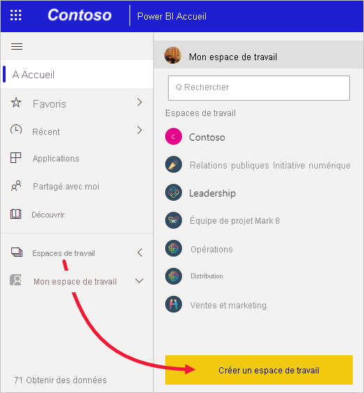

2. Dans **Créer un espace de travail**, entrez un nom, une description (facultative) et une image de logo (facultatif) pour votre espace de travail.

    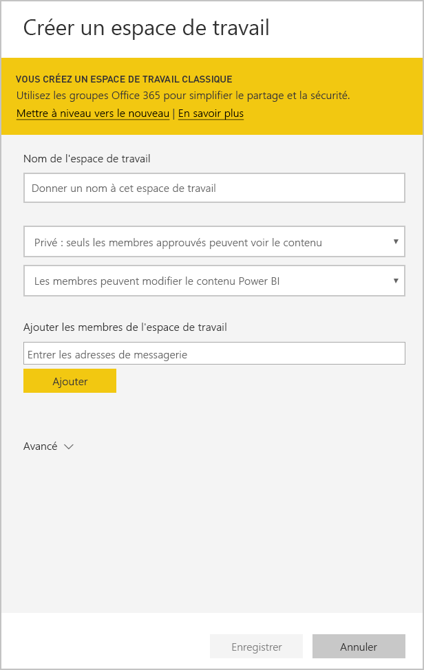

4. Développez la section **Avancé**, puis sélectionnez **Développer une application modèle**.

    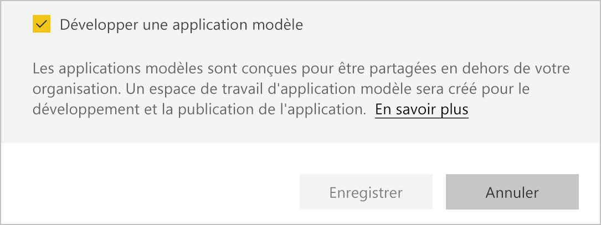

5. Sélectionnez **Enregistrer**.
>[!NOTE]
>Vous avez besoin d’autorisations de votre administrateur Power BI pour promouvoir des applications modèles.

## Ajouter du contenu à l’espace de travail de l’application modèle

Comme avec tout espace de travail Power BI standard, l’étape suivante consiste à ajouter du contenu à l’espace de travail.  

- [Créez votre contenu Power BI](index.yml) dans votre espace de travail.

Si vous définissez des paramètres dans Power Query, assurez-vous d’utiliser des types de paramètres pris en charge (par exemple, Text). Les types Any et Binary ne sont pas pris en charge.

[Conseils pour créer des applications modèles dans Power BI](service-template-apps-tips.md) répertorie les différents points à prendre en considération quand vous créez des rapports et des tableaux de bord pour votre application modèle.

## Définir les propriétés de l’application modèle

Maintenant que vous avez ajouté du contenu dans votre espace de travail, vous êtes prêt à l’intégrer dans une application modèle. La première étape consiste à créer une application modèle de test, accessible uniquement au sein de votre organisation sur votre locataire.

1. Dans l’espace de travail d’application modèle, sélectionnez **Créer une application**.

    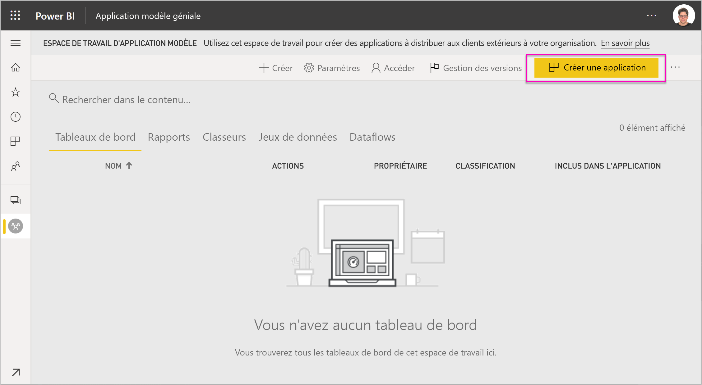

    Ici, vous renseignez d’autres options de création pour votre application modèle, réparties sur six onglets :

    **Personnalisation**

    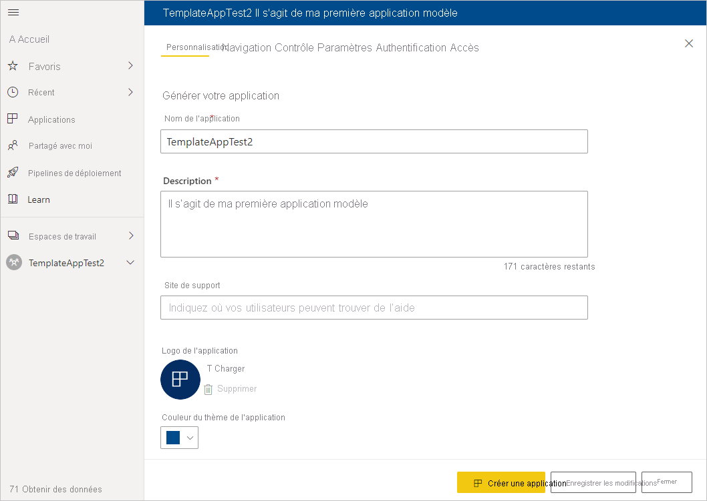
    - Nom de l’application
    - Description
    - Site de prise en charge (le lien est présenté sous les informations de l’application après avoir redistribué l’application modèle en tant qu’application de l’organisation)
    - Logo de l’application (taille limite de fichier 45 Ko, proportions 1:1, formats .png .jpg .jpeg)
    - Couleur du thème de l'application

    **Navigation**

    Activez le **Nouveau générateur de navigation**, où vous pouvez définir le volet de navigation de l’application (pour plus d’informations, consultez [Concevoir l’expérience de navigation](../collaborate-share/service-create-distribute-apps.md#design-the-navigation-experience) dans cet article).

   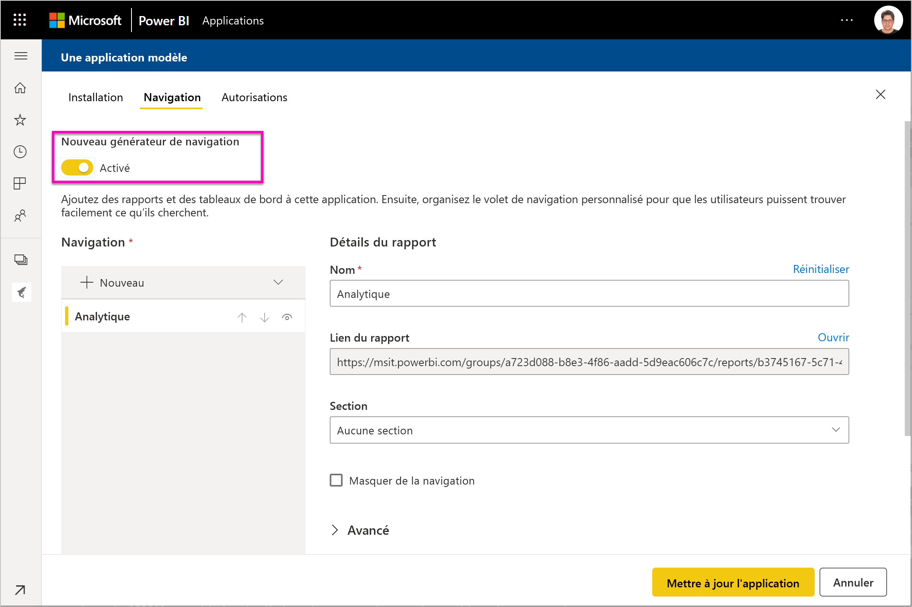
    
    **Page d’accueil de l’application :** Si vous décidez de ne pas utiliser le générateur de navigation, vous avez la possibilité de sélectionner la page d’accueil de l’application. définissez le rapport ou le tableau de bord à utiliser comme page d’accueil de votre application. Utilisez une page d’accueil qui donne l’impression appropriée.

    **Contrôle**

    Définissez les limitations et restrictions d’usage du contenu de votre application par les utilisateurs. Ce contrôle vous permet de protéger la propriété intellectuelle de votre application.

    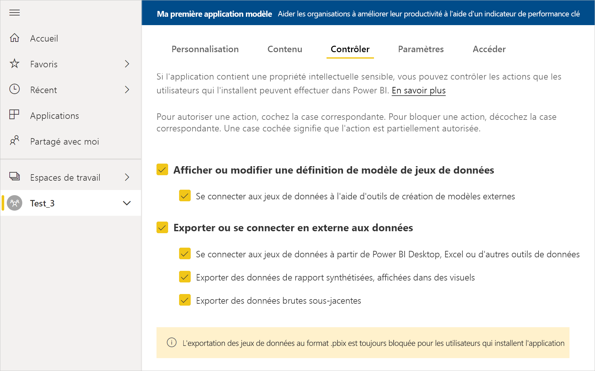

    >[!NOTE]
    >L’exportation au format .pbix est toujours bloquée pour les utilisateurs qui installent l’application.

    **Paramètres**

    Les paramètres sont créés dans le fichier pbix initial (en savoir plus sur la [création de paramètres de requête](https://powerbi.microsoft.com/blog/deep-dive-into-query-parameters-and-power-bi-templates/)). Vous utilisez les fonctionnalités de cet onglet pour aider les utilisateurs qui ont installé l’application à configurer ensuite l’application quand ils se connectent à leurs données.

    Sous cet onglet, vous fournissez également un lien vers la documentation de l’application.

    

    Chaque paramètre a un nom et une description, qui proviennent de la requête, ainsi qu’un champ de valeur. Trois options s’offrent à vous pour obtenir une valeur du paramètre lors de l’installation.

    * Vous pouvez demander à l’utilisateur qui fait l’installation d’entrer obligatoirement une valeur. Dans ce cas, fournissez un exemple qui sera remplacé par l’utilisateur. Pour configurer un paramètre de cette manière, cochez la case **Obligatoire**, puis entrez un exemple dans la zone de texte qui montre à l’utilisateur le genre de valeur attendue. Exemple :

       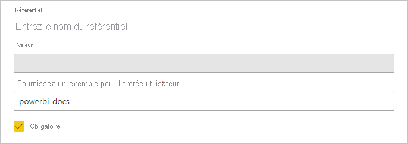

    * Vous pouvez fournir une valeur préremplie et non modifiable par l’utilisateur qui installe l’application. Un paramètre configuré de cette façon n’est pas visible par celui qui effectue l’installation. Utilisez cette méthode uniquement si vous êtes sûr que la valeur préremplie sera appropriée pour tous les utilisateurs. Sinon, utilisez la première méthode mentionnée ci-dessus qui demande une entrée utilisateur.

       Pour configurer un paramètre de cette manière, entrez la valeur dans la zone de texte **Valeur**, puis cliquez sur l’icône de verrou. Ainsi, la valeur ne pourra pas être modifiée. Exemple :

       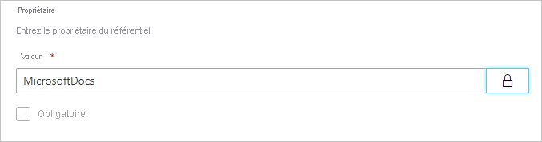

    * Vous pouvez fournir une valeur par défaut que l’utilisateur pourra changer au moment de l’installation. Pour configurer un paramètre de cette manière, entrez la valeur par défaut souhaitée dans la zone de texte **Valeur** et laissez l’icône de verrou déverrouillée. Exemple :

      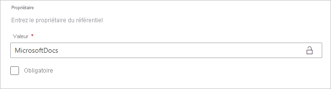

    **Authentification**
    
    Sous cet onglet, vous sélectionnez la méthode d’authentification à utiliser. Les options disponibles dépendent des types des sources de données utilisées.

    

    Le niveau de confidentialité est configuré automatiquement :
   * Source de donnée unique : elle est automatiquement configurée comme privée.
   * Source de données anonyme multiple : elle est automatiquement configurée comme publique.

    **y accéder**
    
    Dans la phase de test, déterminez quels autres utilisateurs dans votre organisation sont autorisés à installer et à tester votre application. Ne vous inquiétez pas, vous pouvez modifier tous ces paramètres à tout moment. Ce paramètre n’a pas d’incidence sur l’accès de l’application modèle distribuée.

    

2. Sélectionnez **Créer une application**.

    Vous voyez un message indiquant que l’application de test est prête, ainsi qu’un lien à copier et à partager avec les testeurs de votre application.

    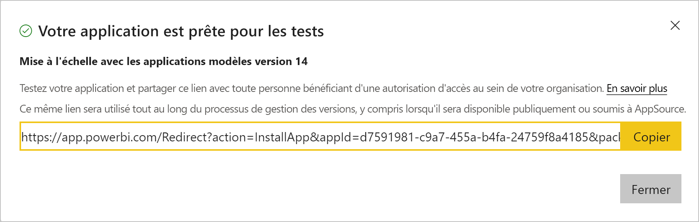

    Vous avez également terminé la première étape du processus de gestion des mises en production, comme expliqué ci-dessous.

## Gérer la mise en production de l’application modèle

Avant de mettre votre nouvelle application modèle à la disposition de tous, vous devez vous assurer qu’elle est prête à l’emploi. À partir du volet Gestion des mises en production dans Power BI, vous pouvez suivre et inspecter tout le chemin de mise en production de l’application. Vous pouvez également déclencher la transition entre chaque phase. Voici les phases principales :

- Générer l’application de test : test de l’application dans votre organisation uniquement.
- Promouvoir le package de test en préproduction : test de l’application en dehors de votre organisation.
- Promouvoir le package de préproduction en production : version en production.
- Supprimer un package, ou recommencer à partir d’une phase précédente.

L’URL ne change pas quand vous passez d’une phase de mise en production à une autre. La promotion n’affecte pas l’URL proprement dite.

Examinons chacune de ces phases :

1. Dans l’espace de travail modèle, sélectionnez **Gestion des mises en production**.

    

2. Sélectionnez **Obtenir le lien** si vous avez créé l’application de test dans la section **Définir les propriétés de l’application modèle** ci-dessus (en conséquence, vous voyez déjà un rond jaune à côté de la phase **Test**).

    Si vous n’avez pas encore créé l’application, sélectionnez **Créer une application**. Cela vous ramène au processus de création de l’application modèle.

    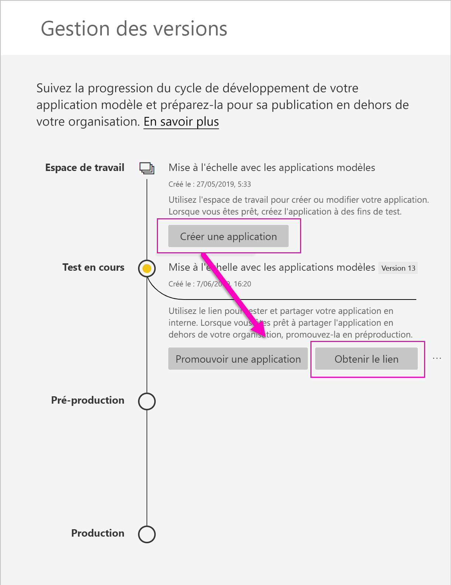

4. Pour tester l’expérience d’installation de l’application, copiez le lien fourni dans la fenêtre de notification et collez-le dans une nouvelle fenêtre de navigateur.

    À partir de là, la procédure est la même que pour vos clients. Consultez [Installer et distribuer des applications modèles dans votre organisation](service-template-apps-install-distribute.md).

5. Dans la boîte de dialogue, sélectionnez **Installer**.

    Au terme de l’installation, vous voyez une notification indiquant que la nouvelle application est prête.

6. Sélectionnez **Accéder à l’application**.
7. Dans **Bien démarrer avec votre nouvelle application**, vous voyez votre application telle qu’elle sera présentée à vos clients.

    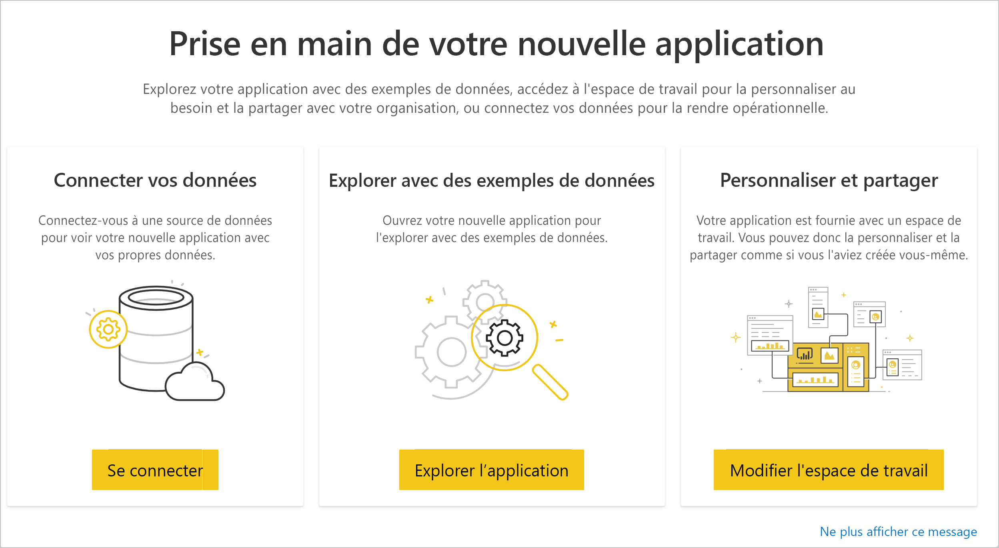
8. Sélectionnez **Explorer l’application** pour passer en revue l’application de test avec les exemples de données.
9. Pour effectuer des modifications, revenez à l’application dans l’espace de travail d’origine. Modifiez l’application de test jusqu’à ce que vous soyez satisfait.
10. Quand vous êtes prêt à promouvoir votre application en préproduction pour la tester en dehors de votre locataire, revenez au volet **Gestion des mises en production** et sélectionnez **Promouvoir l’application**.

    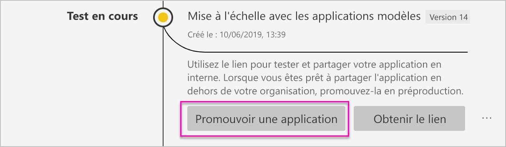
    >[!NOTE]
    > Quand l’application est promue, elle devient accessible à toutes les personnes extérieures à votre organisation.

    Si vous ne voyez pas cette option, demandez à votre administrateur Power BI qu’il vous accorde les [autorisations de développement d’applications modèles](../admin/service-admin-portal.md#template-apps-settings) dans le portail d’administration.
11. Sélectionnez **Promouvoir** pour confirmer votre choix.
12. Copiez cette nouvelle URL à partager en dehors de votre locataire pour les besoins du test. Ce lien est le même que celui que vous soumettez pour commencer le processus de distribution de votre application sur AppSource en créant une [nouvelle offre d’Espace partenaires](/azure/marketplace/partner-center-portal/create-power-bi-app-offer). Soumettez uniquement des liens de préproduction vers l’Espace partenaires. Une fois que l’application est approuvée et que vous avez obtenu une notification disant qu’elle est publiée dans AppSource, vous pouvez promouvoir ce package en production dans Power BI.
13. Quand votre application est prête à être mise en production ou partagée via AppSource, revenez au volet **Gestion des mises en production** et sélectionnez **Promouvoir l’application** à côté de **Préproduction**.
14. Sélectionnez **Promouvoir** pour confirmer votre choix.

    Votre application est maintenant en production, et prête à être distribuée.

    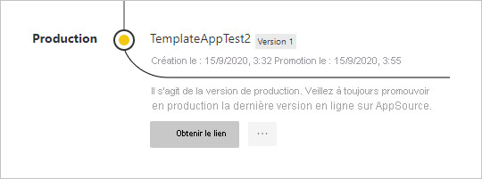

Pour mettre votre application à la disposition du plus grand nombre possible d’utilisateurs Power BI à travers le monde, nous vous conseillons de la soumettre sur AppSource. Pour plus d’informations, consultez [Offre d’application Power BI](/azure/marketplace/partner-center-portal/create-power-bi-app-offer).

## Étapes suivantes

Découvrez de quelle manière vos clients peuvent interagir avec votre application modèle dans l’article [Installer, personnaliser et distribuer des applications modèles dans votre organisation](service-template-apps-install-distribute.md).

Pour plus d’informations sur la distribution de votre application, consultez [Offre d’application Power BI](/azure/marketplace/partner-center-portal/create-power-bi-app-offer).