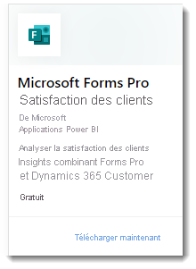

# Que sont les applications modèles Power BI ?

Les nouvelles *applications modèles* Power BI permettent aux partenaires Power BI de créer des applications Power BI avec peu ou pas de codage et de les déployer ensuite vers n’importe quel client Power BI.  Cet article présente une vue d’ensemble du programme d’applications modèles Power BI.

En tant que partenaire Power BI, vous créez du contenu prêt à l’emploi pour vos clients et vous le publiez vous-même.  

Vous concevez des applications modèles qui permettent à vos clients de se connecter et d’instancier à partir de leurs propres comptes. En tant qu’experts dans leur domaine, les clients peuvent déverrouiller les données pour les rendre facilement consommables par leurs utilisateurs professionnels.  

Vous envoyez un modèle d’application à l’Espace partenaires. Les applications deviennent alors accessibles au public sur la [Place de marché des applications Power BI](https://app.powerbi.com/getdata/services) et sur [Microsoft AppSource](https://appsource.microsoft.com/?product=power-bi). Voici un aperçu général de la création d’applications modèles publiques.

## Place de marché des applications Power BI

Les applications modèles Power BI permettent aux utilisateurs de Power BI Pro ou Power BI Premium d'obtenir des informations immédiates grâce à des tableaux de bord et à des rapports prépackagés qui peuvent être connectés à des sources de données actives. De nombreuses applications Power BI sont déjà disponibles sur la [Place de marché des applications Power BI](https://app.powerbi.com/getdata/services).

|  |
|     :---:      |
|     |
|  |

## Processus
Le processus général de développement et de soumission d’une application modèle implique plusieurs étapes. Certaines étapes peuvent inclure plusieurs activités simultanées.

| Phase | Power BI Desktop |  |Service Power BI  |  |Espace partenaire  |
|---|--------|--|---------|---------|---------|
| **Un** | Créer un modèle de données et un rapport dans un fichier .pbix |  | Créer un espace de travail. Importer le fichier .pbix. Créer un tableau de bord supplémentaire  |  | S’inscrire en tant que partenaire |
| **Deux** |  |  | Créer un package de test et effectuer la validation interne        |  | |
| **Trois** | |  | Promouvoir le package de test en préproduction pour sa validation en dehors de votre locataire Power BI, et le soumettre sur AppSource  |  | Avec le package de préproduction, créer une offre d’application modèle Power BI et démarrer le processus de validation |
| **Quatre** | |  | Promouvoir le package de préproduction en production |  | Mettre en ligne l’application modèle |

## Avant de commencer

Pour créer l’application modèle, vous devez avoir les autorisations de création appropriées. Pour plus d’informations, consultez Paramètres des applications modèles dans le portail d’administration Power BI. 

Pour publier une application modèle sur le service Power BI et AppSource, vous devez remplir les conditions requises pour [devenir un éditeur dans l’Espace partenaires](/azure/marketplace/become-publisher).
 
## Étapes principales

Voici les principales étapes à suivre. 

1. [Passez en revue les conditions requises](#requirements) et vérifiez que vous les remplissez. 

2. Générez un rapport dans Power BI Desktop. À l’aide des paramètres, enregistrez le rapport sous forme de fichier utilisable par tous. 

3. Créez un espace de travail pour l’application modèle dans votre locataire sur le service Power BI (app.powerbi.com). 

4. Importez votre fichier .pbix et ajoutez du contenu (comme un tableau de bord) à votre application. 

5. Créez un package de test pour tester vous-même l’application modèle dans votre organisation. 

6. Promouvez l’application de test en préproduction pour soumettre l’application sur AppSource en vue de sa validation et pour la tester en dehors de votre propre locataire. 

7. Envoyer le contenu à l’[Espace partenaires](/azure/marketplace/partner-center-portal/create-power-bi-app-offer) pour publication. 

8. Mettez votre offre « En ligne » dans AppSource et placez votre application en production dans Power BI.

9. Vous pouvez maintenant commencer à développer la prochaine version de l’application dans le même espace de travail, en préproduction. 

## Configuration requise

Pour créer l’application modèle, vous devez avoir les autorisations de création appropriées. Pour plus d’informations, consultez [Paramètres des applications modèles dans le portail d’administration](../admin/service-admin-portal.md#template-apps-settings) Power BI.

Pour publier une application modèle sur le service Power BI et AppSource, vous devez remplir les conditions requises pour [devenir un éditeur dans l’Espace partenaires](/azure/marketplace/become-publisher).
 > [!NOTE] 
 > Les envois de modèles d’applications sont gérés dans l’[Espace partenaires](/azure/marketplace/partner-center-portal/create-power-bi-app-offer). Utilisez le même compte d’inscription du Centre pour développeurs Microsoft pour vous connecter. Vous devez avoir qu’un seul compte Microsoft pour vos offres AppSource. Les comptes ne doivent pas être spécifiques à des services ou offres individuels.

## Conseils 

- Assurez-vous que votre application contient des exemples de données pour aider les utilisateurs à démarrer en un clic. 
- Examinez soigneusement votre application en l’installant dans votre locataire et dans un locataire secondaire. Assurez-vous que les clients voient uniquement ce que vous souhaitez leur montrer. 
- Utilisez AppSource comme magasin en ligne pour y héberger votre application. De cette manière, tout le monde pourra facilement trouver votre application à l’aide de Power BI. 
- Prévoyez de proposer plusieurs applications modèles pour répondre à différents scénarios particuliers. 
- Autorisez la personnalisation des données. Par exemple, autorisez la configuration de paramètres et de connexions personnalisés par le programme d’installation.

Consultez [Conseils pour créer des applications modèles dans Power BI](service-template-apps-tips.md) pour obtenir des suggestions supplémentaires.

## Limites connues

| Caractéristique | Limitation connue |
|---------|---------|
|Contenu :  Jeux de données   | Un seul et unique jeu de données doit être présent. Seuls les jeux de données créés dans Power BI Desktop (fichiers .pbix) sont autorisés.  Non pris en charge : jeux de données issus d’autres applications modèles, jeux de données de plusieurs espaces de travail, rapports paginés (fichiers .rdl), classeurs Excel |
|Contenu : Tableaux de bord | Les vignettes en temps réel ne sont pas autorisées (en d’autres termes, pas de prise en charge de l’envoi (push) ou du streaming de jeux de données) |
|Contenu : Dataflows | Non pris en charge : Dataflows |
|Contenu de fichiers | Seuls les fichiers PBIX sont autorisés.  Non pris en charge : fichiers .rdl (rapports paginés), classeurs Excel   |
| Sources de données | Les sources de données prises en charge pour l’actualisation planifiée des données dans le cloud sont autorisées.  Non pris en charge : <li> DirectQuery</li><li>Connexions actives (sans Azure AS)</li> <li>Sources de données locales (pas de prise en charge des passerelles personnelles et d’entreprise)</li> <li>Vignettes en temps réel (pas de prise en charge de la transmission de type push de jeux de données)</li> <li>Modèles composites</li></ul> |
| Jeu de données : entre plusieurs espaces de travail | Les jeux de données entre plusieurs espaces de travail sont autorisés  |
| Paramètres de requête | Non pris en charge : paramètres de type « Any » ou « Binary », opération d’actualisation des types en bloc pour le jeu de données |
| Visuels Power BI | Seuls les visuels Power BI disponibles publiquement sont pris en charge. Les [visuels Power BI organisationnels](../developer/visuals/power-bi-custom-visuals-organization.md) ne sont pas pris en charge |
| Clouds souverains | Les applications modèles ne sont pas disponibles dans les clouds souverains |

## Support
Pour bénéficier d’un support durant le développement, utilisez [https://powerbi.microsoft.com/support](https://powerbi.microsoft.com/support). Nous supervisons et gérons activement ce site. Les incidents utilisateur sont rapidement transmis à la bonne équipe.

## Étapes suivantes

[Créer une application modèle](service-template-apps-create.md)