# Tutoriel : Créer un modèle Machine Learning dans Power BI

Dans cet article de didacticiel, vous utilisez le **Machine Learning automatisé** pour créer et appliquer un modèle de prédiction binaire dans Power BI. Ce didacticiel fournit des instructions pour créer un dataflow Power BI et utiliser les entités définies dans le dataflow pour former et valider un modèle Machine Learning directement dans Power BI. Nous utilisons ensuite ce modèle pour le scoring de nouvelles données afin de générer des prédictions.

Tout d’abord, vous allez créer un modèle Machine Learning de prédiction binaire afin de prédire l’intention d’achat des acheteurs en ligne selon un ensemble d’attributs de session en ligne. Un jeu de données de référence Machine Learning est utilisé pour cet exercice. Une fois qu’un modèle est formé, Power BI génère automatiquement un rapport de validation expliquant les résultats du modèle. Vous pouvez ensuite passer en revue le rapport de validation et appliquer le modèle à vos données pour le scoring.

Ce didacticiel se compose des étapes suivantes :
> [!div class="checklist"]

> * Créer un dataflow avec les données d’entrée
> * Créer et effectuer l’apprentissage d’un modèle Machine Learning
> * Examiner le rapport de validation de modèle
> * Appliquer le modèle à une entité de dataflow
> * Utilisation de la sortie notée du modèle dans un rapport Power BI

## Créer un dataflow avec les données d’entrée

La première partie de ce didacticiel consiste à créer un dataflow avec des données d’entrée. Ce processus prend quelques étapes, comme indiqué dans les sections suivantes, en commençant par l’obtention des données.

### Obtenir des données

La première étape de la création d’un dataflow consiste à préparer vos sources de données. Dans notre cas, nous utilisons un jeu de données Machine Learning à partir d’un ensemble de sessions en ligne, dont certaines ont abouti à un achat. Le jeu de données contient un ensemble d’attributs concernant ces sessions, que nous utiliserons pour la formation de notre modèle.

Vous pouvez télécharger le jeu de données à partir du site web d’UC Irvine. Nous le proposons également, pour les besoins de ce didacticiel, au lien suivant : [online_shoppers_intention.csv](https://raw.githubusercontent.com/santoshc1/PowerBI-AI-samples/master/Tutorial_AutomatedML/online_shoppers_intention.csv).

### Créer les entités

Pour créer les entités dans votre dataflow, connectez-vous au service Power BI, puis accédez à un espace de travail sur la capacité où l’IA est activée.

Si vous ne disposez pas déjà d’un espace de travail, vous pouvez en créer un en sélectionnant **Espaces de travail** dans le menu du volet de navigation du service Power BI, puis en sélectionnant **Créer un espace de travail** en bas du panneau qui s’affiche. Cette opération ouvre un panneau sur la droite pour entrer les détails de l’espace de travail. Entrez un nom d’espace de travail et sélectionnez **Avancé**. Confirmez que l’espace de travail utilise une capacité dédiée à l’aide du bouton radio, et qu’il est affecté à une instance de capacité pour laquelle la préversion de l’intelligence artificielle est activée. Ensuite, sélectionnez **Enregistrer**.

Une fois que l’espace de travail a été créé, vous pouvez sélectionner **Ignorer** dans la partie inférieure droite de l’écran d’accueil, comme sur l’image suivante.

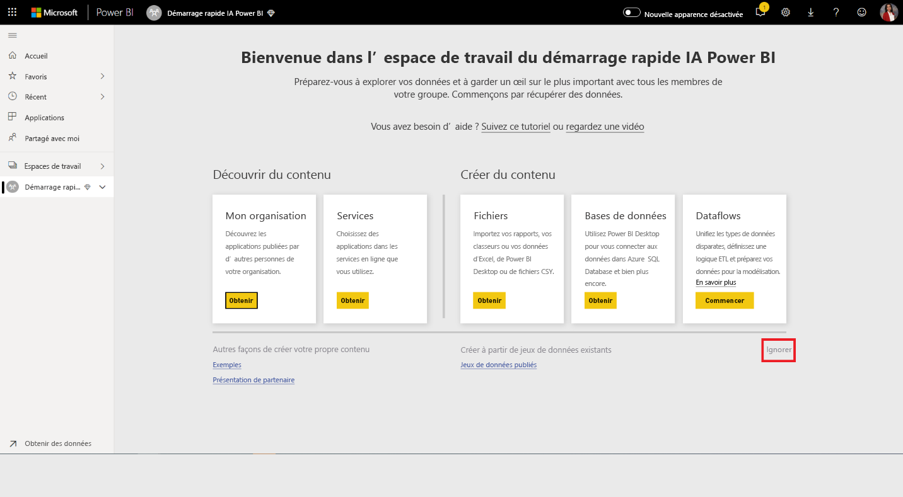

 Sélectionnez le bouton **Créer** en haut à droit de l’espace de travail, puis **Dataflow**.

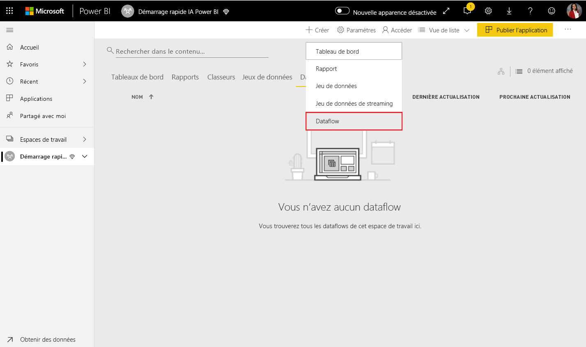

Sélectionnez **Ajouter de nouvelles entités**. Un éditeur **Power Query** est lancé dans le navigateur.

Sélectionnez **Fichier texte/CSV** comme source de données, comme indiqué dans l’image suivante.

Dans la page **Connexion à une source de données** qui apparaît ensuite, collez le lien suivant dans le fichier _online_shoppers_intention.csv_ dans la zone **Chemin ou URL du fichier** , puis sélectionnez **Suivant**.

`https://raw.githubusercontent.com/santoshc1/PowerBI-AI-samples/master/Tutorial_AutomatedML/online_shoppers_intention.csv`

L’éditeur Power Query affiche un aperçu des données à partir du fichier CSV. Vous pouvez renommer la requête avec un nom plus convivial en modifiant la valeur dans la zone Nom dans le volet droit. Par exemple, vous pouvez remplacer le nom de la requête par _Visiteurs en ligne_.

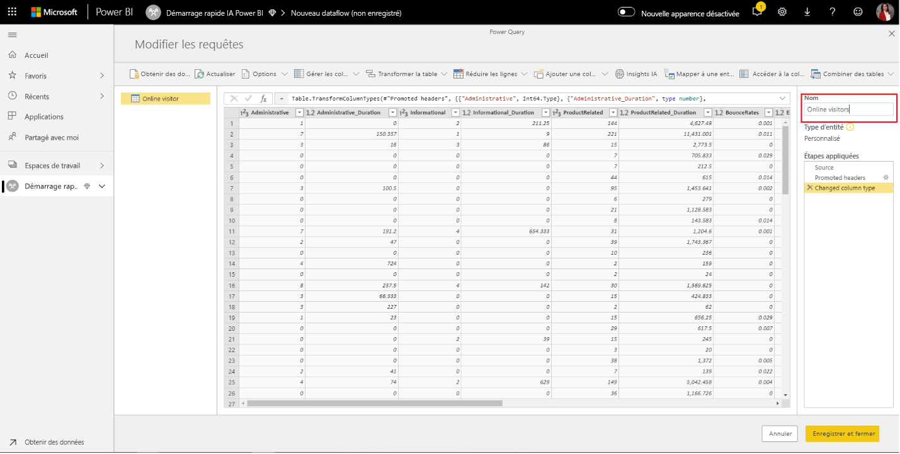

Power Query infère automatiquement le type des colonnes. Vous pouvez modifier le type de colonne en cliquant sur l’icône de type d’attribut en haut de l’en-tête de colonne. Dans cet exemple, nous changeons le type de la colonne Revenue (Revenu) en Vrai/Faux.

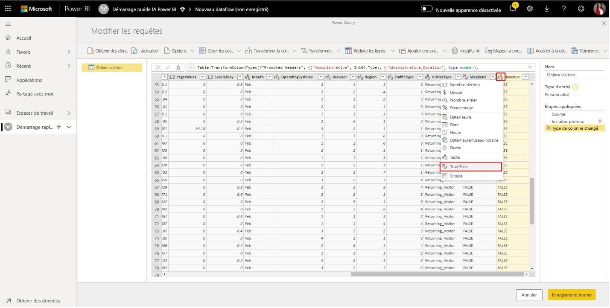

Cliquez sur le bouton **Enregistrer et fermer** pour fermer l’Éditeur Power Query. Spécifiez un nom pour le dataflow, puis sélectionnez **Enregistrer** dans la boîte de dialogue, comme illustré dans l’image suivante.

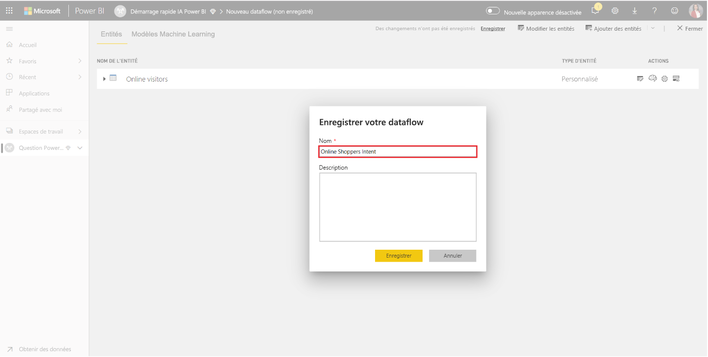

## Créer et effectuer l’apprentissage d’un modèle Machine Learning

Pour ajouter un modèle Machine Learning, sélectionnez le bouton **Appliquer le modèle Machine Learning** dans la liste **Actions** de l’entité de base qui contient vos données d’apprentissage et informations d’étiquette, puis sélectionnez **Ajouter un modèle Machine Learning**.

La première étape pour créer notre modèle Machine Learning consiste à identifier les données historiques, notamment le champ de résultat que vous voulez prédire. Le modèle sera créé en apprenant à partir de ces données.

Dans le cas du jeu de données que nous utilisons, il s’agit du champ **Revenue**. Sélectionnez **Revenue** comme valeur pour « Champ de résultat », puis sélectionnez **Suivant**.

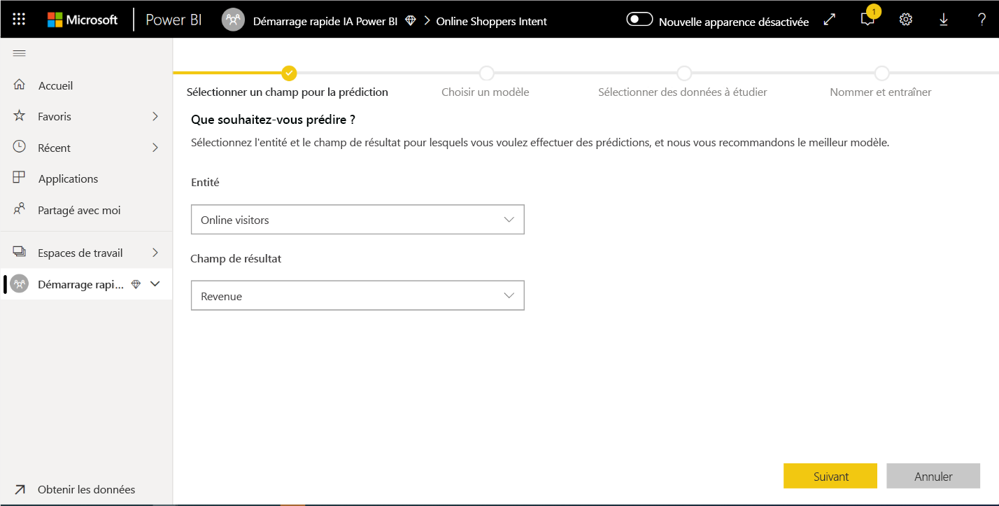

Ensuite, vous devez sélectionner le type de modèle Machine Learning à créer. Power BI analyse les valeurs du champ de résultat que vous avez identifié et suggère les types de modèles Machine Learning qui peuvent être créés pour prédire ce champ.

Dans ce cas, étant donné que nous prévoyons un résultat binaire indiquant si un utilisateur effectuera ou non un achat, Prédiction binaire est recommandé. Étant donné que nous sommes intéressés par la prédiction des utilisateurs qui effectueront un achat, sélectionnez Vrai comme résultat qui vous intéresse le plus pour Revenue. Vous pouvez aussi fournir des étiquettes conviviales pour les résultats à utiliser dans le rapport généré automatiquement qui va récapituler les résultats de la validation du modèle. Sélectionnez ensuite Suivant.

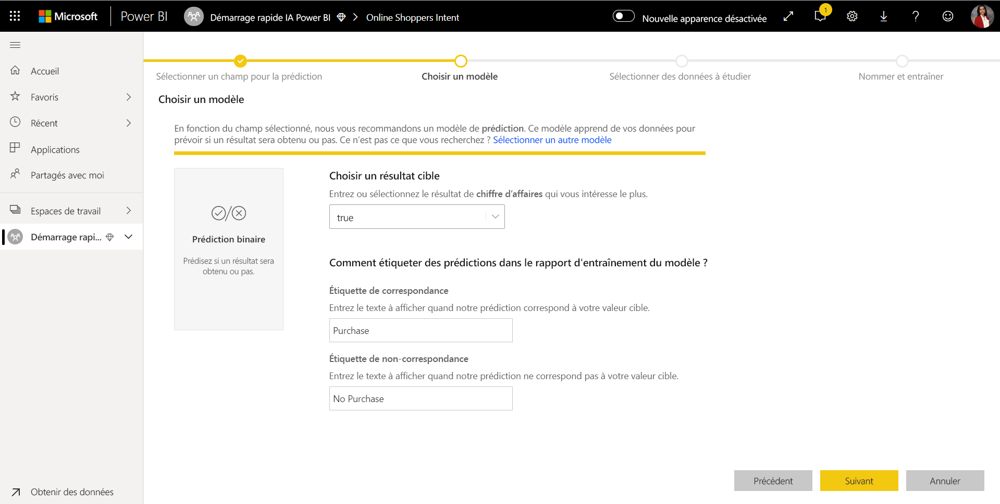

Ensuite, Power BI effectue une analyse préliminaire d’un échantillon de vos données et suggère les entrées qui peuvent produire des prédictions plus précises. Si Power BI ne recommande pas un champ, une explication est fournie en regard de celui-ci. Vous avez la possibilité de changer les sélections pour inclure seulement les champs que vous voulez que le modèle étudie, ou vous pouvez sélectionner tous les champs en cochant la case en regard du nom de l’entité. Sélectionnez **Suivant** pour accepter les entrées.

Dans la dernière étape, nous devons fournir un nom pour notre modèle. Nommez le modèle _Purchase Intent Prediction_ (Prédiction de l’intention d’achat). Vous pouvez choisir de réduire la durée de l’entraînement pour avoir des résultats rapidement, ou d’augmenter sa durée pour obtenir le meilleur modèle possible. Sélectionnez ensuite **Enregistrer et entraîner** pour commencer l’entraînement du modèle.

Le processus d’apprentissage commence par échantillonner et normaliser vos données historiques et fractionner votre jeu de données en deux nouvelles entités, _Données d'apprentissage de prédiction d’intention d’achat_ et _Données de test de prédiction d’intention d’achat_.

Selon la taille du jeu de données, le processus d’entraînement peut entre quelques minutes et le temps d’entraînement sélectionné dans l’écran précédent. À ce stade, vous pouvez voir le modèle sous l'onglet **Modèles Machine Learning** du dataflow. L’état Prêt indique que le modèle a été mis en file d’attente pour l’entraînement ou qu’il est en cours d’entraînement.

Vous pouvez vérifier que le modèle est en cours de formation et de validation par le biais de l’état du dataflow. Il s’agit d’une actualisation des données en cours sous l’onglet **Dataflows** de l’espace de travail.

Une fois l’apprentissage du modèle terminé, le dataflow affiche une date d’actualisation mise à jour. Vous pouvez vérifier que le modèle est formé en accédant à l’onglet **Modèles Machine Learning** dans le dataflow. Le modèle que vous avez créé doit afficher l’état **Entraîné** et l’ **Heure du dernier entraînement** doit être mise à jour.

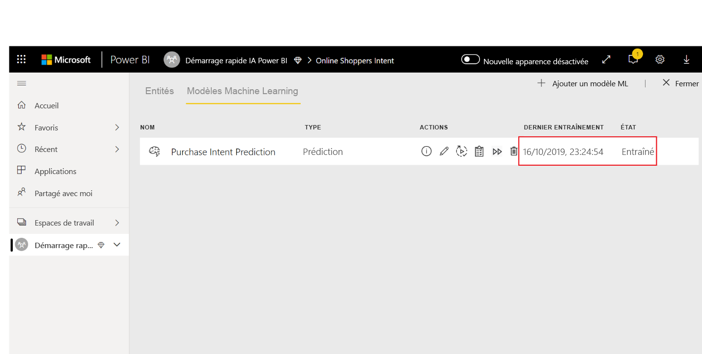

## Examiner le rapport de validation de modèle
Pour passer en revue le rapport de validation de modèle, sous l’onglet Modèles Machine Learning, sélectionnez le bouton Voir le rapport d’entraînement dans la colonne Actions du modèle. Ce rapport décrit les performances attendues de votre modèle Machine Learning.

Dans la page **Performances du modèle** du rapport, sélectionnez **Voir les meilleurs prédicteurs** pour voir les meilleures prédicteurs de votre modèle. Vous pouvez sélectionner un des prédicteurs pour voir comment la distribution des résultats est associée à ce prédicteur.

Vous pouvez utiliser le segment **Seuil de probabilité** sur la page Performances du modèle pour examiner son influence sur la précision et le rappel pour le modèle.

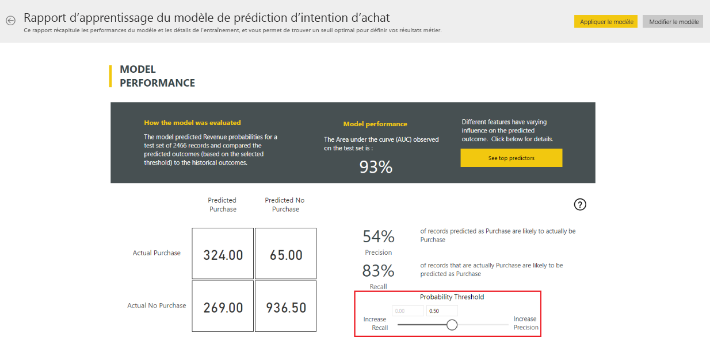

Les autres pages du rapport décrivent les métriques de performance statistiques pour le modèle.

Le rapport comprend également une page de détails de formation qui décrit les différentes itérations exécutées, la façon dont les fonctionnalités ont été extraites des entrées et les hyperparamètres pour le modèle final utilisé.

## Appliquer le modèle à une entité de dataflow

Sélectionnez le bouton **Appliquer le modèle** en haut du rapport pour appeler ce modèle. Dans la boîte de dialogue **Appliquer** , vous pouvez spécifier l’entité cible qui contient les données source auxquelles le modèle doit être appliqué.

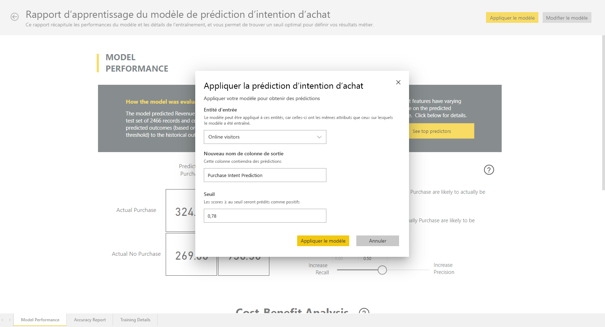

Quand vous y êtes invité, vous devez **Actualiser** le dataflow pour afficher un aperçu des résultats de votre modèle.

L’application du modèle crée deux nouvelles entités, avec le suffixe **enriched <nom_modèle>** et **enriched <nom_modèle> explanations**. Dans le cas présent, l’application du modèle à l’entité **Online Visitors** va créer **Online Visitors enriched Purchase Intent Prediction** qui inclut le résultat prédit à partir du modèle, et **Online Visitors enriched Purchase Intent Prediction explanations** qui contient les influenceurs majeurs spécifiques aux enregistrements pour la prédiction. 

L’application d’un modèle de prédiction binaire ajoute quatre colonnes avec les résultats prédits, les scores de probabilité, les influenceurs majeurs spécifiques aux enregistrements pour la prédiction et l’index des explications, chacune avec le nom de colonne spécifié en préfixe.  

Une fois l’actualisation du dataflow terminée, vous pouvez sélectionner l’entité **Online Visitors enriched Purchase Intent Prediction** pour visualiser les résultats.

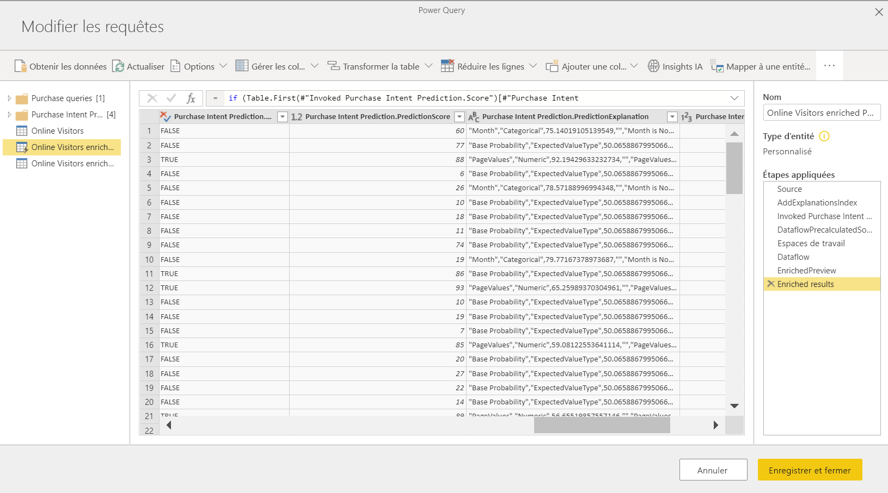

Vous pouvez également appeler n’importe quel modèle AutoML dans l’espace de travail, directement à partir de l’Éditeur Power Query dans votre flux de données. Pour accéder aux modèles Azure ML, sélectionnez le bouton Modifier pour l’entité que vous souhaitez enrichir avec des insights de votre modèle Azure ML, comme le montre l’image suivante.

La sélection du bouton Modifier ouvre l’éditeur Power Query pour les entités de votre flux de données. Sélectionnez le bouton Insights IA dans le ruban.

 Sélectionnez le dossier Modèles Machine Learning Power BI dans le menu du volet de navigation. Tous les modèles AutoML auxquels vous avez accès sont répertoriés ici en tant que fonctions de Power Query. De plus, les paramètres d’entrée pour le modèle AutoML sont automatiquement mappés en tant que paramètres de la fonction Power Query correspondante. Notez que le mappage automatique des paramètres se produit uniquement si le nom et le type de données du paramètre sont identiques.
 
Pour appeler un modèle AutoML, vous pouvez définir une des colonnes de l’entité sélectionnée en tant qu’entrée dans la liste déroulante. Vous pouvez également spécifier une valeur constante à utiliser comme entrée en basculant l’icône de la colonne à gauche de la boîte de dialogue d’entrée.

Sélectionnez Appliquer pour afficher la préversion de la sortie du modèle AutoML en tant que nouvelle colonne dans la table de l’entité. Vous voyez également l’appel de modèle comme étape appliquée pour la requête.

Une fois que vous enregistrez votre flux de données, le modèle est appelé automatiquement lorsque ce flux de données est actualisé, pour toutes les lignes nouvelles ou mises à jour de la table de l’entité.

## Utilisation de la sortie notée du modèle dans un rapport Power BI

Pour utiliser le résultat avec score de votre modèle Machine Learning, vous pouvez vous connecter à votre dataflow à partir de Power BI Desktop avec le connecteur de dataflows. L’entité **Online Visitors enriched Purchase Intent Prediction** peut maintenant être utilisée pour incorporer les prédictions de votre modèle dans les rapports Power BI.

## Étapes suivantes

Dans ce didacticiel, vous avez créé et appliqué un modèle de prédiction binaire dans Power BI à l’aide des étapes suivantes :

* Créer un dataflow avec les données d’entrée
* Créer et effectuer l’apprentissage d’un modèle Machine Learning
* Examiner le rapport de validation de modèle
* Appliquer le modèle à une entité de dataflow
* Utilisation de la sortie notée du modèle dans un rapport Power BI

Pour plus d’informations sur l’automatisation du Machine Learning dans Power BI, consultez [Machine Learning automatisé dans Power BI](../transform-model/service-machine-learning-automated.md).
