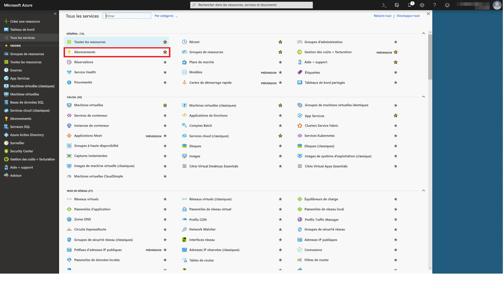
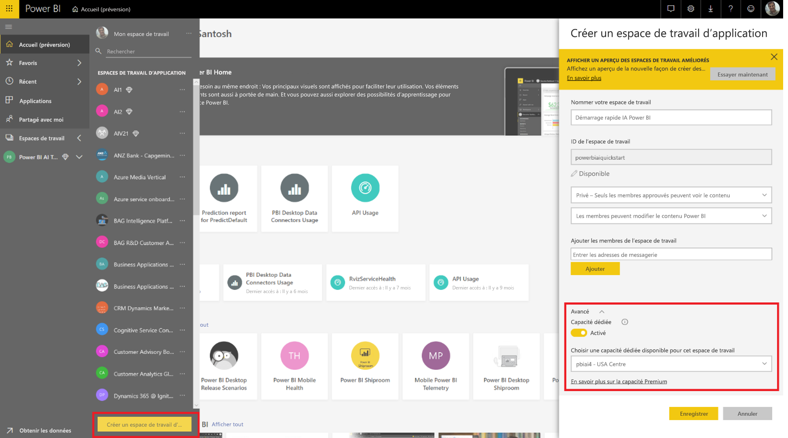
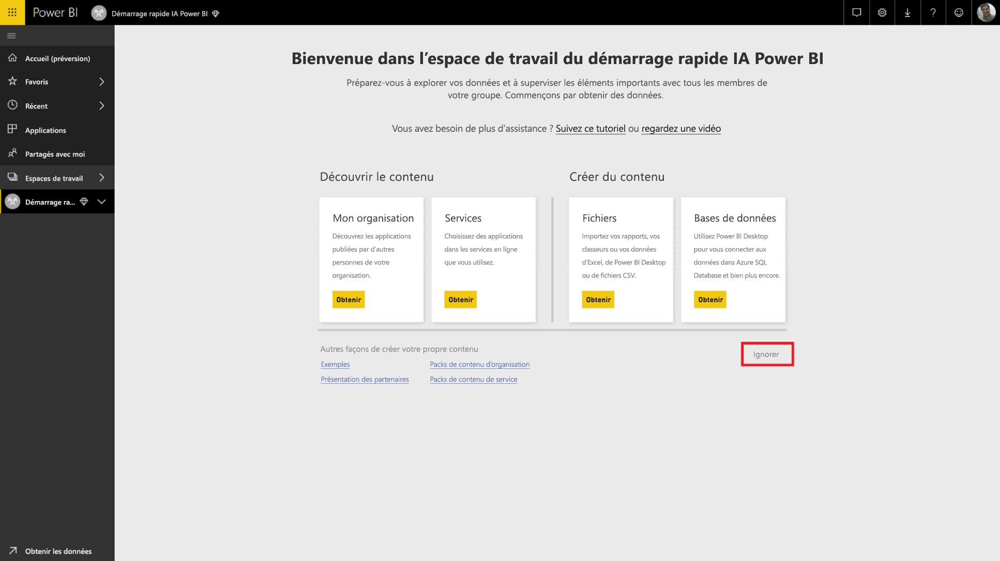
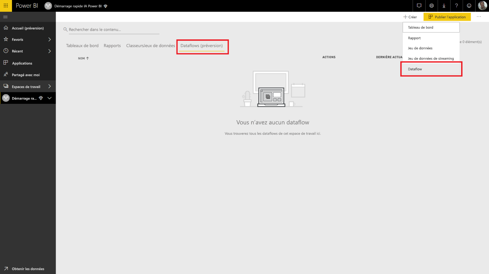
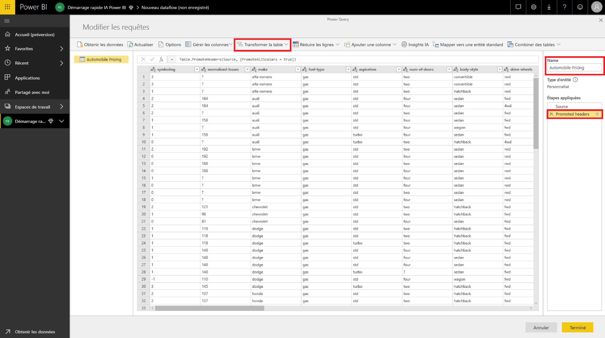
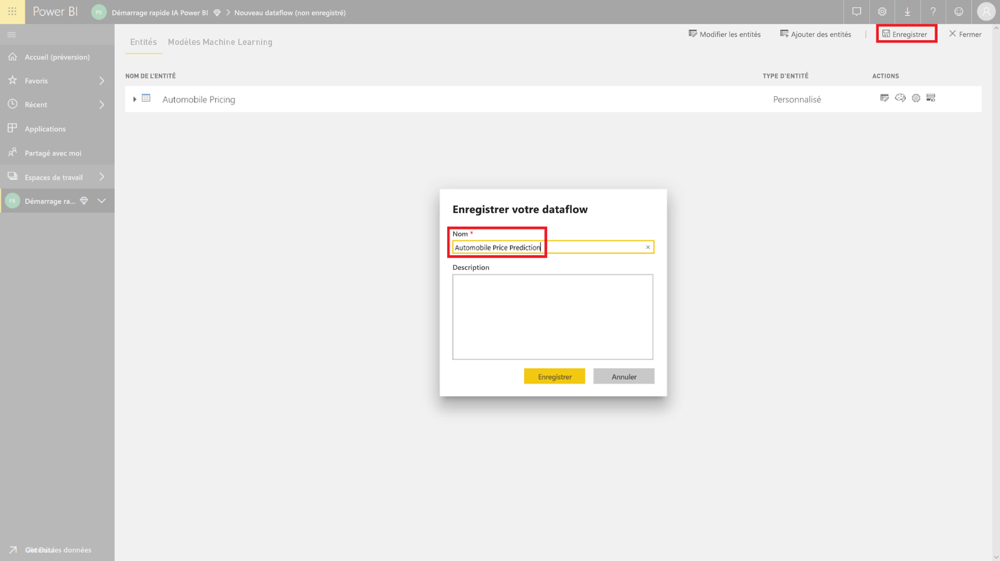
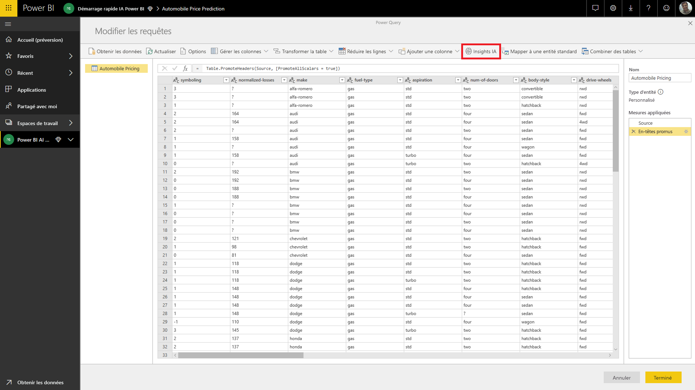
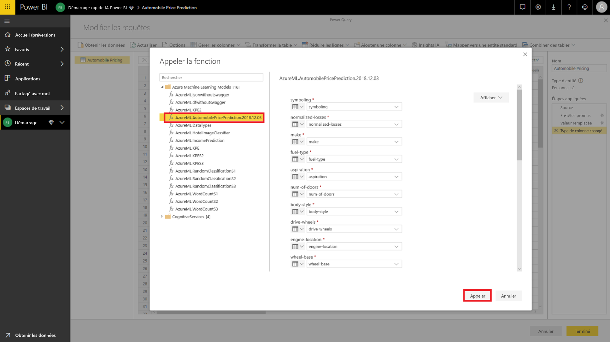
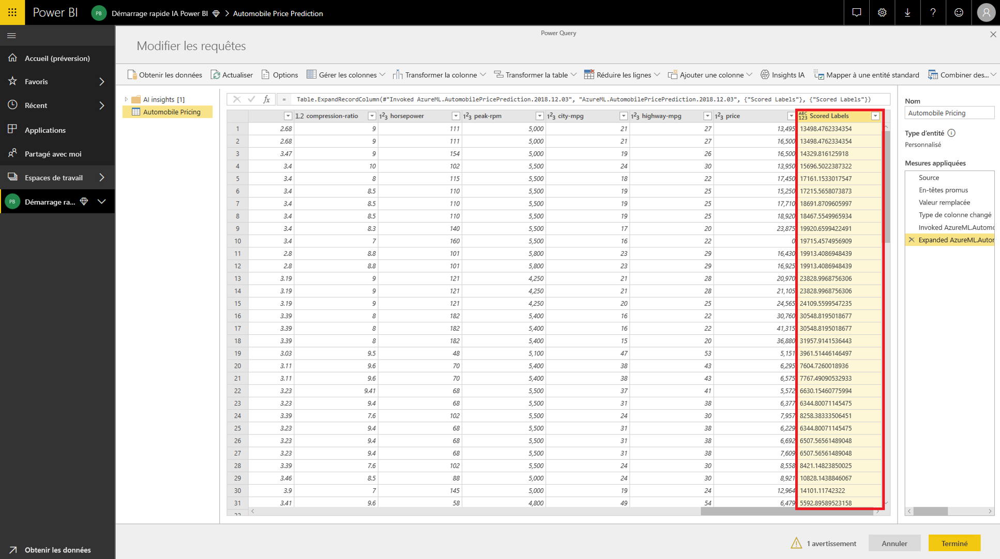

# Tutoriel : Appeler un modèle Machine Learning Studio (classique) dans Power BI (préversion)

Dans ce tutoriel, nous allons incorporer des insights dans Power BI à partir d’un modèle **Azure Machine Learning Studio (classique)** . Ce tutoriel inclut des conseils pour accorder à un utilisateur de Power BI l’accès à un modèle Azure ML en créant un flux de données et en appliquant les insights du modèle Azure ML à votre flux de données. Il fait également référence au guide de démarrage rapide pour la création d’un modèle Azure ML si vous n’en avez pas encore.

Le tutoriel vous guide tout au long des étapes suivantes :

> [!div class="checklist"]
> * Créer et publier un modèle Azure Machine Learning
> * Accorder l’accès à un utilisateur de Power BI pour qu’il utilise le modèle
> * Créer un flux de données
> * Appliquer des insights au flux de données à partir du modèle Azure ML

## Créer et publier un modèle Azure ML

Suivez les instructions de [l’étape de parcours 1 : Créez un espace de travail Machine Learning Studio (classique)](/azure/machine-learning/studio/walkthrough-1-create-ml-workspace) pour créer un espace de travail **Machine Learning**.

Vous pouvez utiliser ces étapes avec n’importe quel modèle Azure ML ou jeu de données que vous avez déjà. Si vous n’avez pas de modèle publié, vous pouvez créer un modèle en quelques minutes en vous reportant à [Créer votre première expérience de science des données dans Azure Machine Learning Studio (classique)](/azure/machine-learning/studio/create-experiment), qui configure un modèle Azure ML pour la prédiction du prix des automobiles.

Suivez les étapes de [Déployer un service web Azure Machine Learning Studio (classique)](/azure/machine-learning/studio/tutorial-part3-credit-risk-deploy) pour publier le modèle Azure ML en tant que service web.

## Accorder un accès à un utilisateur de Power BI

Pour accéder à un modèle Azure ML à partir de Power BI, vous devez avoir un accès **En lecture** à l’abonnement Azure et au groupe de ressources, et un accès **En lecture** au service web Azure Machine Learning Studio (classique) pour les modèles Machine Learning Studio (classique).  Pour le modèle Azure Machine Learning, vous devez avoir un accès **En lecture** à l’espace de travail Machine Learning.

Les étapes suivantes supposent que vous êtes le coadministrateur de l’abonnement Azure et du groupe de ressources dans lequel le modèle a été publié.

Connectez-vous au [portail Azure](https://portal.azure.com) et accédez à la page **Abonnements**, que vous trouverez dans la liste **Tous les services** du volet de navigation.

Sélectionnez l’abonnement Azure que vous avez utilisé pour publier le modèle, puis **Access Control (IAM)** . Sélectionnez ensuite **Ajouter une attribution de rôle**, puis le rôle **Lecteur** et enfin, l’utilisateur de Power BI. Lorsque vous avez terminé, sélectionnez **Enregistrer**. L’image suivante montre ces sélections.

Répétez ensuite les étapes ci-dessus pour accorder l’accès du rôle **Contributeur** à l’utilisateur de Power BI pour le service web Machine Learning spécifique sur lequel le modèle Azure ML a été déployé.

## Créer un flux de données

### Obtenir des données pour la création du flux de données

Connectez-vous au service Power BI avec les informations d’identification de l’utilisateur auquel vous avez accordé l’accès au modèle Azure ML à l’étape précédente.

Cette étape suppose que les données que vous souhaitez évaluer avec votre modèle Azure ML soient au format CSV.  Si vous avez utilisé l’**expérience de tarification automobile** pour créer le modèle dans Machine Learning Studio (classique), le jeu de données est partagé dans le lien suivant :

* [Exemple de modèle Azure Learning Studio (classique)](https://github.com/santoshc1/PowerBI-AI-samples/blob/master/Tutorial_MLStudio_model_integration/Automobile%20price%20data%20_Raw_.csv)

### Créer un flux de données

Pour créer les entités dans votre flux de données, connectez-vous au service Power BI et accédez à un espace de travail sur votre capacité dédiée où la préversion IA est activée.

Si vous ne disposez pas déjà d’un espace de travail, vous pouvez en créer un en sélectionnant **Espaces de travail** dans le menu de gauche, puis **Créer un espace de travail** dans le volet du bas.  Cette opération ouvre un panneau pour entrer les détails de l’espace de travail. Entrer le nom de l'espace de travail, puis sélectionnez **Enregistrer**.

Une fois que l’espace de travail a été créé, vous pouvez sélectionner **Ignorer** dans la partie inférieure droite de l’écran d’accueil.

Sélectionnez l’onglet **Flux de données (préversion)** , puis sélectionnez le bouton **Créer** en haut à droit de l’espace de travail et **Flux de données**.

Sélectionnez **Ajouter de nouvelles entités**, qui lance l’**Éditeur Power Query** dans le navigateur.

Sélectionnez **Texte/Fichier CSV** comme source de données.

Dans l’écran suivant, vous êtes invité à vous connecter à une source de données. Collez le lien vers les données que vous avez utilisées pour créer votre modèle Azure ML. Si vous avez utilisé les données de _tarification automobile_, vous pouvez coller le lien suivant dans la zone **Chemin d’accès de fichier ou URL**, puis sélectionner **Suivant**.

`https://raw.githubusercontent.com/MicrosoftLearning/Principles-of-Machine-Learning-Python/master/Module7/Automobile%20price%20data%20_Raw_.csv`

L’éditeur Power Query affiche un aperçu des données à partir du fichier CSV. Sélectionnez **Transformer une table** dans le ruban des commandes, puis sélectionnez **Utiliser les premières lignes comme en-têtes**.  Cette opération ajoute l’étape de requête _En-têtes promues_ au volet **Étapes appliquées** à droite. Vous pouvez également renommer la requête avec un nom plus convivial, tel que _Tarification automobile_ avec le volet de droite.

Notre jeu de données source a des valeurs inconnues définies sur « ? ».  Pour y remédier, nous pouvons remplacer « ? » par « 0 » pour éviter des erreurs ultérieures et simplifier les choses.  Pour ce faire, sélectionnez les colonnes *normalized-losses*, *bore*, *stroke*, *compression-ratio*, *horsepower* , *peak-rpm* et *price* en cliquant sur leur nom dans les en-têtes de colonnes, puis sur « Transformer les colonnes », et sélectionnez « Remplacer les valeurs ».  Remplacer « ? » par « 0 ».

Toutes les colonnes dans la table à partir d’une source de texte/CSV sont traitées comme des colonnes de texte.  Ensuite, nous devons transformer les colonnes numériques en types de données corrects.  Vous pouvez le faire dans Power Query en cliquant sur le symbole de type de données dans l’en-tête de colonne.  Transformer les colonnes en types ci-dessous :

- **Nombre entier** :  symboling, normalized-losses, curb-weight, engine-size, horsepower, peak-rpm, city-mpg, highway-mpg, price
- **Nombre décimal** :   wheel-base, length, width, height, bore, stroke, compression-ratio

Sélectionnez **Terminé** pour fermer l’éditeur Power Query. La liste des entités avec les données de _Tarification automobile_ que nous avons ajoutées s’affiche. Sélectionnez **Enregistrer** dans l’angle supérieur droit, donnez un nom au flux de données, puis sélectionnez **Enregistrer**.

### Actualiser le flux de données

L’enregistrement du flux de données affiche une notification indiquant que votre flux de données a été enregistré. Sélectionnez **Actualiser maintenant** pour ingérer des données provenant de la source dans le flux de données.

Sélectionnez **Fermer** dans le coin supérieur droit et attendez que l’actualisation du flux de données soit terminée.

Vous pouvez également actualiser votre flux de données avec les commandes **Actions**. Le flux de données affiche l’horodateur lorsque l’actualisation est terminée.

## Appliquer des insights de votre modèle Azure ML

Pour accéder au modèle Azure ML pour la _Prédiction du prix des automobiles_, vous pouvez modifier l’entité _Tarification automobile_ pour laquelle nous souhaitons ajouter le prix prévu.

La sélection de l’icône **Modifier** ouvre l’éditeur Power Query pour les entités de votre flux de données.

Sélectionnez le bouton **Insights IA** dans le ruban, puis sélectionnez le dossier _Modèles Azure Machine Learning_ dans le menu du volet de navigation.

Les modèles Azure ML auxquels vous avez accès sont répertoriés en tant que fonctions de Power Query avec un préfixe *AzureML.*  Lorsque vous cliquez sur la fonction correspondant au modèle _AutomobilePricePrediction_, les paramètres du service web du modèle sont répertoriés en tant que paramètres de fonction.

Pour appeler un modèle Azure ML, vous pouvez définir une des colonnes de l’entité sélectionnée en tant qu’entrée dans la liste déroulante. Vous pouvez également spécifier une valeur constante à utiliser comme entrée en basculant l’icône de la colonne à gauche de la boîte de dialogue d’entrée. Lorsqu’un nom de colonne correspond à l’un des noms de paramètre de fonction, la colonne est automatiquement suggérée en tant qu’entrée.  Si le nom de colonne ne correspond pas, vous pouvez le sélectionner dans la liste déroulante.

Dans le cas de la _prédiction du prix des automobiles_ modèle, les paramètres d’entrée sont :

- make
- body-style
- wheel-base
- engine-size
- horsepower
- peak-rpm
- highway-mpg

Dans notre cas, étant donné que notre table correspond au jeu de données d’origine utilisé pour former le modèle, les bonnes colonnes sont déjà sélectionnées pour tous les paramètres.

Sélectionnez **Appeler** pour afficher l’aperçu de la sortie du modèle Azure ML en tant que nouvelle colonne dans la table de l’entité. Vous verrez également l’appel du modèle comme une étape appliquée pour la requête.

La sortie du modèle est affichée sous forme d’enregistrement dans la colonne de sortie. Vous pouvez développer la colonne pour produire des paramètres de sortie individuels dans des colonnes distinctes. Dans notre cas, nous nous intéressons uniquement aux _étiquettes notées_ qui contiennent le prix prédit pour l’automobile.  Nous désélectionnons donc le reste, puis nous sélectionnons **OK**.

La colonne *Étiquettes notées* a la prédiction de prix du modèle Azure ML.

Une fois que vous enregistrez votre flux de données, le modèle Azure ML est appelé automatiquement lorsque ce flux de données est actualisé pour toutes les lignes nouvelles ou mises à jour de la table de l’entité.

## Nettoyer les ressources

Si vous n’avez plus besoin des ressources Azure que vous avez créées à l’aide de cet article, supprimez-les pour éviter des frais.  Vous pouvez également supprimer les flux de données que vous avez créés si vous n’avez plus besoin.

## Étapes suivantes

Dans ce tutoriel, vous avez créé une expérience simple en utilisant Azure Machine Learning Studio (classique) avec un jeu de données simple lors des étapes suivantes :

- Créer et publier un modèle Azure Machine Learning
- Accorder l’accès à un utilisateur de Power BI pour qu’il utilise le modèle
- Créer un flux de données
- Appliquer des insights au flux de données à partir du modèle Azure ML

Pour plus d’informations sur l’intégration d’Azure Machine Learning dans Power BI, consultez [Intégration d’Azure Machine Learning dans Power BI (préversion)](../transform-model/service-machine-learning-integration.md).