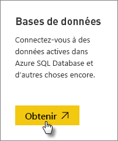
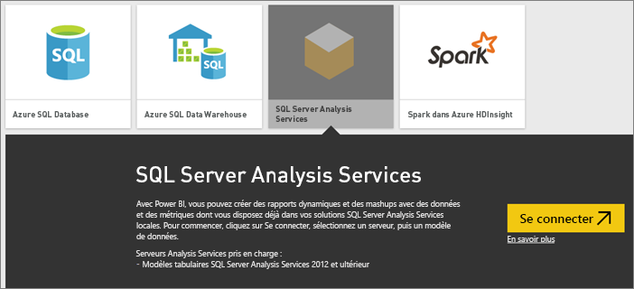
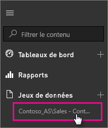

# Données actives SQL Server Analysis Services dans Power BI

Dans Power BI, vous disposez de deux méthodes pour vous connecter à des données actives provenant d’un serveur SQL Server Analysis Services. Dans **Obtenir des données**, vous pouvez vous connecter à un serveur SQL Server Analysis Services ou vous connecter à un [fichier Power BI Desktop](service-desktop-files.md) ou à un [classeur Excel](service-excel-workbook-files.md) qui est déjà connecté à un serveur Analysis Services. Comme bonne pratique, Microsoft recommande vivement l’utilisation de Power BI Desktop en raison de la richesse de ses outils et de sa capacité à conserver localement une copie de sauvegarde du fichier Power BI Desktop.

>[!IMPORTANT]
> * Pour que vous puissiez vous connecter à un serveur Analysis Services en ligne, une passerelle de données locale doit être installée et configurée par un administrateur. Pour plus d’informations, consultez [Passerelle de données locale](service-gateway-onprem.md).
> * Quand vous utilisez la passerelle, vos données restent locales.  Les rapports que vous créez à partir de ces données sont enregistrés dans le service Power BI. 
> * [Les requêtes en langage naturel dans Q&R](../create-reports/service-q-and-a-direct-query.md) sont actuellement en version préliminaire pour les connexions actives Analysis Services.

## Pour se connecter à un modèle via Obtenir des données

1. Dans **Mon espace de travail**, sélectionnez **Obtenir des données**. Vous pouvez également sélectionner un espace de travail de groupe, s’il y en a de disponible.

   

2. Sélectionnez **Bases de données et plus**.

   

3. Sélectionnez **SQL Server Analysis Services** > **Se connecter**.

   

4. Sélectionnez un serveur. Si vous ne voyez aucun des serveurs répertoriés ici, cela signifie qu’une passerelle ou une source de données n’a pas été configurée, ou que votre compte n’est pas répertorié sous l’onglet **Utilisateurs** de la source de données, dans la passerelle. Vérifiez auprès de votre administrateur.

5. Sélectionnez le modèle auquel vous voulez vous connecter. Il peut être tabulaire ou multidimensionnel.

Une fois que vous êtes connectez au modèle, il apparaît dans votre site Power BI, dans **Mon espace de travail/Jeux de données**. Si vous êtes passé à un espace de travail de groupe, le jeu de données s’affiche dans le groupe.

## Vignettes d’un tableau de bord

Si vous épinglez des éléments visuels d’un rapport dans le tableau de bord, les vignettes épinglées sont automatiquement actualisées toutes les 10 minutes. Si les données de votre serveur local Analysis Services sont mises à jour, les vignettes sont mises à jour automatiquement après 10 minutes.

## Problèmes courants

* Erreur due à l’impossibilité de charger le schéma du modèle : cette erreur se produit quand l’utilisateur qui se connecte à SSAS n’a pas accès à la base de données, au cube et au modèle SSAS.

## Étapes suivantes

* [Passerelle de données locale](service-gateway-onprem.md)  
* [Gérer les sources de données Analysis Services](service-gateway-enterprise-manage-ssas.md)  
* [Résolution des problèmes de passerelle de données locale](service-gateway-onprem-tshoot.md)  

D’autres questions ? [Posez vos questions à la communauté Power BI](https://community.powerbi.com/)