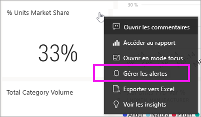
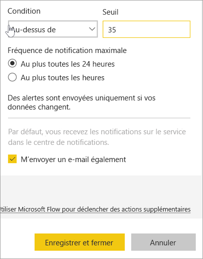
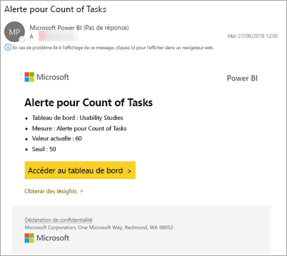
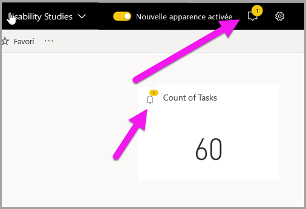
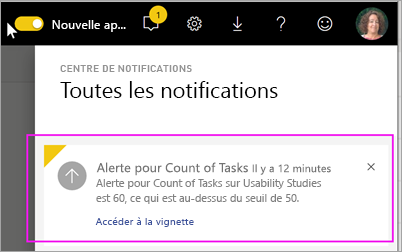
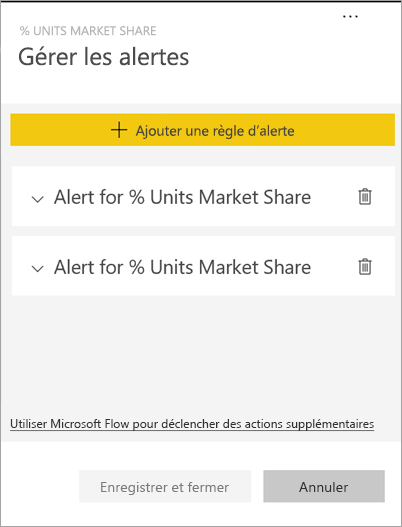
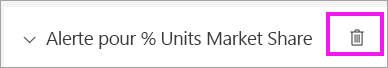
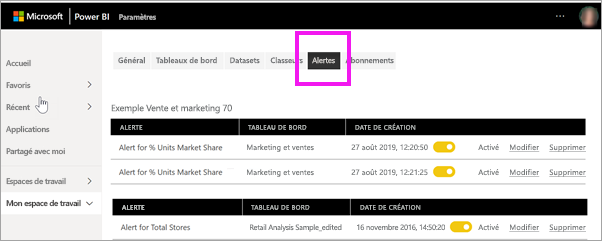

# Tutoriel : Définir des alertes sur des tableaux de bord Power BI

[!INCLUDE[consumer-appliesto-ynnn](../includes/consumer-appliesto-ynnn.md)]

[!INCLUDE [power-bi-service-new-look-include](../includes/power-bi-service-new-look-include.md)]

Définissez des alertes pour vous avertir quand des données de vos tableaux de bord changent au-delà ou en deçà de limites que vous définissez. Des alertes ne peuvent être définies que sur des vignettes épinglées à partir de visuels de rapport, et uniquement sur des jauges, des indicateurs de performance clés et des cartes. 

Les *consommateurs* peuvent ajouter des alertes à des vignettes dans les tableaux de bord qu’ils ont créés dans **Mon espace de travail**. Les *consommateurs* peuvent également ajouter des alertes à des vignettes sur les tableaux de bord qui ont été partagés avec eux dans une [capacité Premium](end-user-license.md). Si vous disposez d’une licence Power BI Pro, vous pouvez également définir des alertes sur des vignettes dans un autre espace de travail.
Cette fonctionnalité étant toujours en cours d’évolution, reportez-vous à la [section Conseils et résolution des problèmes ci-dessous](#tips-and-troubleshooting).

Vous seul pouvez voir les alertes que vous définissez, même si vous partagez votre tableau de bord. Les alertes de données sont entièrement synchronisées entre plateformes. Définissez et affichez les alertes de données [dans les applications mobiles Power BI](mobile/mobile-set-data-alerts-in-the-mobile-apps.md) et dans le service Power BI. 

> [!WARNING]
> Ces alertes fournissent des informations sur vos données. Si vous affichez vos données Power BI sur un appareil mobile et que celui-ci est volé, nous vous recommandons d’utiliser le service Power BI pour désactiver toutes les alertes.
> 

Ce tutoriel couvre les points suivants.
> [!div class="checklist"]
> * Qui peut définir des alertes
> * Quels visuels sont pris en charge par les alertes
> * Qui peut voir mes alertes
> * Les alertes fonctionnent-elles sur Power BI Desktop et sur Power BI Mobile
> * Comment créer une alerte
> * Où vais-je recevoir mes alertes

Si vous n’êtes pas inscrit à Power BI, [inscrivez-vous à un essai gratuit](https://app.powerbi.com/signupredirect?pbi_source=web) avant de commencer.

Cet exemple utilise une vignette de carte de tableau de bord provenant de l’exemple d’application Sales & Marketing. Cette application est disponible sur [Microsoft AppSource](https://appsource.microsoft.com). Pour obtenir de l’aide sur l’obtention de l’application, consultez [Installer et utiliser l’application Ventes et marketing](end-user-app-marketing.md).

1. Dans une jauge, un indicateur de performance clé ou une vignette de carte du tableau de bord, sélectionnez les points de suspension.
   
   
2. Sélectionnez l’icône en forme de cloche  ou **Gérer les alertes** pour ajouter une ou plusieurs alertes pour **% Units market share**.

   

   
1. Dans le volet **Gérer les alertes**, sélectionnez **+ Ajouter une règle d’alerte**.  Vérifiez que le curseur est défini sur **Activé** et donnez un titre à votre alerte. Les titres vous aident à reconnaître facilement vos alertes.
   
   
4. Faites défiler vers le bas, puis entrez les détails de l’alerte.  Dans cet exemple, nous allons créer une alerte qui nous avertit une fois par jour si notre part de marché passe à 35 ou plus. Les alertes s’affichent dans notre centre de notification. Nous allons également demander à Power BI de nous envoyer un courrier électronique.
   
   
5. Sélectionnez **Enregistrer et fermer**.
 
   > [!NOTE]
   > Les alertes fonctionnent uniquement sur les données actualisées Lorsque les données sont actualisées, Power BI vérifie si une alerte est définie pour celles-ci. Si les données ont atteint un seuil d’alerte, une alerte est déclenchée. 
   > 

## Recevoir des alertes
Quand les données suivies atteignent un des seuils définis, plusieurs choses se produisent. Power BI vérifie d’abord si cela fait plus d’une heure ou plus de 24 heures (selon l’option sélectionnée) que la dernière alerte a été envoyée. Tant que les données se trouvent au-delà du seuil, vous recevez une alerte.

Ensuite, Power BI envoie une alerte à votre Centre de notifications et éventuellement par e-mail. Chaque alerte contient un lien direct vers vos données. Sélectionnez le lien pour afficher la vignette appropriée.  

1. Si vous avez défini l’alerte de façon à recevoir un courrier électronique, vous recevez un message semblable à celui-ci dans votre boîte de réception. C’est une alerte que nous avons définie sur un autre tableau de bord : ce tableau de bord effectue le suivi des tâches effectuées par l’équipe Usability (Utilisabilité).
   
   
2. Power BI ajoute un message à votre **centre de notification** et ajoute une nouvelle icône d’alerte à la vignette applicable.
   
   
3. Ouvrez le centre de notification pour afficher les détails de l’alerte.
   
    
   
  

## Gestion des alertes

Il existe de nombreuses façons de gérer vos alertes : à partir de la vignette de tableau de bord elle-même, dans le menu Paramètres de Power BI et sur une vignette spécifique dans l’[application mobile Power BI sur iPhone](mobile/mobile-set-data-alerts-in-the-mobile-apps.md) ou dans l’[application mobile Power BI pour Windows 10](mobile/mobile-set-data-alerts-in-the-mobile-apps.md).

### À partir de la vignette elle-même

1. Si vous devez modifier ou supprimer une alerte pour une vignette, rouvrez la fenêtre **Gérer les alertes** en sélectionnant l’icône en forme de cloche . Toutes les alertes que vous avez définies pour cette vignette sont affichées.
   
    .
2. Pour modifier une alerte, sélectionnez la flèche à gauche du nom de l’alerte.
   
    .
3. Pour supprimer une alerte, sélectionnez la poubelle à droite du nom de l’alerte.
   
      

### Dans le menu Paramètres de Power BI

1. Sélectionnez l’icône en forme d’engrenage dans la barre de menus de Power BI.
   
    .
2. Sous **Paramètres**, sélectionnez **Alertes**.
   
    
3. À ce stade, vous pouvez activer et désactiver les alertes, ouvrir la fenêtre **Gérer les alertes** pour apporter des modifications ou supprimer l’alerte.

## Conseils et résolution des problèmes 

* Si vous ne parvenez pas à définir une alerte pour une jauge, un indicateur de performance clé ou une carte, contactez votre administrateur de locataire pour obtenir de l’aide. Des alertes sont parfois désactivées ou indisponibles pour votre tableau de bord ou pour des types spécifiques de vignettes de tableau de bord.
* Les alertes fonctionnent uniquement sur les données actualisées (pas sur les données statiques). La plupart des exemples fournis par Microsoft sont statiques. 
* Une licence Power BI Pro ou Premium est nécessaire pour recevoir et afficher du contenu partagé. Pour plus d’informations, consultez [Quelle est ma licence ?](end-user-license.md).
* Des alertes peuvent être définies sur des visuels créés à partir de jeux de données de streaming que vous épinglez d’un rapport vers un tableau de bord. Vous ne pouvez pas définir d’alertes sur des vignettes de streaming créées directement sur le tableau de bord à l’aide de **Ajouter une vignette** > **Données de streaming personnalisées**.

## Nettoyer les ressources
Les instructions pour la suppression des alertes sont expliquées ci-dessus. En résumé, sélectionnez l’icône d’engrenage dans la barre de menus de Power BI. Sous **Paramètres**, sélectionnez **Alertes** et supprimez l’alerte.

> [!div class="nextstepaction"]
> [Définir des alertes de données sur votre appareil mobile](mobile/mobile-set-data-alerts-in-the-mobile-apps.md)

