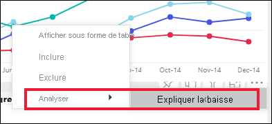
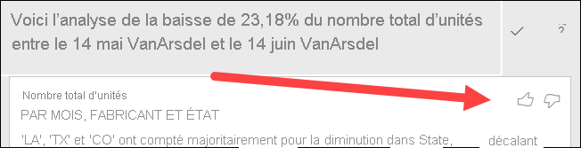
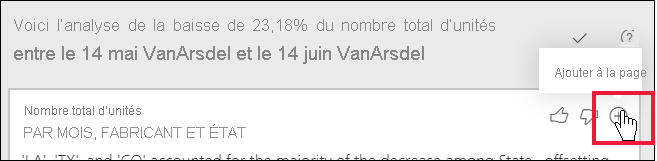

# Utilisation de la fonctionnalité Analyser pour expliquer les fluctuations dans les visuels de rapport

[!INCLUDE[consumer-appliesto-yynn](../includes/consumer-appliesto-yynn.md)]

Les visuels de rapport font souvent apparaître une hausse des valeurs importante suivie d’une baisse marquée, et vous vous interrogez sur la cause de telles fluctuations. Avec **Analyser** du **service Power BI**, vous pouvez identifier la cause en quelques clics.

Prenons par exemple le visuel suivant, qui indique *Unités totales* par *Mois* et *Fabricant*. VanArsdel est plus performant que ses concurrents, mais présente une forte baisse en juin 2014. Dans ce cas, vous pouvez explorer les données pour obtenir une explication sur ce qui s’est passé. 

Vous pouvez demander au service Power BI d’expliquer les hausses, les baisses ou les distributions inhabituelles observées dans des visuels afin d’obtenir une analyse rapide, automatique et révélatrice de vos données. Cliquez avec le bouton droit sur un point de données, puis sélectionnez **Analyser > Expliquer la baisse** (ou la hausse si la barre précédente était plus basse), ou **Analyser > Trouver où cette distribution est différente**. Des insights vous sont proposés dans une fenêtre facile à utiliser.

La fonctionnalité Analyser, contextuelle, se base sur le point de données qui précède immédiatement, par exemple, la barre ou la colonne précédente.

> [!NOTE]
> Cette fonctionnalité étant en préversion, elle est sujette à modification. La fonctionnalité d’insight est activée par défaut (vous n’avez pas besoin de cliquer sur une zone Préversion pour l’activer).

### Facteurs et catégories choisis

Après examen des différentes colonnes, Power BI sélectionne et affiche les facteurs dont la contribution relative a le plus fortement évolué. Pour chacune, les valeurs qui correspondent à la plus forte évolution sur le plan de la contribution sont représentées dans la description. Il en va de même des valeurs qui ont le plus augmenté ou baissé.

Pour afficher tous les insights générés par Power BI, utilisez la barre de défilement. Le contributeur le plus significatif est affiché en premier. 

## Utilisation des informations
Pour utiliser les insights afin d’expliquer les tendances observées sur les visuels, cliquez avec le bouton droit sur n’importe quel point de données d’un graphique à barres ou en courbes, puis sélectionnez **Analyser**. Choisissez ensuite l’option qui s’affiche : **Expliquer l’augmentation**, **Expliquer la baisse** ou **Expliquer la différence**.

Power BI exécute alors ses algorithmes Machine Learning sur les données, puis insère dans une fenêtre un visuel et une description des catégories qui ont le plus influencé la hausse, la baisse ou la différence.  Dans cet exemple, le premier insight est un graphique en cascade.

En sélectionnant les petites icônes au bas du visuel en cascade, vous pouvez choisir d’afficher les informations dans un nuage de points, un histogramme empilé ou un graphique de ruban.

Utilisez les icônes de *pouce levé* et de *pouce baissé* en haut de la page pour commenter le visuel et la fonctionnalité.  

Vous pouvez utiliser les insights lorsque votre rapport est en mode Lecture ou Édition. La fonctionnalité est donc polyvalente pour l’analyse de données et la création de visuels que vous pouvez aisément ajouter à vos rapports. Si le rapport est ouvert en mode Édition, une icône plus s’affiche à côté des icônes de pouce. Sélectionnez l’icône plus pour ajouter l’insight à votre rapport sous la forme d’un nouvel visuel. 

## Détail des résultats retournés

Les détails retournés par les insights visent à souligner ce qui a changé entre les deux périodes et ainsi de mieux comprendre cette évolution.  

On peut considérer que l’algorithme prend toutes les autres colonnes du modèle et calcule la répartition en fonction de cette colonne pour la période *antérieure* et la période *postérieure*, déterminant ainsi l’importance de l’évolution observée dans cette décomposition et retournant ensuite les colonnes qui présentent la plus forte évolution. Par exemple, *State* (État) a été sélectionné dans l’analyse en cascade ci-dessus, car la contribution de la Louisiane, du Texas et du Colorado, qui a chuté de 13 à 19 % entre juin et juillet, représente le principal facteur de la baisse de *Total units* (Nombre total d’unités).  

Pour chaque insight retourné, quatre visuels peuvent être affichés. Trois de ces visuels sont destinés à souligner l’évolution de la contribution entre les deux périodes. Par exemple, pour l’explication de la hausse entre les 2e trimestre (*Qtr 2*) et 3e trimestre (*Qtr 3*). Le graphique en ruban indique les modifications avant et après le point de données sélectionné.

### Nuage de points

Le visuel en nuage de points affiche la valeur de la mesure de la première période (sur l’axe X) par rapport à la celle de la deuxième période (sur l’axe Y), pour chaque valeur de la colonne (*State* dans ce cas). Les points de données se situent dans la zone verte s’ils ont augmenté et dans la zone rouge s’ils ont baissé. 

Le trait en pointillé représente la droite d’ajustement. Ainsi, les points de données qui se trouvent au-dessus sont ceux qui ont augmenté davantage que la tendance globale et ceux qui se trouvent au-dessous sont ceux qui ont moins augmenté.  

Les éléments de données qui ne présentent pas de valeur dans l’une des périodes n’apparaissent pas dans le nuage de points.

### Histogramme empilé 100 %

Le visuel en histogramme empilé 100 % indique la valeur de la contribution au total (100 %) pour le point de données sélectionné et le précédent. Il permet une comparaison côte à côte de la contribution de chacun des points de données. Dans cet exemple, les info-bulles indiquent la contribution réelle de la valeur sélectionnée (Texas). Comme la liste des États est longue, elles aident à voir les détails. Elles permettent ainsi de constater que le Texas présente à peu près la même contribution en pourcentage aux unités totales (31 % et 32 %), mais que le nombre réel d’unités totales a baissé de 89 à 71. N’oubliez pas que l’axe Y est un pourcentage, et non un total, et que chaque bande de colonne représente un pourcentage, et non une valeur. 

### Graphique de ruban

Le graphique en ruban est un visuel qui indique la mesure avant et après. Il s’avère particulièrement utile pour montrer l’évolution des contributions quand le *classement* des contributeurs a évolué (par exemple, *LA* est passé de numéro deux à numéro onze).  Par ailleurs, bien que *TX* soit représenté par un ruban large tout en haut (ce qui signifie qu’il s’agit du contributeur le plus significatif avant et après), la chute montre que la valeur de la contribution a chuté au cours de la période sélectionnée et après.

### Graphique en cascade

Le quatrième visuel est un graphique en cascade qui souligne les hausses ou baisses réelles entre les périodes. Il montre clairement un contributeur significatif à la baisse de juin 2014, en l’occurrence **State** (État). En particulier, l’influence qu’a eue **State** (État) sur le nombre total d’unités se décline ainsi : les baisses enregistrées en Louisiane, au Texas et dans le Colorado sont celles qui ont joué le rôle le plus significatif.      

 

## Considérations et limitations
Étant donné que ces insights sont basés sur l’évolution du précédent point de données, ils ne sont pas disponibles au moment où vous sélectionnez le premier point de données dans un visuel. 

**Analyser** n’est pas disponible pour tous les types de visuels. 

La liste suivante rassemble les scénarios non pris en charge à l’heure actuelle pour **Analyser – Expliquer les hausses/baisses/différences** :

* Filtres TopN
* Filtres Inclure/Exclure
* Filtres de mesures
* Mesures non numériques
* Utilisation de « Afficher la valeur comme »
* Mesures filtrées (les mesures filtrées sont des calculs effectués au niveau du visuel auxquels est appliqué un filtre spécifique (par exemple, *Total des ventes pour la France*) ; elles sont utilisées dans certains visuels créés par la fonctionnalité d’insights.
* Colonnes de catégorie sur l’axe X, sauf si celui-ci définit un tri par colonne de type scalaire. Si vous utilisez une hiérarchie, chaque colonne dans la hiérarchie active doit remplir cette condition.

## Étapes suivantes
[Graphiques en cascade](../visuals/power-bi-visualization-waterfall-charts.md)    
[Nuages de points](../visuals/power-bi-visualization-scatter.md)    
[Histogrammes](../visuals/power-bi-report-visualizations.md)    
[Graphiques de ruban](../visuals/desktop-ribbon-charts.md)
