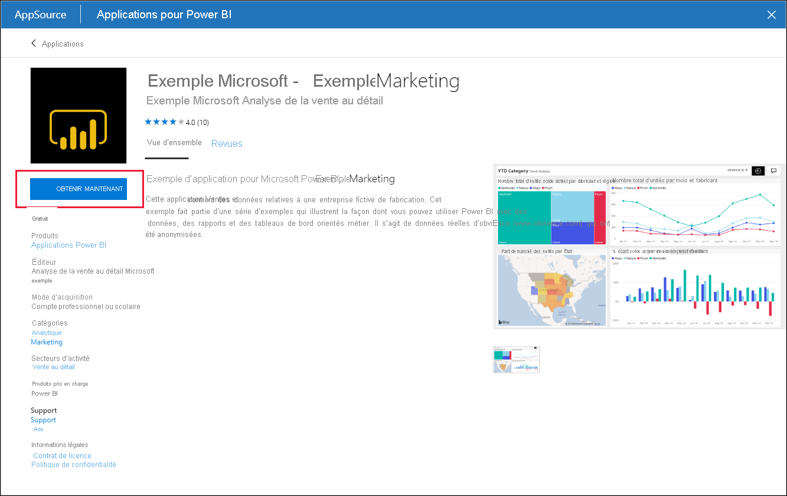
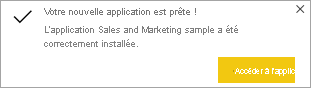
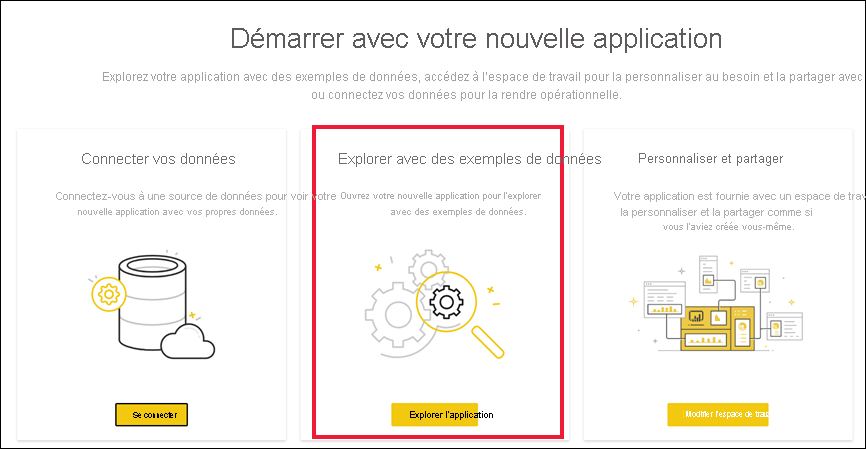

# Installer et utiliser l’exemple d’application Vente et marketing dans le service Power BI

[!INCLUDE[consumer-appliesto-yyny](../includes/consumer-appliesto-yyny.md)]

Maintenant que vous avez des [connaissances de base sur l’obtention de contenu Power BI](end-user-app-view.md), découvrons l’application Vente et marketing disponible sur Microsoft AppSource. 

## Obtenir l’application à partir de Microsoft AppSource

1. Ouvrez [https://appsource.microsoft.com](https://appsource.microsoft.com).

   

1. Dans la zone de recherche, entrez **Marketing** et cochez la case en regard d’**Affiner par produit > Applications Power BI**. 

    

1. Sélectionnez la vignette de l’application pour **Microsoft Sample - Sales & Marketing**. Vous pouvez éventuellement consulter la vue d’ensemble et les révisions et examiner les images.  Sélectionnez ensuite **Obtenir maintenant**.

   

1. Confirmez que vous voulez installer cette application.

   

5. Le service Power BI affiche un message de réussite une fois l’application installée. Sélectionnez **Accéder à l’application** pour ouvrir l’application. Selon la façon dont le concepteur a créé l’application, le tableau de bord ou le rapport de l’application s’affiche.

    

    Vous pouvez également ouvrir l’application directement à partir de votre liste des contenus d’application en sélectionnant **Applications** et en choisissant la mosaïque **Sales & marketing**.

    

6. Indiquez si vous souhaitez connecter vos propres données, explorer avec des exemples de données ou personnaliser et partager votre nouvelle application. Comme nous avons sélectionné un exemple d’application Microsoft, commençons par l’explorer. 

    

7.  Votre nouvelle application s’ouvre avec un tableau de bord. Le *concepteur* de l’application pourrait l’avoir configurée pour qu’elle s’ouvre à la place sur un rapport.  

    

## Interagir avec les tableaux de bord et rapports dans l’application
Prenez le temps d’explorer les données dans les tableaux de bord et les rapports qui composent l’application. Vous avez accès à toutes les interactions Power BI standard, comme le filtrage, la mise en évidence, le tri et l’exploration.  Vous ne voyez pas encore très bien la différence entre les tableaux de bord et les rapports ?  Lisez l’[article sur les tableaux de bord](end-user-dashboards.md) et l’[article sur les rapports](end-user-reports.md).  

## Étapes suivantes
* [Revenir à la vue d’ensemble des applications](end-user-apps.md)    
* [Voir un rapport Power BI](end-user-report-open.md)    
* [Autres moyens de partager du contenu avec vous](end-user-shared-with-me.md)
