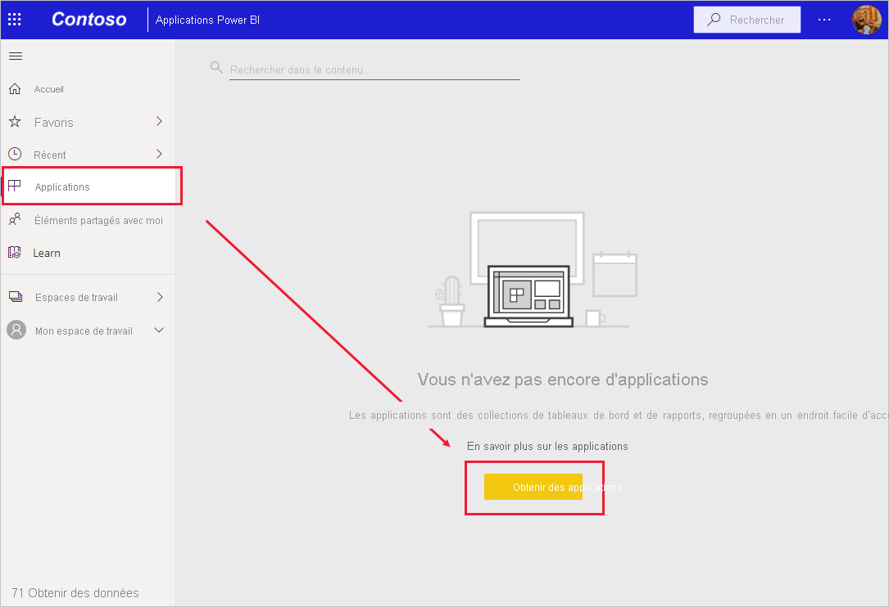
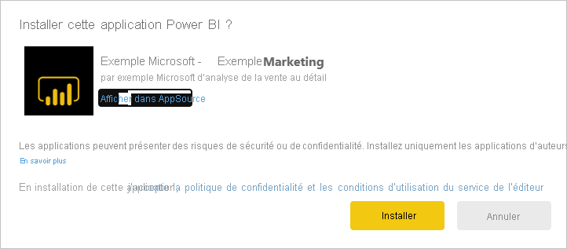
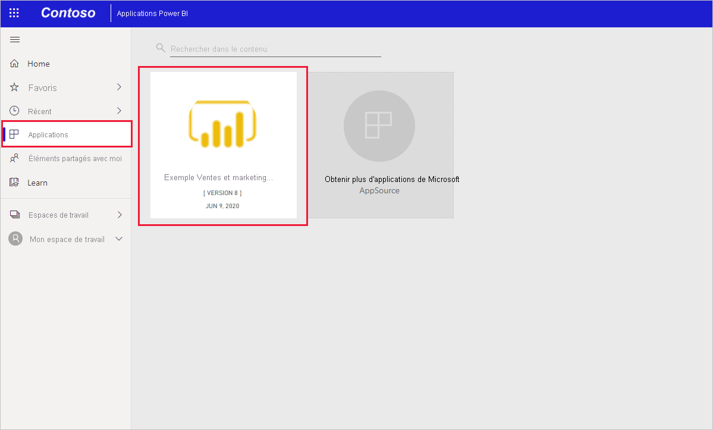

# Installer et utiliser l’exemple d’application Vente et marketing dans le service Power BI

[!INCLUDE[consumer-appliesto-yyny](../includes/consumer-appliesto-yyny.md)]

Maintenant que vous avez des [connaissances de base sur l’obtention de contenu Power BI](end-user-app-view.md), découvrons l’application Vente et marketing disponible sur Microsoft AppSource (appsource.com). 

## Télécharger l’application à partir de la Place de marché des applications Power BI

1. [Connectez-vous au service Power BI](./end-user-sign-in.md) si vous n’êtes pas déjà connecté. 

1. Une fois que vous êtes dans Power BI, sélectionnez **Applications > Obtenir des applications**. 

    

1. La Place de marché des applications Power BI s’ouvre. Trouvez l’application Vente et marketing. Si vous ne le voyez pas, essayez de taper « marketing » dans la zone de recherche.

    

1. Cliquez sur la vignette de l’application. L’offre d’application sur AppSource s’ouvre. Cliquez sur **OBTENIR MAINTENANT**.

   

1. Confirmez que vous voulez installer cette application.

   

5. Le service Power BI affiche un message de réussite une fois l’application installée. Sélectionnez **Accéder à l’application** pour ouvrir l’application. Selon la façon dont le concepteur a créé l’application, le tableau de bord ou le rapport de l’application s’affiche.

    

    Vous pouvez également ouvrir l’application directement à partir de votre liste des contenus d’application en sélectionnant **Applications** et en choisissant **Sales & marketing**.

    

6. Choisissez d’explorer ou de personnaliser et de partager votre nouvelle application. Comme nous avons sélectionné un exemple d’application Microsoft, commençons par l’explorer. 

    

7.  Votre nouvelle application s’ouvre avec un tableau de bord. Le *concepteur* de l’application pourrait l’avoir configurée pour qu’elle s’ouvre à la place sur un rapport.  

    

## Interagir avec les tableaux de bord et rapports dans l’application
Prenez le temps d’explorer les données dans les tableaux de bord et les rapports qui composent l’application. Vous avez accès à toutes les interactions Power BI standard, comme le filtrage, la mise en évidence, le tri et l’exploration.  Vous ne voyez pas encore très bien la différence entre les tableaux de bord et les rapports ?  Lisez l’[article sur les tableaux de bord](end-user-dashboards.md) et l’[article sur les rapports](end-user-reports.md).  

## Étapes suivantes
* [Revenir à la vue d’ensemble des applications](end-user-apps.md)
* [Voir un rapport Power BI](end-user-report-open.md)
* [Autres moyens de partager du contenu avec vous](end-user-shared-with-me.md)
