# Installer et utiliser des applications avec des tableaux de bord et des rapports dans Power BI

[!INCLUDE[consumer-appliesto-ynny](../includes/consumer-appliesto-ynny.md)]

[!INCLUDE [power-bi-service-new-look-include](../includes/power-bi-service-new-look-include.md)]

Maintenant que vous avez des [connaissances de base sur les applications](end-user-apps.md), voyons comment ouvrir et utiliser celles-ci. 

## Méthodes d’obtention d’une nouvelle application
Il existe plusieurs façons d’obtenir une nouvelle application. Un collègue qui conçoit des rapports peut installer l’application automatiquement dans votre compte Power BI ou vous envoyer un lien direct vers l’application. Vous pouvez également accéder à AppSource et rechercher des applications mises à votre disposition par les concepteurs d’applications, qu’elles soient internes ou externes à votre entreprise. 

Dans Power BI sur votre appareil mobile, vous pouvez uniquement installer une application à partir d’un lien direct, et non à partir d’AppSource. Si le concepteur de l’application installe l’application automatiquement, celle-ci apparaît dans votre liste d’applications.

## Installer une application à partir d’un lien direct
Pour installer une nouvelle application, le moyen le plus simple est de recevoir du concepteur de l’application un e-mail contenant un lien direct.  

**Sur votre ordinateur** 

Quand vous suivez le lien de l’e-mail, le service Power BI ([https://powerbi.com](https://powerbi.com)) ouvre l’application dans votre navigateur. 

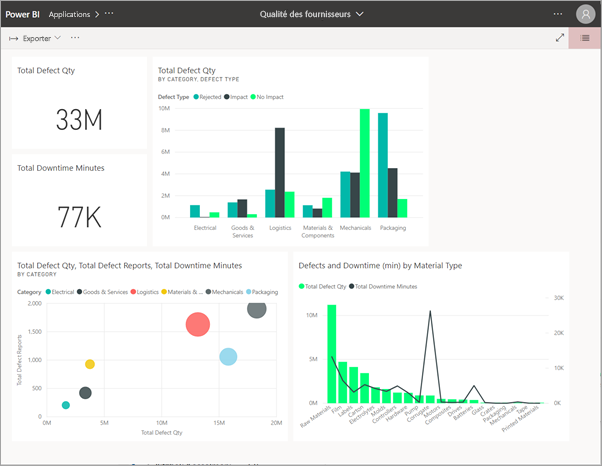

**Sur votre appareil mobile Android ou iOS** 

Quand vous sélectionnez le lien qui figure dans l’e-mail sur votre appareil mobile, l’application s’installe automatiquement et s’ouvre dans l’application mobile. Il peut être nécessaire de d’abord vous connecter. 

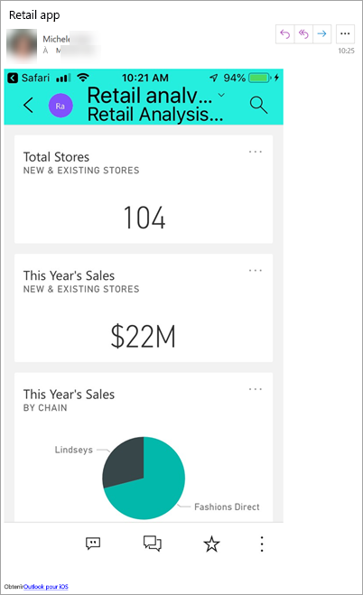

## Obtenir l’application à partir de Microsoft AppSource
Vous pouvez également rechercher et installer des applications à partir de Microsoft AppSource. Seules les applications auxquelles vous avez accès sont présentées (l’auteur des applications vous a donné son autorisation ou l’a donnée à tout le monde).

1. Sélectionnez **Applications**  > **Obtenir des applications**. 
   
    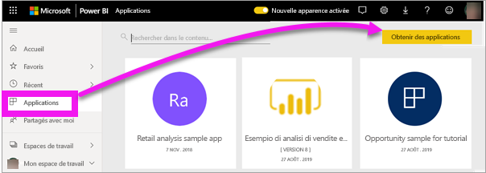    
2. Dans AppSource, cherchez sous **Mon organisation** pour affiner les résultats et trouver l’application souhaitée.
   
    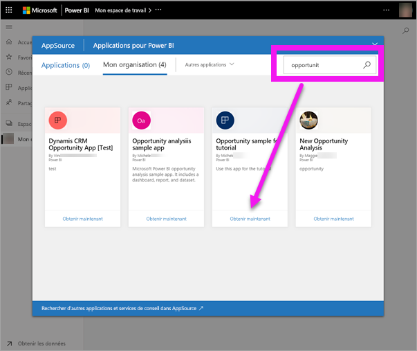
3. Sélectionnez **Obtenir maintenant** pour l’ajouter à votre liste de contenu Applications. 

## Obtenir une application à partir du site web Microsoft AppSource 

Dans cet exemple, nous allons ouvrir un des exemples d’applications Microsoft. Sur AppSource, vous trouverez des applications pour de nombreux services que vous utilisez pour votre activité.  Des services comme Salesforce, Microsoft Dynamics, Google Analytics, GitHub, Zendesk, Marketo, etc. Pour plus d’informations, consultez [Applications pour les services que vous utilisez avec Power BI](../service-connect-to-services.md). 

1. Dans un navigateur, ouvrez [https://appsource.microsoft.com](https://appsource.microsoft.com), puis sélectionnez **Applications Power BI**.

    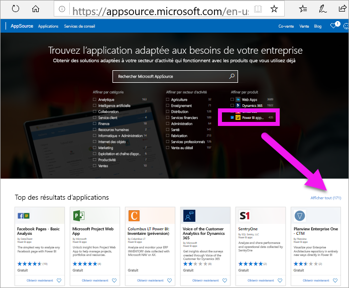

2. Sélectionnez **Afficher tout** pour afficher la liste de toutes les applications Power BI actuellement disponibles sur AppSource. Faites défiler ou recherchez l’application nommée **Microsoft Sample - Sales & Marketing**.

    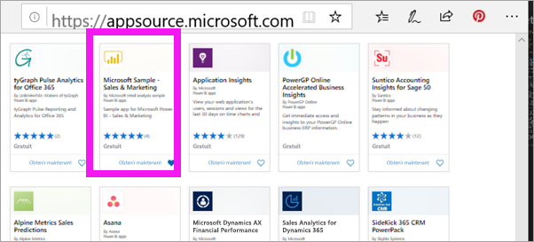

3. Sélectionnez **Obtenir maintenant** et acceptez les conditions d’utilisation.

    

4. Confirmez que vous voulez installer cette application.

    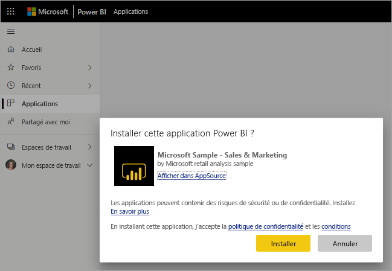

5. Le service Power BI affiche un message de réussite une fois l’application installée. Sélectionnez **Accéder à l’application** pour ouvrir l’application. Selon la façon dont le concepteur a créé l’application, le tableau de bord ou le rapport de l’application s’affiche.

    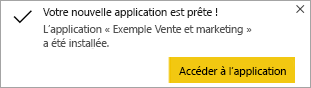

    Vous pouvez également ouvrir l’application directement à partir de votre liste des contenus d’application en sélectionnant **Applications** et en choisissant **Sales & marketing**.

    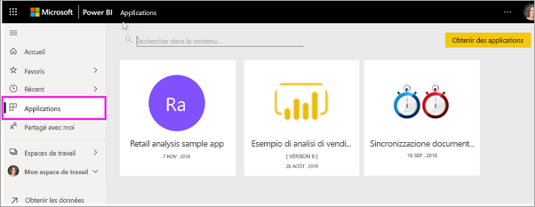

6. Choisissez d’explorer ou de personnaliser et de partager votre nouvelle application. Comme nous avons sélectionné un exemple d’application Microsoft, commençons par l’explorer. 

    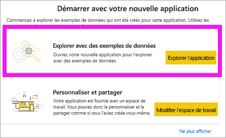

7.  Votre nouvelle application s’ouvre avec un tableau de bord. Le *concepteur* de l’application pourrait l’avoir configurée pour qu’elle s’ouvre à la place sur un rapport.  

    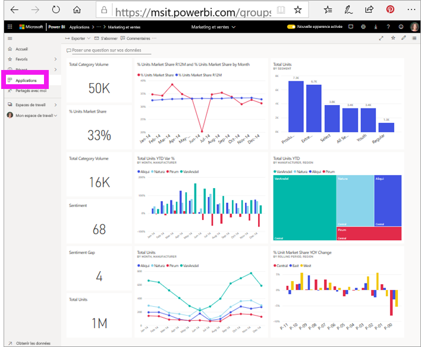

## Interagir avec les tableaux de bord et rapports dans l’application
Prenez le temps d’explorer les données dans les tableaux de bord et les rapports qui composent l’application. Vous avez accès à toutes les interactions Power BI standard, comme le filtrage, la mise en évidence, le tri et l’exploration.  Vous ne voyez pas encore très bien la différence entre les tableaux de bord et les rapports ?  Lisez l’[article sur les tableaux de bord](end-user-dashboards.md) et l’[article sur les rapports](end-user-reports.md).  

## Mettre à jour une application 

De temps à autre, les créateurs d’applications sont susceptibles de publier de nouvelles versions de leurs applications. La façon dont vous obtenez la nouvelle version dépend de la façon dont vous avez reçu l’original. 

* Si vous avez reçu l’application de votre organisation, la mise à jour de la nouvelle version est entièrement transparente : vous n’avez rien à faire. 

* Si vous avez obtenu l’application auprès d’AppSource, la prochaine fois que vous ouvrez l’application, vous voyez une bannière de notification. La notification vous informe qu’une nouvelle version est disponible. 

    1. Sélectionnez **Obtenir** pour mettre à jour.  

        <!-- -->

    2. Quand vous êtes invité à installer l’application mise à jour, sélectionnez **Installer**. 

         

    3. Comme vous avez déjà une version de cette application, décidez si vous souhaitez remplacer la version existante ou si vous souhaitez installer l’application mise à jour dans un nouvel espace de travail.   

         

    > [!NOTE] 
    > L’installation d’une nouvelle version remplace toutes les modifications que vous avez apportées aux rapports et aux tableaux de bord. Pour conserver vos rapports et tableaux de bord mis à jour, vous pouvez les enregistrer sous un autre nom ou à un autre emplacement avant d’effectuer l’installation. 

    4. Une fois que vous avez installé la version mise à jour, sélectionnez **Mettre à jour l’application** pour effectuer le processus de mise à jour. 

    <!-- -->

## Étapes suivantes
* [Revenir à la vue d’ensemble des applications](end-user-apps.md)
* [Voir un rapport Power BI](end-user-report-open.md)
* [Autres moyens de partager du contenu avec vous](end-user-shared-with-me.md)
