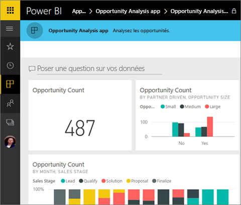
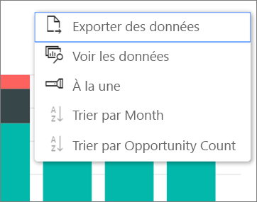

# Installer et utiliser des applications avec des tableaux de bord et des rapports dans Power BI
Maintenant que vous avez des [connaissances de base sur les applications](end-user-apps.md), voyons comment ouvrir et utiliser celles-ci. 

## Méthodes d’obtention d’une nouvelle application
Rappelez-vous qu’il existe plusieurs façons d’obtenir une nouvelle application. Un collègue qui conçoit des rapports peut installer l’application automatiquement dans votre compte Power BI ou vous envoyer un lien direct vers l’application. Vous pouvez également accéder à AppSource et rechercher des applications parmi celles auxquelles vous avez accès, qu’elles soient internes ou externes à votre entreprise. 

Dans Power BI sur votre appareil mobile, vous pouvez uniquement installer une application à partir d’un lien direct, et non à partir d’AppSource. Si l’auteur de l’application installe l’application automatiquement, vous voyez celle-ci dans votre liste d’applications.

## Installer une application à partir d’un lien direct
Pour installer une nouvelle application, le moyen le plus simple consiste à recevoir un e-mail de l’auteur de l’application contenant un lien direct.  

**Sur votre ordinateur** 

Quand vous suivez le lien dans l’e-mail, le service Power BI ([https://powerbi.com](https://powerbi.com)) s’ouvre dans un navigateur. Si vous confirmez l’installation de l’application, Power BI ouvre la page d’accueil de l’application.

**Sur votre appareil mobile Android ou iOS** 

Quand vous sélectionnez le lien qui figure dans l’e-mail sur votre appareil mobile, l’application s’installe automatiquement et ouvre la liste des contenus dans l’application mobile. 

## Obtenir l’application à partir de Microsoft AppSource
Vous pouvez également rechercher et installer des applications à partir de Microsoft AppSource. Seules les applications auxquelles vous avez accès sont présentées (l’auteur des applications vous a donné son autorisation ou l’a donnée à tout le monde).

1. Sélectionnez **Applications**  > **Obtenir des applications**. 
   
     
2. Dans AppSource, vous pouvez chercher sous **Mon organisation** pour affiner les résultats et trouver l’application souhaitée.
   
     
3. Sélectionnez **Obtenir maintenant** pour l’ajouter à votre liste de contenu Applications. 

## Interagir avec les tableaux de bord et rapports dans l’application
Vous pouvez maintenant explorer les données dans les tableaux de bord et rapports de l’application. Vous avez accès à toutes les interactions Power BI standard, telles que le filtrage, la mise en évidence, le tri et la descente dans la hiérarchie. Vous pouvez aussi [exporter les données vers Excel ](end-user-export-data.md) à partir d’un tableau ou d’un autre visuel d’un rapport. En savoir plus sur l’[interaction avec les rapports dans Power BI](end-user-reading-view.md). 

## Étapes suivantes
* [Applications Power BI pour des services externes](end-user-connect-to-services.md)
* Vous avez des questions ? [Essayez d’interroger la communauté Power BI](http://community.powerbi.com/)

