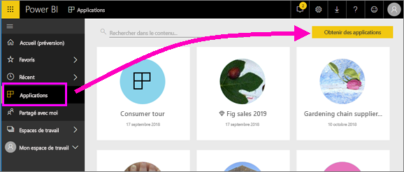

# Installer et utiliser des applications avec des tableaux de bord et des rapports dans Power BI

[!INCLUDE[consumer-appliesto-ynny](../includes/consumer-appliesto-ynny.md)]

[!INCLUDE [power-bi-service-new-look-include](../includes/power-bi-service-new-look-include.md)]

Maintenant que vous avez des [connaissances de base sur les applications](end-user-apps.md), voyons comment ouvrir et utiliser celles-ci. 

## Méthodes d’obtention d’une nouvelle application
Il existe plusieurs façons d’obtenir une nouvelle application :
* Vous pouvez la trouver sur la Place de marché des applications Power BI dans Power BI.
* Vous pouvez suivre le lien direct vers une application qui vous a été envoyé par l’auteur de l’application. 
* L’un des concepteurs de rapports de votre organisation peut installer automatiquement l’application dans votre compte Power BI.

Dans l’application mobile Power BI, il n’est possible d’installer une application qu’en suivant un lien direct. Si le concepteur de l’application installe l’application automatiquement, celle-ci apparaît dans votre liste d’applications.

## Applications et licences
Tous les utilisateurs de Power BI ne peuvent pas visualiser et interagir avec les applications. 
- Si vous disposez d’une licence gratuite, vous pouvez ouvrir des applications qui ont été partagées avec vous et qui sont stockées dans un espace de travail d’une capacité Premium.
- Si vous disposez d’une licence Pro, vous pouvez ouvrir des applications qui ont été partagées avec vous.

## Téléchargement de l’application sur la Place de marché des applications Power BI

Vous pouvez rechercher et installer des applications sur la Place de marché des applications Power BI, qu’il s’agisse d’applications d’organisation ou d’applications modèles.

1. [Connectez-vous au service Power BI](./end-user-sign-in.md) si ce n’est pas déjà fait. 

1. Une fois que vous êtes dans Power BI, sélectionnez **Applications > Obtenir des applications**. 

    

1. La Place de marché des applications Power BI s’ouvre.

   

   Trois onglets vous sont proposés :
   * **Toutes les applications** : parcourez les applications modèles et toutes les applications d’organisation qui sont à votre disposition. Les applications modèles se distinguent par l’icône en forme de panier d’achat qui apparaît en haut à droite de leurs vignettes.
   * **Applications organisationnelles** : parcourez les applications organisationnelles qui ont été partagées avec vous. 
   * **Applications modèles** : parcourez les applications modèles hébergées sur AppSource.

   Vous pouvez également utiliser la zone de recherche pour obtenir une sélection filtrée d’applications. En tapant une partie du nom d’une application ou d’une catégorie comme Finance, Analytique, Marketing, etc., vous trouverez plus facilement l’élément que vous recherchez. 

   La zone de recherche dépend de l’onglet ouvert : seules les applications du type sélectionné sont renvoyées. Si l’onglet **Toutes les applications** est ouvert, tant les applications d’organisation que les applications modèles sont retournées. Cet aspect peut se révéler déroutant quand une application d’organisation et une application modèle portent le même nom. Rappelez-vous simplement que les vignettes des applications modèles présentent une icône en forme de panier d’achat en haut à droite.

Lorsque vous avez trouvé l’application souhaitée, cliquez sur **Installer maintenant** pour l’installer.
* S’il s’agit d’une application d’organisation, elle est immédiatement ajoutée à votre liste d’applications.
* S’il s’agit d’une application modèle, vous accédez automatiquement à l’offre d’applications modèles dans AppSource. Vous trouverez [ici un exemple](end-user-app-marketing.md) de téléchargement et d’installation d’un exemple d’application modèle à partir de la Place de marché des applications Power BI. 

   > [!NOTE]
   > Si vous utilisez une licence utilisateur gratuite, vous pouvez télécharger des applications, mais vous ne pouvez pas les visualiser, sauf si vous effectuez une mise à niveau vers un compte Power BI Pro ou si l’application est stockée dans une capacité Premium. Pour plus d’informations, consultez [Licences pour les consommateurs](end-user-license.md).

## Installer une application à partir d’un lien direct
Vous pouvez également installer une application d’organisation en suivant un lien direct dans un e-mail à partir du concepteur d’applications.  

**Sur votre ordinateur** 

Quand vous suivez le lien de l’e-mail, le service Power BI ([https://powerbi.com](https://powerbi.com)) ouvre l’application dans votre navigateur. 

**Sur votre appareil mobile Android ou iOS** 

Quand vous sélectionnez le lien qui figure dans l’e-mail sur votre appareil mobile, l’application s’installe automatiquement et s’ouvre dans l’application mobile. Il peut être nécessaire de d’abord vous connecter. 

## Interagir avec les tableaux de bord et rapports dans l’application
Prenez le temps d’explorer les données dans les tableaux de bord et les rapports qui composent l’application. Vous avez accès à toutes les interactions Power BI standard, comme le filtrage, la mise en évidence, le tri et l’exploration.  Vous ne voyez pas encore très bien la différence entre les tableaux de bord et les rapports ?  Lisez l’[article sur les tableaux de bord](end-user-dashboards.md) et l’[article sur les rapports](end-user-reports.md).  

## Mettre à jour une application 

De temps à autre, les créateurs d’applications sont susceptibles de publier de nouvelles versions de leurs applications. La façon dont vous obtenez la nouvelle version dépend de la façon dont vous avez reçu l’original. 

* Si vous avez reçu l’application de votre organisation, la mise à jour de la nouvelle version est entièrement transparente : vous n’avez rien à faire. 

* Si vous avez obtenu l’application auprès d’AppSource, la prochaine fois que vous ouvrez l’application, vous voyez une bannière de notification. La notification vous informe qu’une nouvelle version est disponible. 

    1. Sélectionnez **Obtenir** pour mettre à jour.  

        <!-- -->

    2. Quand vous êtes invité à installer l’application mise à jour, sélectionnez **Installer**. 

         

    3. Comme vous avez déjà une version de cette application, décidez si vous souhaitez remplacer la version existante ou si vous souhaitez installer l’application mise à jour dans un nouvel espace de travail.   

         

    > [!NOTE] 
    > L’installation d’une nouvelle version remplace toutes les modifications que vous avez apportées aux rapports et aux tableaux de bord. Pour conserver vos rapports et tableaux de bord mis à jour, vous pouvez les enregistrer sous un autre nom ou à un autre emplacement avant d’effectuer l’installation. 

    4. Une fois que vous avez installé la version mise à jour, sélectionnez **Mettre à jour l’application** pour effectuer le processus de mise à jour. 

## Étapes suivantes
* [Revenir à la vue d’ensemble des applications](end-user-apps.md)
* [Voir un rapport Power BI](end-user-report-open.md)
* [Autres moyens de partager du contenu avec vous](end-user-shared-with-me.md)

