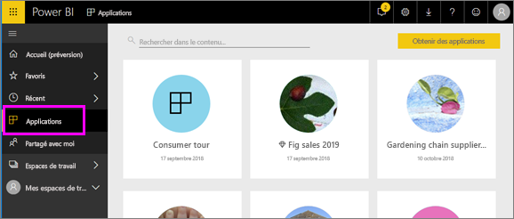

# Applications dans Power BI
## Qu’est-ce qu’une application Power BI ?
Une *application* est un type de contenu Power BI qui regroupe dans un même endroit des tableaux de bord et des rapports connexes. Une application peut ainsi rassembler un ou plusieurs tableaux de bord et un ou plusieurs rapports. Les applications sont créées par des *concepteurs* Power BI qui distribuent et partagent leurs applications avec des *consommateurs* comme vous. 

Vos applications sont organisées dans la liste de contenu **Applications**.

> [!NOTE]
> L’utilisation de la fonctionnalité d’applications nécessite une licence Power BI Pro. <!-- add link to how to figure out your license -->

## ***Concepteurs*** et ***consommateurs*** d’applications
Selon votre rôle, vous pouvez être concepteur. Dans ce cas, vous créez des applications pour votre usage personnel ou pour les partager avec vos collègues. Vous pouvez également être consommateur, c’est-à-dire quelqu’un qui reçoit et télécharge des applications créées par d’autres personnes. Cet article s’adresse aux *consommateurs* d’applications.

## Avantages des applications
Les applications sont faciles à trouver et à installer dans le service Power BI ([https://powerbi.com](https://powerbi.com)) et sur votre appareil mobile. Une fois que vous avez installé une application, vous n’êtes pas obligé de mémoriser les noms d’un grand nombre de tableaux de bord, car ces derniers sont rassemblés dans une même application, dans votre navigateur ou sur votre appareil mobile.

Chaque fois que l’auteur de l’application publie des mises à jour, vous voyez automatiquement les modifications. L’auteur contrôle également la fréquence à laquelle l’actualisation des données est planifiée. Vous n’avez pas besoin de vous soucier de la mise à jour. 

<!-- add conceptual art -->
## Obtenir une nouvelle application
Vous pouvez obtenir des applications de différentes manières. 
- L’auteur de l’application peut installer automatiquement l’application dans votre compte Power BI. Elle figure ainsi dans la liste de contenu **Applications** à la prochaine ouverture de Power BI. 
- L’auteur de l’application peut vous envoyer par e-mail un lien direct vers l’application. Quand vous suivez ce lien, l’application s’ouvre dans Power BI.
- Vous pouvez rechercher des applications dans AppSource où sont listées toutes les applications auxquelles vous avez accès. AppSource contient les applications publiées par des concepteurs de rapports, qu’ils soient internes ou externes à votre entreprise. Par exemple, vous pouvez trouver sur AppSource une application pour un service que vous utilisez déjà, comme Google Analytics, GitHub ou Microsoft Dynamics. 
- Dans Power BI sur votre appareil mobile, vous pouvez uniquement installer une application à partir d’un lien direct, et non à partir d’AppSource. Si l’auteur de l’application installe l’application automatiquement, vous voyez celle-ci dans votre liste d’applications.

## Étape suivante
* [Ouvrir et utiliser une application](end-user-app-view.md)

