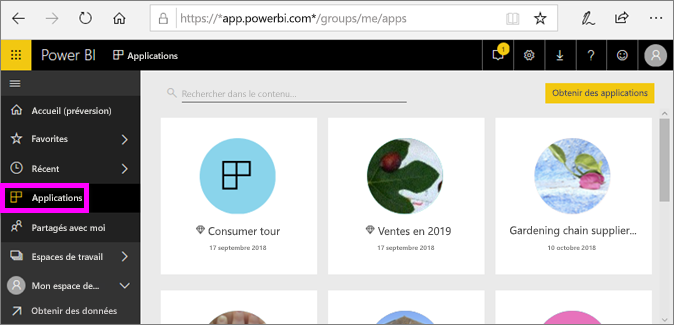
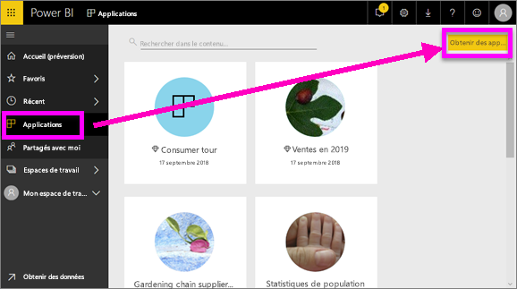
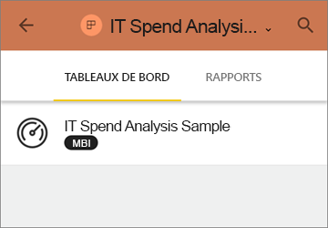
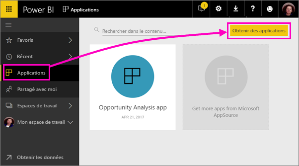
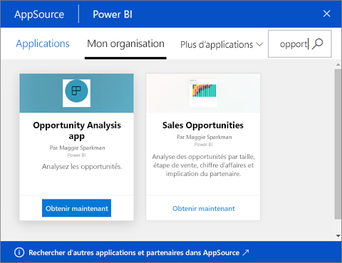

# Installer et utiliser des applications avec des tableaux de bord et des rapports dans Power BI
Dans Power BI, les *applications* rassemblent les rapports et tableaux de bord associés dans un même emplacement. Les personnes de votre organisation créent et distribuent des applications avec les informations clés de l’entreprise. Des [services externes](../service-connect-to-services.md) que vous utilisez peut-être déjà, tels que Google Analytics et Microsoft Dynamics CRM, offrent également des applications Power BI. 

Les applications sont faciles à trouver et à installer dans le service Power BI et sur votre appareil mobile. Une fois que vous avez installé une application, vous n’êtes pas obligé de mémoriser les noms d’un grand nombre de tableaux de bord, car ces derniers sont rassemblés dans une même application, dans votre navigateur ou sur votre appareil mobile.

Chaque fois que l’auteur de l’application publie des mises à jour, vous voyez automatiquement les modifications. L’auteur contrôle également la fréquence à laquelle l’actualisation des données est planifiée. Vous n’avez pas besoin de vous soucier de la mise à jour. 

## Obtenir une nouvelle application
Vous pouvez obtenir des applications de différentes manières. L’auteur de l’application peut l’installer automatiquement dans votre compte Power BI ou vous envoyer un lien direct vers cette application. Vous pouvez la rechercher dans AppSource, où apparaissent toutes les applications auxquelles vous avez accès. Dans Power BI sur votre appareil mobile, vous pouvez uniquement les installer à partir d’un lien direct et non à partir d’AppSource. Si l’auteur de l’application installe l’application automatiquement, vous voyez celle-ci dans votre liste d’applications.

### Installer une application à partir d’un lien direct
Pour installer une nouvelle application, le moyen le plus simple consiste à recevoir un lien direct de l’auteur de l’application. Power BI crée un lien d’installation que l’auteur peut vous envoyer.

**Sur votre ordinateur** 

Sélectionnez le lien dans l’e-mail pour ouvrir le service Power BI ([https://powerbi.com](https://powerbi.com)) dans un navigateur. Confirmez que vous souhaitez installer l’application, puis la page d’accueil de l’application s’ouvre.

**Sur votre appareil mobile Android ou iOS** 

Quand vous sélectionnez le lien qui figure dans l’e-mail sur votre appareil mobile, l’application s’installe automatiquement et ouvre la liste des contenus dans l’application mobile. 

### Obtenir l’application à partir de Microsoft AppSource
Vous pouvez également rechercher et installer des applications auxquelles vous avez accès à partir de Microsoft AppSource. 

1. Sélectionnez **Applications**  > **Obtenir des applications**. 
   
     
2. Dans AppSource, cherchez sous **Mon organisation** pour affiner les résultats et trouver l’application souhaitée.
   
     
3. Sélectionnez **Obtenir maintenant** pour l’ajouter à votre page Applications. 

## Interagir avec les tableaux de bord et rapports dans l’application
Vous pouvez maintenant explorer les données dans les tableaux de bord et rapports de l’application. Vous avez accès à toutes les interactions Power BI standard, telles que le filtrage, la mise en évidence, le tri et la descente dans la hiérarchie. En savoir plus sur l’[interaction avec les rapports dans Power BI](end-user-reading-view.md). 

## Étapes suivantes
[Applications Power BI pour des services externes](../service-connect-to-services.md)

