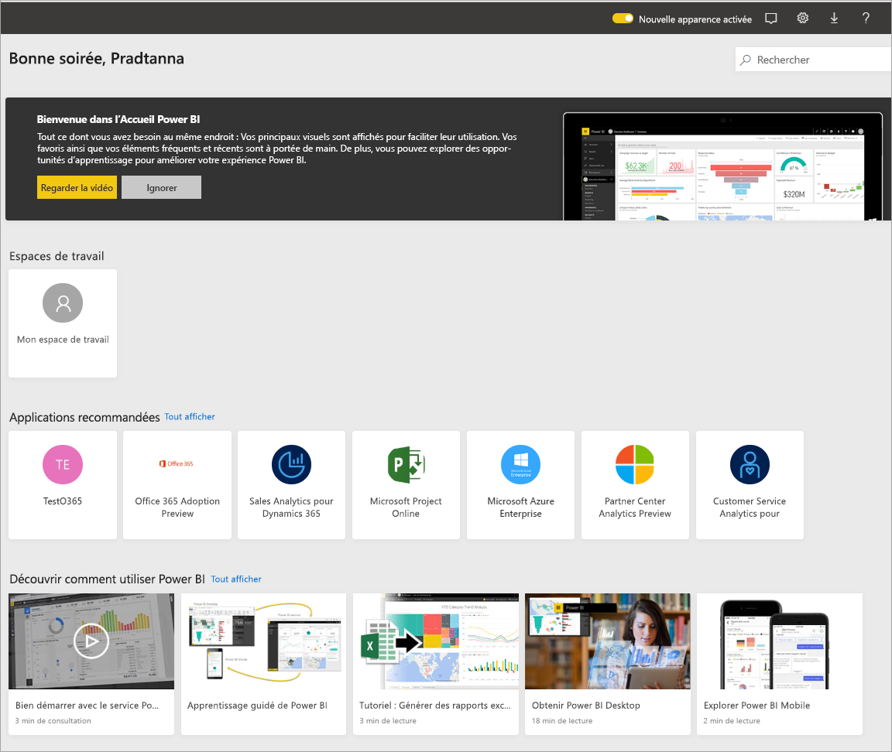
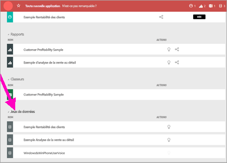
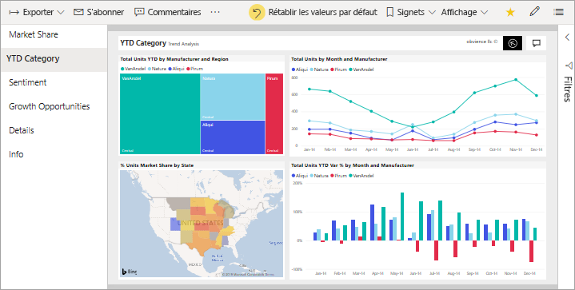
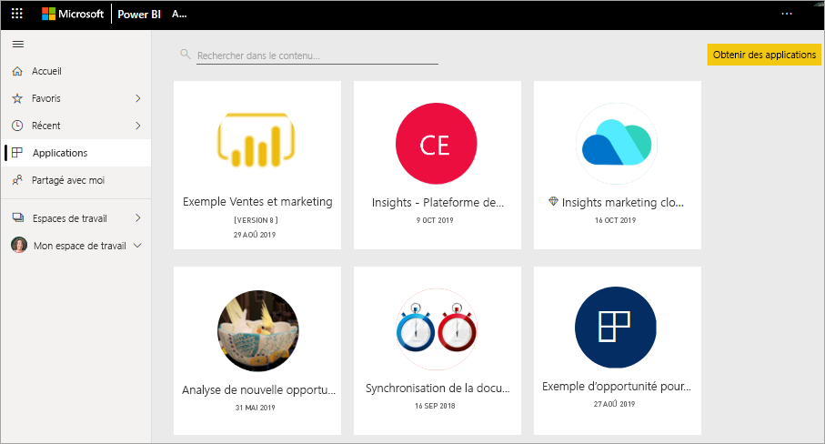

# Concepts de base pour les consommateurs du service Power BI

[!INCLUDE[consumer-appliesto-ynnm](../includes/consumer-appliesto-ynnm.md)]

[!INCLUDE [power-bi-service-new-look-include](../includes/power-bi-service-new-look-include.md)]

Cet article suppose que vous avez déjà lu la [Vue d’ensemble de Power BI](../fundamentals/power-bi-overview.md) et que vous vous êtes identifié comme [ **_consommateur_** Power BI](end-user-consumer.md). Les consommateurs reçoivent du contenu Power BI, comme des tableaux de bord et des rapports, de leurs collègues. Les consommateurs utilisent le service Power BI, qui est la version basée sur un site web de Power BI.

Pour recevoir du contenu d’autres personnes, il faut une licence utilisateur Power BI Pro ou une licence de capacité Power BI Premium. [Rechercher votre type de licence](end-user-license.md)

Vous entendrez sans aucun doute le terme « Power BI Desktop » ou simplement « Desktop ». Il s’agit de l’outil autonome utilisé par les *concepteurs* qui créent et partagent des tableaux de bord et des rapports avec vous. Il est important de savoir qu’il existe d’autres outils Power BI. Tant que vous êtes consommateur, vous travaillez uniquement avec le service Power BI. Cet article s’applique uniquement au service Power BI.

## Terminologie et concepts

Cet article n’est pas une visite guidée visuelle de Power BI, ni un tutoriel pratique. Il s’agit plutôt d’une vue d’ensemble qui vous aidera à vous familiariser avec la terminologie et les concepts de Power BI. Il vous présente le jargon et la configuration du terrain. Pour une visite guidée du service Power BI et de sa navigation, accédez à [Démarrage rapide - découverte dans le service Power BI](end-user-experience.md).

## Ouvrir le service Power BI pour la première fois

La plupart des consommateurs de Power BI obtiennent le service Power BI car 1) leur entreprise achète des licences et 2) un administrateur affecte ces licences à des employés comme vous.

Pour commencer, ouvrez un navigateur et saisissez **app.powerbi.com**. La première fois que vous ouvrez le service Power BI, vous voyez un contenu semblable à ce qui suit :

Quand vous utiliserez Power BI, vous personnaliserez ce que vous voyez chaque fois que vous ouvrirez le site web. Par exemple, certaines personnes aiment que Power BI s’ouvre sur la **page d’accueil**, tandis que d’autres ont un tableau de bord favori qu’ils veulent voir en premier. Ne vous inquiétez pas, cet article va vous apprendre à personnaliser votre expérience.

- [Présentation de l’accueil Power BI et de la recherche globale](https://powerbi.microsoft.com/blog/introducing-power-bi-home-and-global-search)

- [Tableaux de bord par défaut dans le service Power BI](end-user-featured.md)

Mais avant d’aller plus loin, revenons en arrière et parlons des modules qui composent le service Power BI.

_______________________________________________________

## Contenu Power BI

### Introduction aux modules

Pour un consommateur de Power BI, les cinq blocs de construction sont les **_visualisations_** , les **_tableaux de bord_** , les **_rapports_** , les **_applications_** et les **_jeux de données_** . Ils sont parfois appelés **_contenu_** *Power BI*. Le *contenu* se trouve dans des **_espaces de travail_** . Un workflow typique implique tous les blocs de construction : Un *concepteur* Power BI (en jaune dans le diagramme ci-dessous) collecte des données à partir de *jeux de données*, les apporte dans Power BI pour qu’elles soient analysées, crée des *rapports* remplis de *visualisations* qui mettent en évidence les faits et les insights intéressants, qui épinglent des visualisations des rapports dans un tableau de bord, et qui partagent les rapports et les tableaux de bord avec des *consommateurs* , comme vous (en noir dans le diagramme ci-dessous). Le *concepteur* les partage sous la forme d’*applications* ou d’autres types de contenu partagé.

Dans sa version la plus basique :

-  une **_visualisation_** (ou *visuel*) est un type de graphique créé par les *concepteurs* Power BI. Les visuels affichent les données des *rapports* et des *jeux de données*. En général, les *concepteurs* génèrent les visuels dans Power BI Desktop.

    Pour plus d’informations, consultez [Interagir avec les visuels dans les rapports, les tableaux de bord et les applications](end-user-visualizations.md).

-  Un *jeu de données* est un conteneur de données. Par exemple, cela peut être un fichier Excel de l’Organisation mondiale de la Santé. Cela peut également être une base de données de clients appartenant à une entreprise, ou un fichier Salesforce.  

-  Un *tableau de bord* est un écran unique avec des visuels interactifs, du texte et des graphiques. Un tableau de bord collecte vos métriques les plus importantes, sur un seul écran, pour raconter une histoire ou répondre à une question. Le contenu d’un tableau de bord provient d’un ou de plusieurs rapports et d’un ou de plusieurs jeux de données.

    Pour plus d’informations, consultez [Tableaux de bord pour les consommateurs du service Power BI](end-user-dashboards.md).

-  Un *rapport* est constitué d’une ou de plusieurs pages de visuels interactifs, de texte et de graphiques qui constituent un rapport unique. Power BI base un rapport sur un jeu de données unique. Souvent, le service organise les pages de rapport que chacune traite d’un domaine d’intérêt principal ou réponde à une question unique.

    Pour plus d’informations, consultez [Rapports dans Power BI](end-user-reports.md).

-  Une *application* est un moyen pour les *concepteurs* de regrouper et de partager des rapports et des tableaux de bord associés. Les *consommateurs* reçoivent automatiquement certaines applications, mais ils peuvent rechercher d’autres applications créées par des collègues ou par la communauté. Par exemple, des services externes que vous utilisez peut-être déjà, comme Google Analytics et Microsoft Dynamics CRM, offrent des applications Power BI.

Autrement dit, si vous êtes un nouvel utilisateur et que vous vous êtes connecté à Power BI pour la première fois, vous ne voyez encore de tableau de bord, d’application ou de rapport.

_______________________________________________________

## Jeux de données

Un *jeu de données* est une collection de données que des *concepteurs* importent ou à laquelle ils se connectent, puis qu’ils utilisent pour générer des rapports et des tableaux de bord. En tant que consommateur, vous n’interagirez pas directement avec les jeux de données, mais il est toutefois intéressant d’apprendre comment ils s’intègrent dans une perspective plus globale.  

Chaque jeu de données représente une source de données unique. Par exemple, la source peut être un classeur Excel sur OneDrive, un jeu de données tabulaires locales SQL Server Analysis Services ou un jeu de données Salesforce. Power BI prend en charge de nombreuses sources de données différentes.

Quand un concepteur partage une application avec vous, vous pouvez voir quels jeux de données il y a inclus.

Un jeu de données...

- Peut être utilisé encore et encore par un concepteur de rapports pour créer des tableaux de bord et des rapports

- Peut être utilisé de nombreux rapports différents

- Des visuels de ce jeu de données peuvent apparaître sur de nombreux tableaux de bord différents

  

Le module suivant : les visualisations.

_______________________________________________________

## Visualisations

Les visualisations (également appelées visuels) affichent des insights que Power BI a détectés dans les données. Les visualisations facilitent l’interprétation de l’insight, car votre cerveau peut comprendre une image plus rapidement qu’une feuille de calcul de nombres.

Voici quelques-unes des visualisations que vous rencontrerez dans Power BI : cascade, ruban, treemap, secteurs, entonnoir, carte, nuage de points et jauge :

   

Consultez la [liste complète des visualisations incluses dans Power BI](../power-bi-visualization-types-for-reports-and-q-and-a.md).

Des visualisations appelées *visuels personnalisés* sont également fournies par la communauté. Si vous recevez un rapport comprenant un visuel que vous ne reconnaissez pas, il s’agit probablement d’un visuel personnalisé. Si vous avez besoin d’aide pour interpréter le visuel personnalisé, recherchez le nom du *concepteur* du rapport ou du tableau de bord, puis contactez-le.

Une visualisation dans un rapport...

- Peut apparaître plusieurs fois dans le même rapport

- Peut apparaître sur de nombreux tableaux de bord

_______________________________________________________

## Rapports

Un rapport Power BI se compose d’une ou de plusieurs pages de visualisations, de graphiques et de texte. Toutes les visualisations dans un rapport proviennent d’un seul jeu de données. Les *concepteurs* partagent des rapports avec des *consommateurs* qui [interagissent avec les rapports en *mode Lecture*](end-user-reading-view.md).

Un rapport…

- peut être associé à plusieurs tableaux de bord (les vignettes épinglées à partir de ce rapport peuvent apparaître sur plusieurs tableaux de bord).

- Peut être créé à l’aide de données provenant d’un seul jeu de données.  

- Peut faire partie de plusieurs applications.

  

_______________________________________________________

## Tableaux de bord

Un tableau de bord représente une vue personnalisée d’une partie d’un ou de plusieurs jeux de données sous-jacents. Les *concepteurs* génèrent des tableaux de bord et les partagent avec des *consommateurs*, soit individuellement soit comme partie d’une application. Un tableau de bord est un canevas unique qui contient des *vignettes*, des graphiques et du texte.

  

Une vignette est le rendu d’un visuel qu’un *concepteur* *épingle*, par exemple d’un rapport à un tableau de bord. Chaque vignette épinglée montre une [visualisation](end-user-visualizations.md) que le concepteur a créée à partir d’un jeu de données et épinglée sur ce tableau de bord. Une vignette peut également contenir une page de rapport entière, ainsi que des données de streaming en direct ou une vidéo. Les *concepteurs* ont de nombreuses possibilités d’ajouter des vignettes aux tableaux de bord. Il y en a trop pour les évoquer toutes dans cet article de présentation. Pour plus d’informations, consultez [Vignettes de tableau de bord dans Power BI](end-user-tiles.md).

Les consommateurs ne peuvent pas modifier des tableaux de bord. Vous pouvez toutefois ajouter des commentaires, afficher des données associées, les mettre en favori, vous y abonner, et bien plus encore.

Quels sont les objectifs des tableaux de bord ?  En voici juste quelques-uns :

- pour voir en un coup d’œil toutes les informations nécessaires pour prendre des décisions

- pour surveiller les informations les plus importantes concernant votre activité

- pour vous assurer que tous vos collègues accèdent à la même page, et qu’ils consultent et utilisent les mêmes informations que vous

- pour surveiller la santé d’une entreprise, d’un produit, d’une unité organisationnelle, d’une campagne marketing, etc.

- Pour créer une vue personnalisée d’un tableau de bord plus large en affichant les métriques qui vous intéressent.

**UN** tableau de bord…

- peut afficher des visualisations à partir de nombreux jeux de données différents ;

- peut afficher des visualisations à partir de nombreux rapports différents

- peut afficher des visualisations épinglées à partir d’autres outils (par exemple, Excel)

  

_______________________________________________________

## Applications

Ces collections de tableaux de bord et de rapports organisent du contenu associé dans un seul et même package. Les *concepteurs* Power BI les génèrent et les partagent avec des personnes, des groupes, toute une organisation ou tout le monde. En tant que consommateur, vous pouvez être certain que vous et vos collègues travaillez avec les mêmes données, car il existe une seule version approuvée.

> [!NOTE]
> Pour utiliser des applications, il faut une licence Power BI Pro ou Premium. 

Les applications sont faciles à trouver et à installer dans le [service Power BI](https://powerbi.com) et sur votre appareil mobile. Après avoir installé une application, vous n’avez pas à mémoriser les noms d’un grand nombre de tableaux de bord. Ils sont tous dans une même application, dans votre navigateur ou sur votre appareil mobile.

Cette application comprend trois tableaux de bord associés et trois rapports associés qui constituent une application unique.

Chaque fois que l’auteur de l’application publie des mises à jour, vous voyez automatiquement les modifications. L’auteur contrôle également la planification de la fréquence à laquelle Power BI actualise les données. Vous n’avez pas besoin de vous soucier des mises à jour.

Vous pouvez obtenir des applications de différentes manières :

- Le concepteur de l’application peut l’installer automatiquement dans votre compte Power BI.

- Le concepteur de l’application peut vous envoyer un lien direct vers celle-ci.

- Vous pouvez la rechercher dans [Microsoft AppSource](https://appsource.microsoft.com/marketplace/apps?product=power-bi), où toutes les applications que vous pouvez utiliser sont répertoriées.

Dans Power BI sur votre appareil mobile, vous pouvez installer des applications uniquement à partir d’un lien direct, et non à partir d’AppSource. Si le concepteur de l’application installe l’application automatiquement, celle-ci apparaît dans votre liste d’applications.

Une fois que vous avez installé l’application, sélectionnez-la simplement dans votre liste d’applications, puis sélectionnez le tableau de bord ou le rapport à ouvrir et à explorer en premier.

J’espère que cet article vous a donné une bonne connaissance des modules qui constituent le service Power BI pour les consommateurs.

## Étapes suivantes

- Consulter le [glossaire](end-user-glossary.md) et l’ajouter aux favoris

- Faire une [visite guidée du service Power BI](end-user-experience.md)

- Lire la [vue d’ensemble de Power BI rédigée spécialement pour les consommateurs](end-user-consumer.md)

- Regarder une vidéo dans laquelle Will passe en revue les concepts de base et propose une visite guidée du service Power BI.

    <iframe width="560" height="315" src="https://www.youtube.com/embed/B2vd4MQrz4M" frameborder="0" allowfullscreen></iframe>
