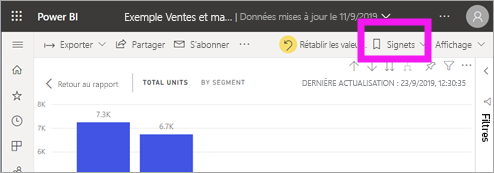
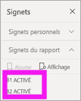
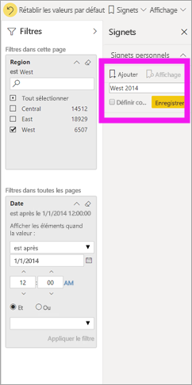
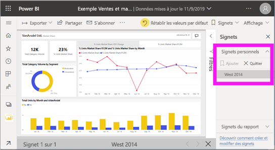
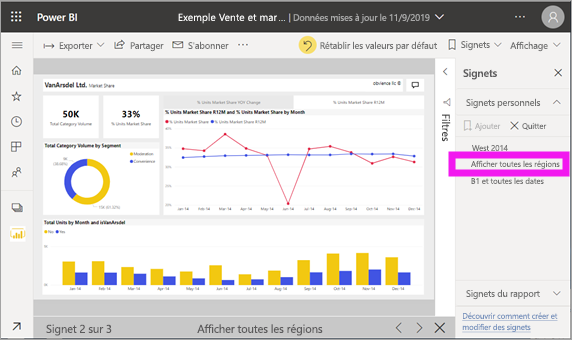

# Qu’est-ce qu’un signet ?

[!INCLUDE[consumer-appliesto-ynnm](../includes/consumer-appliesto-ynnm.md)]

[!INCLUDE [power-bi-service-new-look-include](../includes/power-bi-service-new-look-include.md)]

Les signets capturent la vue actuellement configurée d’une page de rapport, notamment les filtres, les segments et l’état des visuels. Lorsque vous sélectionnez un signet, Power BI vous ramène à cette vue. Il existe deux types de signets : ceux que vous créez et ceux qui sont créés par les *concepteurs* de rapports. Tout utilisateur Power BI peut créer des signets personnels. Toutefois, pour utiliser des signets créés par d’autres personnes, il faut une licence Power BI Pro ou Premium. [Quelle est ma licence ?](end-user-license.md)

## Utiliser des signets pour partager des insights et créer des récits dans Power BI 
Les signets ont de nombreuses utilisations. Imaginons que vous ayez découvert un insight très intéressant et que vous souhaitiez en garder une trace. Pour cela, vous pouvez créer un signet afin d’y revenir plus tard. Si vous souhaitez enregistrer votre travail avant de quitter le bureau, vous pouvez là aussi créer un signet. Vous pouvez même créer un signet correspondant à la vue par défaut de votre rapport. Ainsi, chaque fois que vous rouvrez le rapport, c’est cette vue qui s’affiche en premier. 

Vous pouvez également créer une collection de signets, les réorganiser dans l’ordre de votre choix, puis parcourir chaque signet dans le cadre d’une présentation, afin de mettre en avant une série d’insights.  

## Ouvrir des signets
Pour ouvrir le volet Signets, sélectionnez **Signets** > **Afficher d’autres signets** dans la barre de menus. Pour revenir à la vue d’origine du rapport, sélectionnez **Rétablir les valeurs par défaut**.

### Signets du rapport
Si le *concepteur* de rapports a créé des signets, vous les trouverez sous **Signets du rapport**. Cette page de rapport a deux signets, B1 et B2. 

> [!NOTE]
> Vous avez besoin de Power BI Pro ou Premium pour voir des rapports partagés. 

Sélectionnez un signet pour changer de vue de rapport. 

### Signets personnels

Lorsque vous créez un signet, les éléments suivants sont enregistrés :

* Page actuelle
* Filtres
* Segments, y compris le type de segments (par exemple, liste déroulante ou liste) et l’état des segment
* État de sélection des visuels (par exemple, filtres de mise en surbrillance croisée)
* Ordre de tri
* Emplacement d’exploration
* Visibilité (d’un objet, à l’aide du volet **Sélection**)
* Le mode focus ou **À la une** des objets visibles

Configurez une page de rapport comme vous souhaitez qu’elle apparaisse dans le signet. Une fois que votre page de rapport et les visuels sont organisés comment vous le souhaitez, sélectionnez **Ajouter** dans le volet **Signets** pour ajouter un signet. Dans cet exemple, nous avons ajouté des filtres pour la région et la date. 

**Power BI** crée un signet personnel, puis lui donne un nom générique ou celui que vous spécifiez. Vous pouvez *renommer*, *supprimer* ou *mettre à jour* votre signet en sélectionnant les points de suspension en regard de son nom, puis en sélectionnant une action dans le menu qui apparaît.

Une fois le signet créé, vous pouvez l’afficher en le sélectionnant dans le volet **Signets**. 

<!--
## Arranging bookmarks
As you create bookmarks, you might find that the order in which you create them isn't necessarily the same order you'd like to present them to your audience. No problem, you can easily rearrange the order of bookmarks.

In the **Bookmarks** pane, simply drag-and-drop bookmarks to change their order, as shown in the following image. The yellow bar between bookmarks designates where the dragged bookmark will be placed.

The order of your bookmarks can become important when you use the **View** feature of bookmarks, as described in the next section. 

-->

## Signets en mode diaporama
Pour voir les signets dans l’ordre, sélectionnez **Afficher** dans le volet **Signets** afin de lancer un diaporama.

Le mode **Vue** offre quelques fonctionnalités utiles :

- Le nom du signet apparaît dans la barre de titre de celui-ci, qui apparaît au bas du canevas.
- La barre de titre des signets comporte des flèches permettant de passer au signet suivant ou précédent.
- Vous pouvez quitter le mode **Vue** en sélectionnant **Quitter** dans le volet **Signets** ou la croix (**X**) dans la barre de titre des signets.

Lorsque vous êtes en mode **Vue**, vous pouvez fermer le volet **Signets** (en cliquant sur le signe X sur ce volet) pour fournir davantage d’espace pour votre présentation. De plus, en mode **Vue**, tous les visuels sont interactifs et compatibles avec la sélection croisée, comme dans toute autre interaction. 

<!--
## Visibility - using the Selection pane
With the release of bookmarks, the new **Selection** pane is also introduced. The **Selection** pane provides a list of all objects on the current page and allows you to select the object and specify whether a given object is visible. 

You can select an object using the **Selection** pane. Also, you can toggle whether the object is currently visible by clicking the eye icon to the right of the visual. 

When a bookmark is added, the visible status of each object is also saved based on its setting in the **Selection** pane. 

It's important to note that **slicers** continue to filter a report page, regardless of whether they are visible. As such, you can create many different bookmarks, with different slicer settings, and make a single report page appear very different (and highlight different insights) in various bookmarks.

## Bookmarks for shapes and images
You can also link shapes and images to bookmarks. With this feature, when you click on an object, it will show the bookmark associated with that object. This can be especially useful when working with buttons; you can learn more by reading the article about [using buttons in Power BI](desktop-buttons.md). 

To assign a bookmark to an object, select the object, then expand the **Action** section from the **Format Shape** pane, as shown in the following image.

Once you turn the **Action** slider to **On** you can select whether the object is a back button, a bookmark, or a Q&A command. If you select bookmark, you can then select which of your bookmarks the object is linked to.

There are all sorts of interesting things you can do with object-linked bookmarking. You can create a visual table of contents on your report page, or you can provide different views (such as visual types) of the same information, just by clicking on an object.

When you are in editing mode you can use ctrl+click to follow the link, and when not in edit mode, simply click the object to follow the link. 

## Bookmark groups

Beginning with the August 2018 release of **Power BI Desktop**, you can create and use bookmark groups. A bookmark group is a collection of bookmarks that you specify, which can be shown and organized as a group. 

To create a bookmark group, hold down the CTRL key and select the bookmarks you want to include in the group, then click the ellipses beside any of the selected bookmarks, and select **Group** from the menu that appears.

**Power BI Desktop** automatically names the group *Group 1*. Fortunately, you can just double-click on the name and rename it to whatever you want.

With any bookmark group, clicking on the bookmark group's name only expands or collapses the group of bookmarks, and does not represent a bookmark by itself. 

When using the **View** feature of bookmarks, the following applies:

* If the selected bookmark is in a group when you select **View** from bookmarks, only the bookmarks *in that group* are shown in the viewing session. 

* If the selected bookmark is not in a group, or is on the top level (such as the name of a bookmark group), then all bookmarks for the entire report are played, including bookmarks in any group. 

To ungroup bookmarks, just select any bookmark in a group, click the ellipses, and then select **Ungroup** from the menu that appears. 

Note that selecting **Ungroup** for any bookmark from a group takes all bookmarks out of the group (it deletes the group, but not the bookmarks themselves). So to remove a single bookmark from a group, you need to **Ungroup** any member from that group, which deletes the grouping, then select the members you want in the new group (using CTRL and clicking each bookmark), and select **Group** again. 
-->

## Considérations et limitations
Pour cette préversion des **signets**, vous devez garder à l’esprit les considérations et limitations suivantes.

* La plupart des visuels Power BI doivent fonctionner correctement avec l’attribution de signets. Si vous rencontrez des problèmes avec l’attribution de signets et un visuel Power BI, contactez le créateur de ce dernier et demandez-lui d’ajouter la prise en charge des signets pour son visuel.
* Si vous ajoutez un visuel sur une page de rapport après la création d’un signet, le visuel s’affiche dans son état par défaut. Cela signifie également que si vous introduisez un segment dans une page où vous avez précédemment créé des signets, le segment se comporte avec son état par défaut.
* En règle générale, vos signets ne sont pas affectés lorsque le *concepteur* met à jour ou republie un rapport. Toutefois, si le concepteur apporte des modifications majeures au rapport, par exemple, s’il supprime des champs utilisés par un signet, vous recevrez un message d’erreur la prochaine fois que vous tenterez d’ouvrir ce signet. 

<!--
## Next steps
spotlight?
-->
