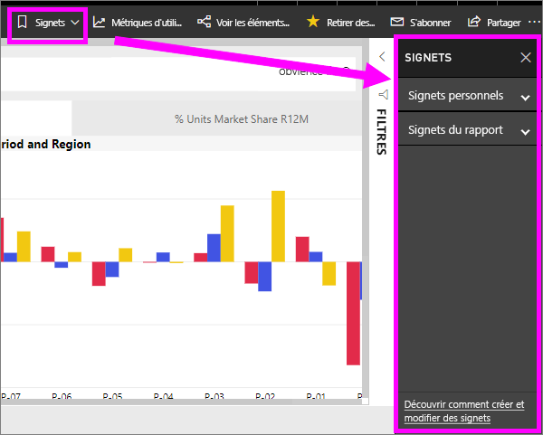
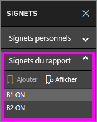
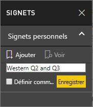
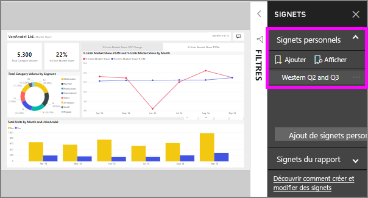

# Quelles sont les signets ?
Signets capturent la vue actuellement configurée d’une page de rapport, y compris les filtres, les segments et l’état d’éléments visuels. Lorsque vous sélectionnez un signet, Power BI vous ramène à cette vue. Il existe deux types de signets - celles que vous créez vous-même et ceux créés par rapport *concepteurs*.

## Utiliser des signets pour partager des insights et créer des récits dans Power BI 
Il existe de nombreuses utilisations pour les signets. Supposons que vous découvrez une information intéressante et que vous souhaitez conserver--créer un signet afin de pouvoir revenir ultérieurement. Vous devrez laisser et souhaitez conserver votre travail en cours, de créer un signet. Vous pouvez même créer un signet à retourner de la vue par défaut du rapport, donc chaque fois que vous, que la vue de la page de rapport s’ouvre en premier. 

Vous pouvez également créer une collection de signets, les réorganiser dans l’ordre de votre choix, puis parcourir chaque signet dans une présentation pour mettre en surbrillance d’une série d’analyses que vous raconter une histoire.  

## Utilisation des signets
Pour ouvrir le volet signets, sélectionnez **signets** à partir de la barre de menus. Pour revenir à la vue publiée d’origine du rapport, sélectionnez **par défaut**.

### Signets du rapport
Si le rapport *concepteur* inclus les signets du rapport, vous les trouverez sous le **signaler signets** titre. 

Sélectionnez un signet pour passer à cette vue de rapport. 

### Signets personnels

Lorsque vous créez un signet, les éléments suivants sont enregistrés :

* Page actuelle
* Filtres
* Segments, y compris le type de segments (par exemple, liste déroulante ou liste) et l’état des segment
* État de sélection des visuels (par exemple, filtres de mise en surbrillance croisée)
* Ordre de tri
* Emplacement d’exploration
* Visibilité (d’un objet, à l’aide du volet **Sélection**)
* Le mode focus ou **À la une** des objets visibles

Configurez une page de rapport comme vous souhaitez qu’elle apparaisse dans le signet. Une fois que votre page de rapport et les visuels sont organisés comment vous le souhaitez, sélectionnez **Ajouter** dans le volet **Signets** pour ajouter un signet. Dans cet exemple, nous avons ajouté des filtres de région et de date. 

**Power BI** crée un signet et lui donne un nom générique ou un nom que vous entrez. Vous pouvez *renommer*, *supprimer*, ou *mettre à jour* un signet en sélectionnant les points de suspension en regard du nom du signet, puis en sélectionnant une action dans le menu qui s’affiche.

Une fois que vous avez un signet, vous pouvez l’afficher en sélectionnant simplement le signet dans le **signets** volet. 

<!--
## Arranging bookmarks
As you create bookmarks, you might find that the order in which you create them isn't necessarily the same order you'd like to present them to your audience. No problem, you can easily rearrange the order of bookmarks.

In the **Bookmarks** pane, simply drag-and-drop bookmarks to change their order, as shown in the following image. The yellow bar between bookmarks designates where the dragged bookmark will be placed.

The order of your bookmarks can become important when you use the **View** feature of bookmarks, as described in the next section. 

-->

## Signets en mode diaporama
Pour présenter ou afficher les signets, dans l’ordre, sélectionnez **vue** à partir de la **signets** volet pour lancer un diaporama.

Le mode **Vue** offre quelques fonctionnalités utiles :

1. Le nom du signet apparaît dans la barre de titre de celui-ci, qui apparaît au bas du canevas.
2. La barre de titre des signets comporte des flèches permettant de passer au signet suivant ou précédent.
3. Vous pouvez quitter le mode **Vue** en sélectionnant **Quitter** dans le volet **Signets** ou la croix (**X**) dans la barre de titre des signets. 

Lorsque vous êtes en mode **Vue**, vous pouvez fermer le volet **Signets** (en cliquant sur le signe X sur ce volet) pour fournir davantage d’espace pour votre présentation. De plus, en mode **Vue**, tous les visuels sont interactifs et compatibles avec la sélection croisée, comme dans toute autre interaction. 

<!--
## Visibility - using the Selection pane
With the release of bookmarks, the new **Selection** pane is also introduced. The **Selection** pane provides a list of all objects on the current page and allows you to select the object and specify whether a given object is visible. 

You can select an object using the **Selection** pane. Also, you can toggle whether the object is currently visible by clicking the eye icon to the right of the visual. 

When a bookmark is added, the visible status of each object is also saved based on its setting in the **Selection** pane. 

It's important to note that **slicers** continue to filter a report page, regardless of whether they are visible. As such, you can create many different bookmarks, with different slicer settings, and make a single report page appear very different (and highlight different insights) in various bookmarks.

## Bookmarks for shapes and images
You can also link shapes and images to bookmarks. With this feature, when you click on an object, it will show the bookmark associated with that object. This can be especially useful when working with buttons; you can learn more by reading the article about [using buttons in Power BI](desktop-buttons.md). 

To assign a bookmark to an object, select the object, then expand the **Action** section from the **Format Shape** pane, as shown in the following image.

Once you turn the **Action** slider to **On** you can select whether the object is a back button, a bookmark, or a Q&A command. If you select bookmark, you can then select which of your bookmarks the object is linked to.

There are all sorts of interesting things you can do with object-linked bookmarking. You can create a visual table of contents on your report page, or you can provide different views (such as visual types) of the same information, just by clicking on an object.

When you are in editing mode you can use ctrl+click to follow the link, and when not in edit mode, simply click the object to follow the link. 

## Bookmark groups

Beginning with the August 2018 release of **Power BI Desktop**, you can create and use bookmark groups. A bookmark group is a collection of bookmarks that you specify, which can be shown and organized as a group. 

To create a bookmark group, hold down the CTRL key and select the bookmarks you want to include in the group, then click the ellipses beside any of the selected bookmarks, and select **Group** from the menu that appears.

**Power BI Desktop** automatically names the group *Group 1*. Fortunately, you can just double-click on the name and rename it to whatever you want.

With any bookmark group, clicking on the bookmark group's name only expands or collapses the group of bookmarks, and does not represent a bookmark by itself. 

When using the **View** feature of bookmarks, the following applies:

* If the selected bookmark is in a group when you select **View** from bookmarks, only the bookmarks *in that group* are shown in the viewing session. 

* If the selected bookmark is not in a group, or is on the top level (such as the name of a bookmark group), then all bookmarks for the entire report are played, including bookmarks in any group. 

To ungroup bookmarks, just select any bookmark in a group, click the ellipses, and then select **Ungroup** from the menu that appears. 

Note that selecting **Ungroup** for any bookmark from a group takes all bookmarks out of the group (it deletes the group, but not the bookmarks themselves). So to remove a single bookmark from a group, you need to **Ungroup** any member from that group, which deletes the grouping, then select the members you want in the new group (using CTRL and clicking each bookmark), and select **Group** again. 
-->

## Considérations et limitations
Pour cette préversion des **signets**, vous devez garder à l’esprit les considérations et limitations suivantes.

* La plupart des visuels personnalisés doivent fonctionner correctement avec l’attribution de signets. Si vous rencontrez des problèmes avec l’attribution de signets et un visuel personnalisé, contactez le créateur de ce dernier et demandez-lui d’ajouter la prise en charge des signets pour son visuel. 
* Si vous ajoutez un visuel sur une page de rapport après la création d’un signet, le visuel s’affiche dans son état par défaut. Cela signifie également que si vous introduisez un segment dans une page où vous avez précédemment créé des signets, le segment se comporte avec son état par défaut.
* Le déplacement parmi les visuels après la création d’un signet est reflété dans le signet. 
* En règle générale, vos signets ne seront pas affectées si le rapport *concepteur* met à jour ou republie le rapport. Toutefois, si le concepteur apporte des modifications majeures au rapport, tels que la suppression des champs utilisés par un signet, puis vous recevrez un message d’erreur la prochaine fois que vous essayez d’ouvrir ce signet. 

<!--
## Next steps
spotlight?
-->
