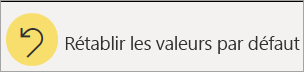

# Modifier le mode tri d’un graphique dans un rapport Power BI

[!INCLUDE[consumer-appliesto-ynnn](../includes/consumer-appliesto-ynnn.md)]

> [!IMPORTANT]
> **Cet article s’adresse aux utilisateurs de Power BI qui ne disposent pas d’autorisations de modification sur le rapport ou le jeu de données et qui travaillent uniquement avec la version en ligne de Power BI (le service Power BI). Si vous êtes *concepteur*, *administrateur* ou *propriétaire* de rapports, il se peut que cet article ne comporte pas toutes les informations dont vous avez besoin. Lisez plutôt [Trier par colonne dans Power BI Desktop](../create-reports/desktop-sort-by-column.md)** .

Dans le service Power BI, vous pouvez changer l’apparence d’un visuel en le triant par différents champs de données. En changeant la façon dont vous triez un visuel, vous pouvez mettre en évidence les informations que vous voulez transmettre. Que vous utilisiez des données numériques (comme des chiffres de ventes) ou des données de texte (comme des noms d’État), vous pouvez trier vos visuels comme vous le souhaitez. Power BI offre une grande souplesse sur le plan du tri et des menus rapides que vous pouvez utiliser. 

Les visuels d’un tableau de bord ne peuvent pas être triés. Toutefois, dans un rapport Power BI, vous pouvez trier la plupart des visuels à raison d’un champ, parfois deux, à la fois. Pour certains types de visuels, le tri n’est pas disponible du tout : arborescences, jauges, cartes, etc. 

## Commencer

Pour commencer, ouvrez un rapport que vous avez créé ou qui a été partagé avec vous. Sélectionnez un visuel (pouvant être trié) et choisissez **Plus d’actions** (...).  Il existe trois options pour le tri : **Tri décroissant**, **Tri croissant** et **Trier par**. 
    

### Trier par ordre alphabétique ou par ordre numérique

Les visuels peuvent être triés par ordre alphabétique en fonction des noms de catégories du visuel, ou en fonction des valeurs numériques de chaque catégorie. Par exemple, ce graphique est trié par ordre alphabétique en fonction de la catégorie de l’axe X **Nom** des magasins.

Pour passer du tri par catégorie (nom de magasin) au tri par valeur (ventes par mètres carrés), sélectionnez **Plus d’actions** (...) et choisissez **Trier par**. Sélectionnez une valeur numérique utilisée dans le visuel.  Dans cet exemple, nous avons sélectionné **Sales Per Sq Ft** (Ventes par pied carré).

Si nécessaire, changez l’ordre de tri de croissant à décroissant.  Resélectionnez **Plus d’actions** (...), puis choisissez **Tri décroissant** ou **Tri croissant**. Le champ utilisé pour le tri est en gras et a une barre jaune.

   

> [!NOTE]
> Certains visuels ne peuvent pas être triés. C’est le cas, par exemple, des visuels suivants : treemap, carte géographique, carte choroplèthe, nuage de points, jauge, carte, cascade.

## Trier sur plusieurs colonnes
Les données de ce tableau sont triées par **Number of customers** (Nombre de clients).  Nous le savons en raison de la petite flèche sous le mot *Number* (Nombre). La flèche pointe vers le bas, ce qui signifie que la colonne est triée dans *l’ordre décroissant*.

Pour ajouter d’autres colonnes à l’ordre de tri, appuyez sur Maj et cliquez sur l’en-tête de colonne que vous souhaitez ajouter ensuite dans l’ordre de tri. Par exemple, si vous cliquez sur **Number of customers** (Nombre de clients) puis que vous utilisez la touche Maj tout en cliquant sur **Total revenue** (Chiffre d’affaires total), le tableau est d’abord trié par clients, puis par chiffre d’affaires. Le contour rouge indique les zones où l’ordre de tri a changé.

Si vous utilisez la touche Maj tout en cliquant une deuxième fois sur la même colonne, cela modifie le sens de tri (croissant, décroissant) de cette colonne. En outre, si vous utilisez la touche Maj tout en cliquant sur une colonne que vous avez précédemment ajoutée à l’ordre de tri, cette colonne est déplacée vers la fin de l’ordre de tri.

## Enregistrement de vos modifications de l’ordre de tri
Les rapports Power BI conservent les filtres, les segments, le tri et les autres changements que vous apportez aux vues de données, même si vous travaillez en [Mode Lecture](end-user-reading-view.md). Ainsi, si vous quittez un rapport et que vous y revenez plus tard, vos changements de tri sont enregistrés.  Si vous voulez annuler vos changements et revenir aux paramètres du *concepteur* du rapport, sélectionnez **Rétablir les valeurs par défaut** dans la barre de menus supérieure. 

Cependant, si le bouton **Rétablir les valeurs par défaut** est grisé, cela signifie que le *concepteur* du rapport a désactivé la possibilité d’enregistrer vos changements.

## Considérations et résolution des problèmes

### Tri à l’aide d’autres critères
Il peut parfois être utile de trier un visuel selon un autre champ (non inclus dans le visuel) ou d’autres critères.  Par exemple, vous pouvez être amené à effectuer un tri par mois dans l’ordre séquentiel (et non par ordre alphabétique) ou bien un tri par nombres entiers plutôt qu’un tri par chiffre (0, 1, 9, 20, et non 0, 1, 20, 9).  

Seule la personne qui a conçu le rapport peut apporter ces changements pour vous. Vous pouvez trouver les informations de contact du *concepteur* en sélectionnant le nom du rapport dans la barre d’en-tête.

Si vous êtes *concepteur* et que vous disposez d’autorisations de modification sur le contenu, lisez [Trier par colonne dans Power BI Desktop](../create-reports/desktop-sort-by-column.md) pour savoir comment mettre à jour le jeu de données et autoriser ce type de tri.

## Étapes suivantes
En savoir plus sur les [visualisations dans les rapports Power BI](end-user-visualizations.md).

[Power BI – Concepts de base](end-user-basic-concepts.md)
