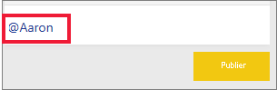
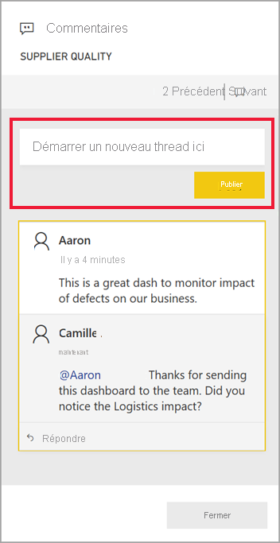
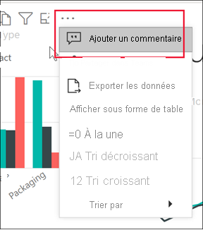
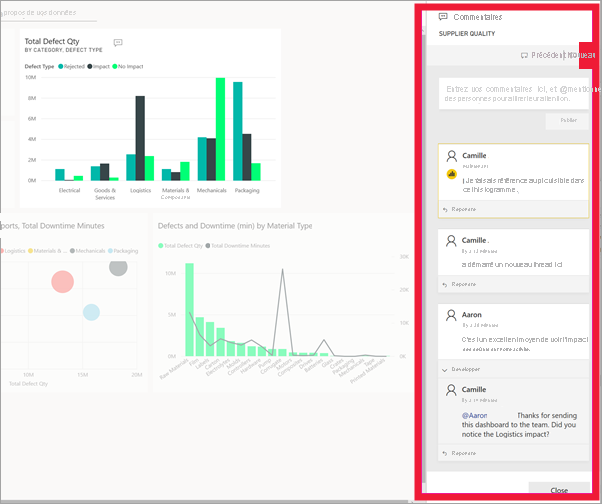

# Ajouter des commentaires à un tableau de bord ou à un rapport

[!INCLUDE[consumer-appliesto-ynny](../includes/consumer-appliesto-ynny.md)]

[!INCLUDE [power-bi-service-new-look-include](../includes/power-bi-service-new-look-include.md)]

Ajoutez un commentaire personnel ou démarrez une conversation à propos d’un tableau de bord ou d’un rapport avec vos collègues. Les **commentaires** représentent une fonctionnalité parmi d’autres permettant à un *utilisateur professionnel* de travailler en collaboration avec d’autres personnes. 

> [!NOTE]
> Pour collaborer avec d’autres personnes, notamment ajouter des commentaires à des rapports partagés, vous devez disposer d’une licence Power BI Pro ; à défaut, le contenu doit être hébergé dans une capacité Power BI Premium. [Quel type de licence j’ai ?](end-user-license.md)

## Comment utiliser la fonctionnalité Commentaires
Les commentaires peuvent être ajoutés à l’ensemble d’un tableau de bord, à chacun des visuels d’un tableau de bord, à une page de rapport, à un rapport paginé et à chacun des visuels d’une page de rapport. Le commentaire que vous ajoutez peut être général ou cibler certains collègues.  

Lorsque vous ajoutez un commentaire à un rapport, Power BI capture le filtre et les valeurs de segment actuels, puis crée un [signet](end-user-bookmarks.md). Cela signifie que lorsque vous sélectionnez un commentaire ou y répondez, la page de rapport ou le visuel du rapport peut changer pour vous montrer les sélections de filtre et de segment qui étaient actives lorsque le commentaire a été ajouté pour la première fois.  

Pourquoi est-ce important ? Prenons l’exemple d’un collègue ayant appliqué un filtre qui a révélé une information intéressante qu’il souhaite partager avec l’équipe. Si ce filtre n’était pas sélectionné, le commentaire serait probablement moins pertinent.

Si vous utilisez un rapport paginé, vous ne pouvez écrire que des commentaires d’ordre général sur votre rapport.  Il n’est pas possible d’écrire des commentaires pour un visuel de rapport paginé.

### Ajouter un commentaire général à un tableau de bord ou à un rapport
Les processus d’ajout de commentaires à un tableau de bord ou à un rapport sont similaires.  Dans cet exemple, nous utilisons un tableau de bord. 

1. Ouvrez un tableau de bord ou un rapport Power BI et sélectionnez l’icône **Commentaire**. La boîte de dialogue Commentaires s’ouvre.

    

    Vous pouvez constater ici que le créateur du tableau de bord a déjà ajouté un commentaire général.  Toute personne ayant accès à ce tableau de bord peut voir ce commentaire.

    

2. Pour répondre, sélectionnez **Répondre**, tapez votre réponse, puis sélectionnez **Poster**.  

    

    Par défaut, Power BI envoie votre réponse au collègue à l’origine du thread de commentaires, dans ce cas, Aaron. 

    

 3. Si vous souhaitez ajouter un commentaire qui ne fait pas partie d’un thread existant, entrez votre commentaire dans le champ de texte situé dans la partie supérieure.

    

    Les commentaires pour ce tableau de bord ressemblent maintenant à ceci.

    

### Ajouter un commentaire à un visuel de tableau de bord ou de rapport spécifique
Vous pouvez également ajouter des commentaires à des vignettes de tableau de bord individuelles et à des visuels de rapport individuels. Les processus sont similaires et, dans cet exemple, nous utilisons un rapport.

1. Pointez sur le visuel, puis sélectionnez **Plus d’actions** (…).    
2. Dans la liste déroulante, sélectionnez **Ajouter un commentaire**.

      

3.  La boîte de dialogue **Commentaires** s’ouvre, et les autres visuels de la page sont grisés. Ce visuel n’a pas encore de commentaires. 

      

4. Tapez votre commentaire, puis sélectionnez **Poster**.

      

    - Si vous sélectionnez un commentaire effectué sur un visuel sur une page de rapport, ce visuel est mis en évidence (cf. ci-dessous).

    - Dans un tableau de bord, l’icône représentant un graphique  indique qu’un commentaire est lié à un visuel spécifique. Les commentaires qui s’appliquent à l’intégralité du tableau de bord n’ont pas d’icône spéciale. La sélection de l’icône représentant un graphique permet de mettre en surbrillance le visuel associé dans le tableau de bord.
    

    

5. Sélectionnez **Fermer** pour revenir au tableau de bord ou au rapport.

### Attirer l’attention de vos collègues à l’aide du symbole @
Que vous ajoutiez des commentaires à un tableau de bord, un rapport, une vignette ou un visuel, vous pouvez utiliser le symbole « \@ » pour attirer l’attention de vos collègues.  Quand vous tapez le symbole « \@ », Power BI ouvre une liste déroulante dans laquelle vous pouvez rechercher des personnes de votre organisation et les sélectionner. Tout nom vérifié commençant par le symbole « \@ » s’affiche en bleu. Les personnes @mentioned reçoivent immédiatement un e-mail dans leur boîte de réception et, si elles utilisent une application Power BI Mobile, elles reçoivent une notification Push sur leur appareil. Elles peuvent ouvrir le commentaire directement à partir de la notification, afficher les données et répondre en conséquence.

Voici une conversation avec le *concepteur* d’une visualisation. Il utilise le symbole @ pour que je voie le commentaire. Je reçois une notification et je sélectionne le lien pour ouvrir ce tableau de bord et la conversation correspondante.  

  

## Considérations et résolution des problèmes

- Les signets ne sont pas capturés lorsque vous répondez à une conversation. Seul le premier commentaire d’une conversation crée un signet.
- Si vous utilisez un rapport paginé, vous ne pouvez écrire que des commentaires d’ordre général sur votre rapport.  Il n’est pas possible d’écrire des commentaires pour un visuel de rapport paginé.

## Étapes suivantes
Revenir aux [visualisations pour les utilisateurs professionnels](end-user-visualizations.md)    
[Sélectionner une visualisation pour ouvrir un rapport](end-user-report-open.md)
