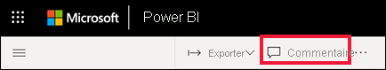
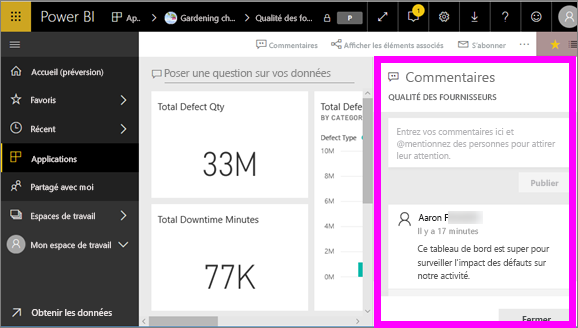
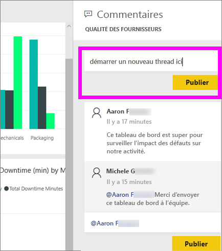
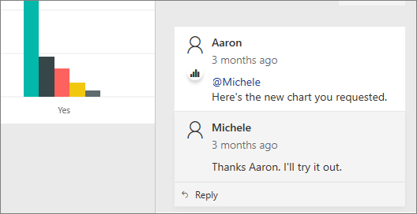
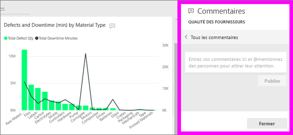
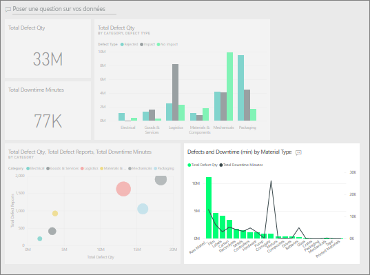

# Ajouter des commentaires à un tableau de bord
Ajoutez un commentaire personnel ou démarrez une conversation à propos d’un tableau de bord avec vos collègues. Les **commentaires** sont une fonctionnalité parmi d’autres qui permet à un *consommateur* de collaborer avec d’autres personnes. 

## Comment utiliser la fonctionnalité Commentaires
Vous pouvez ajouter des commentaires à un tableau de bord entier ou à un visuel spécifique d’un tableau de bord. Le commentaire que vous ajoutez peut être général ou cibler certains collègues.  

### Ajouter un commentaire général à un tableau de bord
1. Ouvrez un tableau de bord Power BI et sélectionnez l’icône **Commentaires**. La boîte de dialogue Commentaires s’ouvre.

    

    Vous pouvez constater ici que le créateur du tableau de bord a déjà ajouté un commentaire général.  Toute personne ayant accès à ce tableau de bord peut voir ce commentaire.

    

2. Pour répondre, sélectionnez **Répondre**, tapez votre réponse, puis sélectionnez **Poster**.  

    

    Par défaut, Power BI envoie votre réponse au collègue à l’origine du thread de commentaires (dans ce cas, Aaron F). 

    

 3. Si vous souhaitez ajouter à un tableau de bord un commentaire qui ne fait pas partie d’un thread existant, entrez votre commentaire dans le champ de texte situé dans la partie supérieure.

    

    Les commentaires pour ce tableau de bord ressemblent maintenant à ceci.

    

### Ajouter un commentaire à un visuel de tableau de bord spécifique
1. Pointez sur le visuel, puis sélectionnez les points de suspension (...).    
2. Dans la liste déroulante, sélectionnez **Ajouter un commentaire**.

      

3.  La boîte de dialogue **Commentaires** s’ouvre. Ce visuel n’a pas encore de commentaires. 

      

4. Tapez votre commentaire, puis sélectionnez **Poster**.

      

    L’icône représentant un graphique  indique que ce commentaire est lié à un visuel spécifique. Sélectionnez l’icône pour mettre en surbrillance le visuel correspondant sur le tableau de bord.

    

5. Sélectionnez **Fermer** pour revenir au tableau de bord ou au rapport.

### Attirer l’attention de vos collègues à l’aide du symbole @
Que vous ajoutiez des commentaires à un tableau de bord ou à un visuel particulier, vous pouvez utiliser le symbole « @ » pour attirer l’attention de vos collègues.  Quand vous tapez le symbole « @ », Power BI ouvre une liste déroulante dans laquelle vous pouvez rechercher et sélectionner des personnes de votre organisation. Tout nom vérifié commençant par le symbole « @ » s’affiche en bleu. 

Voici une conversation avec le *concepteur* d’une visualisation. Il utilise le symbole @ pour que je voie le commentaire. Je sais que ce commentaire m’est destiné. Quand j’ouvre le tableau de bord de cette application dans Power BI, je sélectionne **Commentaires** dans l’en-tête. Le volet **Commentaires** affiche notre conversation.

  

## Étapes suivantes
Revenir aux [visualisations pour les consommateurs](end-user-visualizations.md)    
<!--[Select a visualization to open a report](end-user-open-report.md)-->