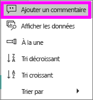
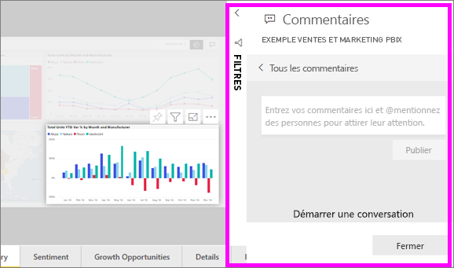
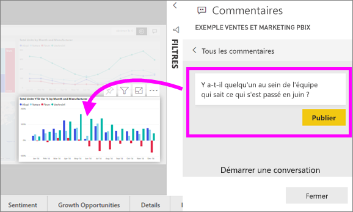
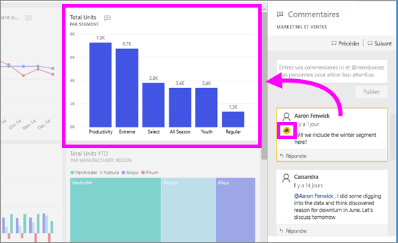

# Ajouter des commentaires à un rapport ou tableau de bord
Ajouter un commentaire personnel ou démarrer une conversation sur un tableau de bord ou un rapport avec vos collègues. Les **commentaires** sont une fonctionnalité parmi d’autres qui permet à un *consommateur* de collaborer avec d’autres personnes. 

## Comment utiliser la fonctionnalité Commentaires
Les commentaires peuvent être ajoutés à un tableau de bord entier, des éléments visuels individuels sur un tableau de bord, une page de rapport et des éléments visuels sur une page de rapport. Ajouter un commentaire général ou un commentaire ciblé sur vos collègues spécifiques.  

Lorsque vous ajoutez un commentaire à un rapport, Power BI capture les valeurs de filtre et segment actuels. Cela signifie que lorsque vous sélectionnez ou répondre à un commentaire, la page de rapport ou visuel de rapport peut changer pour vous montrer le filtre et les sélections de segment qui étaient actives lors le commentaire a d’abord été ajouté.  

Pourquoi est-ce important ? Par exemple qu'un collègue appliqué un filtre qui a révélé une information intéressante qu’il souhaite partager avec l’équipe. Sans ce filtre est sélectionné, le commentaire ne peut pas être judicieuse. 

### Ajouter un commentaire général à un tableau de bord ou un rapport
Les processus pour ajouter des commentaires à un rapport ou tableau de bord sont similaires. Dans cet exemple, nous utilisons un tableau de bord. 

1. Ouvrez un rapport ou tableau de bord Power BI et sélectionnez le **commentaires** icône. La boîte de dialogue Commentaires s’ouvre.

    

    Vous pouvez constater ici que le créateur du tableau de bord a déjà ajouté un commentaire général.  Toute personne ayant accès à ce tableau de bord peut voir ce commentaire.

    

2. Pour répondre, sélectionnez **Répondre**, tapez votre réponse, puis sélectionnez **Poster**.  

    

    Par défaut, Power BI envoie votre réponse au collègue à l’origine du thread de commentaires (dans ce cas, Aaron F). 

    

 3. Si vous souhaitez ajouter un commentaire qui ne fait pas partie d’un thread existant, entrez votre commentaire dans le champ de texte supérieur.

    

    Les commentaires pour ce tableau de bord ressemblent maintenant à ceci.

    

### Ajouter un commentaire à un tableau de bord spécifique ou d’un visuel de rapport
Outre l’ajout de commentaires à un tableau de bord entier ou à une page entière de rapport, vous pouvez ajouter des commentaires pour les vignettes de tableau de bord et des éléments visuels de rapport individuel. Les processus sont similaires, et dans cet exemple, nous utilisons un rapport.

1. Pointez sur le visuel, puis sélectionnez les points de suspension (...).    
2. Dans la liste déroulante, sélectionnez **Ajouter un commentaire**.

      

3.  Le **commentaires** boîte de dialogue s’ouvre, et les autres éléments visuels sur la page sont grisées. Ce visuel n’a pas encore de commentaires. 

      

4. Tapez votre commentaire, puis sélectionnez **Poster**.

      

    - Sur un rapport page, en sélectionnant un commentaire qui a été effectué sur un élément visuel, en évidence (voir ci-dessus).

    - Sur un tableau de bord, l’icône de graphique  nous permet de savoir qu’un commentaire est lié à un visuel spécifique. Les commentaires qui s’appliquent à l’ensemble du tableau de bord n’ont pas d’une icône spéciale. En sélectionnant l’icône de graphique met en évidence le visuel connexe sur le tableau de bord.

        

5. Sélectionnez **Fermer** pour revenir au tableau de bord ou au rapport.

### Attirer l’attention de vos collègues à l’aide du symbole @
Si vous créez une manipulation de tableau de bord, rapports, vignette ou commentaire visual, attention de vos collègues à l’aide de la «\@« symbole.  Lorsque vous tapez le «\@« symbole, Power BI ouvre une liste déroulante dans laquelle vous pouvez rechercher et sélectionner des personnes dans votre organisation. Tout nom vérifié commençant par le symbole « \@ » s’affiche en bleu. 

Voici une conversation avec le *concepteur* d’une visualisation. Il utilise le symbole @ pour que je voie le commentaire. Je sais que ce commentaire m’est destiné. Quand j’ouvre le tableau de bord de cette application dans Power BI, je sélectionne **Commentaires** dans l’en-tête. Le volet **Commentaires** affiche notre conversation.

  

## Étapes suivantes
Revenir aux [visualisations pour les consommateurs](end-user-visualizations.md)    
<!--[Select a visualization to open a report](end-user-open-report.md)-->
