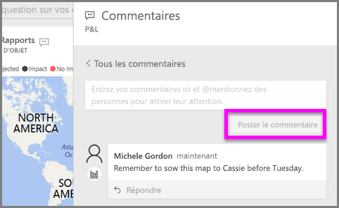
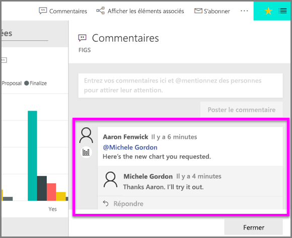

# Ajouter des commentaires à une visualisation
Ajoutez un commentaire personnel ou démarrez une conversation sur une visualisation avec vos collègues. La fonctionnalité **Commentaire** n’est qu’un des moyens par lesquels un *consommateur* peut interagir avec une visualisation. 

## Comment utiliser la fonctionnalité Commentaire

1. Pointez sur la visualisation, puis sélectionnez les points de suspension (...).    
2. Dans la liste déroulante, sélectionnez **Ajouter un commentaire**.

      

3.  Tapez votre commentaire, puis sélectionnez **Poster le commentaire**. Celui-ci est un commentaire destiné à moi-même, avec des fautes d’orthographe.

      

4. Voici une conversation avec le *concepteur* d’une visualisation. Il utilise le symbole @ pour que je voie le commentaire. Je sais que ce commentaire m’est destiné. Quand j’ouvre le tableau de bord de cette application dans Power BI, je sélectionne **Commentaires** dans l’en-tête. Le volet **Commentaires** affiche notre conversation. 

      

5. Cliquez sur **Fermer** pour revenir au tableau de bord ou au rapport.

## Étapes suivantes
Revenir aux [visualisations pour les consommateurs](end-user-visualizations.md)    
<!--[Select a visualization to open a report](end-user-open-report.md)-->