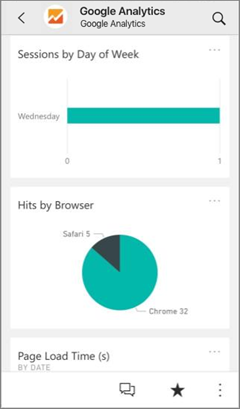
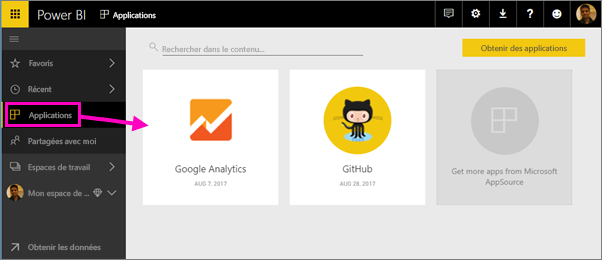
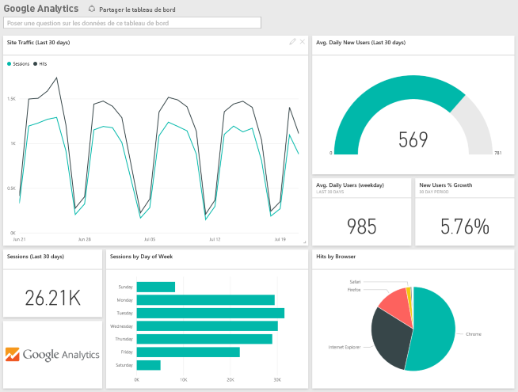
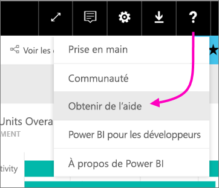

# Se connecter aux services que vous utilisez avec Power BI

Une fois l’application installée, vous pouvez voir le tableau de bord et les rapports dans le service Power BI ([https://powerbi.com](https://powerbi.com)) et dans les applications mobiles Power BI. 

## Bien démarrer
[!INCLUDE [powerbi-service-apps-get-more-apps](.././includes/powerbi-service-apps-get-more-apps.md)]

## Afficher le tableau de bord et les rapports
Une fois l’importation terminée, la nouvelle application s’affiche sur la page Applications.

1. Dans le volet de navigation de gauche, sélectionnez **Applications**, puis l’application.
   
     
2. Vous pouvez poser une question en tapant dans la zone Q&R, ou cliquer sur une vignette pour ouvrir le rapport sous-jacent. 
   
    
   
    Vous pouvez filtrer et mettre en surbrillance les données dans le rapport, mais vous ne pouvez pas enregistrer vos modifications.

## Ce qui est inclus
Une fois connecté à un service, vous voyez une nouvelle application avec un tableau de bord, des rapports et un jeu de données. Les données du service étant focalisées sur un scénario spécifique, elles peuvent ne pas inclure toutes les informations du service. La fréquence planifiée d’actualisation des données est quotidienne. Vous pouvez contrôler la planification en sélectionnant le jeu de données.

Pour plus d’informations sur la connexion à des services spécifiques, voir les pages d’aide concernant ceux-ci.

## Résolution des problèmes
**Vignettes vides**  
Lorsque Power BI se connecte pour la première fois à un service, vous pouvez voir sur votre tableau de bord un ensemble vide de vignettes. Si le tableau de bord est toujours vide après 2 heures, cela indique probablement un échec de connexion. Si vous n’avez pas vu de message d’erreur contenant des informations sur la résolution du problème, créez un ticket de support.

* Sélectionnez l’icône Point d’interrogation (**?**) dans l’angle supérieur droit, puis choisissez **Obtenir de l’aide**.
  
    

**Informations manquantes**  
Le tableau de bord et les rapports incluent le contenu du service focalisé sur un scénario spécifique, pas toutes les informations du service. S'il existe une mesure spécifique que vous ne voyez pas dans le pack de contenu, saisissez une suggestion dans la page [Support Power BI](https://support.powerbi.com/forums/265200-power-bi).

## Suggestion de services
Vous utilisez un service que vous souhaitez suggérer pour une application Power BI ? Accédez à la page [Support Power BI](https://support.powerbi.com/forums/265200-power-bi) et faites-le nous savoir.

Vous disposez d’un service pour lequel vous souhaitez créer une application ? [Soumettez votre candidature](https://azure.microsoft.com/marketplace/programs/certified/apply/) et sélectionnez « Publier un pack de contenu Power BI » pour commencer.

## Étapes suivantes
* [Que sont les applications dans Power BI ?](end-user-apps.md)
* [Obtenir des données dans Power BI](../service-get-data.md)
* D’autres questions ? [Essayez d’interroger la communauté Power BI](http://community.powerbi.com/)

