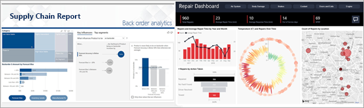

# Le service Power BI, pour les utilisateurs professionnels

[!INCLUDE[consumer-appliesto-ynny](../includes/consumer-appliesto-ynny.md)]

Vous vivez dans une culture de la donnée, où les décisions métier sont basées sur des faits, et non pas sur des opinions. Vous avez besoin de données pour prendre ces décisions et vos collègues vous y aident.     
 
Ils vous envoient tous les types de rapports, de feuilles de calcul, d’e-mails avec des graphiques et même de documents imprimés. À mesure que les données s’accumulent, il devient de plus en plus difficile de trouver rapidement ce dont vous avez besoin, et vous vous inquiétez de ne pas utiliser les informations les plus récentes.  
 

## Le service Power BI, pour les *utilisateurs professionnels*

Power BI rend votre travail plus facile tout en lui donnant plus d’impact. Toutes les données sont représentées sous forme de graphiques, qui vous permettent de visualiser vos données. Au lieu de longues listes ou de tableaux de nombres et de mots, vos insights sur les données sont réellement ***beaux*** : ce sont des visuels colorés et convaincants qui représentent les insights de vos données. 

 
Il vous suffit d’ouvrir le service Power BI dans un navigateur ou sur un appareil mobile. Vos collègues et vous-même travaillez à partir des mêmes tableaux de bord et rapports approuvés, qui sont mis à jour et actualisés automatiquement : vous travaillez donc toujours avec le contenu le plus récent.   

Comme le contenu n’est pas statique, vous pouvez l’explorer, à la recherche de tendances, d’insights et d’autres données décisionnelles. Segmentez le contenu et posez même des questions avec vos propres mots. Vous pouvez aussi ne rien faire et laisser vos données découvrir des insights qui vous intéressent, et vous envoyer des alertes quand des données sont modifiées et des rapports par e-mail selon une planification que vous définissez. Toutes vos données, à tout moment, dans le cloud ou localement, depuis n’importe quel appareil. C’est juste le commencement de tout ce que Power BI peut faire. 

## Suis-je un *utilisateur professionnel* de Power BI ?

La façon dont vous interagissez avec Power BI dépend de votre travail. En tant que consommateur ou qu’*utilisateur professionnel*, vous êtes la personne qui reçoit du contenu (des tableaux de bord, des rapports et des applications) de vos collègues. Vous travaillez dans la version en ligne ou mobile de Power BI, qui est appelée « Service Power BI », examinant et interagissant avec ce contenu, pour prendre des décisions métier. 
   
En tant qu’utilisateur professionnel, vous n’avez pas accès à toutes les fonctionnalités de Power BI, mais ce n’est pas un problème, car votre travail ne consiste pas à créer des tableaux de bord et des rapports. Vous allez utiliser le service Power BI pour analyser, superviser, explorer et prendre des décisions. 

Vous entendrez sans doute le terme « Power BI Desktop » ou simplement « Desktop » : il s’agit d’un outil autonome utilisé par les *concepteurs* qui créent et partagent des tableaux de bord et des rapports avec vous.  Il est important de savoir qu’il existe d’autres outils Power BI, mais si vous êtes *utilisateur professionnel*, vous utiliserez seulement le service Power BI. 

Et parce que vous travaillerez avec du contenu *partagé*, vous aurez besoin de l’un des éléments suivants :
- une licence Power BI Pro
- Votre organisation doit disposer d’un abonnement pour Power BI Premium et le contenu doit être partagé avec vous à partir d’une capacité Premium. 

Pour plus d’informations sur les licences et les abonnements, consultez [Quelle est ma licence ?](end-user-license.md)

## Interagir avec le contenu de manière sécurisée 
Quand vous filtrez, segmentez et exportez, ou quand vous vous abonnez, ne vous inquiétez pas : votre travail n’impacte pas le jeu de données sous-jacent ni le contenu partagé d’origine (tableaux de bord, rapports et applications).  

Vous ne pouvez pas endommager vos données.  Power BI est l’endroit idéal pour explorer et expérimenter sans craindre de « détériorer » quoi que ce soit.  
 
Cela ne veut pas dire que vous ne pouvez pas enregistrer vos changements. Mais ces modifications affectent seulement votre vue du contenu. Pour revenir à la vue d’origine par défaut, il vous suffit de cliquer sur un bouton.  

## Étapes suivantes

[Faire une visite guidée du service Power BI pour les utilisateurs professionnels](end-user-reading-view.md)    
[Formation au service Power BI pour les utilisateurs professionnels](/learn/paths/consume-data-with-power-bi/)    
[Terminologie et concepts pour les *utilisateurs professionnels* Power BI](end-user-basic-concepts.md)