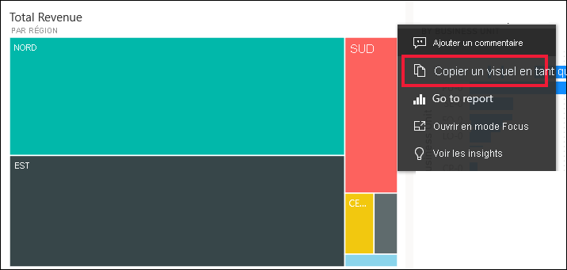
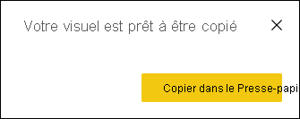
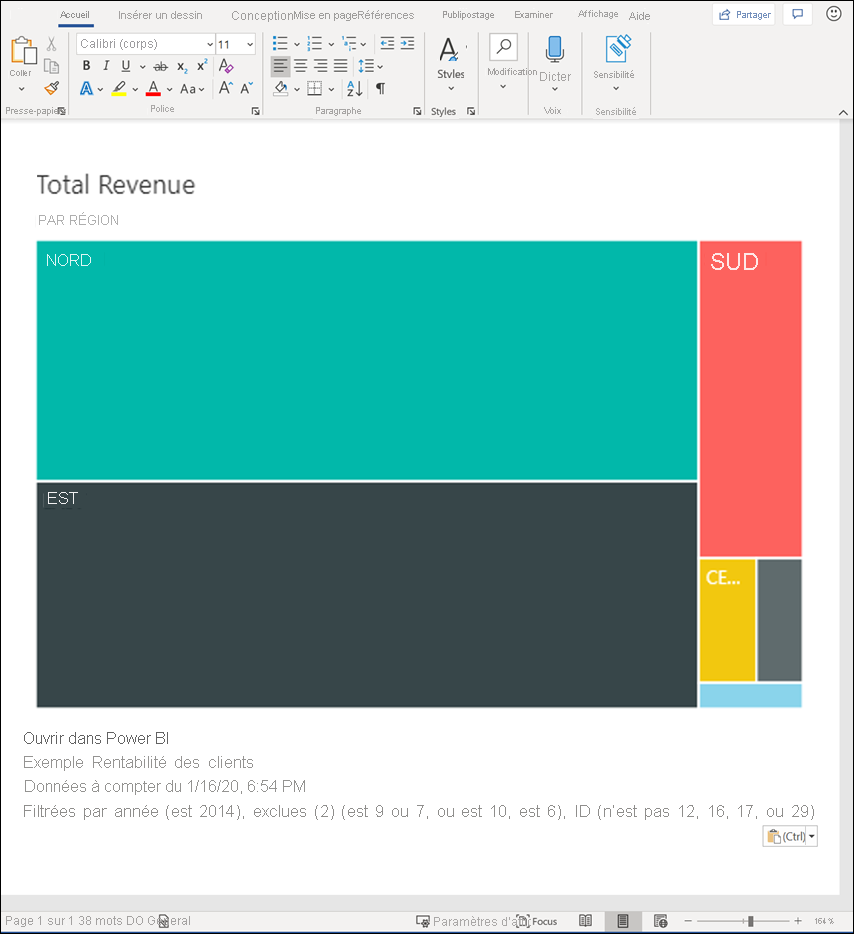
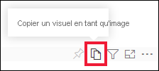
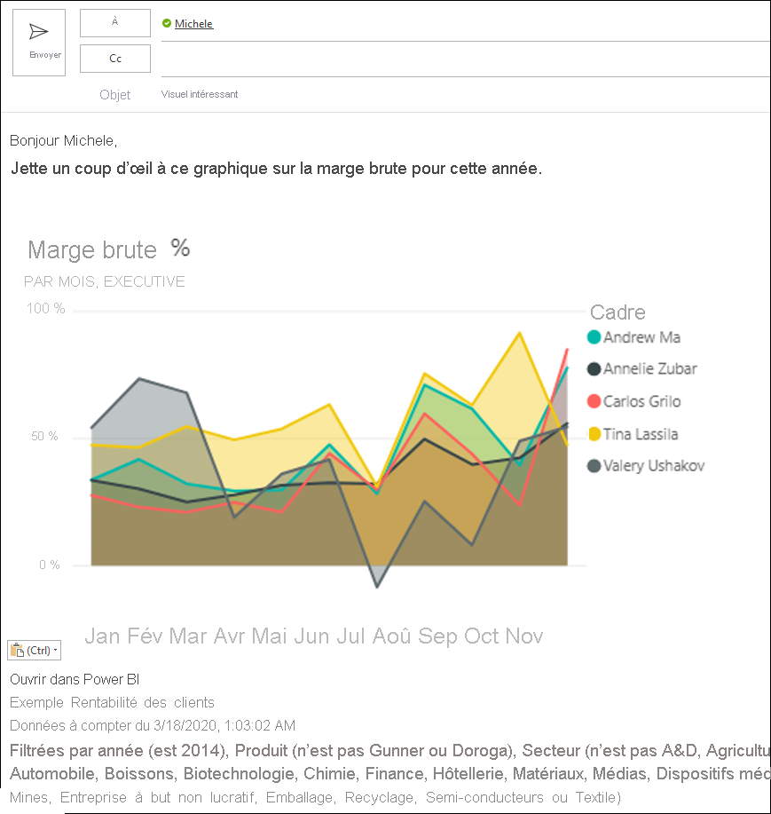
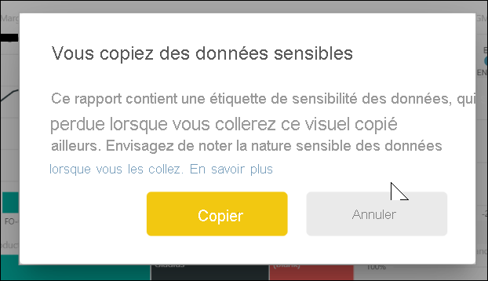
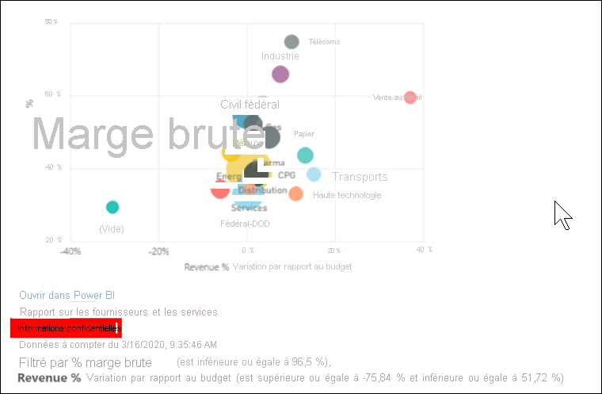
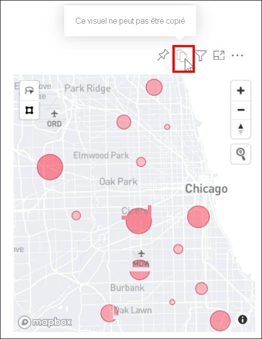

# Copier un visuel en tant qu’image dans le Presse-papiers

[!INCLUDE[consumer-appliesto-yyyn](../includes/consumer-appliesto-yyyn.md)]

Avez-vous déjà voulu partager une image d’un rapport ou d’un tableau de bord Power BI ? Vous pouvez maintenant copier le visuel et le coller dans toute autre application qui prend en charge le collage. 

Lorsque vous copiez une image statique d’un visuel, vous obtenez une copie du visuel avec les métadonnées. Cela comprend :
* un lien pour retourner au rapport Power BI ou au tableau de bord
* le titre du rapport ou du tableau de bord
* un message précisant que l’image contient des informations confidentielles
* l’horodatage de la dernière mise à jour
* les filtres appliqués au visuel

### Copie à partir d’une vignette de tableau de bord

1. Accédez au tableau de bord à partir duquel vous souhaitez effectuer la copie.

2. En haut à droite du visuel, sélectionnez **Plus d’actions (…)** , puis choisissez **Copier le visuel comme une image**. 

    

3. Quand la boîte de dialogue **Votre visuel est prêt à être copié** s’affiche, sélectionnez **Copier dans le Presse-papiers**.

    

4. Une fois le visuel copié, collez-le dans une autre application en appuyant sur **Ctrl+V** ou en cliquant avec le bouton droit > Coller. Dans la capture d’écran ci-dessous, nous avons collé le visuel dans Microsoft Word. 

    

### Copie à partir d’un visuel de rapport 

1. Accédez au rapport à partir duquel vous voulez effectuer la copie.

2. Dans l’angle supérieur droit du visuel, sélectionnez l’icône **Copier le visuel comme une image**. 

    

3. Quand la boîte de dialogue **Votre visuel est prêt à être copié** s’affiche, sélectionnez **Copier dans le Presse-papiers**.

    

4. Une fois le visuel copié, collez-le dans une autre application en appuyant sur **Ctrl+V** ou en cliquant avec le bouton droit > Coller. Dans la capture d’écran ci-dessous, nous avons collé le visuel dans un message électronique.

    

5. Si le rapport comporte une étiquette de sensibilité des données, un avertissement s’affiche lorsque vous sélectionnez l’icône de copie.  

    

    Une étiquette de sensibilité sera ajoutée aux métadonnées sous le visuel collé. 

    

## Considérations et résolution des problèmes

   

Q : Pourquoi l’icône de copie est-elle désactivée sur un visuel ?    
R : Nous prenons actuellement en charge les visuels Power BI natifs et les visuels personnalisés certifiés. Certains visuels sont pris en charge de façon limitée, notamment : 
- ESRI et autres visuels de carte 
- Visuels Python 
- Visuels R 
- PowerApps    

R : La possibilité de copier un visuel peut être désactivée par votre service informatique ou par votre administrateur Power BI.

Q : Pourquoi mon visuel n’est-il pas correctement collé ?    
R : Il existe des limitations pour les visuels personnalisés et les visuels animés. 

## Étapes suivantes
En savoir plus sur les [visualisations dans les rapports Power BI](end-user-visual-type.md)

D’autres questions ? [Posez vos questions à la communauté Power BI](https://community.powerbi.com/)

