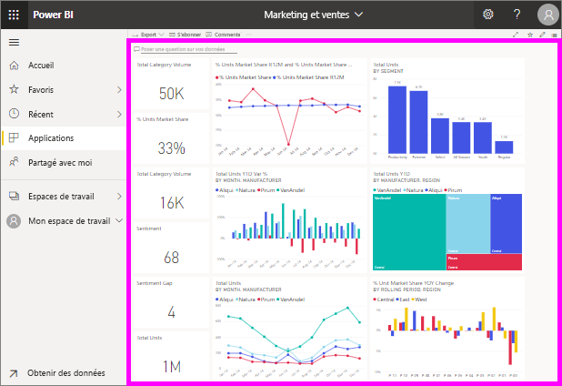

# Afficher un tableau de bord
Les *utilisateurs* de Power BI consacrent beaucoup de temps à la consultation des tableaux de bord. Les tableaux de bord sont conçus pour mettre en évidence des informations spécifiques des rapports et jeux de données sous-jacents. Et les consommateurs de Power BI utilisent ces informations pour le suivi, la surveillance, les réponses aux questions, les tests et bien plus encore, afin de prendre des décisions commerciales pilotées par les données.

Power BI Pro est nécessaire pour partager un tableau de bord et afficher un tableau de bord partagé.

## Ouvrir un tableau de bord

|              |         |
|------------|--------------------------------|
|      |Les tableaux de bord peuvent être ouverts à partir de nombreux emplacements dans le service Power BI.   Recherchez simplement cette icône de tableau de bord. Une fois que vous avez identifié un  tableau de bord, il est simple de l’ouvrir : il suffit de le sélectionner pour que le tableau de bord remplisse  votre canevas Power BI. |
|                    |          |

Vous pouvez trouver des tableaux de bord dans tous les conteneurs de la barre de navigation gauche. 

- **Accueil** 
- **Favoris** : Si vous avez [défini un tableau de bord comme favori](end-user-favorite.md)
- **Récente** : Si vous avez récemment visité un tableau de bord
- **Applications** : la plupart des applications contiennent des tableaux de bord et des rapports
- **Partagé avec moi** : si un collègue a [partagé un tableau de bord avec vous](end-user-shared-with-me.md)
- **Mon espace de travail** : si vous avez téléchargé un [exemple Power BI](../sample-datasets.md)

## Étapes suivantes
* Familiarisez-vous avec les tableaux de bord en effectuant une visite guidée d’un de nos [exemples de tableau de bord](../sample-tutorial-connect-to-the-samples.md).
* Apprenez-en plus sur les [vignettes du tableau de bord](end-user-tiles.md) et ce qui se produit lorsque vous sélectionnez une.