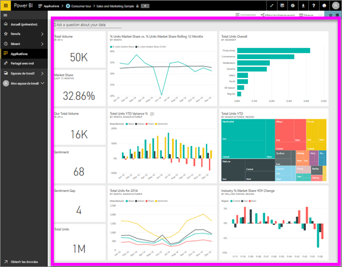

# Afficher un tableau de bord
Les consommateurs de Power BI consacrent beaucoup de temps à l’affichage des tableaux de bord. Les tableaux de bord sont conçus pour mettre en évidence des informations spécifiques des rapports et jeux de données sous-jacents. Et les consommateurs de Power BI utilisent ces informations pour le suivi, la surveillance, les réponses aux questions, les tests et bien plus encore, afin de prendre des décisions commerciales pilotées par les données.

Power BI Pro est nécessaire pour partager un tableau de bord et afficher un tableau de bord partagé.

## Ouvrir un tableau de bord
Les tableaux de bord peuvent être ouverts à partir de nombreux emplacements dans le service Power BI.  La clé détermine le contenu qui est un tableau de bord (par opposition à un rapport, par exemple). Une fois que vous avez identifié un tableau de bord, l’ouvrir est simple : il suffit de cliquer pour que le tableau de bord remplisse votre canevas de Power BI.

|              |         |
|------------|--------------------------------|
|      |La façon la plus simple d’identifier un tableau de bord consiste à rechercher cette  icône de tableau de bord. Lorsque vous avez localisé le contenu avec cette icône, sélectionnez-la pour ouvrir le tableau de bord. |
|                    |          |

 

<!--insert aGIF-->

Vous pouvez trouver des tableaux de bord dans tous les conteneurs de la barre de navigation gauche. 
- **Accueil** (préversion)
- **Favoris** : Si vous avez [défini un tableau de bord comme favori](end-user-favorite.md)
- **Récente** : Si vous avez récemment visité un tableau de bord
- **Applications** : la plupart des applications contiennent des tableaux de bord et des rapports
- **Partagé avec moi** : si un collègue a [partagé un tableau de bord avec vous](end-user-shared-with-me.md)
- **Mon espace de travail** : si vous avez téléchargé un [exemple Power BI](../sample-datasets.md)

## Étapes suivantes
* Familiarisez-vous avec les tableaux de bord en effectuant une visite guidée d’un de nos [exemples de tableau de bord](../sample-tutorial-connect-to-the-samples.md).
* Apprenez-en plus sur les [vignettes du tableau de bord](end-user-tiles.md) et ce qui se produit lorsque vous sélectionnez une.
* Si vous souhaitez effectuer le suivi d’une vignette du tableau de bord et recevoir un e-mail lorsqu’elle atteint un certain seuil ? [Créer des alertes sur les vignettes](end-user-alerts.md).
* Amusez-vous en posant des questions à votre tableau de bord. Découvrez comment utiliser [Power BI Q&A](end-user-q-and-a.md) pour poser une question concernant vos données et obtenir la réponse sous la forme d’une visualisation. 