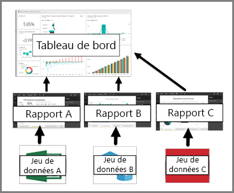

# Tableau de bord pour les consommateurs du service Power BI

[!INCLUDE[consumer-appliesto-ynny](../includes/consumer-appliesto-ynny.md)]

[!INCLUDE [power-bi-service-new-look-include](../includes/power-bi-service-new-look-include.md)]

Un ***tableau de bord*** Power BI est une page unique, souvent appelée canevas, qui utilise des visualisations pour raconter une histoire. Comme il est limité à une seule page, un tableau de bord bien conçu contient uniquement les éléments les plus importantes de cette histoire.

Les visualisations que vous voyez dans le tableau de bord sont appelées *vignettes* et sont *épinglées* au tableau de bord par les *concepteurs* de rapports. Dans la plupart des cas, la sélection d’une vignette ouvre la page de rapport où la visualisation a été créée. Si vous êtes novice dans Power BI, vous pouvez acquérir de bonnes bases en lisant [Power BI – Concepts de base](end-user-basic-concepts.md).

> [!NOTE]
> Les tableaux de bord peuvent être [affichés et partagés sur des appareils mobiles](mobile/mobile-apps-view-dashboard.md).
>
> Power BI Pro est requis pour afficher un tableau de bord qui a été partagé avec vous.
> 

Les visualisations sur un tableau de bord proviennent de rapports, et chaque rapport est basé sur un jeu de données. En fait, on peut considérer un tableau de bord comme une porte d’entrée dans les rapports et les jeux de données sous-jacents. La sélection d’une visualisation vous amène au rapport (et au jeu de données) utilisé(s) pour la créer.

## Avantages des tableaux de bord
Les tableaux de bord sont un moyen formidable pour surveiller votre activité, pour rechercher des réponses et pour afficher vos mesures les plus importantes en un coup d’œil. Les visualisations sur un tableau de bord peuvent provenir d’un ou plusieurs jeux de données sous-jacents et d’un ou plusieurs rapports sous-jacents. Un tableau de bord peut combiner des données locales et cloud, offrant ainsi une vue centralisée, quel que soit l’endroit où les données résident.

Un tableau de bord n’est pas seulement une belle image figée, il est aussi interactif, puisque les vignettes sont mises à jour au fur et à mesure que les données sous-jacentes changent.

## Tableaux de bord et rapports pour les ***consommateurs*** Power BI
Les rapports sont souvent confondus avec les tableaux de bord, car il s’agit également de canevas contenant des visualisations. Mais il existe quelques différences majeures pour les *consommateurs* Power BI.

| **Fonctionnalité** | **Tableaux de bord** | **Rapports** |
| --- | --- | --- |
| Pages |Une seule page |Une ou plusieurs pages |
| Sources de données |Un ou plusieurs rapports et un ou plusieurs jeux de données par tableau de bord |Un seul jeu de données par rapport |
| Filtrage |Impossible de filtrer ou découper |Différentes manières de filtrer, mettre en surbrillance et découper |
| Définir des alertes |Possibilité de créer des alertes pour vous envoyer un e-mail lorsque certaines conditions sont remplies |Non |
| Sélection |Possibilité de définir un tableau de bord comme votre tableau de bord « par défaut » |Impossible de créer un rapport par défaut |
| Possibilité d’afficher les tables et les champs sous-jacents d’un jeu de données |No. Possibilité d’exporter les données, mais pas de voir les tables et les champs dans le tableau de bord. |Oui. Possibilité de voir les tables d’un jeu de données ainsi que les champs et les valeurs. |

## Concepteurs et utilisateurs de tableaux de bord
En tant que ***consommateur*** Power BI, vous recevez des tableaux de bord de la part de *concepteurs*. Continuez à découvrir les tableaux de bord avec les rubriques suivantes :

* [Afficher un tableau de bord](end-user-dashboard-open.md)
* Apprenez-en plus sur les [vignettes du tableau de bord](end-user-tiles.md) et ce qui se produit lorsque vous sélectionnez une.
* Si vous souhaitez effectuer le suivi d’une vignette du tableau de bord et recevoir un e-mail lorsqu’elle atteint un certain seuil ? [Créer des alertes sur les vignettes](end-user-alerts.md).
* Amusez-vous en posant des questions à votre tableau de bord. Découvrez comment utiliser [Power BI Q&A](end-user-q-and-a.md) pour poser une question concernant vos données et obtenir la réponse sous la forme d’une visualisation.

> [!TIP]
> Si vous n’avez pas trouvé pas ce que vous cherchiez ici, utilisez la table des matières sur la gauche.
> 

## Étapes suivantes
[Afficher un tableau de bord](end-user-dashboard-open.md) 