# Mode Exploration pour une visualisation dans Power BI

## L’exploration nécessite une hiérarchie
Quand un visuel a une hiérarchie, vous pouvez l’explorer pour révéler des détails supplémentaires. Par exemple, vous pouvez avoir une visualisation qui examine le nombre de médailles olympiques avec une hiérarchie constituée de sports, disciplines et événements. Par défaut, la visualisation indique le nombre de médailles olympiques par sport (gymnastique, ski, sports aquatiques, etc.). Toutefois, comme elle a une hiérarchie, si vous sélectionnez un élément visuel (par exemple, une barre, une ligne ou une bulle), une image encore plus détaillée s’affiche. Sélectionnez l’élément **aquatics** (sports aquatiques) afin d’afficher les données relatives à la natation, la plongée et le water polo.  Sélectionnez l’élément **diving** (plongée) pour afficher les détails relatifs au plongeoir, à la plateforme et aux événements de plongeon synchronisé.

Vous pouvez ajouter des hiérarchies aux rapports que vous possédez, mais pas à ceux partagés avec vous.
Vous ne savez pas quelles visualisations Power BI contiennent une hiérarchie ?  Passez la souris sur une visualisation. Si vous voyez ces contrôles de descente dans la hiérarchie dans les angles supérieurs, la visualisation a une hiérarchie.

    
   

Les dates sont un type unique de hiérarchie. Quand vous ajoutez un champ de date à une visualisation, Power BI ajoute automatiquement une hiérarchie de temps qui inclut l’année, le trimestre, le mois et le jour. Pour plus d’informations, consultez [Hiérarchies visuelles et comportement d’exploration](../guided-learning/visualizations.yml?tutorial-step=18) ou regardez la vidéo ci-dessous.

  <iframe width="560" height="315" src="https://www.youtube.com/embed/MNAaHw4PxzE?list=PL1N57mwBHtN0JFoKSR0n-tBkUJHeMP2cP" frameborder="0" allowfullscreen></iframe>

> [!NOTE]
> Pour savoir comment créer des hiérarchies à l’aide de Power BI Desktop, regardez la vidéo [Comment créer et ajouter des hiérarchies](https://youtu.be/q8WDUAiTGeU).
> 

## Conditions préalables

1. Dans le service Power BI ou dans Power BI Desktop, l’exploration nécessite une visualisation avec une hiérarchie. 
   
2. Pour suivre la procédure, [ouvrez l’exemple Retail Analysis](../sample-datasets.md) et créez une treemap qui examine **Total Units This Year** (Values) par **Territory**, **City**, **PostalCode** et **Name** (Group).  La treemap a une hiérarchie constituée de secteurs, de villes, de codes postaux et de noms de ville. Chaque secteur a une ou plusieurs villes, chaque ville a un ou plusieurs codes postaux, etc. Par défaut, la visualisation affiche uniquement les données relatives au secteur, car le *secteur* (Territory) apparaît en premier dans la liste.
   
   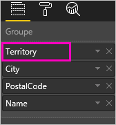

2. Comprendre comment les différentes icônes d’exploration fonctionnent ensemble peut prêter à confusion : nous allons donc filtrer la treemap pour afficher seulement 2 des plus petits secteurs : **KY** et **TN**. Sélectionnez la treemap et, sous **Filtres au niveau de l’élément visuel**, développez **Territory** et sélectionnez **KY** et **TN**.

    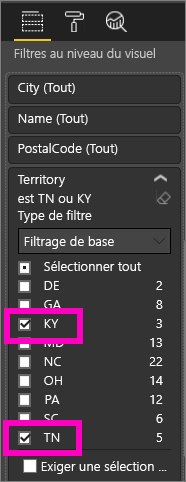    

   Seuls deux secteurs apparaissent maintenant dans la treemap.

   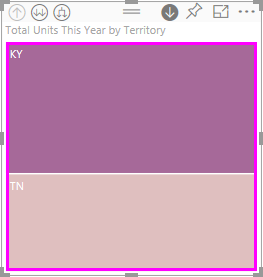

## Trois façons d’accéder aux fonctionnalités d’exploration
Vous disposez de plusieurs options pour accéder aux fonctionnalités d’exploration permettant de monter et de descendre dans la hiérarchie, et de développer, pour les visualisations qui ont des hiérarchies. Cet article explique comment utiliser la première option ci-dessous. Une fois que vous comprenez les principes fondamentaux de l’exploration permettant de descendre dans la hiérarchie et de développer, vous pouvez constater que ces trois méthodes accomplissent les mêmes choses, les tester et choisir celle que vous appréciez le plus.

- Pointez sur une visualisation pour voir et utiliser les icônes.  

    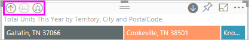

- Cliquez avec le bouton droit sur une visualisation pour faire apparaître et utiliser le menu.
    
    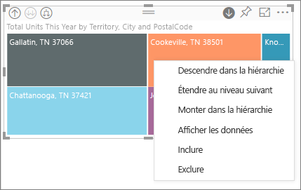

- Dans la barre de menus de Power BI, sélectionnez le bouton **Explorer**.

   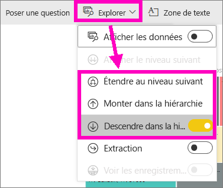

## Parcours d’exploration
### Descendre dans la hiérarchie
Vous disposez de plusieurs moyens pour explorer votre visualisation. ***Descendre dans la hiérarchie*** vous amène au niveau suivant dans la hiérarchie : ainsi, si vous considérez le niveau **Territory**, vous pouvez descendre dans la hiérarchie au niveau City, puis au niveau PostalCode, et enfin au niveau Name. Chaque étape de ce parcours vous montre de nouvelles informations.

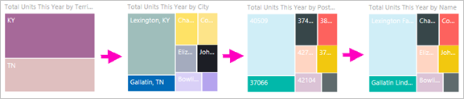

### Développer

***Développer*** ajoute un niveau de hiérarchie supplémentaire à la vue actuelle. Par conséquent, si vous considérez le niveau **Territory**, vous pouvez développer et ajouter des détails de City, PostalCode et Name à votre treemap. Chaque étape du parcours vous montre les mêmes informations et ajoute un niveau de nouvelles informations.

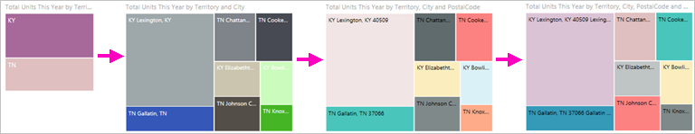

Vous pouvez également choisir de descendre dans la hiérarchie ou de développer sur un champ à la fois ou sur tous les champs en même temps. 

## Descendre dans la hiérarchie pour tous les champs à la fois

1. Démarrez au plus haut niveau de la treemap montrant les données pour KY et TN. Élargissez votre treemap en sélectionnant une des poignées et en la faisant glisser vers la droite. 

    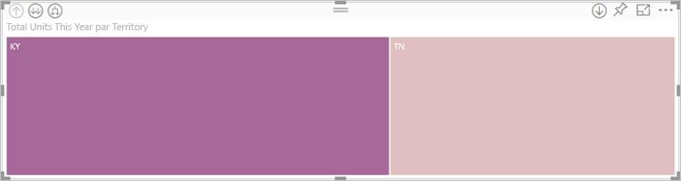 .

2. Pour descendre dans la hiérarchie pour ***tous les champs en même temps***, sélectionnez la flèche double en haut à gauche de la visualisation  . Votre treemap montre maintenant les données des villes pour le Kentucky et le Tennessee. 

    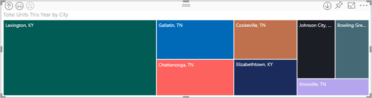
   
5. Descendez dans la hiérarchie une nouvelle fois au niveau PostalCode.

    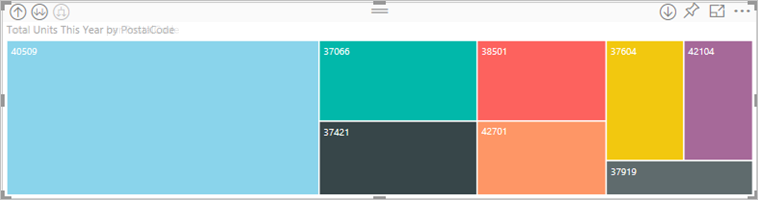

3. Pour remonter d’un niveau, sélectionnez la flèche vers le haut en haut à gauche de la visualisation .

## Descendre dans la hiérarchie pour un champ à la fois
Cette méthode utilise l’icône Descendre dans la hiérarchie qui apparaît en haut à droite de la visualisation elle-même. 

1. Sélectionnez l’icône Descendre dans la hiérarchie pour l’activer . Vous avez maintenant la possibilité de descendre dans la hiérarchie ***un champ à la fois***. 
   
   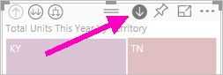

   Si vous n’activez pas la fonctionnalité de descente dans la hiérarchie, le fait de sélectionner un visuel (comme une barre ou une bulle) ne fait pas descendre de niveau, mais effectue à la place un filtrage croisé des autres graphiques sur la page du rapport.

2. Sélectionnez la *feuille* pour **TN**. Votre treemap montre maintenant toutes les villes du Tennessee qui ont un magasin. 

    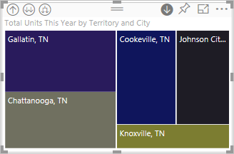

2. À ce stade, vous pouvez continuer à descendre dans la hiérarchie pour Tennesee ou pour une ville particulière du Tennesee, ou bien vous pouvez développer (consultez **Développer tous les champs à la fois** ci-dessous). Continuons à descendre dans la hiérarchie pour un champ à la fois.  Sélectionnez **Knoxville, TN**. Votre treemap montre maintenant le code postal pour votre magasin de Knoxville. 

   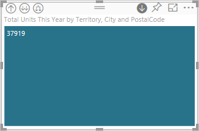

    Notez que le titre change à mesure que vous explorez puis revenez en arrière.  

## Développer tout et développer un champ à la fois
Une treemap qui nous montre uniquement un code postal n’apporte pas beaucoup d’informations.  Développons donc un niveau de la hiérarchie.  

1. Avec la treemap active, sélectionnez l’icône *Développer vers le bas* . Votre treemap montre maintenant les 2 niveaux de notre hiérarchie : le code postal et le nom du magasin. 

    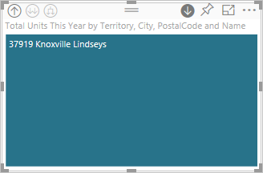

2. Pour afficher l’ensemble des 4 niveaux de hiérarchie des données pour Tennesee, sélectionnez la flèche Monter dans la hiérarchie jusqu’à atteindre le deuxième niveau, **Total units this year by territory and city**, de votre treemap. 

    

3. Vérifiez que la fonctionnalité Descendre dans la hiérarchie est toujours activée , puis sélectionnez l’icône *Développer vers le bas* . Votre treemap montre maintenant des détails supplémentaires : au lieu de montrer seulement la ville et l’état, elle montre maintenant aussi le code postal. 

    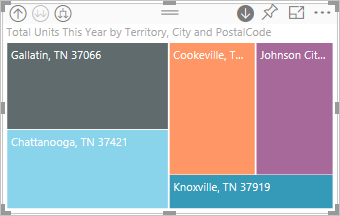

4. Sélectionnez une fois de plus l’icône *Développer vers le bas* pour afficher l’ensemble des 4 niveaux de la hiérarchie des détails pour Tennesee sur votre treemap. Pointez sur une feuille pour voir davantage de détails.

   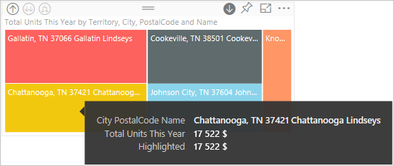

## L’exploration filtre les autres visuels
Quand vous travaillez en mode Exploration, vous devez décider comment les fonctionnalités Descendre dans la hiérarchie et Développer impactent les autres visualisations de la page. 

Par défaut, l’exploration ne filtre pas les autres visuels d’un rapport. Cette fonctionnalité peut cependant être activée dans Power BI Desktop et dans le service Power BI. 

1. Dans Power BI Desktop, sélectionnez l’onglet **Format** et cochez la case pour **Filtrages d’exploration sur les autres visuels**.

    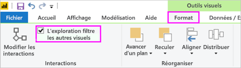

2. Maintenant, quand vous descendez dans la hiérarchie (ou que vous montez dans la hiérarchie ou que vous développez) dans un visuel avec une hiérarchie, cette action filtre les autres visuels de la page. 

    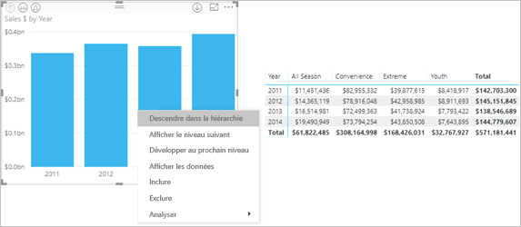

    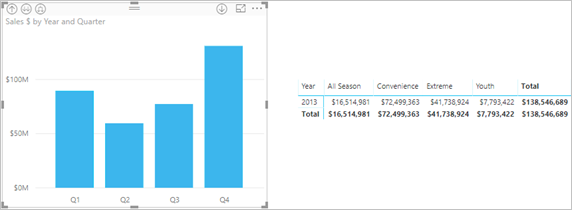

> [!NOTE]
> Pour activer cette option dans le service Power BI, dans la barre de menus de plus haut niveau, sélectionnez **Interactions entre les visuels > Filtrages d’exploration sur les autres visuels**.
>
> 

## Présentation de l’axe de hiérarchie et du groupe de hiérarchie
Vous pouvez considérer l’axe de hiérarchie et le groupe de hiérarchie comme les mécanismes à utiliser pour augmenter et diminuer la granularité des données à afficher. Toutes les données qui peuvent être organisées en catégories et sous-catégories peuvent avoir une hiérarchie. Cela inclut, bien entendu, les dates et les heures.

Vous pouvez créer une visualisation dans Power BI avec une hiérarchie en sélectionnant un ou plusieurs champs de données à ajouter à la zone **Axe** ou la zone **Groupe**, ainsi que les champs de données à examiner dans la zone **Valeurs**. Vous savez si vos données sont hiérarchiques si les icônes du *Mode Exploration* apparaissent en haut à droite et à gauche de votre visualisation. 

Fondamentalement, on peut dire qu’il existe deux types de données hiérarchiques :
- Données de date et d’heure : Si vous avez un champ de données avec un type de données DateTime, vous avez déjà des données hiérarchiques. Power BI crée automatiquement une hiérarchie pour tout champ de données dont les valeurs peuvent être analysées dans une structure [DateTime](https://msdn.microsoft.com/library/system.datetime.aspx). Vous devez uniquement ajouter un champ DateTime à la zone **Axe** ou **Groupe**.
- Données catégoriques : Si vos données sont dérivées de collections avec des sous-collections ou avec des lignes de données qui partagent des valeurs communes, vous avez des données hiérarchiques.

Power BI vous permet de développer les données d’un ou de tous les sous-ensembles. Vous pouvez descendre dans la hiérarchie de vos données pour afficher un seul sous-ensemble par niveau ou pour afficher tous les sous-ensembles simultanément par niveau. Par exemple, vous pouvez explorer une année donnée ou afficher tous les résultats de chaque année à mesure que vous descendez dans la hiérarchie. À l’inverse, vous pouvez monter dans la hiérarchie de la même manière.

Les sections suivantes décrivent une descente dans la hiérarchie de la vue la plus élevée à la vue intermédiaire, puis à la vue la plus basse.

### Données hiérarchiques et données temporelles
Pour cet exemple, reprenez [l’exemple Analyse de la vente au détail](../sample-datasets.md) et créez une visualisation d’histogramme empilé qui examine le **Mois** (axe) par rapport aux **Ventes totales** (valeurs).  

Même si le champ de données Axe est **Mois**, il crée toujours une catégorie **Année** dans la zone **Axe**. C’est parce que Power BI fournit la structure DateTime complète pour toutes les valeurs qu’il lit. En haut de la hiérarchie se trouvent les données de l’année.

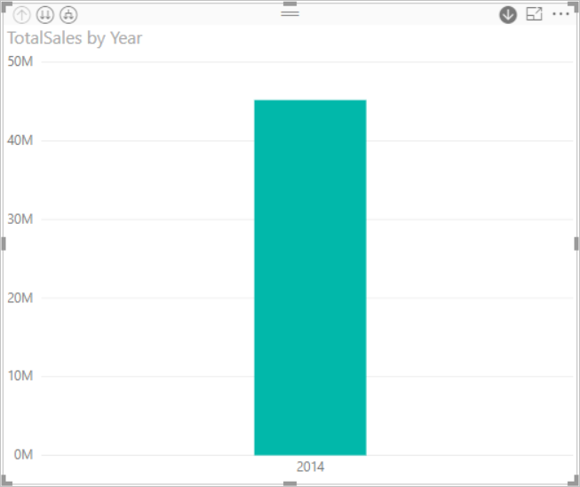

Avec le mode Descendre dans la hiérarchie activé, cliquez sur la barre du graphique pour descendre d’un niveau dans la hiérarchie. Vous voyez trois barres pour les données de trimestre disponibles. Ensuite, à partir des icônes en haut à gauche, choisissez **Développer le niveau inférieur de toute la hiérarchie**. Ensuite, répétez l’opération pour accéder au niveau le plus bas de la hiérarchie, qui présente les résultats de chaque mois.

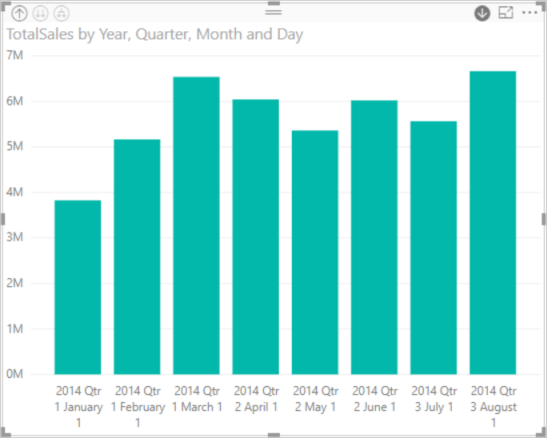

En plus de la visualisation, nous pouvons voir la hiérarchie reflétée dans les données affichées pour chaque rapport. Le tableau suivant montre les résultats de l’action **Afficher les données** dans un rapport qui descend dans la hiérarchie pour un seul mois ou pour tous les mois. 

Notez que les données sont les mêmes pour les rapports annuels et trimestriels, mais une fois que vous descendez dans la hiérarchie jusqu’au niveau de détail spécifié pour **Valeurs**, vous pouvez observer que le rapport pour un seul mois devient plus spécifique et que le rapport pour tous les mois a plus de données.

|Mode Développer|Année|Quarter|Month|Day|
| ---|:---:|:---:|:---:|---|
|À sens unique|||||
|All|||||

### Données de catégorie hiérarchiques
Les données modélisées à partir de collections et de sous-collections sont hiérarchiques. Un bon exemple de ce type de données sont les données de localisation. Prenons une table dans une source de données avec des colonnes Pays, État, Ville et Code postal. Les données qui partagent les mêmes pays, état et ville sont hiérarchiques.

Pour cet exemple, reprenez [l’exemple Analyse de la vente au détail](../sample-datasets.md). Créez une visualisation d’histogramme empilé qui examine le **Total des unités cette année** (valeurs) par **Secteur de vente**, **Ville**, **Code postal** et **Nom** (groupe).  

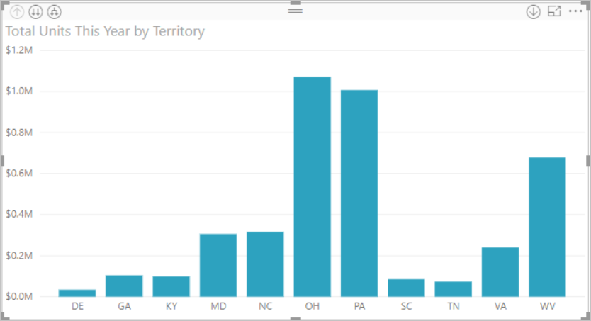

Avec le mode Descendre dans la hiérarchie activé, à partir des icônes en haut à gauche, choisissez **Développer le niveau inférieur de toute la hiérarchie** trois fois de suite.
Vous devez accéder au niveau le plus bas de la hiérarchie, qui affiche les résultats pour le secteur de vente, la ville et le code postal.

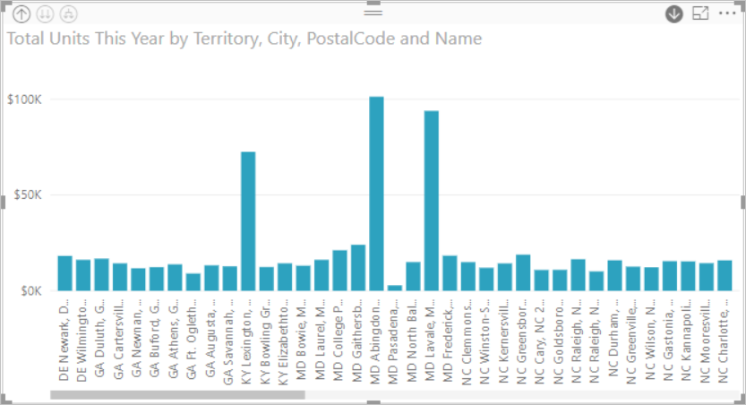

En plus de la visualisation, nous pouvons voir la hiérarchie reflétée dans les données affichées pour chaque rapport. Le tableau suivant montre les résultats de l’action **Afficher les données** dans un rapport qui descend dans la hiérarchie pour un seul secteur de vente ou pour tous les secteurs de vente. Quand vous descendez dans la hiérarchie, vous pouvez observer que le rapport pour un seul secteur de vente devient plus spécifique et que le rapport pour tous les secteurs de vente a plus de données.

| Mode Développer|Territoire|City|Code postal|Nom|
| ---|:---:|:---:|:---:|---|
|À sens unique|||||
|All|||||

## Considérations et limitations
* Si l’ajout d’un champ de date à une visualisation ne crée pas de hiérarchie, c’est peut-être que le champ « date » n’est pas bien enregistré en tant que date. Si vous êtes le propriétaire du jeu de données, ouvrez-le dans la vue *Données* dans Power BI Desktop, sélectionnez la colonne qui contient la date, puis sous l’onglet Modélisation, définissez **Type de données** sur **Date** ou **Date/Heure**. Si le rapport a été partagé avec vous, contactez le propriétaire pour lui demander d’effectuer la modification.  
  
  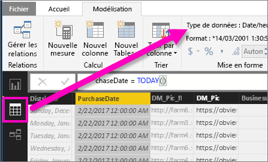

## Étapes suivantes
[Visualisations dans des rapports Power BI](../visuals/power-bi-report-visualizations.md)

[Rapports Power BI](end-user-reports.md)

[Power BI – Concepts de base](end-user-basic-concepts.md)

D’autres questions ? [Posez vos questions à la communauté Power BI](http://community.powerbi.com/)

