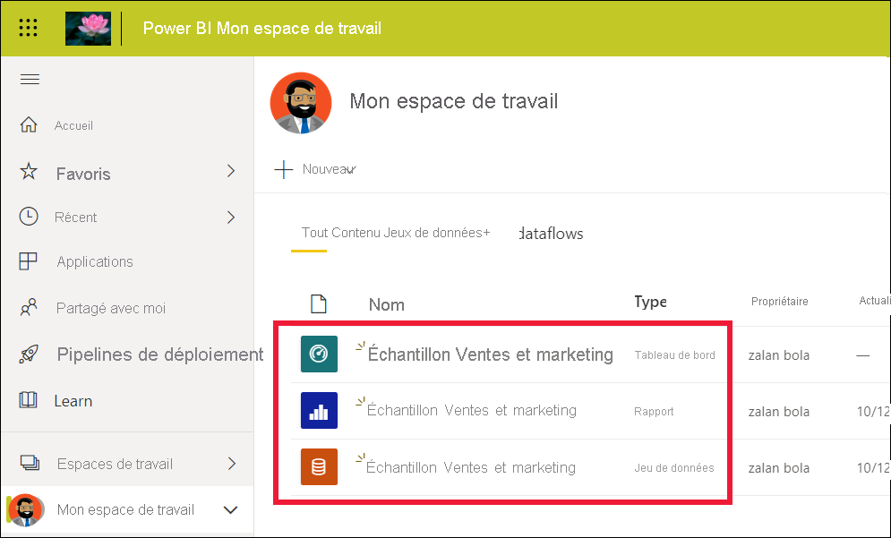

# Démarrage rapide - Découverte du service Power BI

[!INCLUDE [power-bi-service-new-look-include](../includes/power-bi-service-new-look-include.md)]

Maintenant que vous connaissez les [concepts de base de Power BI](end-user-basic-concepts.md), vous êtes prêt à découvrir le **service Power BI**. Comme mentionné dans l’article précédent, les collègues de votre équipe peuvent passer tout leur temps dans **Power BI Desktop**, à combiner des données et créer des rapports, des tableaux de bord et des applications pour d’autres. Ce sont des *concepteurs*. Vous passez peut-être tout votre temps à travailler dans le service Power BI pour afficher et exploiter du contenu créé par d’autres personnes (expérience de **consommation**). Vous êtes un *utilisateur professionnel*. Ce guide de démarrage rapide est destiné aux *utilisateurs professionnels*. 

   
 
## Prérequis

- Si vous n’êtes pas inscrit à Power BI, [inscrivez-vous à un essai gratuit](https://app.powerbi.com/signupredirect?pbi_source=web) avant de commencer.

- Prenez connaissance des [concepts de base du service Power BI](end-user-basic-concepts.md)

- L’affichage du contenu Power BI (rapports, tableaux de bord, applications) créé par les *concepteurs* requiert l’une des deux conditions suivantes :
    - une licence Power BI Pro
    - Votre organisation doit disposer d’un abonnement pour Power BI Premium, et le contenu doit être partagé avec vous à partir d’une capacité Premium.    
    [En savoir plus sur les licences et les abonnements](end-user-license.md).     

    Dans le cadre de ce guide de démarrage rapide, nous n’avons pas besoin que ces conditions soient remplies. Microsoft met à votre disposition des exemples de contenu directement à partir de l’interface du service Power BI. Nous allons utiliser cet exemple de contenu pour découvrir le service Power BI. 

## Ouvrir le service Power BI

Pour commencer, ouvrez le service Power BI (app.powerbi.com). 
1. Si le volet de navigation gauche est réduit, sélectionnez l’icône du volet de navigation  pour le développer. 

1. Dans le coin inférieur gauche, sélectionnez **Obtenir des données**. Vous allez récupérer quelques exemples de données qui vous serviront pendant la visite guidée du service Power BI. Parmi tous les types d’exemples de données à votre disposition pour explorer le service, vous allez utiliser les données sur le marketing et les ventes. 

   

1. Après l’ouverture de l’écran **Obtenir des données**, sélectionnez **Exemples**.

   

1. Sélectionnez **Sales and marketing** > **Connexion**. 

   

5. Le service Power BI installe l’exemple dans **Mon espace de travail**.  **Mon espace de travail** est votre bac à sable privé pour vos initiatives d’apprentissage et d’expérimentation.  Vous êtes la seule personne à pouvoir voir le contenu dans **Mon espace de travail**. L’exemple comprend un tableau de bord, un rapport et un jeu de données. En règle générale, les *utilisateurs professionnels* ne recevront pas de jeux de données, mais cet exemple est conçu pour tous les utilisateurs et en inclut un.

    

    En tant qu’*utilisateur professionnel*, la plupart des contenus partagés avec vous n’incluront pas l’accès direct aux jeux de données sous-jacents. Dans la mesure où les exemples Power BI sont créés pour tous les clients Power BI, les jeux de données sont inclus.   

    Pour en savoir plus sur les exemples, consultez [Obtenir des exemples pour Power BI](../create-reports/sample-datasets.md).

## Afficher du contenu (tableaux de bord et rapports)
Le contenu est organisé dans le contexte d’un espace de travail. Tout utilisateur professionnel dispose au moins d’un espace de travail appelé **Mon espace de travail**. Lorsque vos collègues *concepteurs* partagent du contenu avec vous, vous pouvez vous retrouver avec des espaces de travail supplémentaires.  Par exemple, si un *concepteur* vous attribue des autorisations d’accès à l’un de ses espaces de travail, cet espace de travail s’affichera dans votre site Power BI.  

**Mon espace de travail** stocke tout le contenu qui vous appartient et que vous créez. Considérez-le comme votre zone de travail ou bac à sable personnel pour votre propre contenu. Pour de nombreux *utilisateurs professionnels* Power BI, **Mon espace de travail** reste vide car votre travail n’implique pas la création de nouveau contenu.  Les *utilisateurs professionnels*, par définition, consomment des données créées par d’autres et utilisent ces données pour prendre des décisions commerciales. Si vous êtes amené à créer du contenu, lisez les [articles Power BI destinés aux *créateurs de rapports*](../index.yml).

Un espace de travail est bien plus qu’une simple liste de contenus. Cette page fournit de nombreuses informations sur les tableaux de bord et les rapports de l’espace de travail. Prenez quelques minutes pour identifier le propriétaire du contenu, la date de la dernière actualisation, la sensibilité des données et les approbations, le cas échéant. Sélectionnez **Autres actions (...)** pour afficher une liste d’actions pour le tableau de bord et le rapport.   

Pour plus d’informations, consultez [Espaces de travail](end-user-workspaces.md).

Un espace de travail est également l’un des chemins d’accès à vos données. À partir d’un espace de travail, vous pouvez ouvrir un tableau de bord ou un rapport en le sélectionnant dans la liste.  Vous pouvez pointer sur un tableau de bord ou un rapport et sélectionner l’icône en forme d’étoile pour l’ajouter aux favoris. Si le *concepteur* vous a donné les [autorisations de partage](end-user-shared-with-me.md), vous pouvez également partager à partir d’ici. 

1. Sélectionnez le nom du tableau de bord pour l’ouvrir. Les tableaux de bord sont différents dans le service Power BI et dans Power BI Desktop. [Découvrir les tableaux de bord](end-user-dashboards.md)

    

2. Les actions que vous pouvez effectuer sur un tableau de bord s’affichent dans la barre de menus supérieure.    

    

3. Pointez sur une vignette de tableau de bord, puis sélectionnez **Plus d’options (...)** pour voir les options dont vous disposez pour interagir avec cette vignette.

    

4. Sélectionnez une vignette de tableau de bord pour ouvrir le rapport qui a été utilisé pour créer cette vignette. Le rapport s’ouvre sur la page qui contient le visuel sur la vignette. Ici, nous avons sélectionné la vignette du tableau de bord avec le treemap. Le service Power BI ouvre la page de rapport **YTD Category**.

    

    Les rapports comportent plusieurs sections. À gauche, vous trouverez une liste de pages de rapport, sur lesquelles vous pouvez cliquer. Dans la partie supérieure se trouve la barre de menus qui contient les actions que vous pouvez effectuer avec le rapport.  Les options disponibles dépendent du rôle et des autorisations que le *concepteur* du rapport vous a attribués. Dans la partie droite se trouve le volet **Filtres**. Enfin, le canevas central contient le rapport lui-même. À l’instar du tableau de bord, vous pouvez effectuer des actions pour l’ensemble du rapport, des visuels individuels ou une seule page de rapport. 

    En savoir plus sur les [Rapports Power BI](end-user-reports.md).

## À l’aide du volet de navigation gauche
Le volet de navigation devient plus utile lorsque vos collègues partagent du contenu avec vous. Dans cette section du Guide de démarrage rapide, nous allons mettre l’exemple *Sales & Marketing* de côté et examiner un tableau de bord et un rapport qui appartiennent à un *utilisateur professionnel* Power BI qui a beaucoup de contenu partagé.

1. **La page d’accueil** est la page d’accès par défaut lorsque vous vous connectez au service Power BI. La page d’accueil est un excellent point de départ et une autre façon de naviguer dans votre contenu. Le contenu de la page de démarrage est organisé par éléments favoris, récents, fréquents et mis en avant. La page d’accueil affiche également les espaces de travail et applications les plus récents. Sélectionnez simplement un élément pour l’ouvrir.

    La page Accueil rassemble les outils de recherche et de tri, le volet de navigation et un canevas composé de *cartes* que vous pouvez sélectionner pour ouvrir vos tableaux de bord, rapports et applications. Au début, votre canevas Accueil peut ne pas avoir beaucoup de cartes. Toutefois, cela changera dès que vous commencerez à utiliser Power BI avec vos collègues. Votre canevas d’accueil est également mis à jour avec le contenu et les ressources de formation recommandés.

   

    Pour plus d’informations, consultez [Page d’accueil de Power BI](end-user-home.md)

2. Les éléments **Favoris** et **Récents** ont des flèches. Sélectionnez une flèche pour afficher rapidement les cinq premiers favoris ou les cinq éléments de contenu les plus récemment visités. Dans le menu volant, sélectionnez le contenu à ouvrir. 

   

    Pour afficher la liste complète des favoris ou des éléments récents, sélectionnez le mot ou l’icône. Ces listes de contenu fournissent des détails supplémentaires sur les rapports, applications et tableaux de bord.

    

    Pour plus d’informations, consultez [Récents dans Power BI](end-user-recent.md) et [Favoris dans Power BI](end-user-recent.md).

4. Sélectionnez **Applications** pour afficher toutes les applications qui ont été partagées avec vous ou que vous avez installées. Et sélectionnez **Partagé avec moi** pour afficher les tableaux de bord et les rapports qui ont été partagés avec vous. Dans la mesure où vous commencez à utiliser le service Power BI, ces zones de contenu sont vides. 

    En savoir plus sur les [Applications](end-user-apps.md) et [Partagé avec moi](end-user-shared-with-me.md).

### Rechercher et trier du contenu
Si vous utilisez le service Power BI depuis peu, vous n’avez pas beaucoup de contenu. Mais, si vos collègues en partagent avec vous et que vous téléchargez des applications, vous pouvez vous retrouver avec de longues listes de contenus. C’est à ce moment-là que vous trouverez la recherche et le tri extrêmement utiles.

La recherche est disponible presque partout dans le service Power BI. Repérez simplement la zone de recherche ou l’icône en forme de loupe.    

Dans le champ Rechercher, tapez tout ou partie du nom d’un tableau de bord, d’un rapport, d’un classeur, d’une application ou d’un propriétaire. Power BI effectue une recherche sur l’ensemble de votre contenu.

Vous pouvez également trier du contenu de nombreuses façons. Pointez sur les en-têtes de colonnes et recherchez les flèches indiquant que la colonne peut être triée. Toutes les colonnes ne peuvent pas être triées. 

Ou recherchez **filtres** de recherche près de l’angle supérieur droit de vos listes de contenu. Recherchez rapidement du contenu en sélectionnant le type de contenu, le propriétaire ou tout autre champ disponible.

Pour en savoir plus, consultez [Navigation dans Power BI : rechercher et trier](end-user-search-sort.md).

## Trouver le propriétaire
Nous allons terminer ce guide de démarrage rapide avec un conseil utile. Si vous avez des questions sur un tableau de bord, un rapport ou une application, vous pouvez rechercher les informations du propriétaire. Une fois le contenu ouvert, sélectionnez la liste déroulante du titre pour afficher le propriétaire. Le propriétaire peut être une personne ou un groupe.

## Nettoyer les ressources
Maintenant que vous avez terminé ce guide de démarrage rapide, vous pouvez, si vous le souhaitez, supprimer le tableau de bord, le rapport et le jeu de données de l’exemple.

1. Ouvrez le service Power BI (app.powerbi.com) et connectez-vous.    
2. Ouvrez la page d’accueil de Power BI, faites défiler la liste et sélectionnez **Mon espace de travail**.      

3. Pointez sur le tableau de bord, le rapport ou le jeu de données, puis sélectionnez **Plus d’options (...)**  > **Supprimer**. Répétez l’opération jusqu’à ce que les trois éléments soient supprimés.

    

## Étapes suivantes

> [!div class="nextstepaction"]
> [Mode Lecture dans le service Power BI](end-user-reading-view.md)
