# Démarrage rapide - Découverte du service Power BI

Maintenant que vous connaissez les concepts de base de Power BI, vous êtes prêt à découvrir le **service Power BI**. Comme mentionné précédemment, une personne de votre équipe peut passer tout son temps à travailler dans **Power BI Desktop**, afin de combiner les données et créer des rapports pour d’autres. De votre côté, vous passez peut-être tout votre temps à travailler dans le service Power BI pour afficher et exploiter du contenu créé par d’autres personnes (expérience de **consommation**). Dans ce guide de démarrage rapide, vous allez importer des exemples de données, puis vous servir de ces données pour apprendre à utiliser le service Power BI. 
 
## Conditions préalables

- Si vous n’êtes pas inscrit à Power BI, [inscrivez-vous à un essai gratuit](https://app.powerbi.com/signupredirect?pbi_source=web) avant de commencer.

- Prenez connaissance des [concepts de base du service Power BI](end-user-basic-concepts.md)

## Ouvrir le service Power BI et obtenir des données
Vous allez récupérer quelques exemples de données qui vous serviront pendant la visite guidée du service Power BI. Parmi tous les types d’exemples de données à votre disposition pour explorer le service, vous allez utiliser les données sur les magasins de détail.    
1. Ouvrez app.powerbi.com et sélectionnez le lien des **exemples**. 

    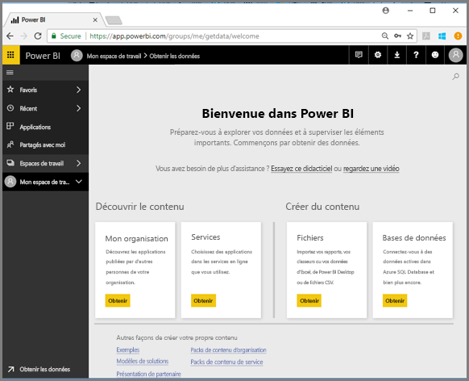

2. Sélectionnez **Exemple Analyse de la vente au détail > Se connecter**.

    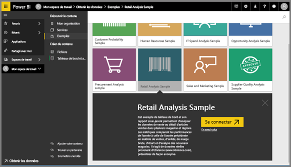

    Le service Power BI importe l’exemple et affiche le tableau de bord. Les tableaux de bord sont différents dans le service Power BI et dans Power BI Desktop. L’exemple inclut également un rapport et un jeu de données, que vous découvrirez plus tard.

    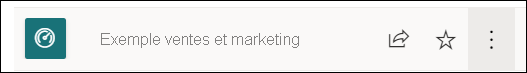

Suivez Amanda dans une visite guidée de l’expérience de navigation du service Power BI.  Suivez ensuite les instructions détaillées sous la vidéo pour explorer par vous-même.

<iframe width="560" height="315" src="https://www.youtube.com/embed/G26dr2PsEpk" frameborder="0" allowfullscreen></iframe>

## Affichage du contenu (tableaux de bord, rapports, classeurs, jeux de données, espaces de travail, applications)
Commençons par examiner comment le contenu de base (tableaux de bord, rapports, jeux de données, classeurs) est organisé. Le contenu s’affiche dans le contexte d’un espace de travail. Pour le moment, vous voyez un seul espace de travail, appelé **Mon espace de travail**. En général, les consommateurs n’ont pas besoin d’autres espaces de travail. Mon espace de travail stocke tout le contenu qui vous appartient. Considérez-le comme votre zone de travail ou bac à sable personnel pour votre propre contenu. Mon espace de travail est l’emplacement où l’exemple Analyse de la vente au détail que vous venez de télécharger est enregistré. 

Dans Mon espace de travail, votre contenu est organisé en 4 onglets : Tableaux de bord, Rapports, Classeurs et Jeux de données.

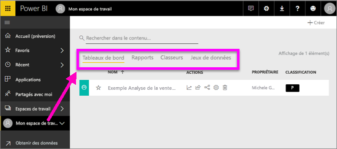

Sélectionnez un espace de travail dans le volet de navigation de gauche. Les onglets correspondant au contenu associé (tableaux de bord, rapports, classeurs, jeu de données) occupent la zone de dessin de Power BI à droite.

Si vous êtes un nouvel utilisateur, vous voyez seulement **Mon espace de travail**.

Ces onglets (les *vues du contenu*) présentent des informations sur le contenu ainsi que les actions possibles sur ce contenu.  Par exemple, sous l’onglet Tableaux de bord, vous pouvez ouvrir un tableau de bord, effectuer une recherche, trier, et bien plus encore.

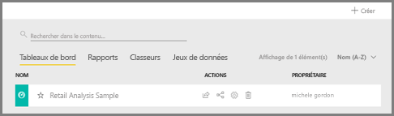

Ouvrez le tableau de bord en sélectionnant son nom.

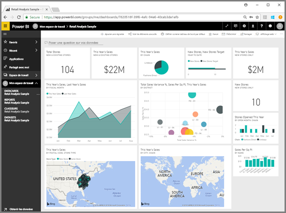

## Ajouter un rapport et un tableau de bord aux favoris
Les**Favoris** vous permettent d’accéder rapidement au contenu dont vous avez le plus besoin.  

1. Quand le tableau de bord est ouvert, sélectionnez **Ajouter un favori** dans l’angle supérieur droit.
   
   
   
   **Ajouter un favori** devient **Retirer des favoris** et l’étoile devient jaune.
   
   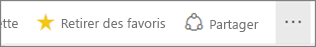

2. Pour afficher la liste de tous les contenus que vous avez ajoutés aux Favoris, dans le volet de navigation de gauche, sélectionnez la flèche à droite de **Favoris**. Étant donné que le volet de navigation de gauche est une fonctionnalité permanente du service Power BI, vous avez accès à cette liste quel que soit l’endroit où vous vous trouvez dans ce service.
   
    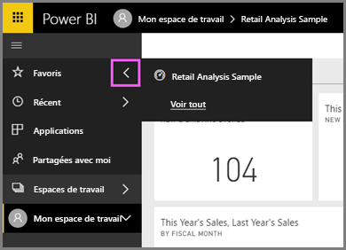
   
    Pour le moment, il n’y a qu’un seul favori. Les favoris peuvent désigner des tableaux de bord, des rapports ou des applications.  

1. Vous pouvez aussi ajouter un tableau de bord ou un rapport dans les Favoris à partir de l’onglet d’affichage de contenu **Tableaux de bord** ou **Rapports**.  Ouvrez l’onglet **Rapports** et sélectionnez l’icône étoile à gauche du nom du rapport.
   
   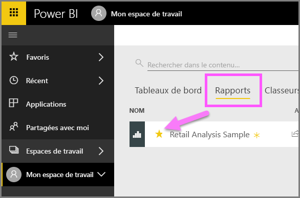

3. Ouvrez le **volet** *Favoris* en sélectionnant **Favoris** dans le volet de navigation de gauche ou en sélectionnant l’icône étoile .
   
   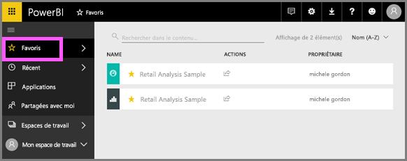
   
   Vous voyez maintenant deux favoris (un tableau de bord et un rapport). À partir de là, vous pouvez ouvrir un contenu, rechercher du contenu, retirer un contenu des favoris ou partager du contenu avec vos collègues.

4. Sélectionnez le nom du rapport pour l’ouvrir dans l’éditeur de rapport.

    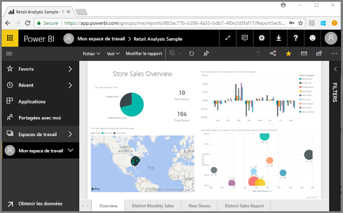

Pour en savoir plus, consultez [Favoris](end-user-favorite.md).

## Rechercher votre contenu le plus récent

1. Comme avec les favoris, affichez rapidement le contenu utilisé le plus récent depuis n’importe où dans le service Power BI en sélectionnant la flèche à côté de **Récent** dans le volet de navigation de gauche.

   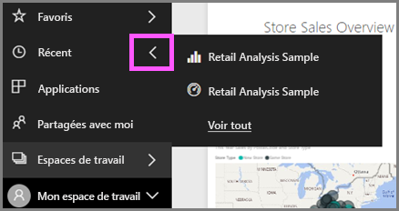

    Dans le menu volant, sélectionnez le contenu à ouvrir.

2. Parfois, vous ne voulez pas juste ouvrir du contenu récent, mais afficher des informations ou effectuer une autre action, comme afficher des insights ou exporter du contenu dans Excel. Pour effectuer ces actions, ouvrez le volet **Récents** en sélectionnant **Récent** ou son icône dans le volet de navigation de gauche. Si vous aviez plusieurs espaces de travail, cette liste inclurait le contenu de l’ensemble de vos espaces de travail.

   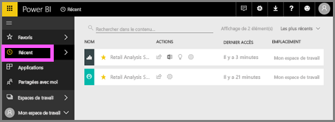

Pour en savoir plus, consultez [Récents dans Power BI](end-user-recent.md)

### Rechercher et trier du contenu
La vue du contenu facilite la recherche, le filtrage et le tri du contenu. Pour rechercher un tableau de bord, un rapport ou un classeur, tapez dans la zone de recherche. Power BI filtre uniquement le contenu qui contient votre chaîne de recherche.

Étant donné que vous utilisez un seul exemple, la recherche et le tri sont inutiles.  Toutefois, les fonctionnalités de recherche et de tri sont très utiles quand vous avez de longues listes de tableaux de bord, de rapports, de classeurs et de jeux de données.

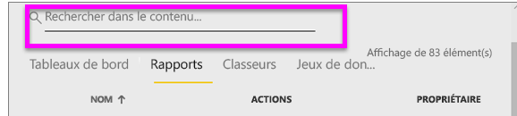

Vous pouvez également trier le contenu par nom ou propriétaire. Notez la flèche vers le haut à droite de **Nom**. Nous trions actuellement 83 éléments par ordre alphabétique par nom, dans l’ordre croissant. Pour utiliser l’ordre de tri décroissant, sélectionnez **Nom**. La flèche vers le haut est remplacée par une flèche vers le bas.

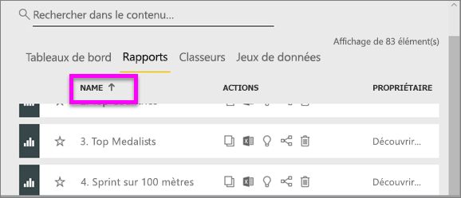

Toutes les colonnes ne peuvent pas être triées. Placez le curseur sur les en-têtes de colonne pour savoir lesquelles peuvent être triées.

Pour en savoir plus, consultez [Navigation dans Power BI : rechercher et trier](end-user-search-sort.md).

## Nettoyer les ressources
Maintenant que vous avez suivi ce guide de démarrage rapide, vous pouvez si vous le souhaitez supprimer le rapport, le jeu de données et le tableau de bord de l’exemple Retail Analysis (Analyse des ventes au détail).

1. Ouvrez le service Power BI (app.powerbi.com) et connectez-vous.    
2. Dans le volet de navigation de gauche, sélectionnez **Espaces de travail > Mon espace de travail**.  
    Vous avez noté l’étoile jaune indiquant que c’est un favori ?    
3. Sous l’onglet **Tableaux de bord**, sélectionnez l’icône **Supprimer** de la corbeille à côté du tableau de bord Analyse des ventes au détail.    

    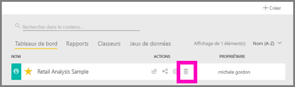

4. Sélectionnez l’onglet **Rapports** et procédez de la même façon pour le rapport Analyse des ventes au détail.
1. Sélectionnez l’onglet **Jeux de données** et procédez de la même façon pour le jeu de données Retail Analysis (Analyse de la vente au détail).

## Étapes suivantes

> [!div class="nextstepaction"]
> [Mode Lecture dans le service Power BI](end-user-reading-view.md)