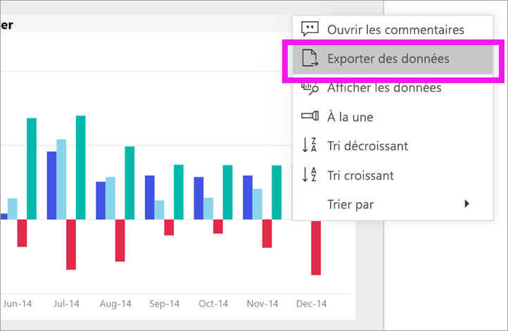

# Exporter des données à partir de visual
Si vous souhaitez afficher les données qui sont utilisées pour créer un élément visuel, [vous pouvez afficher ces données dans Power BI](end-user-show-data.md) ou exporter ces données vers Excel. La possibilité d’exporter les données nécessite un type ou une licence et modifier les autorisations pour le contenu. Si vous ne pouvez pas exporter, contactez votre administrateur Power BI. 

## À partir d’un élément visuel sur un tableau de bord Power BI

1. Démarrer sur un tableau de bord Power BI. Ici, nous utilisons le tableau de bord à partir de la ***exemple vente et Marketing*** application. Vous pouvez [télécharger cette application à partir de AppSource.com](https://appsource.microsoft.com/en-us/product/power-bi/microsoft-retail-analysis-sample.salesandmarketingsample-preview?flightCodes=e2b06c7a-a438-4d99-9eb6-4324ce87f282).

    

2. Placez le curseur sur un élément visuel pour afficher les points de suspension (...) et cliquez pour afficher le menu action.

    

3. Sélectionnez **exporter vers Excel**.

4. Que se passe-t-il ensuite varie sur navigateur que vous utilisez. Vous pouvez être invité à enregistrer le fichier ou vous pouvez voir un lien vers le fichier exporté en bas du navigateur. 

    

5. Ouvrez le fichier dans Excel.  

    

## À partir d’un visuel dans un rapport
Vous pouvez exporter des données à partir d’un visuel dans un rapport en tant que .csv ou .xlsx (Excel) format. 

1. Dans un tableau de bord, sélectionnez une vignette pour ouvrir le rapport sous-jacent.  Dans cet exemple, nous sélectionnons le même visuel comme ci-dessus, *Total unités YTD Var %* . 

    

    Dans la mesure où cette vignette a été créée à partir de la *exemple vente et Marketing* rapport, qui est le rapport s’ouvre. Et bien, il s’ouvre à la page qui contient l’élément visuel mosaïque sélectionnée. 

2. Sélectionnez la vignette dans le rapport. Notez que le **filtres** volet à droite. Cet élément visuel a des filtres appliqués. Pour en savoir plus sur les filtres, consultez [utiliser des filtres dans un rapport](end-user-report-filter.md).

    

3. Sélectionnez les ellipses, dans le coin supérieur droit de la visualisation. Choisissez **exporter des données**.

    

4. Vous verrez des options d’exportation des données de synthèse ou sous-jacent. Si vous utilisez le *exemple vente et marketing* app, **données sous-jacentes** va être désactivé. Mais vous pouvez rencontrer des rapports où les deux options sont activées. Voici une explication de la différence.

    **Données résumées**: sélectionnez cette option si vous voulez exporter les données de ce que vous voyez dans le visuel.  Ce type d’exportation vous montre uniquement les données qui a été utilisées pour créer le visuel. Si l’élément visuel a des filtres appliqués, les données que vous exportez seront également être filtrées. Par exemple, pour cet élément visuel, l’exportation inclut uniquement les données pour 2014 et la région centrale et seules les données de quatre des fabricants : VanArsdel Natura, Aliqui et Prirum.
  

    **Données sous-jacentes**: sélectionnez cette option si vous voulez exporter les données de ce que vous voyez dans le visuel **plus** des données supplémentaires à partir du jeu de données sous-jacent.  Cela peut inclure des données contenues dans le jeu de données, mais pas utilisées dans le visuel. 

    

5. Que se passe-t-il ensuite varie sur navigateur que vous utilisez. Vous pouvez être invité à enregistrer le fichier ou vous pouvez voir un lien vers le fichier exporté en bas du navigateur. 

    

7. Ouvrez le fichier dans Excel. Comparer la quantité de données exportées vers les données que nous avons exportée à partir du même élément visuel sur le tableau de bord. La différence est que cette exportation inclut **données sous-jacentes**. 

    

