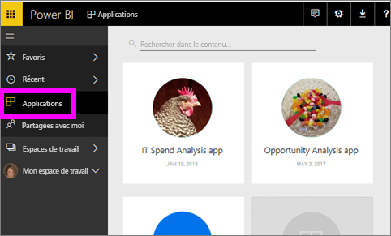
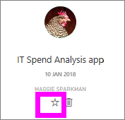
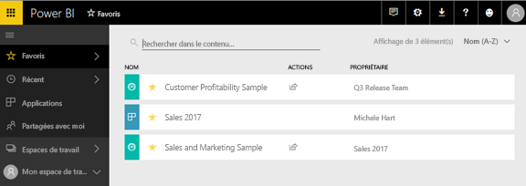
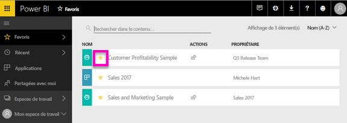

# Tableaux de bord, rapports et applications favoris dans le service Power BI
Lorsque vous ajoutez du contenu un *favori*, vous serez en mesure d’y accéder rapidement à partir de la **favoris** liste de contenu et à partir de **Power BI accueil**  >   **Favoris et fréquents**.  Les favoris sont généralement contenus que vous consultez le plus souvent et sont identifiés avec une étoile jaune.

   

   

Vous pouvez également sélectionner un tableau de bord unique comme un [proposées du tableau de bord](end-user-featured.md) dans le service Power BI.

## Ajouter un tableau de bord ou un rapport aux *favoris*

1. Ouvrez un tableau de bord ou un rapport que vous utilisez souvent. Chaque contenu partagé avec vous peut être un *favori*.

2. Dans le ruban supérieur du service Power BI, sélectionnez **favori** ou l’étoile  icône.
   
   
   
   Vous pouvez également comme favori un tableau de bord ou un rapport à partir de n’importe quel endroit, vous voyez l’icône d’étoile, comme accueil, récents, applications et partagé avec moi. 
   
   

## Ajouter une application aux *favoris*

1. Dans le volet de navigation, sélectionnez **applications**.

   

2. Pointez sur une application pour afficher plus de détails.  Sélectionnez l’icône en forme d’étoile   pour l’ajouter aux favoris.
   
   

## Utilisation de *Favoris*
1. Pour accéder à vos favoris, sélectionnez la flèche à droite de **favoris**.  Vous pouvez sélectionner ici un favori pour l’ouvrir. Seuls cinq favoris sont répertoriés (par ordre alphabétique). Si vous avez plus de cinq, sélectionnez **afficher tout** pour ouvrir les contenu la liste des Favoris (voir #2, ci-dessous). 
   
   
2. Pour voir **tous les** le contenu que vous avez ajoutés aux Favoris, dans le volet de navigation, sélectionnez **favoris** ou favoris  icône.  
   
    
   
   À ce stade, vous pouvez effectuer une action : ouvrir, identifier les propriétaires et même partager avec vos collègues.

## Retirer du contenu des favoris
Vous n’utilisez plus souvent un rapport ?  Vous pouvez le retirer des favoris. Quand vous retirez du contenu de la liste des favoris, il est retiré de vos favoris mais pas de Power BI.

1. Dans le volet de navigation de gauche, sélectionnez **Favoris** pour ouvrir l’écran **Favoris**.
   
   
2. Sélectionnez l’étoile jaune en regard du contenu à retirer des favoris.

> [!NOTE]
> Vous pouvez également retirer un tableau de bord, un rapport ou une application des favoris. Pour cela, il vous suffit d’ouvrir l’élément en question et de désélectionner l’icône jaune.   
> 
> 
## Considérations et limitations
À l’heure actuelle, vous pouvez ajouter aux Favoris d’une application et ce automatiquement favoris tous les rapports et tableaux de bord pour cette application. Il n’est pas possible de favoris application individuelle ou tableaux de bord. 

## Étapes suivantes
[Power BI – Concepts de base](end-user-basic-concepts.md)

D’autres questions ? [Posez vos questions à la communauté Power BI](http://community.powerbi.com/)

