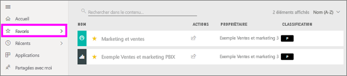
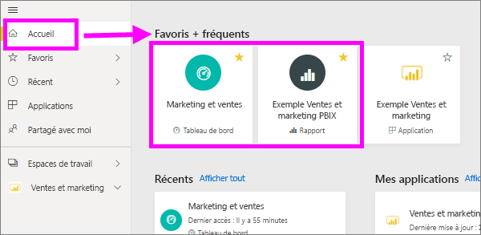
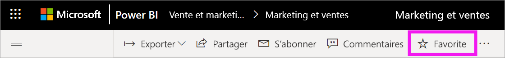
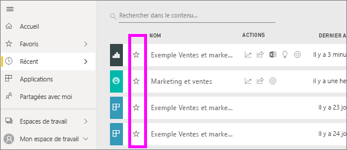
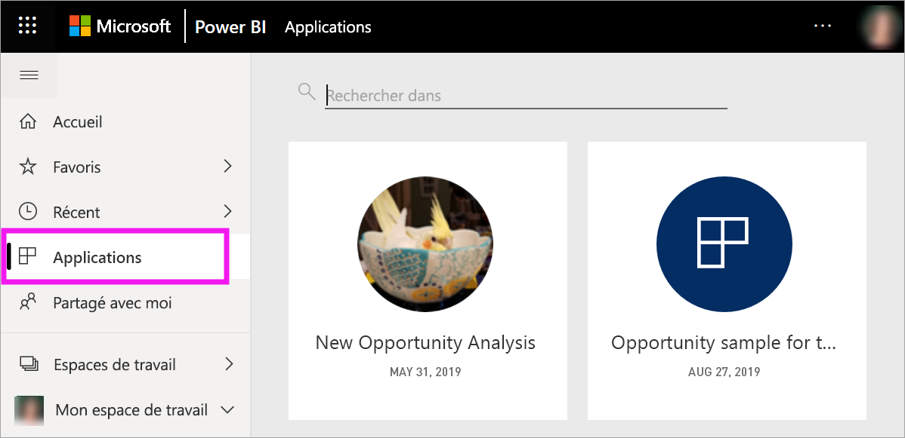
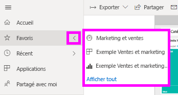
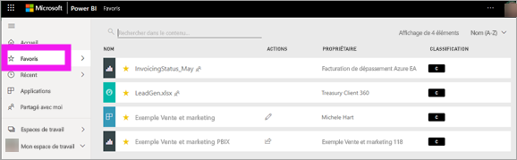
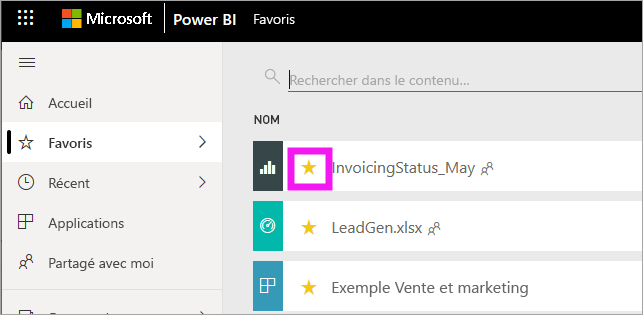

# Tableaux de bord, rapports et applications favoris dans le service Power BI
Quand vous ajoutez du contenu à vos *Favoris*, vous pouvez y accéder rapidement à partir de la liste de contenus des **Favoris** ainsi qu’en accédant à **Accueil Power BI** > **Favoris + fréquents**. Les favoris sont généralement le contenu que vous consultez le plus souvent et qui est signalé par une étoile.

   

   

Dans le service Power BI, vous pouvez également sélectionner un tableau de bord comme [Tableau de bord par défaut](end-user-featured.md).

## Ajouter un tableau de bord ou un rapport aux favoris

1. Ouvrez un tableau de bord ou un rapport que vous utilisez souvent. Chaque contenu partagé avec vous peut être un favori.

2. Dans la barre de menus du haut du service Power BI, sélectionnez **Favori** ou l’icône en forme d’étoile .
   
   
   
   Vous pouvez également afficher un tableau de bord ou un rapport à partir de n’importe quel emplacement signalé par une étoile (Accueil, Récents, Applications et Partagé avec moi). 
   
   

## Ajouter une application aux favoris

1. Dans le volet de navigation, sélectionnez **Applications**.

   

2. Pointez sur une application pour afficher plus de détails. Sélectionnez l’icône en forme d’étoile  pour l’ajouter aux favoris.
   
   

## Utiliser les Favoris
1. Pour accéder aux favoris, sélectionnez la flèche de menu volant située à droite de **Favoris**. Vous pouvez sélectionner ici un favori pour l’ouvrir. Jusqu’à cinq favoris sont listés par ordre alphabétique. Si vous en avez plus de cinq, sélectionnez **Afficher tout** pour ouvrir la liste de contenus de Favoris. 
   
   
2. Pour voir tous les contenus que vous avez ajoutés aux favoris, dans le volet de navigation, sélectionnez **Favoris** ou l’icône Favoris . 
   
    
   
   À partir d’ici, vous pouvez effectuer différentes actions. Vous pouvez ouvrir un favori, identifier les propriétaires et même partager des favoris avec vos collègues.

## Retirer du contenu des favoris
Si vous n’utilisez plus un rapport aussi souvent qu’avant, vous pouvez le retirer des favoris. Quand vous retirez du contenu des favoris, il est retiré de votre liste Favoris, mais pas de Power BI.

1. Dans le volet de navigation, sélectionnez **Favoris** pour ouvrir l’écran **Favoris**.
   
   
2. Sélectionnez l’étoile jaune en regard du contenu que vous voulez retirer des favoris.

> [!NOTE]
> Vous pouvez également retirer des favoris un tableau de bord, un rapport ou une application. Ouvrir simplement l’élément et désélectionnez l’icône jaune. 
> 
> 
## Considérations et limitations
À l’heure actuelle, vous pouvez marquer une application comme favorite et permettre à tous les rapports et tableaux de bord qu’elle contient de devenir eux aussi des favoris. Il n’est pas possible de mettre dans les favoris un rapport ou un tableau de bord individuel d’une application. 

## Étapes suivantes
- [Power BI : Concepts de base](end-user-basic-concepts.md)
- D’autres questions ? Essayez la [communauté Power BI](https://community.powerbi.com/).

