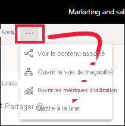
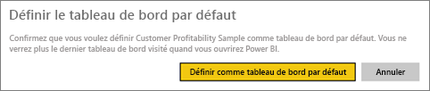

# Tableaux de bord par défaut dans le service Power BI
## Créer un tableau de bord par défaut
La plupart d’entre nous ont un tableau de bord que nous consultons plus souvent que tous les autres.  Cela peut être le tableau de bord que nous utilisons pour gérer votre entreprise, ou un tableau de bord contenant un groupement de vignettes de différents tableaux de bord et rapports.

Lorsque vous sélectionnez un tableau de bord en tant que tableau de bord *par défaut*, chaque fois que vous ouvrez le service Power BI, celui-ci s’ouvre en affichant ce tableau de bord.  

Vous pouvez également sélectionner plusieurs tableaux de bord et les ajouter aux *favoris*. Consultez [Tableau de bord favoris](end-user-favorite.md).

> [!NOTE] 
>Ce didacticiel s’applique au service Power BI, mais pas à Power BI Desktop.

Si vous n’avez pas encore un tableau de bord par défaut, Power BI s’ouvre en affichant le dernier tableau de bord que vous avez utilisé.  

### Pour définir un tableau de bord **par défaut**
Regardez Amanda créer un tableau de bord par défaut, puis suivez les instructions sous la vidéo pour essayer par vous-même.

<iframe width="560" height="315" src="https://www.youtube.com/embed/G26dr2PsEpk" frameborder="0" allowfullscreen></iframe>

1. Ouvrez le tableau de bord que vous souhaitez définir comme tableau de bord *par défaut*. 
2. Dans la barre de menus supérieure, vous voyez l’option **Définir comme tableau de bord par défaut** ou simplement l’icône Définir comme tableau de bord par défaut . Sélectionnez l’une des deux.
   
    
3. Confirmez votre sélection.
   
    

## Modifier le tableau de bord par défaut
Bien sûr, si vous changez d’avis par la suite, vous pouvez définir un nouveau tableau de bord comme tableau de bord par défaut.

1. Suivez les étapes 1 et 2 ci-dessus.
   
    
2. Sélectionnez **Définir comme tableau de bord par défaut**. Désactiver un tableau de bord par défaut ne le supprime pas de votre espace de travail.  
   
    

## Supprimer le tableau de bord par défaut
Si vous ne souhaitez pas qu’un tableau de bord s’affiche par défaut, voici comment annuler la sélection d’un tableau de bord par défaut.

1. Ouvrez le tableau de bord actuellement défini par défaut.
2. Dans la barre de menus supérieure, sélectionnez **Désactiver le tableau de bord par défaut**.
   
    

À présent, Power BI s’ouvre en affichant le dernier tableau de bord que vous avez utilisé.  

## Étapes suivantes
[Ajouter un tableau de bord aux favoris](end-user-favorite.md)

D’autres questions ? [Posez vos questions à la communauté Power BI](http://community.powerbi.com/)

