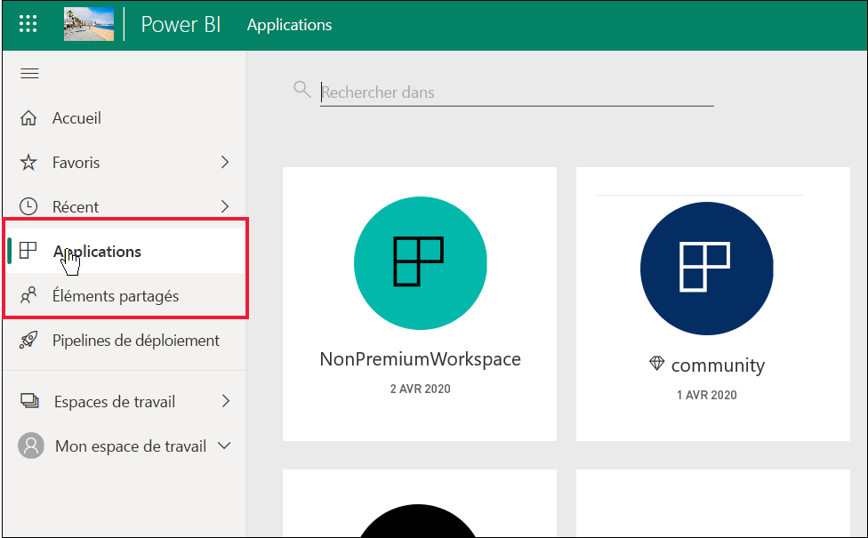
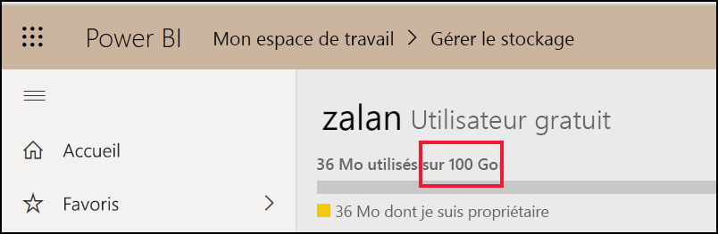
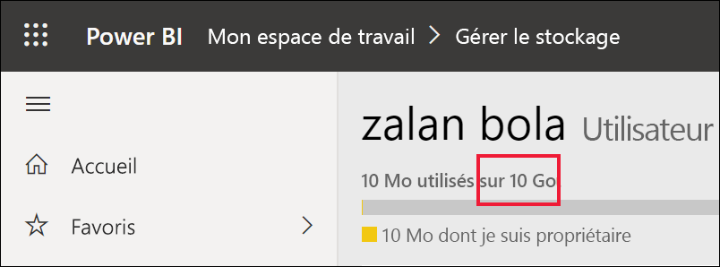

# Liste des fonctionnalités de Power BI pour les *consommateurs* et autres personnes bénéficiant de licences gratuites

[!INCLUDE[consumer-appliesto-ynnn](../includes/consumer-appliesto-ynnn.md)]

En tant que *consommateur*, vous utilisez le service Power BI pour explorer des rapports et des tableaux de bord afin de prendre des décisions métier. Ces rapports et tableaux de bord sont créés par des *concepteurs* qui ont des licences *Pro* Power BI. Les utilisateurs Pro ont la possibilité de partager du contenu avec leurs collègues, et de contrôler ce que ceux-ci peuvent et ne peuvent pas faire avec ce contenu. Parfois, les concepteurs partagent du contenu en vous envoyant des liens et, parfois le contenu est installé automatiquement et s’affiche dans Power BI sous **Applications** ou **Partagé avec moi**.

Les concepteurs peuvent partager du contenu de nombreuses façons différentes. Cet article étant destiné aux *consommateurs* Power BI, il décrit uniquement comment ceux-ci reçoivent et interagissent avec le contenu. Pour plus d’informations sur d’autres façons de partager du contenu, consultez [Moyens de partager votre travail dans Power BI](../service-how-to-collaborate-distribute-dashboards-reports.md).

Dans l’[article précédent](end-user-license.md), vous avez appris que ce que vous pouvez faire avec les tableaux de bord, les rapports et les applications (contenu) dans le service Power BI dépend de trois choses : vos licences, vos rôles et autorisations ainsi que l’emplacement de stockage du contenu.

Cet article répertorie les fonctionnalités du service Power BI qui sont à la disposition des *consommateurs* comme vous. Par définition, les *consommateurs* utilisent une licence gratuite pour travailler dans le service Power BI (pas dans Power BI Desktop) et sont membres d’organisations qui bénéficient d’une capacité Premium.

<art>

## Aperçu rapide de la terminologie
Passons en revue certains concepts de Power BI avant de dresser la liste des fonctionnalités. Il s’agit d’un rapide coup d’œil ; si vous avez besoin de plus de détails, consultez [Licences pour les consommateurs](end-user-license.md) ou [Concepts de base de Power BI](end-user-basic-concepts.md).

### Espaces de travail et rôles
Il existe deux types d’espaces de travail : **Mon espace de travail** et les espaces de travail d’application. Vous êtes le seul utilisateur à avoir accès à **Mon espace de travail**. La collaboration et le partage exigent que les *concepteurs* de contenu, qui ont des licences Pro, utilisent un espace de travail d’application. 

Dans les espaces de travail d’application, des *rôles* sont attribués par les concepteurs pour gérer qui peut faire quoi dans cet espace de travail. Le rôle de **Lecteur** est attribué aux *consommateurs*. 

### Capacité Premium
Quand une organisation dispose d’un abonnement de capacité Premium, les administrateurs et les utilisateurs Pro peuvent attribuer des espaces de travail à la *capacité dédiée*. Un espace de travail dans une capacité dédiée est un espace où les utilisateurs Pro peuvent partager et collaborer avec des utilisateurs gratuits sans que ces derniers aient besoin d’une licence Pro. Au sein de ces espaces de travail, les utilisateurs gratuits disposent d’autorisations élevées (voir la liste ci-dessous). 

### Licences 
Chaque utilisateur du service Power BI a une licence gratuite ou une licence Pro. *Les consommateurs* disposent de licences gratuites.

- **Licence gratuite** : généralement attribuées aux *consommateurs* au sein d’une organisation (voir la première image ci-dessous). Également attribuée à toute personne qui s’inscrit au service Power BI en tant qu’individu et qui veut essayer le [service Power BI en mode autonome](../service-self-service-signup-for-power-bi.md) (voir deuxième image ci-dessous). 

    

    En tant qu’utilisateur gratuit, être membre d’une organisation disposant d’une capacité Premium est ce qui vous donne de super pouvoirs. Tant que leurs collègues Pro utilisent des espaces de travail de capacité Premium pour partager du contenu, les utilisateurs gratuits peuvent voir et collaborer avec ces collègues Pro.  **Ainsi, l’utilisateur gratuit devient un *consommateur* Power BI, avec la capacité à recevoir et à partager du contenu pour prendre des décisions commerciales.** 
 
    

   

## Liste des fonctionnalités de Power BI pour les *consommateurs* et les utilisateurs gratuits
Le graphique suivant identifie les tâches pouvant être effectuées par un *consommateur* qui interagit avec le contenu dans une capacité Premium et dans une capacité partagée.    

La première colonne représente un utilisateur gratuit travaillant avec du contenu dans **Mon espace de travail**. Cet utilisateur ne peut pas collaborer avec ses collègues dans le service Power BI. Ses collègues ne peuvent pas partager directement du contenu avec cet utilisateur, et cet utilisateur ne peut pas partager à partir de **Mon espace de travail**. 

La deuxième colonne représente un *consommateur*.  Un consommateur :

- dispose d’une licence utilisateur gratuite.
- fait partie d’une organisation disposant d’un abonnement de capacité Premium.
- Reçoit du contenu (applications, tableaux de bord, rapports) de la part d’utilisateurs Pro qui partagent ce contenu à l’aide d’espaces de travail d’application dans une capacité dédiée.
- dispose du rôle de **Lecteur** pour ces espaces de travail d’application. 

### Légende
  La fonctionnalité est disponible dans le scénario actuel    
  La fonctionnalité n’est pas disponible dans le scénario actuel    
 ****  La disponibilité de la fonctionnalité est limitée à **Mon espace de travail**. Le contenu de **Mon espace de travail** est destiné à l’usage personnel du propriétaire et ne peut pas être partagé ou affiché par une autre personne dans Power BI    
 \*  L’accès à cette fonctionnalité peut être activé ou désactivé par un utilisateur Pro ou un administrateur    
   

### Liste des fonctionnalités

|Fonctionnalités   | Scénario 1 : utilisateur gratuit Power BI qui n’a pas accès au contenu hébergé dans une capacité dédiée.    | Scénario 2 : utilisateur gratuit Power BI disposant d’autorisations de **Lecteur** pour le contenu stocké dans une capacité dédiée. Cette personne est un *consommateur* Power BI. |
|---|---|---|
|**Applications** 
|S’installe automatiquement |  | *| 
|Ouvrir |  |   | 
|Favori |  |   |
 |Modifier, mettre à jour, repartager, republier |  |   |
 |Créer une application |  |   |
 |AppSource : télécharger et ouvrir |   | | 
|Magasin de l’organisation : télécharger et ouvrir|  |  |
 |**Espaces de travail d’application**
| Créer, modifier ou supprimer un espace de travail ou du contenu  |   | |
|Ajouter des approbations |   | | 
|Ouvrir et afficher  |   |    | 
| Lire les données stockées dans les flux de données des espaces de travail | ||
|**Tableaux de bord**
|Recevoir, afficher et interagir avec les tableaux de bord des collègues |  |    | 
| Ajouter des alertes à des vignettes  |   |    | 
| Afficher et répondre aux commentaires des autres utilisateurs : ajouter vos propres commentaires  |   |  *  | 
| Enregistrer une copie |  | | 
|Copier un visuel en tant qu’image ? | ||
|Créer, modifier, mettre à jour, supprimer |  | | 
|Exporter une vignette vers Excel | | |
|Favori || |
|Caractéristique | ||
|Modes Plein écran et Focus | | |
|Recherche globale |* |* |
|Insights sur les vignettes |     | *|
|  Q&R : utiliser sur le tableau de bord  |* |* |
|Q&R : ajouter des questions proposées et enregistrées |   | |
|Q&R : consulter les questions posées |   | |  
|Inspecteur des performances |  | |
|Épingler des vignettes à partir de Q&R ou des rapports |  | | 
|Imprimer |* |* |
|Actualiser |  | | 
|Repartager |   | | 
|S’abonner |* |*  |
|Abonner d’autres personnes |   | | 
|**Groupes de données**
|  Ajouter, supprimer, modifier  |    |   |   
| Créer un rapport dans un autre espace de travail à partir d’un jeu de données de cet espace de travail |   | |  
|  Insights sur les jeux de données  |   || 
|Planifier l’actualisation |  || 
|**Rapports**
|Recevoir des rapports de collègues |  |    | 
| Collaborer avec des collègues sur la même version d’un rapport | |    | 
| Analyser un rapport dans Excel  |*  |*  | 
| Afficher les signets créés par d’autres utilisateurs et ajouter vos propres signets  | |  |
| Afficher et répondre aux commentaires des autres utilisateurs : ajouter de nouveaux commentaires  | |  |
|Modifier les dimensions d’affichage   |  |   | 
| Enregistrer une copie | |*  
|Copier un visuel en tant qu’image* |
| Effectuer des sélections croisées et des filtres croisés sur des visuels de rapport   | |  |
|  Explorer   |  |  |
| Extraction |* |* |
|  Incorporer (publier sur le web, public) | * | |  
|  Exporter des données synthétisées à partir de visuels de rapport*  | | |
|Exporter des données sous-jacentes à partir de visuels de rapport* |  |  | 
|  Ajouter le rapport aux favoris  | | |
|  Filtres : changer les types  |* |* |
|  Filtres : interagir   || |
|  Filtres : persistents  |* |* |
| Rechercher dans le volet de filtre |* |* |
| Modes Plein écran et Focus   | | |
|  Insights sur les rapports1  |   || 
| Vue de traçabilité  | | |
|PDF : créer à partir de pages de rapport | |  |
|Inspecteur des performances || |
| PowerPoint : créer à partir de pages de rapport*   | | |
|  Promouvoir le contenu vers Accueil  |   | | 
| Imprimer des pages de rapport* | | |
|Interagir avec un visuel Q&R | | |
|Code QR | | |
|  Actualiser  | | |
|  Partager le contenu avec des utilisateurs externes  |   | | 
| Partager : permettre à d’autres utilisateurs de repartager des éléments |   | | 
|Afficher sous forme de table (afficher des données)| | |
|  Segments : ajouter ou supprimer  | | |
| Interagir avec des segments | | |
|  Trier les visuels de rapport  | | |
|  S’abonner à des rapports* | | |
|  Abonner d’autres personnes à des rapports  |   | | 
|  Afficher les éléments associés | | |
|  Visuels : changer les types dans les rapports  |* |* |
|  Changer les interactions entre les visuels  |  | |
|  Visuels : ajouter un nouveau  |  | |
|  Visuels : ajouter de nouveaux champs  |   | |
|Visuels : changer le type |  | |
| Visuels : pointer pour révéler des détails et des info-bulles  |  | |

1. Disponible uniquement à partir de la vue de contenu **Partagé avec moi**. 

## Étapes suivantes
[Power BI pour les *consommateurs*](end-user-consumer.md)    
