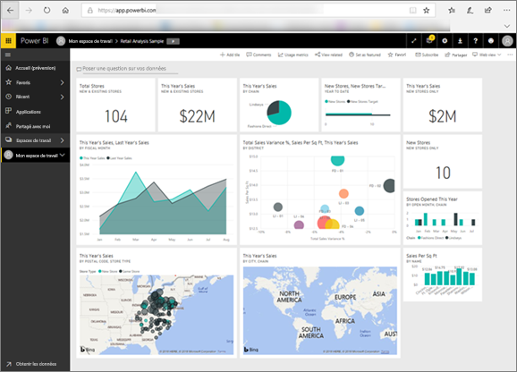
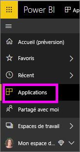
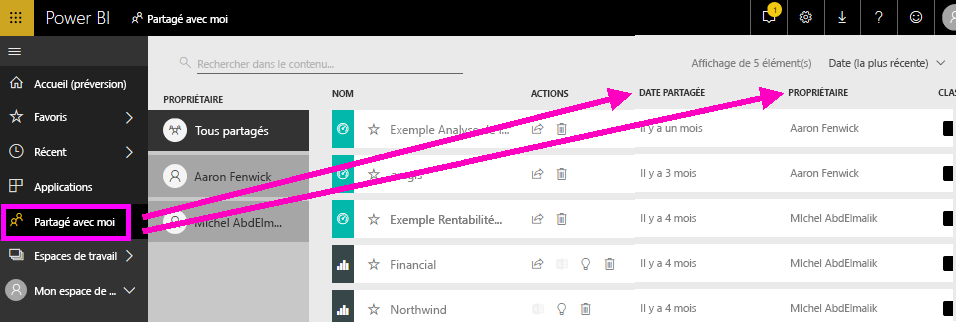
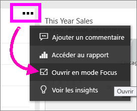
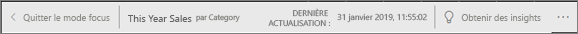
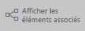
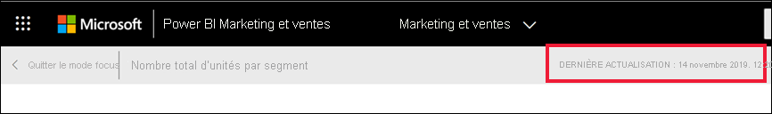

# Votre contenu est à jour
En tant que *consommateur*, vous interagissez avec du contenu qui a été créé par des *concepteurs* et partagé avec vous. Vous vous demandez peut-être parfois si ce contenu est à jour ou simplement quand il a été actualisé pour la dernière fois. Savoir que vous utilisez le contenu le plus récent vous rassure.  
 

La garantie d’utiliser les données les plus récentes est souvent un facteur essentiel pour prendre les bonnes décisions. Comment vous assurer que vous utilisez le contenu le plus récent ? Dans la plupart des cas, vous n’avez rien à faire en particulier. En effet, les applications qui ont été partagées avec vous sont automatiquement actualisées et mises à jour selon une planification établie par leur concepteur. Il en va de même pour les tableaux de bord et les rapports partagés avec vous : le concepteur garantit que leur contenu est mis à jour soit manuellement, soit automatiquement à l’aide d’une planification de l’actualisation.  

Si vous avez des questions sur l’actualisation des données, contactez le concepteur.

## Comment trouver le nom du concepteur ?

### Applications

L’écran de l’application affiche le nom du concepteur ainsi que la date de création de l’application.  

1. Dans le volet de navigation de gauche, sélectionnez **Applications**.

    

    Pour chaque application, vous voyez son titre et la date de sa création. 

2. Pointez sur l’application pour voir également le nom du concepteur. 

    

### Partagées avec moi
L’écran **Partagé avec moi** affiche le nom du propriétaire du contenu ainsi que la date à laquelle le contenu a été partagé avec vous.

 

## Comment trouver la date de la dernière actualisation ?
Si vous avez besoin de cette information, vous pouvez rechercher la date de la dernière actualisation pour la plupart du contenu. 

### Mise à jour des vignettes de tableau de bord
Pour les vignettes de tableau de bord, affichez la vignette en mode Focus pour connaître la date et l’heure de sa dernière actualisation.

1. Sur une vignette de tableau de bord, sélectionnez les points de suspension (...) et choisissez **Ouvrir en mode Focus**.

    

2. La date de la dernière actualisation est affichée en haut à droite. Si vous ne la voyez pas, développez votre navigateur pour l’agrandir. 

    

### À partir des tableaux de bord et des rapports
Une autre méthode pour voir la date de la dernière actualisation consiste à utiliser **Afficher les éléments associés**.  L’option **Afficher les éléments associés** se trouve dans la barre de menus supérieure de Power BI.

Le volet **Contenu associé** affiche les informations sur la dernière actualisation du jeu de données sous-jacent dans le tableau de bord ou le rapport.

## Que se passe-t-il si une application est supprimée par le concepteur ?

Quand un concepteur supprime une application, les tableaux de bord et rapports associés à cette application sont aussi automatiquement supprimés de votre espace de travail Power BI. Ces ressources ne sont plus disponibles et l’application ne figure plus dans le volet de navigation.

## S’abonner pour voir les modifications
Un autre moyen de rester à jour est de vous abonner à un rapport ou un tableau de bord. Au lieu de devoir vous connecter et ouvrir un rapport ou un tableau de bord, vous indiquez à Power BI de vous envoyer un instantané selon une planification que vous définissez.  Pour plus d’informations, consultez [S’abonner à des tableaux de bord et des rapports](end-user-subscribe.md).

## Définir des alertes de données
Vous souhaitez être averti si des données changent au-dessus ou en dessous d’une limite que vous définissez ? [Créez une alerte de données](end-user-alerts.md).  L’utilisation d’alertes de données est une méthode très simple pour rester à jour. Vous indiquez à Power BI de vous envoyer un e-mail dès qu’une valeur dans un rapport passe en dessous ou au-dessus d’un seuil spécifique,  par exemple, si un stock tombe à moins de 25 unités ou si les ventes dépassent les objectifs.  

## Étapes suivantes
[Créer une alerte de données](end-user-alerts.md)    
[S’abonner à des tableaux de bord et des rapports](end-user-subscribe.md)    
[Afficher le contenu associé](end-user-related.md)    
