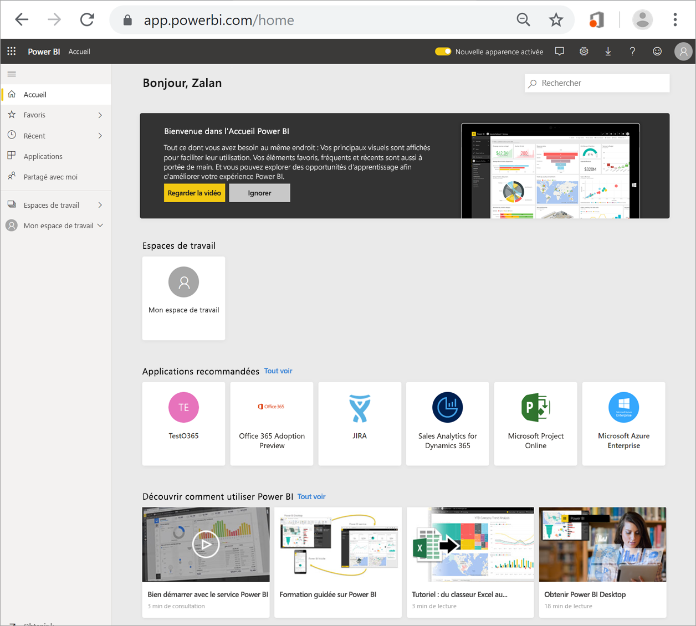
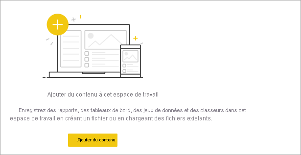
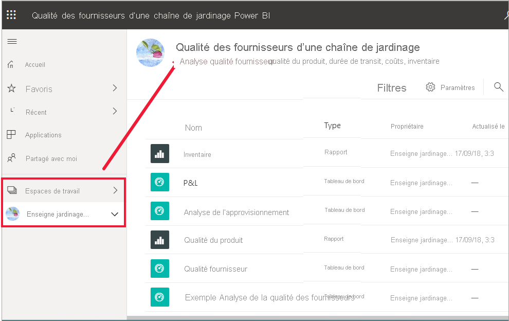
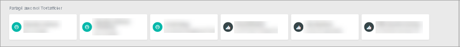
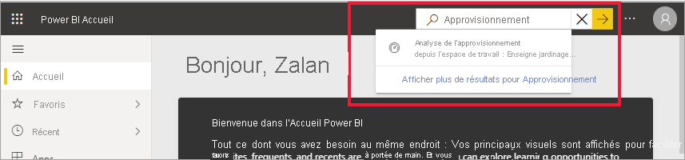

# Rechercher des tableaux de bord, des rapports et des applications
Dans Power BI, le terme *contenu* fait référence aux applications, aux tableaux de bord et aux rapports. Le contenu est créé par les *concepteurs* Power BI, qui le partagent avec leurs collègues. Votre contenu est accessible et consultable dans le service Power BI, et le meilleur emplacement pour commencer à utiliser Power BI est **l’Accueil** Power BI.

## Explorer la page Accueil Power BI
Après vous être connecté au service Power BI, sélectionnez **Accueil** dans le volet de navigation. 

Power BI affiche votre canevas d’accueil, comme dans la figure suivante.
 

La page Accueil Power BI propose trois options pour rechercher et voir votre contenu. Seule la méthode diffère, puisque ces trois options permettent d’accéder au même pool de contenu. Dans certains cas, la recherche est la méthode la plus simple et la plus rapide pour trouver un élément. Dans d’autres cas, la sélection d’une *carte* dans le canevas d’accueil peut constituer la meilleure solution.

- Le canevas d’accueil affiche et organise votre contenu préféré, votre contenu le plus récent, ainsi que le contenu et les ressources de formation qui vous sont recommandés. Chaque élément de contenu s’affiche sous la forme d’une *carte* associée à un titre et à une icône. Lorsque vous sélectionnez une carte, vous ouvrez son contenu.
- Sur la gauche se trouve un volet de navigation. Dans ce volet, le contenu est organisé de façon légèrement différente, selon les options suivantes : Favoris, Récents, Applications et Partagés avec moi. Vous pouvez voir des listes de contenu et en sélectionner une pour l’ouvrir.
- En haut à droite, la zone de recherche globale vous permet de rechercher du contenu par titre, par nom ou par mot clé.

Les rubriques suivantes expliquent chaque option de recherche et de consultation du contenu.

## Canevas Accueil
Dans le canevas d’accueil, vous pouvez voir tout le contenu que vous êtes autorisé à utiliser. Au début, votre canevas d’accueil peut ne pas avoir beaucoup de contenu (voir image ci-dessus). Toutefois, cela changera dès que vous commencerez à utiliser Power BI avec vos collègues.

Votre canevas d’accueil est également mis à jour avec le contenu et les ressources de formation recommandés. 
 
L’Accueil Power BI se remplit à mesure que vous utilisez le service Power BI, lorsque vous recevez des tableaux de bord, des rapports et des applications de la part de vos collègues. Au bout d’un certain temps, il pourra se présenter ainsi.

 
Les rubriques suivantes s’intéressent plus en détail à ce canevas d’accueil, du haut vers le bas.

## Disponibilité immédiate du contenu le plus important

### Favoris et fréquents
La section du haut contient des liens vers le contenu que vous consultez le plus souvent ou que vous avez marqué comme contenu [favori ou par défaut](end-user-favorite.md). Notez que plusieurs cartes sont signalées par une étoile. Cela signifie que les deux applications et le tableau de bord concernés ont été marqués comme favoris. 

De plus, vous pouvez marquer le contenu comme [à la une](end-user-featured.md). Choisissez le tableau de bord ou le rapport que vous prévoyez de consulter le plus souvent et définissez-le comme votre contenu *par défaut*. Chaque fois que vous ouvrez le service Power BI, votre tableau de bord par défaut s’affiche en premier. 

### Récents et Mes applications
La section suivante affiche le contenu que vous avez consulté le plus récemment. Remarquez l’horodatage sur chaque carte. La section **Mes applications** liste les applications qui ont été partagées avec vous ou que vous avez [téléchargées à partir de AppSource](end-user-apps.md). C’est aussi là que sont listées les applications les plus récentes. Vous pouvez sélectionner **Tout afficher** pour afficher la liste de toutes les applications qui ont été partagées avec vous.

### Espaces de travail
Chaque consommateur du service Power BI dispose d’un espace nommé **Mon espace de travail**. **Mon espace de travail** ne contient du contenu que si vous avez téléchargé des exemples Microsoft ou créé vos propres tableaux de bord, rapports ou applications. Pour de nombreux *consommateurs*, **Mon espace de travail** est et restera vide.  

Chaque fois que vous [téléchargez une application](end-user-app-marketing.md), ou qu’une [application est partagée avec vous](end-user-apps.md), un nouvel espace de travail est créé.  Pour ouvrir un *espace de travail d’application*, sélectionnez-le dans votre canevas d’accueil. 

L’application s’ouvre sur votre canevas et le nom de l’espace de travail figure dans votre volet de navigation. Dans les espaces de travail, le service Power BI sépare votre contenu par type : tableaux de bord et rapports. Dans certains cas, vous disposez également de classeurs et de jeux de données. Cette organisation est visible lorsque vous sélectionnez un espace de travail. Dans cet exemple, l’espace de travail **Chaîne de jardinage** contient quatre tableaux de bord et deux rapports.

### Éléments partagés avec moi
Vos collègues partagent des applications avec vous, mais ils peuvent également partager des rapports et des tableaux de bord. Dans la section **Partagé avec moi**, remarquez qu’il existe trois tableaux de bord et que vos collègues ont partagé trois rapports avec vous.

### Applications recommandées
Power BI affiche un ensemble d’applications recommandées en se basant sur vos paramètres d’activité et de compte. Le fait de sélectionner une carte ouvre l’application correspondante.
 
### Ressources de formation
Au bas du canevas d’accueil se trouve un ensemble de ressources de formation. Les ressources qui s’affichent dépendent de votre activité, de vos paramètres et des choix de l’administrateur Power BI. 
 
## Explorer le volet de navigation

Le volet de navigation classifie votre contenu de manière à vous aider à trouver rapidement ce dont vous avez besoin.  

Utilisez le volet de navigation pour localiser des tableaux de bord, des rapports et des applications, et passer des uns aux autres. Parfois, l’utilisation du volet de navigation est ce qui permet d’accéder le plus rapidement au contenu. Le volet de navigation s’affiche quand vous ouvrez la page d’accueil et reste ouvert quand vous ouvrez d’autres sections du service Power BI. Vous pouvez le réduire en sélectionnant l’icône de masquage  .
  
Le volet de navigation organise votre contenu dans des conteneurs similaires à ceux que vous avez déjà vus dans le canevas d’accueil : Favoris, Récents, Applications, Partagés avec moi et espaces de travail. À l’aide de menus volants, vous pouvez voir uniquement le contenu le plus récent dans chacun de ces conteneurs. Vous pouvez également accéder aux listes de contenu pour voir tout le contenu de chaque catégorie de conteneur.
 
- Pour ouvrir l’une de ces sections de contenu et afficher la liste de tous les éléments, sélectionnez son titre.
- Pour voir le contenu le plus récent de chaque conteneur, sélectionnez le menu volant ( **>** ).

    

 
Le volet de navigation vous permet lui aussi de trouver rapidement le contenu dont vous avez besoin. L’organisation du contenu est similaire à celle du canevas Accueil. Toutefois, il s’affiche sous la forme de listes plutôt que de cartes. 

## Effectuer des recherches dans l’ensemble de votre contenu
Parfois, le moyen le plus rapide de trouver votre contenu est d’utiliser la fonctionnalité Recherche. Par exemple, vous vous êtes peut-être rendu compte que les tableaux de bord que vous n’avez pas utilisés depuis un certain temps ne s’affichent plus dans votre canevas d’accueil. Il est possible aussi que vous sachiez que votre collègue a partagé un contenu avec vous, mais que vous ne vous souveniez pas du nom qu’il lui a donné ou du type de contenu dont il s’agit (tableau de bord ou rapport). Autre possibilité, vous avez tellement de contenus qu’il est plus facile d’effectuer une recherche que de les faire défiler ou de les trier. 
 
Le champ de recherche se trouve dans la section supérieure droite de la barre de menus Accueil. Vous pouvez entrer le nom complet ou partiel de ce tableau de bord et lancer une recherche. Vous pouvez aussi entrer le nom de votre collègue et rechercher le contenu qu’il a partagé avec vous. La recherche est effectuée uniquement dans le contenu dont vous êtes propriétaire ou auquel vous avez accès.

## Étapes suivantes
Vue d’ensemble des [concepts de base de Power BI](end-user-basic-concepts.md)
