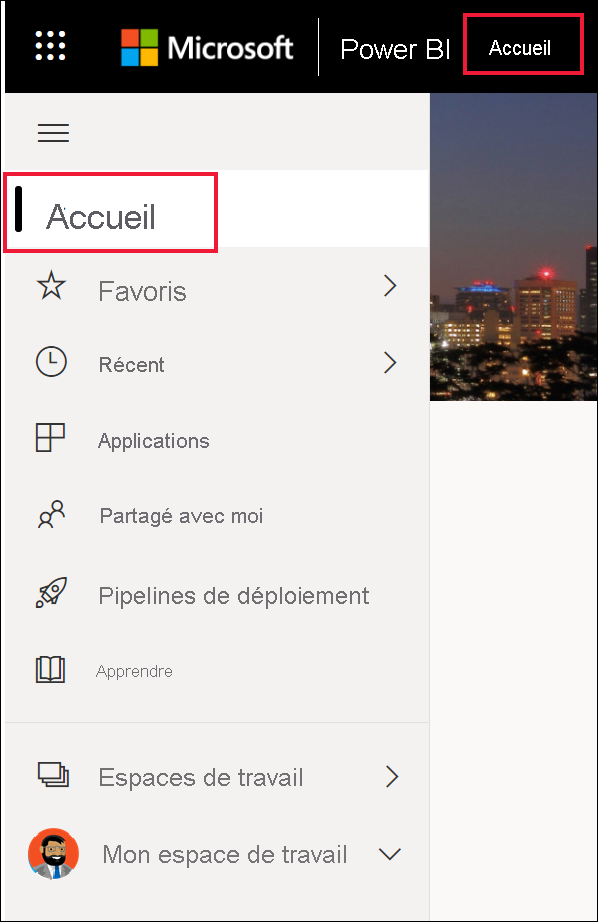
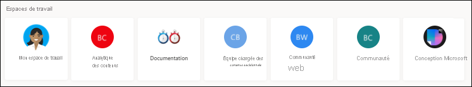
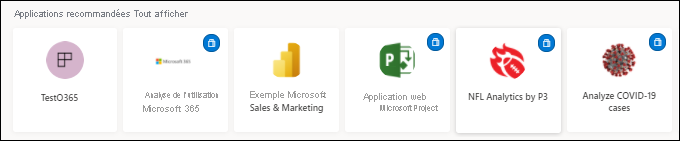

# Rechercher des tableaux de bord, des rapports et des applications

[!INCLUDE[consumer-appliesto-yynn](../includes/consumer-appliesto-yynn.md)]
Dans Power BI, le terme *contenu* fait référence aux applications, aux tableaux de bord et aux rapports. Le contenu est créé par les *concepteurs* Power BI, qui le partagent avec leurs collègues. Votre contenu est accessible et consultable dans le service Power BI, et le meilleur emplacement pour commencer à utiliser Power BI est **l’Accueil** Power BI.

## Explorer la page Accueil Power BI
Après vous être connecté au service Power BI, sélectionnez **Accueil** dans le volet de navigation. 

Power BI affiche votre canevas d’accueil, comme l’illustre l’image suivante. La disposition et le contenu de la page d’accueil sont différents pour chaque utilisateur. Plus loin dans cet article, nous allons voir la page d’accueil d’un tout nouvel utilisateur et celle d’un utilisateur très expérimenté. 
 

La page Accueil Power BI propose trois options pour rechercher et voir votre contenu. Seule la méthode diffère, puisque ces trois options permettent d’accéder au même pool de contenu. Dans certains cas, la recherche est la méthode la plus simple et la plus rapide pour trouver un élément. Dans d’autres cas, la sélection d’une *carte* dans le canevas d’accueil peut constituer la meilleure solution.

- Le canevas d’accueil présente et organise votre contenu préféré, fréquent, récent et recommandé, en plus de vos applications et espaces de travail.  Si vous ne connaissez pas encore le service Power BI, vous y verrez aussi une section Bien démarrer. Sélectionnez une carte, ou un élément dans une liste, pour l’ouvrir.
- Sur la gauche se trouve un volet de navigation. Sélectionnez  pour développer le volet de navigation. Dans le volet de navigation, le contenu est organisé de façon légèrement différente, selon les options suivantes : Favoris, Récents, Applications et Partagés avec moi. Vous pouvez voir des listes de contenu et en sélectionner une pour l’ouvrir.
- En haut à droite, la zone de recherche globale vous permet de rechercher du contenu par titre, par nom ou par mot clé.

Les rubriques suivantes expliquent chaque option de recherche et de consultation du contenu.

## Canevas Accueil
Dans le canevas d’accueil, vous pouvez voir tout le contenu que vous êtes autorisé à utiliser. Votre canevas d’accueil est également mis à jour avec le contenu et les ressources de formation recommandés. Au début, votre canevas d’accueil peut ne pas avoir beaucoup de contenus. Toutefois, cela changera dès que vous commencerez à utiliser Power BI avec vos collègues.

 
L’Accueil Power BI se remplit à mesure que vous utilisez le service Power BI, lorsque vous recevez des tableaux de bord, des rapports et des applications de la part de vos collègues. Au bout d’un certain temps, il pourra se présenter ainsi.

 
Les rubriques suivantes examinent de plus près la page d’accueil d’un utilisateur expérimenté, du haut vers le bas.

## Disponibilité immédiate du contenu le plus important

### Favoris et fréquents
La section du haut contient des liens vers le contenu que vous consultez le plus souvent ou que vous avez marqué comme contenu [favori ou par défaut](end-user-favorite.md). Comme vous pouvez le constater, plusieurs cartes comportent une étoile noire ; elles ont été marquées comme favoris. 

De plus, vous pouvez marquer le contenu comme [à la une](end-user-featured.md). Choisissez le tableau de bord ou le rapport que vous prévoyez de consulter le plus souvent et définissez-le comme votre contenu *par défaut*. Chaque fois que vous ouvrez le service Power BI, votre tableau de bord par défaut s’affiche en premier. 

### Recommandés
La section **Recommandés** comporte le contenu que votre administrateur a *promu* sur votre Accueil. En règle générale, il s’agit de contenu important ou utile dans le cadre de votre travail. Dans cet exemple, le contenu recommandé comprend des métriques de suivi de la réussite.

### Récents, Partagés avec moi et Mes applications
La section suivante est une liste à onglets. 
- **Récents** correspond au contenu que vous avez consulté dernièrement. Remarquez que chaque élément est horodaté. 
- Vos collègues partagent des applications avec vous, mais ils peuvent également partager des rapports et des tableaux de bord. Dans la section **Partagés avec moi**, vous trouverez des tableaux de bord et des rapports que vos collègues ont partagés avec vous. 
- La section **Mes applications** liste les applications qui ont été partagées avec vous ou que vous avez [téléchargées à partir de AppSource](end-user-apps.md). C’est aussi là que sont listées les applications les plus récentes. 

### Workspaces
Chaque utilisateur du service Power BI dispose d’un espace nommé **Mon espace de travail**. **Mon espace de travail** ne contient du contenu que si vous avez téléchargé des exemples Microsoft ou créé vos propres tableaux de bord, rapports ou applications. Pour de nombreux *utilisateurs professionnels*, **Mon espace de travail** est et restera vide. Si vous êtes nouvel utilisateur, vous ne disposerez que d’un seul espace de travail, **Mon espace de travail**. 

Si vous sélectionnez cet espace de travail, vous le trouverez vide.

Chaque fois que vous [téléchargez une application](end-user-app-marketing.md), ou qu’une [application est partagée avec vous](end-user-apps.md), un nouvel espace de travail est créé. Au fil du temps, vous disposerez de plusieurs espaces de travail. Pour ouvrir un *espace de travail d’application*, sélectionnez-le dans votre canevas d’accueil. 

L’application s’ouvre sur votre canevas et le nom de l’espace de travail figure dans votre volet de navigation. Dans les espaces de travail, le service Power BI sépare votre contenu par type : tableaux de bord et rapports. Dans certains cas, vous disposez également de classeurs et de jeux de données. Cette organisation est visible lorsque vous sélectionnez un espace de travail. Dans cet exemple, l’espace de travail **Chaîne de jardinage** contient quatre tableaux de bord et deux rapports.

### Applications recommandées
En fonction de votre activité et des paramètres de votre compte, Power BI affiche un ensemble d’applications recommandées. Le fait de sélectionner une carte ouvre l’application correspondante. Les applications avec l’icône bleue sont des [applications modèles](../connect-data/service-template-apps-overview.md).

 
### Ressources d’apprentissage pour bien démarrer
Les ressources qui s’affichent dépendent de votre activité, de vos paramètres et des choix de l’administrateur Power BI. Si vous êtes un nouvel utilisateur, la section Bien démarrer s’affiche en haut de la page d’accueil. Si vous êtes un nouvel utilisateur et que vous ne voulez plus voir la section Bien démarrer en haut de la page d’accueil, sélectionnez **Épingler en bas**.
 
## Explorer le volet de navigation

Le volet de navigation classifie votre contenu de manière à vous aider à trouver rapidement ce dont vous avez besoin.  

Utilisez le volet de navigation pour localiser des tableaux de bord, des rapports et des applications, et passer des uns aux autres. Parfois, l’utilisation du volet de navigation est ce qui permet d’accéder le plus rapidement au contenu. Le volet de navigation s’affiche quand vous ouvrez la page d’accueil et reste ouvert quand vous ouvrez d’autres sections du service Power BI. Vous pouvez le réduire en sélectionnant l’icône de masquage  .
  
Le volet de navigation organise votre contenu dans des conteneurs similaires à ceux que vous avez déjà vus dans le canevas d’accueil : Favoris, Récents, Applications, Partagés avec moi et espaces de travail. À l’aide de menus volants, vous pouvez voir uniquement le contenu le plus récent dans chacun de ces conteneurs. Vous pouvez également accéder aux listes de contenu pour voir tout le contenu de chaque catégorie de conteneur.
 
- Pour ouvrir une de ces sections de contenu et afficher la liste de tous les éléments, sélectionnez le titre.
- Pour voir le contenu le plus récent de chaque conteneur, sélectionnez le menu volant ( **>** ).

    

 
Le volet de navigation vous permet lui aussi de trouver rapidement le contenu dont vous avez besoin. L’organisation du contenu est similaire à celle du canevas Accueil. Toutefois, il s’affiche sous la forme de listes plutôt que de cartes. 

## Rechercher tout votre contenu
La méthode la plus rapide pour trouver votre contenu consiste parfois à le rechercher. Par exemple, vous vous êtes peut-être rendu compte que les tableaux de bord que vous n’avez pas utilisés depuis un certain temps ne s’affichent plus dans votre canevas d’accueil. Il est possible aussi que vous sachiez que votre collègue a partagé un contenu avec vous, mais que vous ne vous souveniez pas du nom qu’il lui a donné ou du type de contenu dont il s’agit (tableau de bord ou rapport). Autre possibilité, vous avez tellement de contenus qu’il est plus facile d’effectuer une recherche que de les faire défiler ou de les trier. 
 
Le champ de recherche se trouve dans la section supérieure droite de la barre de menus Accueil. Vous pouvez entrer le nom partiel ou complet de ce tableau de bord et le rechercher. Vous pouvez aussi entrer le nom de votre collègue et rechercher le contenu qu’il a partagé avec vous. La recherche couvre la recherche de correspondances dans tout le contenu dont vous êtes propriétaire ou auquel vous avez accès.

## Étapes suivantes
Vue d’ensemble des [concepts de base de Power BI](end-user-basic-concepts.md)

Le contenu s’affiche sous la forme d’une *carte* ou d’une liste. Les cartes ont un titre et une icône. Lorsque vous sélectionnez une carte, vous ouvrez son contenu.