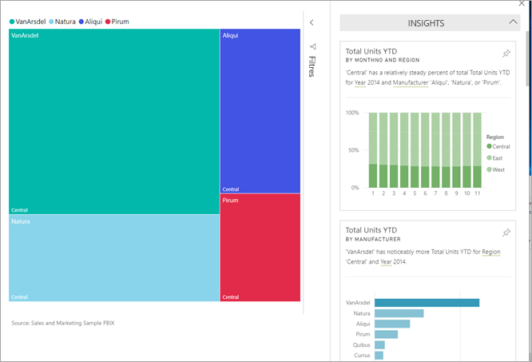
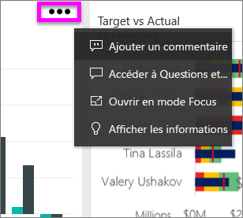

# Afficher des insights sur les données sur les vignettes de tableaux de bord avec Power BI

[!INCLUDE[consumer-appliesto-yyny](../includes/consumer-appliesto-yyny.md)]

Chaque [vignette](end-user-tiles.md) de visuel sur votre tableau de bord est une voie d’accès à l’exploration des données. Quand vous sélectionnez une vignette, elle ouvre un rapport ou [Questions et réponses](end-user-q-and-a.md), où vous pouvez filtrer, trier et explorer le jeu de données sous-jacent du rapport. Et lorsque vous exécutez un aperçu, Power BI effectue l’exploration de données pour vous.

Exécutez une recherche d’insights pour générer des visuels interactifs intéressants basés sur vos données. La recherche d’insights peut être effectuée sur une vignette de tableau de bord spécifique, et vous pouvez même rechercher des insights sur un insight !

La fonctionnalité d’insights repose sur un [ensemble croissant d’algorithmes analytiques avancés](end-user-insight-types.md) développés conjointement avec Microsoft Research, que nous continuerons d’utiliser pour permettre à davantage de personnes de tirer des insights de leurs données de façon innovante et intuitive.

## Exécuter un aperçu sur une vignette de tableau de bord
Lorsque vous exécutez un aperçu sur une mosaïque de tableau de bord, Power BI recherche simplement les données utilisées pour créer cette mosaïque de tableau de bord unique. 

1. [Ouvrir un tableau de bord](end-user-dashboards.md).
2. Pointez sur une vignette, Sélectionnez **Plus d’options** (...) et choisissez **Afficher des informations**. 

    

3. La vignette s’ouvre en [mode Focus](end-user-focus.md), qui présente les cartes d’informations à droite.    
   
        
4. Une information suscite votre intérêt ? Sélectionnez la carte d’informations pour en savoir plus. L’information sélectionnée s’affiche à gauche et les nouvelles cartes d’informations, basées uniquement sur les données de cette information, s’affichent à droite.    

 ## Interagir avec les cartes d’informations
Une fois que vous avez un insight ouvert, continuez l’exploration.

   * Filtrez le visuel sur le canevas.  Pour afficher les filtres, dans l’angle supérieur droit, sélectionnez la flèche pour développer le volet Filtres.

      
   
   * Exécuter un aperçu sur la carte proprement dite. C’est ce que l’on appelle un **aperçu connexe**. Sélectionnez une carte d’insight pour l’activer. Il se déplace vers le côté gauche du canevas du rapport, et de nouvelles cartes, basées uniquement sur les données de cet insight, s’affichent à droite.
   
      
   
     
Pour revenir à votre rapport, dans le coin supérieur gauche, sélectionnez **Quitter le mode focus**.

## Considérations et résolution des problèmes
- **Afficher les informations** ne fonctionne pas avec tous les types de mosaïque de tableau de bord. Par exemple, ce n’est pas disponible pour les visuels personnalisés Power BI.<!--[Power BI visuals](end-user-custom-visuals.md)-->

## Étapes suivantes

Exécutez des insights sur les visuels de rapport [à l’aide de la fonctionnalité Analyser](end-user-analyze-visuals.md)    
Pour en savoir plus, voir les [types d’informations disponibles](end-user-insight-types.md).

