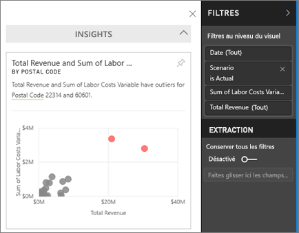
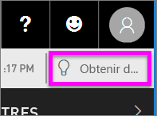

# Afficher des insights sur les données sur les vignettes de tableaux de bord avec Power BI
Chaque mosaïque de visualisation sur votre tableau de bord est une voie d’accès à l’exploration des données. Lorsque vous sélectionnez une mosaïque, un rapport dans lequel vous pouvez filtrer, trier et explorer le jeu de données derrière le rapport s’ouvre. Et lorsque vous exécutez un aperçu, Power BI effectue l’exploration de données pour vous.

Exécutez un aperçu rapide pour générer des visualisations interactives intéressantes basées sur vos données. L’aperçu rapide peut être exécuté sur une mosaïque de tableau de bord spécifique, et vous pouvez même exécuter un aperçu sur un autre aperçu !

La fonctionnalité d’aperçu repose sur un [ensemble croissant d’algorithmes analytiques avancés](end-user-insight-types.md) développés conjointement avec Microsoft Research, que nous continuerons d’utiliser pour permettre à davantage de personnes de tirer des informations de leurs données de façon innovante et intuitive.

## Exécuter un aperçu sur une vignette de tableau de bord
Lorsque vous exécutez un aperçu sur une mosaïque de tableau de bord, Power BI recherche simplement les données utilisées pour créer cette mosaïque de tableau de bord unique. 

1. [Ouvrir un tableau de bord](end-user-dashboards.md).
2. Pointez sur une vignette, Sélectionnez les points de suspension (...) et choisissez **Afficher des informations**. 

    

3. La vignette s’ouvre en [mode Focus](end-user-focus.md), qui présente les cartes d’informations à droite.    
   
        
4. Une information suscite votre intérêt ? Sélectionnez la carte d’informations pour en savoir plus. L’information sélectionnée s’affiche à gauche et les nouvelles cartes d’informations, basées uniquement sur les données de cette information, s’affichent à droite.    

 ## Interagir avec les cartes d’informations
Une fois que vous avez un insight ouvert, continuez l’exploration.

   * Filtrez le visuel sur le canevas.  Pour afficher les filtres, dans l’angle supérieur droit, sélectionnez la flèche pour développer le volet Filtres.

     
   
   * Exécuter un aperçu sur la carte proprement dite. C’est ce que l’on appelle un **aperçu connexe**. En haut à droite, sélectionnez l’icône en forme d’ampoule  ou **Obtenir des informations**.
     
     
     
     L’aperçu s’affiche à gauche et de nouvelles cartes, basées uniquement sur les données de cet aperçu, s’affichent à droite.
     
     

Pour revenir au canevas d’aperçu d’origine, dans le coin supérieur gauche, sélectionnez **Quitter le mode Focus**.

## Considérations et résolution des problèmes
- **Afficher les informations** ne fonctionne pas avec DirectQuery (seulement avec les données chargées sur Power BI).
- **Afficher les informations** ne fonctionne pas avec tous les types de mosaïque de tableau de bord. Par exemple, il n’est pas disponible pour les visuels personnalisés.<!--[custom visuals](end-user-custom-visuals.md)-->

## Étapes suivantes
Découvrez les [types d’Informations rapides disponibles](end-user-insight-types.md).

