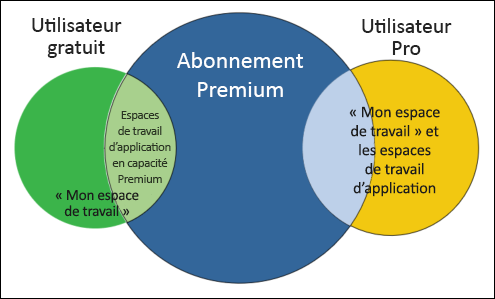
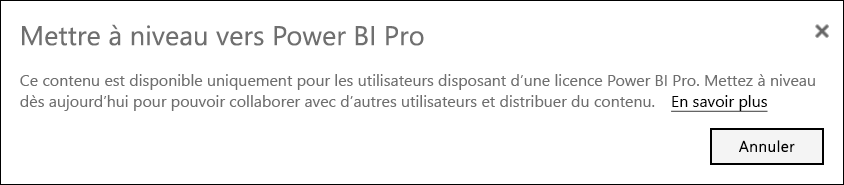
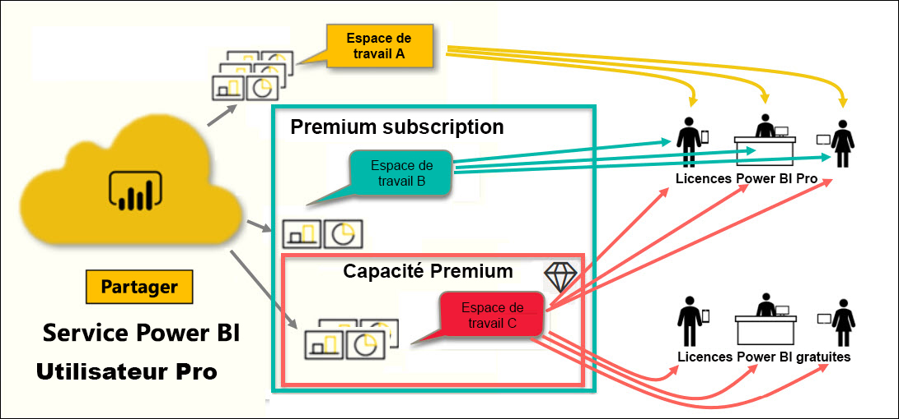

# Types de licences Power BI

[!INCLUDE[consumer-appliesto-ynnn](../includes/consumer-appliesto-ynnn.md)]

En tant que *consommateur*, vous utilisez le service Power BI pour explorer des rapports et des tableaux de bord afin de prendre des décisions métier. Si vous utilisez Power BI depuis un certain temps ou qu’il vous arrive de discuter avec les *concepteurs* avec qui vous travaillez, vous savez probablement que certaines caractéristiques ne sont opérationnelles qu’avec une licence ou un abonnement particulier. 

Cet article explique les différences entre les licences utilisateur et les abonnements d’organisation et comment elles fonctionnent ensemble : gratuit, Professionnel, Premium et capacité Premium. Vous verrez également comment identifier la combinaison de licences et d’abonnements que vous utilisez.  

Commençons par examiner les deux catégories de licences : les abonnements par utilisateur et organisationnels. Notre point de départ sera les fonctionnalités par défaut disponibles pour chacun. Ensuite, nous allons examiner comment votre administrateur Power BI et les propriétaires de contenu peuvent utiliser des rôles et des autorisations pour modifier les fonctionnalités de licence et d’abonnement par défaut. 

Par exemple, même si votre licence le permet, votre administrateur peut limiter votre capacité à effectuer des opérations telles que l’exportation de données, l’utilisation de requêtes en langage naturel Q&R ou la publication sur le web. Et lorsqu’un *concepteur* de rapports attribue du contenu à un [espace de travail](end-user-workspaces.md), il peut vous attribuer un rôle d’espace de travail. Les rôles déterminent ce que vous pouvez et ne pouvez pas faire au sein de cet espace de travail. Le *concepteur* peut ajuster les limites de votre licence à l’aide des paramètres d’autorisation. En d’autres termes... c’est compliqué. Espérons que cet article mette fin à tout ou partie de la confusion.

## Licences par utilisateur
Le premier type de licence est une licence **par utilisateur**. Chaque utilisateur du service Power BI a une licence gratuite ou une licence Pro. Certaines fonctionnalités sont réservées aux utilisateurs disposant de licences Pro.  

- **Une licence Power BI Pro (sans abonnement Premium)** permet à un utilisateur de collaborer avec d’autres utilisateurs Pro en créant et en partageant du contenu. Seuls les utilisateurs disposant d’une licence Pro peuvent publier des rapports, s’abonner à des tableaux de bord et à des rapports, et collaborer avec des collègues dans des espaces de travail. 

    

    Power BI Pro est une licence utilisateur individuelle qui permet aux utilisateurs de lire et d’interagir avec les rapports et les tableaux de bord publiés par d’autres utilisateurs sur le service Power BI. Les utilisateurs disposant de ce type de licence peuvent partager du contenu et collaborer avec d’autres utilisateurs Power BI Pro. Seuls les utilisateurs Power BI Pro peuvent publier ou partager du contenu avec d’autres utilisateurs ou consommer du contenu créé par d’autres utilisateurs. Sauf si ce contenu est hébergé dans une [capacité Power BI Premium](#understanding-premium-and-premium-capacity). (Pour plus d’informations, consultez [capacité Power BI Premium](#understanding-premium-and-premium-capacity) ci-dessous.) Les licences Pro sont généralement utilisées par les *concepteurs* et les développeurs de rapports. 

- **Une licence Power BI gratuite autonome (sans abonnement Premium)** , bien que puissante, est destinée aux utilisateurs qui débutent avec Power BI ou qui créent du contenu pour eux-mêmes. Consultez [S’inscrire au service Power BI en tant qu’individu](../service-self-service-signup-for-power-bi.md).   

    Une licence utilisateur autonome gratuite est parfaite pour une personne utilisant les exemples Microsoft pour apprendre Power BI. Les titulaires de licences autonomes gratuites ne peuvent pas voir le contenu partagé par d’autres personnes ni partager leur contenu avec d’autres utilisateurs de Power BI. 

    

    Tous les clients disposant d’une licence autonome gratuite peuvent effectuer une mise à niveau vers un [essai gratuit de la licence Power BI Pro](../service-self-service-signup-for-power-bi.md). L’essai gratuit vous offre la puissance et toutes les fonctionnalités d’un utilisateur Power BI Pro.

    

- **Une licence gratuite Power BI avec un abonnement Premium** lorsqu’une organisation a un abonnement Premium, les administrateurs et les utilisateurs Pro peuvent attribuer des espaces de travail à la *capacité Premium* et accorder aux utilisateurs un accès gratuit à ces espaces de travail. Un espace de travail dans une capacité Premium est un espace où les utilisateurs Pro peuvent partager et collaborer avec des utilisateurs gratuits, sans que ces derniers aient des comptes Pro. Au sein de ces espaces de travail, les utilisateurs gratuits disposent d’autorisations élevées. Ils peuvent collaborer et partager, exporter des données, s’abonner, interagir avec les filtres et bien plus encore. 

Tout est clair jusqu’ici ?  OK. Examinons plus en détail la **capacité Premium**.

## Comprendre Premium et la capacité Premium
Premium est un abonnement **organisationnel**. C’est comme si vous ajoutiez une couche de fonctionnalités à toutes les licences **par utilisateur** Power BI d’une organisation. 

Quand une organisation achète une licence Premium, l’administrateur attribue généralement des licences Pro aux employés susceptibles de créer et de partager du contenu. Il attribue ensuite des licences gratuites à toute personne souhaitant consommer ce contenu. Les utilisateurs Pro créent des [espaces de travail d’application](end-user-workspaces.md) et ajoutent du contenu (tableaux de bord, rapports, applications) à ces espaces de travail. Pour permettre aux utilisateurs gratuits de collaborer dans ces espaces de travail, l’administrateur ou l’utilisateur Pro enregistre les espaces de travail dans la *capacité Premium*. 

Quand une organisation achète une licence Premium, elle reçoit cette capacité dans le service Power BI qui lui est exclusivement alloué. Il n’est pas partagé par d’autres organisations. Cette capacité est prise en charge par un matériel dédié entièrement géré par Microsoft. Les organisations peuvent choisir d’appliquer leur capacité dédiée de manière étendue ou de l’allouer à des espaces de travail spécifiques. Une organisation peut avoir tous les espaces de travail en capacité ou seulement certains. Vous pouvez identifier un espace de travail dans la capacité Premium par son icône en losange .  Un espace de travail dans une capacité Premium est un espace où les utilisateurs Pro peuvent partager et collaborer avec des utilisateurs gratuits, sans que ces derniers aient des comptes Pro. 

Dans une capacité Premium, les licences Pro sont toujours requises pour les concepteurs de contenu. Les concepteurs créent des espaces de travail, se connectent aux sources de données, modélisent les données et créent des rapports et des tableaux de bord partagés directement ou empaquetés et partagés en tant qu’applications. Les utilisateurs ne disposant pas d’une licence Pro peuvent toujours accéder à un espace de travail d’application qui se trouve dans Power BI Premium, à condition que cet espace de travail se trouve dans la *capacité* Premium et que le propriétaire de l’espace de travail leur accorde l’autorisation.

Dans le diagramme ci-dessous, la partie gauche représente les utilisateurs Pro qui créent et partagent un contenu dans les espaces de travail de l’application. 

- **L’espace de travail A** a été créé dans une organisation ne disposant pas d’abonnement Premium. 

- **L’espace de travail B** a été créé dans une organisation qui dispose d’un abonnement Premium, bien que cet espace de travail particulier n’ait pas été enregistré dans une capacité Premium. L’espace de travail n’a pas d’icône en forme de losange.

- **L’espace de travail C** a été créé dans une organisation qui dispose d’un abonnement Premium et a été enregistré dans une capacité Premium. Cet espace de travail a une icône en forme de losange.  

Le *concepteur* Power BI Pro peut partager et collaborer avec d’autres utilisateurs Pro à l’aide de l’un des trois espaces de travail. Tant que le concepteur partage l’espace de travail avec toute l’organisation ou attribue des rôles d’espace de travail aux utilisateurs Pro. 

L’utilisateur Power BI Pro peut uniquement partager et collaborer avec des utilisateurs gratuits à l’aide de l’espace de travail C. L’espace de travail doit être attribué à la capacité Premium pour que les utilisateurs gratuits puissent accéder à l’espace de travail. Dans l’espace de travail, le concepteur attribue des rôles aux collaborateurs : *Admin*, *Membre*, *Contributeur* ou *Lecteur*. Votre rôle détermine les actions que vous pouvez effectuer dans l’espace de travail. Les *consommateurs* Power BI sont généralement attribués au rôle *Lecteur*. Pour plus d’informations, consultez [Espaces de travail pour les consommateurs Power BI](end-user-workspaces.md).

## Déterminer la licence et l’abonnement que vous avez
Vous pouvez obtenir des informations sur votre licence et votre abonnement Power BI de plusieurs façons. 

Tout d’abord, déterminez la licence **utilisateur** dont vous disposez.

- Certaines versions de Microsoft Office incluent une licence Power BI Pro.  Pour savoir si votre version d’Office intègre Power BI, visitez le [portail Office](https://portal.office.com/account) et sélectionnez **Abonnements**.

    Ce premier utilisateur, Pradtanna, a Office 365 E5 qui inclut une licence Power BI Pro.

    

    Ce deuxième utilisateur, Zalan, a une licence Power BI gratuite. 

    

Ensuite, vérifiez si votre compte fait également partie d’un abonnement Premium. L’un des utilisateurs ci-dessus, Pro ou gratuit, peut appartenir à une organisation titulaire d’une licence Premium.  Examinons notre deuxième utilisateur, Zalan.  

- Dans la service Power BI, sélectionnez **Mon espace de travail** puis sélectionnez l’icône en forme d’engrenage dans le coin supérieur droit. Choisissez **Gérer le stockage personnel**.

    

    Les licences **par utilisateur**, Pro ou gratuites, offrent 10 Go de stockage dans le cloud que vous pouvez utiliser pour héberger des rapports Power BI ou des classeurs Excel. Si le stockage dépasse 10 Go, cela signifie que vous êtes membre d’un compte organisationnel avec une licence Premium.

    

    Souvenez-vous que la page du portail Office indiquait que Zalan disposait d’une licence utilisateur pour Power BI (gratuite). Toutefois, étant donné que son organisation a acheté un abonnement Premium, dans le service Power BI, Zalan n’est pas limité à 10 Go de stockage. Il dispose de 100 Go. En tant que *consommateur* au sein d’une organisation disposant d’une licence Premium, tant que le *concepteur* place l’espace de travail dans la capacité Premium, Zalan a la possibilité d’afficher du contenu partagé, de collaborer avec des collègues, d’utiliser des applications et bien plus encore. L’étendue de ses autorisations est définie par son administrateur Power BI et par le concepteur de contenu. Notez qu’un utilisateur Pro a déjà partagé un espace de travail avec Zalan. L’icône en forme de losange indique que cet espace de travail est stocké dans une capacité Premium. 

   
## Comprendre les rôles d’espace de travail
Jusqu’à présent, nous avons examiné les licences par utilisateur, les abonnements Premium, les espaces de travail d’application et la capacité Premium. À présent, examinons les *rôles* d’espace de travail.

Étant donné qu’il s’agit d’un article pour les *consommateurs* Power BI, nous avons le scénario suivant :

-  Vous êtes un utilisateur *gratuit* au sein d’une organisation disposant d’un abonnement Power BI Premium. 
- Un utilisateur Power BI Pro a créé une collection de tableaux de bord et de rapports et publié cette collection sous forme *d’application* dans l’ensemble de votre organisation.  
- Les applications existent dans les *espaces de travail* et cet espace de travail est dans une capacité Premium.    
- Cet espace de travail d’application contient un tableau de bord et deux rapports.
- L’utilisateur Pro nous a attribué le rôle de **Lecteur**.

### Le rôle Lecteur
Les rôles permettent aux *concepteurs* Power BI de gérer qui peut faire quoi dans un espace de travail, ce qui permet aux équipes de collaborer. L’un de ces rôles est **Lecteur**. 

Lorsque l’espace de travail se trouve dans une capacité Power BI Premium, les utilisateurs avec le rôle Lecteur peuvent accéder l’espace de travail même s’ils n’ont pas de licence Power BI Pro. Étant donné que le rôle Viewer ne peut pas accéder aux données sous-jacentes ou les exporter, il s’agit d’un moyen sûr d’interagir avec les tableaux de bord, les rapports et les applications.

> [!TIP]
> Pour en savoir plus sur les autres rôles (Admin, Membre et Collaborateur), consultez [création d’un espace de travail](../service-new-workspaces.md).

## Étapes suivantes
[Suis-je un *consommateur* Power BI ?](end-user-consumer.md)    
[En savoir plus sur les espaces de travail](end-user-workspaces.md)    
<!--[View Power BI features by license type](end-user-features.md) -->

