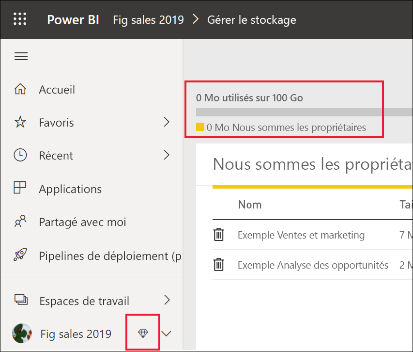
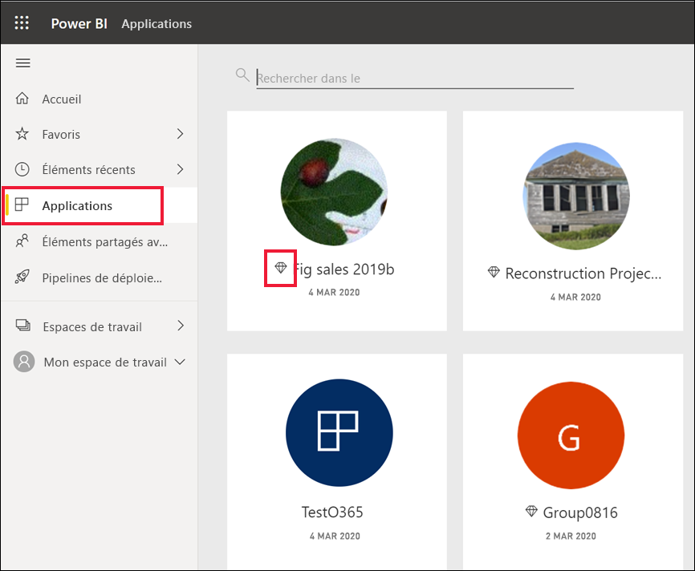
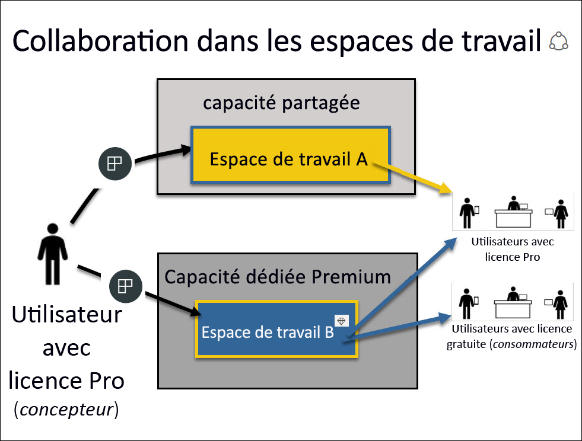

# Licences et abonnements pour les *consommateurs*

[!INCLUDE[consumer-appliesto-ynnn](../includes/consumer-appliesto-ynnn.md)]

En tant que [*consommateur*](end-user-consumer.md), vous utilisez le service Power BI pour explorer des rapports et des tableaux de bord afin de prendre des décisions métier basées sur les données. Si vous utilisez Power BI depuis un certain temps ou qu’il vous arrive de discuter avec les *concepteurs* avec qui vous travaillez, vous savez probablement que certaines caractéristiques ne sont opérationnelles qu’avec une licence, un abonnement ou des autorisations particuliers. 

Ce que vous pouvez faire dans le service Power BI dépend de trois choses :
-    le type de licence et d’abonnement que vous utilisez ;
-    l’emplacement de stockage du contenu ;
-    les rôles et les autorisations qui vous sont attribués.

Dans cet article, nous décrivons les fonctionnalités de chaque type de licence et la façon dont *l’emplacement de stockage du contenu* peut affecter *ce que vous pouvez faire avec*. Vous apprendrez également à rechercher votre licence et votre abonnement et à déterminer l’emplacement de stockage de votre contenu. Pour plus d'informations sur les autorisations et les rôles, consultez les [rôles d’espace de travail](end-user-workspaces.md).

## Licences

Chaque utilisateur du service Power BI utilise une licence *gratuite* ou une licence *Pro*. Si vous êtes un *consommateur* Power BI, vous utilisez probablement une licence qui est gérée par votre administrateur de locataire Power BI. 

Il est possible d’avoir plusieurs licences en même temps.  Le service vous fournit toujours l’expérience correspondant à celle offerte par la meilleure licence que vous avez actuellement. 

## Capacité Power BI Premium

Premium est un abonnement professionnel qui offre un moyen différent de stocker du contenu, à savoir dans une capacité dédiée. Avec la version Premium, tous les utilisateurs avec des autorisations, qu’ils appartiennent ou non à votre entreprise, peuvent afficher votre contenu Power BI, sans avoir à acheter de licences Power BI Pro individuelles. 

Premium permet aux utilisateurs Pro de distribuer du contenu sans exiger que les destinataires disposent d’une licence Pro. Des licences Pro sont toutefois nécessaires pour les concepteurs de contenu. Les concepteurs se connectent aux sources de données, modélisent les données et créent des rapports et des tableaux de bord qui sont présentés sous la forme d’applications d’espace de travail. L’utilisateur sans licence Pro peut toujours accéder à un espace de travail qui se trouve dans une capacité Power BI Premium, à condition d’avoir un [rôle attribué dans cet espace de travail](end-user-workspaces.md).

Au sein de ces espaces de travail, les concepteurs attribuent des rôles, tels que **viewer**, **contributeur**, **membre** et **administrateur**, qui déterminent dans quelle mesure les collègues peuvent interagir avec le contenu. Pour plus d’informations, consultez [les autorisations et les rôles de l’espace de travail.](end-user-workspaces.md) 

Pour plus d’informations sur la capacité Premium, consultez [Présentation de Microsoft Power BI Premium](../admin/service-premium-what-is.md).

## Identifier les licences que vous utilisez

Visitez [votre page Microsoft **Mon compte**](https://portal.office.com/account) pour voir quelles licences vous sont attribuées.  Sélectionnez l'onglet **Abonnements**.

Ce premier utilisateur, Pradtanna, a Office 365 E5 qui inclut une licence Power BI Pro.

Ce deuxième utilisateur, Zalan, a une licence Power BI gratuite. 

## Déterminer si vous avez accès à la capacité Premium

Vérifiez d’abord si vous faites partie d’une organisation dotée d’une capacité Premium. L’un des utilisateurs ci-dessus, Pro ou gratuit, peut appartenir à une organisation dotée d’une capacité Premium.  Examinons notre deuxième utilisateur, Zalan.  

Nous pouvons déterminer si l’organisation de Zalan dispose d’une capacité Premium en recherchant la quantité de stockage disponible. 

- Dans la service Power BI, sélectionnez **Mon espace de travail** puis sélectionnez l’icône en forme d’engrenage dans le coin supérieur droit. Choisissez **Gérer le stockage personnel**.

    

    Si le stockage dépasse 10 Go, cela signifie que vous êtes membre d’une organisation titulaire d’un abonnement Premium. L’image ci-dessous montre que l’organisation de Zalan dispose d’un espace de stockage pouvant atteindre 100 Go.  

    

Notez qu’un utilisateur Pro a déjà partagé un espace de travail avec Zalan. L’icône en forme de losange indique que cet espace de travail est stocké dans une capacité Premium. 

## Identifier le contenu hébergé dans une capacité Premium

Une autre façon de déterminer si votre organisation dispose d’une capacité Premium consiste à rechercher des applications et des espaces de travail d’applications avec une icône en forme de losange. Le losange indique que le contenu est stocké dans une capacité Premium. 

Dans l’image ci-dessous, trois des applications sont stockées dans une capacité Premium.

    
En tant qu’utilisateur avec une licence gratuite, tant que le *concepteur* place l’espace de travail dans la capacité Premium dédiée, vous avez la possibilité, **au sein de cet espace de travail**, d’afficher du contenu partagé, de collaborer avec des collègues, d’utiliser les tableaux de bord et les rapports des applications et bien plus encore. L’étendue de vos autorisations est définie par votre administrateur Power BI et par le concepteur de contenu. 

   

## Exemple complet

Quand une organisation achète un abonnement Premium, l’administrateur attribue généralement des licences Pro aux employés susceptibles travailler dans la capacité Premium ainsi que de créer et de partager du contenu. Les utilisateurs Pro créent des [espaces de travail](end-user-workspaces.md) et ajoutent du contenu (tableaux de bord, rapports, applications) à ces espaces de travail. Pour permettre aux utilisateurs gratuits de collaborer dans ces espaces de travail, l’administrateur ou l’utilisateur Pro affectent les espaces de travail à une *capacité dédiée*.    
 

|Type de licence  |capacité partagée  |capacité dédiée  |
|---------|---------|---------|
|**Gratuit**     |  Pour une utilisation en tant que bac à sable personnel dans lequel vous créez du contenu pour vous-même et interagissez avec ce contenu. C’est un excellent moyen de tester le service Power BI. Vous ne pouvez ni utiliser le contenu d’une autre personne, ni partager votre contenu avec d’autres utilisateurs 1     |   Interagissez avec le contenu affecté à la capacité dédiée et partagé avec vous. Les utilisateurs gratuits et Pro peuvent collaborer sans que les utilisateurs gratuits disposent de comptes Pro.      |
|**Pro**     |  Collaborez avec d’autres utilisateurs Pro en créant et en partageant du contenu.        |  Collaborez avec des utilisateurs gratuits et Pro en créant et en partageant du contenu.       |

1 Consultez [Considérations et résolution des problèmes](#considerations-and-troubleshooting). 

Dans le diagramme ci-dessous, la partie gauche représente les utilisateurs Pro qui créent et partagent un contenu dans les espaces de travail de l’application. 

- **L’espace de travail A** a été créé dans une organisation ne disposant pas de capacité Premium. 

- **L’espace de travail B** a été créé dans une organisation qui dispose d’un abonnement Premium, et l’espace de travail a été enregistré dans une capacité dédiée. Cet espace de travail a une icône en forme de losange.  

    

Le *concepteur* Power BI Pro peut partager et collaborer avec d’autres utilisateurs Pro à l’aide de l’un des espaces de travail. Mais la seule façon dont l’utilisateur Power BI Pro peut partager et collaborer avec des utilisateurs gratuits est l’utilisation de l’espace de travail B, qui est une capacité dédiée de niveau Premium.  Dans l’espace de travail, le concepteur attribue des rôles aux collaborateurs. Votre rôle détermine les actions que vous pouvez effectuer dans l’espace de travail. Les *consommateurs* Power BI sont généralement attribués au rôle *Lecteur*. Pour plus d’informations sur les rôles, consultez [Espaces de travail pour les consommateurs Power BI](end-user-workspaces.md).

## Considérations et résolution des problèmes
- Il est aussi possible d’avoir plusieurs licences Power BI. Le service Power BI fournit toujours l’expérience correspondant à celle offerte par la meilleure licence que vous avez actuellement. Par exemple, si vous avez une licence Pro et une licence gratuite, le service Power BI utilisera la licence Pro.

- Si vous souhaitez partager et créer du contenu (tableaux de bord, rapports, applications), vous n’êtes peut-être pas un *consommateur* Power BI, mais un *concepteur*. Vérifiez que vous disposez d’une licence utilisateur Pro. Vous pouvez vous inscrire pour une évaluation gratuite de 60 jours de Power BI Pro en sélectionnant la boîte de dialogue de mise à niveau qui s’affiche dans le service Power BI chaque fois que vous tentez d’utiliser une fonctionnalité Pro.

    

  À la fin des 60 jours d’évaluation, votre licence redevient une licence Power BI gratuite. Après cela, vous n’avez plus accès aux fonctionnalités qui nécessitent une licence Power BI Pro. Si vous souhaitez continuer avec une licence Pro, contactez votre administrateur ou le service d’assistance informatique pour qu’il achète une licence Power BI Pro. Si vous n’avez pas d’administrateur ou de service d’assistance informatique, visitez [la page de tarification Power BI](https://powerbi.microsoft.com/pricing/).     

- Si vous vous êtes inscrit à une licence gratuite en sélectionnant un bouton de type *Essayez gratuitement*, elle n’expire jamais. Par conséquent, si vous effectuez une mise à niveau vers une version d’évaluation Pro ou que votre organisation vous fournit une licence Pro, puis que votre période d’évaluation se termine ou que votre organisation supprime votre licence Pro, vous pouvez toujours revenir à la licence gratuite, sauf si vous annulez la licence. 

- 1 Une licence utilisateur gratuite pour le service Power BI est parfaite pour une personne qui l’explore ou l’utilise pour analyser et visualiser des données personnelles à l’aide de **Mon espace de travail**. Un utilisateur gratuit autonome n’utilise pas Power BI pour collaborer avec des collègues. Les titulaires de licences autonomes gratuites ne peuvent pas voir le contenu partagé par d’autres personnes ni partager leur contenu avec d’autres utilisateurs de Power BI. 

    

## Étapes suivantes
- [Suis-je un *consommateur* Power BI ?](end-user-consumer.md)    
- [En savoir plus sur les espaces de travail](end-user-workspaces.md)    
- [Afficher les fonctionnalités des consommateurs de Power BI par type de licence](end-user-features.md)
