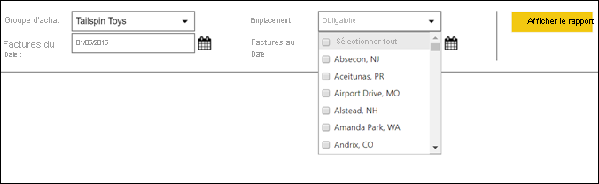
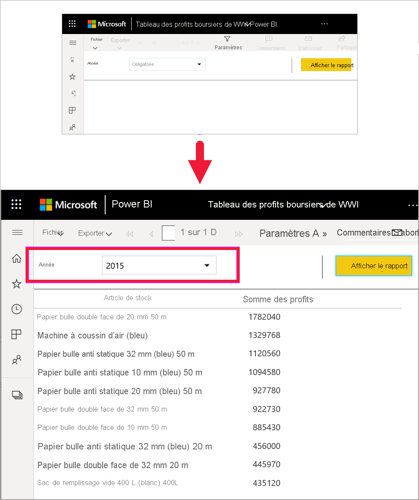
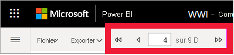
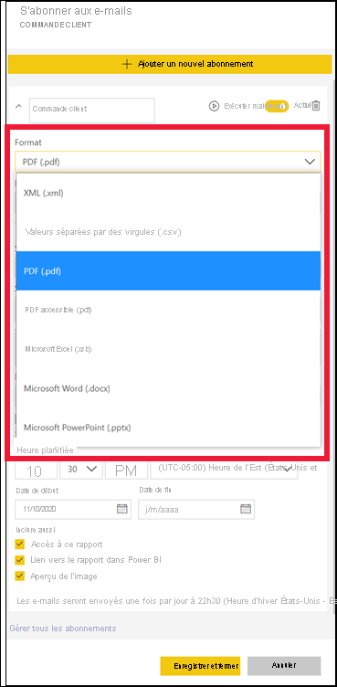

# Rapports paginés dans le service Power BI

[!INCLUDE[consumer-appliesto-yyny](../includes/consumer-appliesto-yyny.md)]

Vous avez découvert les [rapports Power BI](end-user-reports.md). Il s’agit des types de rapports que vous êtes le plus susceptible de rencontrer. Les rapports Power BI sont optimisés pour l’exploration et l’interactivité. Un rapport de ventes où différents vendeurs souhaitent ventiler les données d’un même rapport par région/secteur/client spécifique et voir comment les chiffres évoluent est très bien servi par un rapport Power BI.

Toutefois, il existe un autre type de rapport appelé *rapport paginé*. La réception et l’affichage des rapports paginés nécessitent une licence Power BI Pro ou que le rapport soit enregistré dans une capacité Premium.  [En savoir plus sur les licences](end-user-license.md).  

## Identifier un rapport paginé

Dans les listes de contenu et dans votre page d’accueil, les rapports paginés peuvent être identifiés par leur icône .  Un rapport paginé peut être partagé directement avec vous, ou dans le cadre d’une [application Power BI](end-user-apps.md). Si le *concepteur* de rapports vous y a autorisé, vous pouvez repartager le rapport paginé, et vous abonner vous-même et d’autres personnes.

## Qu’est-ce qu’un rapport paginé ?

Ces rapports sont appelés *paginés* car ils sont mis en forme pour tenir sur une page imprimée. Ils présentent, entre autres, l’avantage d’afficher toutes les données d’une table, même si cette dernière s’étend sur plusieurs pages. Les rapports paginés sont parfois appelés « pixel parfait », car les *concepteurs* de rapports contrôlent exactement la mise en page de ces derniers.

Les rapports paginés sont les mieux adaptés à des scénarios qui requièrent une mise en forme et une optimisation pour l'impression ou la génération de fichiers PDF. Un compte de résultat est un bon exemple du type de rapport que vous souhaitez probablement voir sous forme de rapport paginé.

## Fonctionnement des rapports paginés

Quand les *concepteurs* de rapports créent un rapport paginé, ils créent en réalité une *définition de rapport*. Il ne contient pas les données. Il spécifie où obtenir les données, les données à obtenir et comment les afficher. Quand vous exécutez le rapport, le processeur de rapports prend la définition de rapport, récupère les données et les combine avec la disposition du rapport pour le générer. Parfois, le rapport affiche les données par défaut. Dans d’autres cas, vous devez entrer des paramètres pour que le rapport puisse afficher des données. 

Sélectionnez un rapport paginé pour l’ouvrir dans le service Power BI. S’il possède des paramètres, vous devez les sélectionner avant de pouvoir afficher le rapport.

   

La définition de paramètres constitue généralement l’importance de l’interaction. Si vous êtes analyste de facturation, vous pouvez utiliser des rapports paginés pour créer ou imprimer des factures. Si vous êtes responsable des ventes, vous pouvez utiliser des rapports paginés pour voir les commandes par magasin ou par vendeur. 

Une fois que vous avez sélectionné le paramètre **Year** (Année), ce rapport paginé simple génère les bénéfices par année. 

Par rapport aux rapports paginés, les rapports Power BI sont bien plus interactifs. Les rapports Power BI permettent de générer des rapports ad hoc et prennent en charge de nombreux autres types de visuels, notamment des visuels personnalisés.

## Interagir avec un rapport paginé

La façon dont vous interagissez avec un rapport paginé est différente de celle des autres rapports. Vous pouvez effectuer des opérations comme l’impression, la création de signets, l’exportation et les commentaires, mais l’interactivité est moindre. Souvent, les rapports paginés vous demandent une entrée pour remplir le canevas de rapport.  Dans d’autres cas, le rapport affiche les données par défaut et vous pouvez entrer des paramètres pour voir des données différentes.

### Imprimer un rapport paginé

Les rapports *paginés* sont mis en forme de manière à tenir sur une page et à s’imprimer correctement. Ce que vous voyez dans le navigateur correspond à ce que vous voyez quand vous imprimez. Par ailleurs, si le rapport contient une longue table, elle est imprimée dans son intégralité, même si elle s’étend sur plusieurs pages. 

Les rapports paginés peuvent avoir de nombreuses pages. Par exemple, ce rapport compte 563 pages. Chaque page est mise en page exactement, avec une page par facture et des en-têtes et pieds de page récurrents. Quand vous imprimez ce rapport, vous obtenez des sauts de page entre les factures.

   

### Naviguer dans le rapport paginé

Dans ce rapport des commandes client, il existe trois paramètres : Type d’entreprise, Revendeur et Numéro de commande. 

Pour changer les informations affichées, entrez de nouvelles valeurs pour les trois paramètres, puis sélectionnez **Afficher le rapport**. Ici, nous avons sélectionné **Specialty Bike Shop**, **Alpine Ski House** et le numéro de commande **SO46085**. Le fait de sélectionner **Afficher le rapport** actualise notre canevas de rapport avec cette nouvelle commande client.

La nouvelle commande client s’affiche en utilisant les paramètres que vous avez sélectionnés. 

Certains rapports paginés comprennent de nombreuses pages.  Utilisez les contrôles de page pour naviguer dans le rapport. 

### Exporter le rapport paginé
Vous disposez de diverses options pour l’exportation de rapports paginés, notamment PDF, Word, XML, PowerPoint, Excel, entre autres. Lors de l’exportation, la mise en forme est conservée autant que possible. Les rapports paginés exportés vers Excel, Word, PowerPoint, MHTML et PDF, par exemple, préservent la qualité de la mise en forme (« pixel parfait »). 

### S’abonner au rapport paginé
Quand vous vous abonnez à un rapport paginé, Power BI vous envoie un e-mail contenant le rapport en pièce jointe. Lors de la configuration de votre abonnement, vous choisissez la fréquence à laquelle vous voulez recevoir des e-mails : quotidienne, hebdomadaire, horaire ou mensuelle. L’abonnement contient en pièce jointe la sortie de l’intégralité du rapport, d’une taille maximale de 25 Mo. Exportez l’ensemble du rapport ou choisissez à l’avance les paramètres. Choisissez parmi de nombreux types de pièces jointes différents, notamment Excel, PDF, PowerPoint, et plus encore.  

## Considérations et résolution des problèmes

- Un rapport paginé peut s’afficher vide tant que vous n’avez pas sélectionné des paramètres et choisi **Afficher le rapport**.

- Si vous n’avez pas de rapports paginés, cela peut être dû au fait que personne n’a partagé ce type de rapport avec vous. Cela peut également signifier que votre administrateur système n’a pas activé les rapports paginés pour vous. 

 

## Étapes suivantes
- [Rapports Power BI](end-user-reports.md)
- [Rapports paginés dans Power BI : FORUM AUX QUESTIONS](../paginated-reports/paginated-reports-faq.md)
- D’autres questions ? Essayez la [communauté Power BI](https://community.powerbi.com/).
